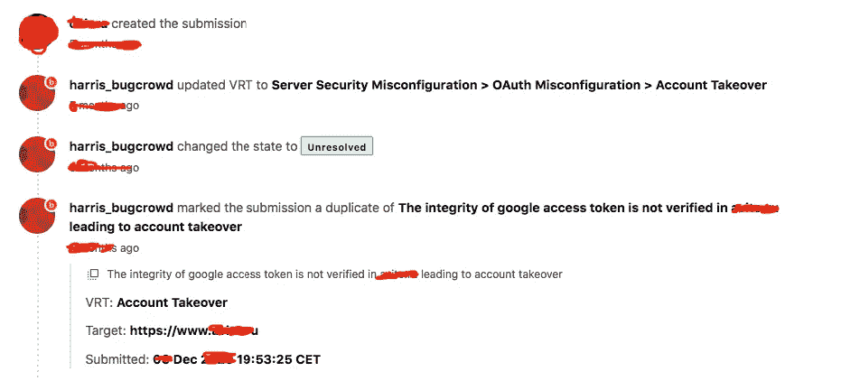
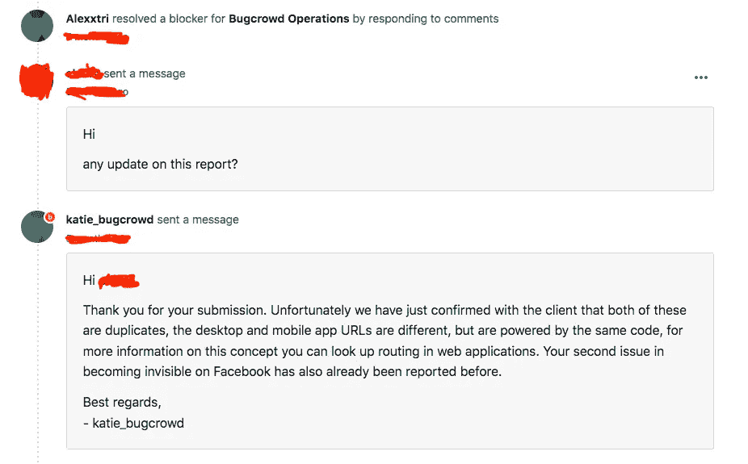
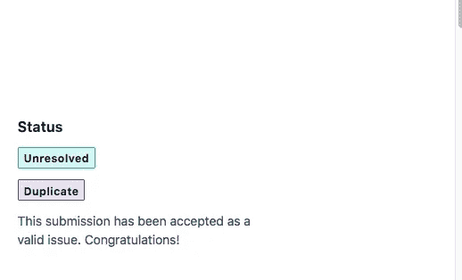

# OAuth 错误配置

> 原文：<https://infosecwriteups.com/the-oauth-misconfiguration-15e66dd19a6e?source=collection_archive---------1----------------------->

## 向 OAuth 服务注册您的客户端应用程序

克拉克·蒂布斯在 [Unsplash](https://unsplash.com?utm_source=medium&utm_medium=referral) 上拍摄的照片

## 101 简介

## **什么是 OAuth？**

OAuth 2.0**是 Web 应用**的授权框架。它向请求它的网站验证用户的身份，而不泄露网站的密码。

## 什么是 OAuth 错误配置？

最臭名昭著的基于 OAuth 的漏洞是当**OAuth 服务本身的配置使攻击者能够窃取授权码或访问与其他用户账户相关的令牌**。通过窃取有效的代码或令牌，攻击者可能能够访问受害者的帐户。

# 现实生活场景:

几天前，我发现*Hotdomain.com*的 android 应用程序容易受到 *OAuth 错误配置*的攻击。让攻击者侵入任何用户的账户。该漏洞可能危及任何用户帐户。

**描述:**
*Hotdomain.com*安卓应用没有在服务器端验证**脸书**“access _ token ”,这使得攻击者能够使用他自己的个人应用访问令牌来攻击任何帐户。

## **易受攻击的请求/** HTTP 请求 **:**

如上面的跟踪转储所示，这是用 **Burpsuite** 发出的暴露具有漏洞的端点的请求的日志。

## 复制步骤:

通过查看*行* ***17*** 你可以看到你将不得不添加你的恶意访问令牌以便接管你想要的任何账户。

## 影响

通过生成一个随机访问令牌，并把它放在原来的位置，我能够获得受害者帐户的控制权。**脸书**访问令牌没有在服务器端得到验证。实际上，在登录脸书选项上，脸书应该为每个用户提供并验证一个唯一的访问令牌来登录这个应用程序。

## 修复建议:

[https://developers . Facebook . com/docs/Facebook-log in/security](https://developers.facebook.com/docs/facebook-login/security)* *(OAuth 流程中的 Bug)

看着上面的图片，我们可以看到报告的进展，它并不像我期待的那样。

长话短说，如此处所示，我的报告是一长串报告中的一部分。其中 android 应用程序和 web 应用程序作为一个整体，是一份独特报告的一部分。这是因为两个应用程序使用了相同的代码。对我来说，这仍然是一个胜利，因为这是你可以在下一个目标中使用的东西。

## 总结:

为什么 OAuth 不利于认证？让我们从 OAuth 不是认证的最大原因开始:**访问令牌不是为客户端应用程序**设计的。当授权服务器发出访问令牌时，目标受众就是受保护的资源。…由受保护的资源来理解和验证令牌。