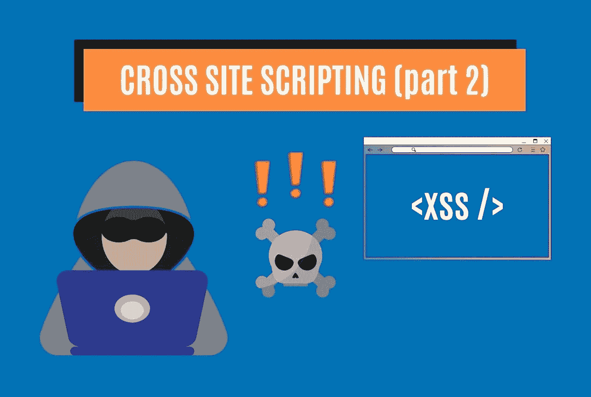
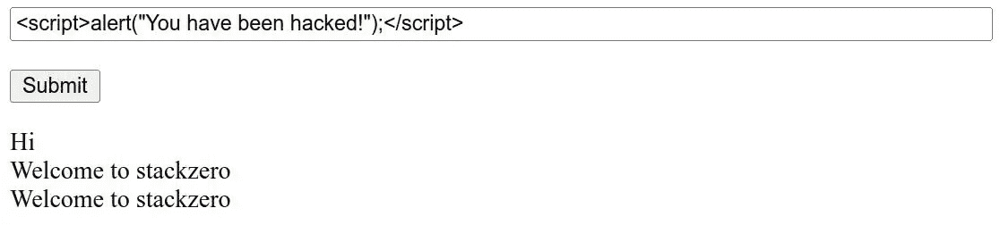

# 跨站脚本的可怕世界(XSS)(第二部分)——stack zero

> 原文：<https://infosecwriteups.com/the-terrifying-world-of-cross-site-scripting-xss-part-2-stackzero-cc7fa7e8dcbb?source=collection_archive---------1----------------------->



# 介绍

我已经在文章第 1 部分的 [XSS 简介](https://www.stackzero.net/xss/)中讨论了这个漏洞。无论如何，只是为了快速刷新，XSS 是一个漏洞，使攻击者能够将恶意代码注入其他用户浏览的网页。【types 有三种类型:

在文章的第二部分，我要做的只是构建一个简单的易受攻击的应用程序，然后尝试利用它们。即使它只包含理解所必需的内容，我也会尝试实现所有类型的漏洞。

让我们一起努力实现目标，更好地了解 XSS。

在开始之前，这里有一个快速导航的相关文章列表:

*   [跨站脚本的恐怖世界(XSS)(第一部分)](https://medium.com/codex/the-terrifying-world-of-cross-site-scripting-xss-part-1-stackzero-54be9cdc011a)
*   [跨站脚本的恐怖世界(XSS)(第二部分)](https://medium.com/@stackzero/the-terrifying-world-of-cross-site-scripting-xss-part-2-stackzero-cc7fa7e8dcbb)
*   [实践中的 XSS:如何在 web 应用程序中利用 XSS](https://medium.com/codex/xss-in-practice-how-to-exploit-xss-in-web-applications-walktrought-into-google-xss-game-c939f30005ea)
*   [反映了 XSS DVWA——一个具有真实世界后果的漏洞](/reflected-xss-dvwa-an-exploit-with-real-world-consequences-stackzero-171cfb2d87d2)
*   [如何利用 DVWA 上存储的 XSS 漏洞](/how-to-exploit-a-stored-xss-vulnerability-on-dvwa-stackzero-1de6cc9545b9)
*   [如何在 DVWA 上利用多姆 XSS](/how-to-exploit-dom-xss-on-dvwa-stackzero-c83a682ed7b7)

# 要求

我认为为了让一切更具可读性，Python 将是正确的选择，我们将用 [Python](https://www.python.org/) / [Flask](https://flask.palletsprojects.com/en/2.1.x/) 编写整个应用程序，并用 [Javascript](https://www.javascript.com/) 编写最后一部分。

我们只需要:

为了安装[烧瓶](https://flask.palletsprojects.com/en/2.1.x/)，我们必须打开一个新的终端并键入:

```
pip3 install flask
```

如果有什么问题，你可以在这里找到官方指南。

在满足所有要求之后，我们可以构建我们的应用程序结构:

```
from flask import Flask, request
from pathlib import Pathapp = Flask("__name__")# Code Hereapp.run(host="0.0.0.0", port=5000)
```

这是一个空的应用程序，此时，我们只需要定义端点。

# 反射式跨站点脚本

这是最容易理解的，我们将通过从查询字符串中取出未排序的变量，并将其放入服务器的页面中来实现漏洞。

```
[@app](http://twitter.com/app).route("/reflected-xss")
def reflected_xss():
    name = request.args.get("name")
    page = f"""
            <html>
                <head> </head>
                <body>
                    <h1>Hello {name}! </h1>
                </body>
            </html>
    """
    return page
```

正如我们所看到的，服务器将我们传递给变量*“name”*的内容放入 HTML。

如果我们想利用，让我们运行服务器:

```
python3 main.py
```

现在我们想运行以下恶意脚本作为概念证明:

```
<script> alert("You have been hacked"); </script>
```

为此，让我们打开浏览器并连接到以下地址:

**http://127 . 0 . 0 . 1:5000/reflected-XSS？name= < script > alert("你被黑了！");</脚本>**

它将显示一个包含字符串“你已经被黑客攻击！”
显然，这是无害的，但它让我们明白黑客是如何在我们的浏览器中运行任意代码的。

容易吗？现在我想更进一步。

# 存储的跨站点脚本

在这种情况下，服务器必须存储脚本，这只是为了创建一个简单的持久性机制。

所以实际结果是实现了一个非常基本的留言簿，但是为了避免无用的复杂性，我们将所有消息保存在一个简单的文本文件中。这很好地满足了我们的目的，可以让我们专注于主题。

```
[@app](http://twitter.com/app).route("/stored-xss", methods=["POST", "GET"])
def stored_xss():db_file = "comments.txt"file = Path(db_file)
    file.touch(exist_ok=True)if request.method == "POST":
        comment = request.form["comment"]with open(db_file, "a") as f:
            f.write(comment + "\n")comments = ""
    with open(db_file, "r+") as f:
        for line in f.readlines():
            comments += f"<div>{line}</div>"page = f"""
        <html>
        <head></head>
        <body>
            <form action="#" method="POST">
                <input type="text" id="comment" name="comment"><br><br>
                <input type="submit" value="Submit">
            </form>
            {comments}
        </body>
        </html> 
    """
    return page
```

代码是不言自明的，为了清楚起见，我想列出它的流程。

这些是此代码执行的操作:

*   定义一个名为 stored_xss 的路由，允许使用 POST 或 GET 方法进行访问。
*   如果不存在名为【T6 " comments . txt "的数据库文件，则创建该文件。
*   如果请求方法是 POST，它会将表单中的注释添加到数据库文件中。
*   最后，它读取数据库文件并在页面上显示注释。

正如我们之前所做的那样，现在是时候测试利用漏洞了，让我们打开浏览器，查看地址:

[**http://localhost:5000/stored-XSS**](http://localhost:5000/stored-xss)

在这种情况下，输入来自 POST 方法，因此我们必须将漏洞放入“name”表单，然后单击 submit 按钮。



然后，在提交之后，服务器将给定的脚本存储在我们的数据库中，每次我们打开页面时弹出窗口都会出现。

显而易见，这种类型的跨站点脚本有多危险，每次用户打开易受攻击的页面时，都会受到攻击。

# 基于 DOM 的跨站点脚本

这是涉及客户端处理的漏洞。所以我们要做的是处理 Url 并将其写入 DOM。
显然，它与第一个示例非常相似，但更深入地看，这次遗漏的清理发生在客户端，而在前一个示例中，易受攻击的输入由服务器反映。

但是看一下代码:

```
[@app](http://twitter.com/app).route("/dom-based-xss")
def dom_based_xss():
    page = """
        <html>
        <head></head>
        <body>
            <h1>Hello 
                <script>
                var name_start = document.location.href.indexOf("name=");
                var name_end = document.location.href.substring(name_start).indexOf("&");
                if(name_start == -1)
                    var name= "Anonymous";
                else if(name_end != -1)
                    var name = document.location.href.substring(name_start+5, name_start+name_end);
                else
                    var name = document.location.href.substring(name_start+5);
                document.write(decodeURIComponent(name));  
                </script>

            </h1>

        </body>
        </html>
    """return page
```

很明显没有服务器端处理，但它只是返回一个 HTML/Javascript 页面。

“script”标记中的代码从 URL 中检索“name”参数的值，并将其写入文档。

具体来说，它从变量分隔符 *" & "* 中获取 *"name="* 的索引。

例如，看看我们连接到这个地址的情况(localhost 是 127.0.0.1 的别名):

[**http://localhost:5000/DOM-based-XSS？name = stack zero&other variable = other value**](http://localhost:5000/dom-based-xss?name=stackzero&othervariable=othervalue)

页面内的脚本将解析 URL，并将值“stackzero”放入 name 变量，该值是 index of*(“name= "*)+5(5 是字符串“name = ")和 indexOf( *" & "* )之间的子字符串。

即使在这种情况下，字符串也不会被清理，所以为了利用这个漏洞，我们可以像在反射 XSS 案例中那样，将恶意脚本放入 URL 中。

**http://localhost:5000/DOM-based-XSS？name= < script > alert("你被黑了！");</脚本>/**

# 一些快速缓解

正如我们在 XSS 介绍文章中看到的，防止攻击的方法是净化输入，让我们看看如何在我们的应用程序中做到这一点。

前两种情况非常相似，我们需要将输出转义到服务器，我们可以很容易地做到。使用 Flask 中的“escape”模块。

这些是新进口的:

```
from flask import Flask, request, escape 
from pathlib import Path
```

现在反射和存储的 XSS 被净化:

```
[@app](http://twitter.com/app).route("/reflected-xss-sanitized")
def reflected_xss_sanitized():
    name = request.args.get("name")
    page = f"""
            <html>
                <head> </head>
                <body>
                    <h1>Hello {escape(name)}! </h1>
                </body>
            </html>
    """
    return page[@app](http://twitter.com/app).route("/stored-xss-sanitized", methods=["POST", "GET"])
def stored_xss_sanitized():db_file = "comments.txt"file = Path(db_file)
    file.touch(exist_ok=True)if request.method == "POST":
        comment = request.form["comment"]with open(db_file, "a") as f:
            f.write(comment + "\n")comments = ""
    with open(db_file, "r+") as f:
        for line in f.readlines():
            comments += f"<div>{line}</div>"page = f"""
        <html>
        <head></head>
        <body>
            <form action="#" method="POST">
                <input size="100" type="text" id="comment" name="comment"><br><br>
                <input type="submit" value="Submit">
            </form>
            {escape(comments)}
        </body>
        </html> 
    """
    return page
```

在基于 DOM 的跨站点脚本攻击中，错误出现在 URI 组件的解码中，

我们可以通过用 encodeURIComponent 函数对组件进行编码来解决这个问题。

```
[@app](http://twitter.com/app).route("/dom-based-xss-sanitized")
def dom_based_xss_sanitized():
    page = """
        <html>
        <head></head>
        <body>
            <h1>Hello 
                <script>
                var name_start = document.location.href.indexOf("name=");
                var name_end = document.location.href.substring(name_start).indexOf("&");
                if(name_start == -1)
                    var name= "Anonymous";
                else if(name_end != -1)
                    var name = document.location.href.substring(name_start+5, name_start+name_end);
                else
                    var name = document.location.href.substring(name_start+5);
                document.write(encodeURIComponent(name));  
                </script>

            </h1>

        </body>
        </html>
    """return page
```

# 完整的代码

现在，让我们看看完整的应用程序，以便更好地了解一切，或者如果您有点懒，您可以复制粘贴并测试漏洞:

```
from flask import Flask, request, escape
from pathlib import Pathapp = Flask("__name__")[@app](http://twitter.com/app).route("/reflected-xss")
def reflected_xss():
    name = request.args.get("name")
    page = f"""
            <html>
                <head> </head>
                <body>
                    <h1>Hello {name}! </h1>
                </body>
            </html>
    """
    return page[@app](http://twitter.com/app).route("/reflected-xss-sanitized")
def reflected_xss_sanitized():
    name = request.args.get("name")
    page = f"""
            <html>
                <head> </head>
                <body>
                    <h1>Hello {escape(name)}! </h1>
                </body>
            </html>
    """
    return page[@app](http://twitter.com/app).route("/stored-xss", methods=["POST", "GET"])
def stored_xss():db_file = "comments.txt"file = Path(db_file)
    file.touch(exist_ok=True)if request.method == "POST":
        comment = request.form["comment"]with open(db_file, "a") as f:
            f.write(comment + "\n")comments = ""
    with open(db_file, "r+") as f:
        for line in f.readlines():
            comments += f"<div>{line}</div>"page = f"""
        <html>
        <head></head>
        <body>
            <form action="#" method="POST">
                <input size="100" type="text" id="comment" name="comment"><br><br>
                <input type="submit" value="Submit">
            </form>
            {comments}
        </body>
        </html> 
    """
    return page[@app](http://twitter.com/app).route("/stored-xss-sanitized", methods=["POST", "GET"])
def stored_xss_sanitized():db_file = "comments.txt"file = Path(db_file)
    file.touch(exist_ok=True)if request.method == "POST":
        comment = request.form["comment"]with open(db_file, "a") as f:
            f.write(comment + "\n")comments = ""
    with open(db_file, "r+") as f:
        for line in f.readlines():
            comments += f"<div>{line}</div>"page = f"""
        <html>
        <head></head>
        <body>
            <form action="#" method="POST">
                <input size="100" type="text" id="comment" name="comment"><br><br>
                <input type="submit" value="Submit">
            </form>
            {escape(comments)}
        </body>
        </html> 
    """
    return page[@app](http://twitter.com/app).route("/dom-based-xss")
def dom_based_xss():
    page = """
        <html>
        <head></head>
        <body>
            <h1>Hello 
                <script>
                var name_start = document.location.href.indexOf("name=");
                var name_end = document.location.href.substring(name_start).indexOf("&");
                if(name_end != -1)
                    var name = document.location.href.substring(name_start+5, name_start+name_end);
                else
                    var name = document.location.href.substring(name_start+5);
                document.write(decodeURIComponent(name));  
                </script>

            </h1>

        </body>
        </html>
    """return page[@app](http://twitter.com/app).route("/dom-based-xss-sanitized")
def dom_based_xss_sanitized():
    page = """
        <html>
        <head></head>
        <body>
            <h1>Hello 
                <script>
                var name_start = document.location.href.indexOf("name=");
                var name_end = document.location.href.substring(name_start).indexOf("&");
                if(name_start == -1)
                    var name= "Anonymous";
                else if(name_end != -1)
                    var name = document.location.href.substring(name_start+5, name_start+name_end);
                else
                    var name = document.location.href.substring(name_start+5);
                document.write(encodeURIComponent(name));  
                </script>

            </h1>

        </body>
        </html>
    """return pageapp.run(host="0.0.0.0", port=5000)
```

# 结论

在本文中，我们在实践中分析了该漏洞，并看到了一些简单的缓解措施，无论如何，这只是一个概念证明，以更好地理解，远离现实世界的情况。
为了完整起见，XSS 是一个非常危险且广泛存在的漏洞(即使它没有出现在[OWASP 2021 年 10 大漏洞](https://www.stackzero.net/top-10-owasp-2021/)中)，因此我们在构建 web 应用程序时必须注意输入。

我们的 XSS 世界之旅还没有结束，下一步将是在一个更现实的应用程序中进行演练，该应用程序包含相同类型的漏洞。

我希望你喜欢这篇文章。

*原载于 2022 年 6 月 14 日*[*https://www.stackzero.net*](https://www.stackzero.net/the-terrifying-world-of-cross-site-scripting-xss-part-2/)*。*

## 来自 Infosec 的报道:Infosec 每天都有很多内容，很难跟上。[加入我们的每周简讯](https://weekly.infosecwriteups.com/)以 5 篇文章、4 条线索、3 个视频、2 个 Github Repos 和工具以及 1 个工作提醒的形式免费获取所有最新的 Infosec 趋势！