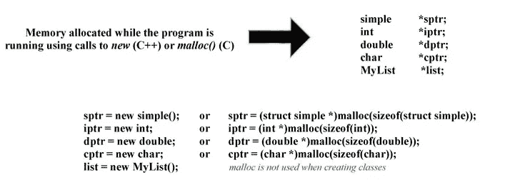
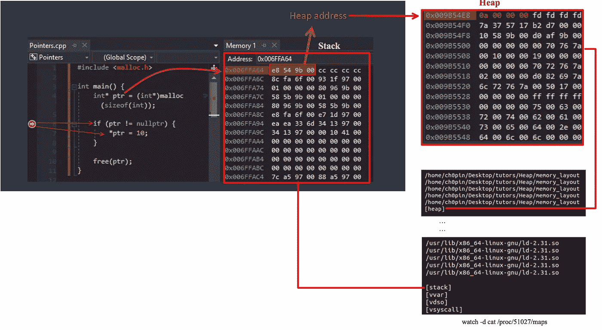
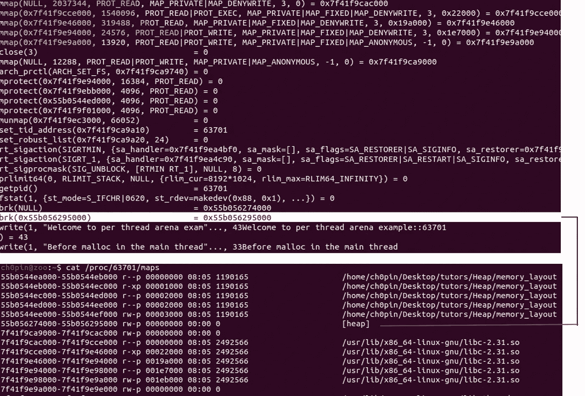
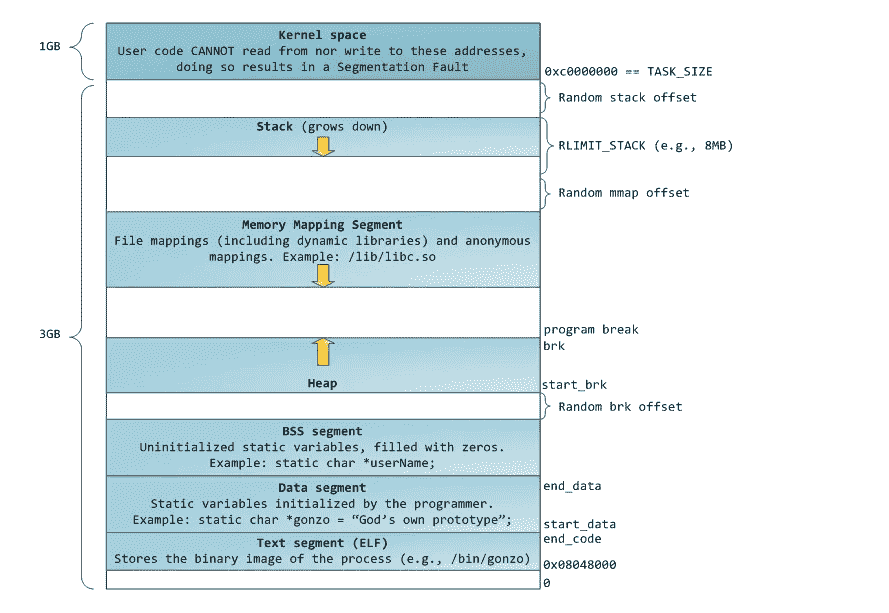
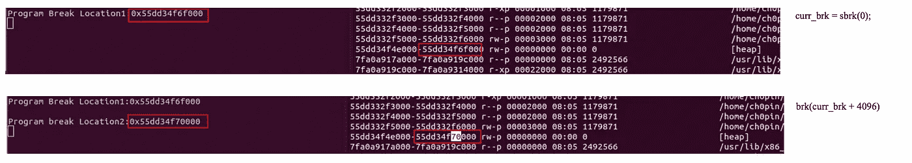

# 幼儿动态内存分配入门

> 原文：<https://infosecwriteups.com/the-toddlers-introduction-to-dynamic-memory-allocation-300f312cd2db?source=collection_archive---------0----------------------->

堆漏洞很长一段时间以来一直是安全研究社区的兴趣所在，因为它们有可能找到创新的利用方式。从 2001 年开始，随着 [Vudo Malloc Tricks](http://phrack.org/issues/57/8.html) 和[Once Once A free()](http://phrack.org/issues/57/9.html)的出现，接着是 [Advanced Doug Lea 的 malloc exploits](http://phrack.org/issues/61/6.html) 、 [Malloc Maleficarum](https://dl.packetstormsecurity.net/papers/attack/MallocMaleficarum.txt) 等等，堆类型开发技术的清单很长，概念似乎很难掌握。

寻找这样的技巧通常被认为是一种黑暗艺术，没有坚实背景就一头扎进这些领域的读者常常会迷失，然后沮丧……最后放弃。虽然在这篇文章中保持这种令人费解的黑暗艺术精神很有诱惑力，但我最终决定用一种更轻松的语气，因为我讨厌我们这个领域中那些故意试图用更简单的方式解释复杂概念的人。这篇文章将试图揭示 heap 领域的一些情况，并回答通常你不好意思问的问题。

# 基本概念和定义

让我们从一些基本定义开始:

> **内存分配:**是在程序中留出部分内存用于存储变量、结构和类的实例的过程[1]。

内存分配有两种类型:

> **静态分配:**

[https://www . cs . uah . edu/~ rcoleman/Common/C _ Reference/memory alloc . html](https://www.cs.uah.edu/~rcoleman/Common/C_Reference/MemoryAlloc.html)

**特性:**分配是永久性的，发生在程序执行之前，使用一个叫做**堆栈的内存空间，**没有内存可重用性。

> **动态分配:**

[https://www . cs . uah . edu/~ rcoleman/Common/C _ Reference/memory alloc . html](https://www.cs.uah.edu/~rcoleman/Common/C_Reference/MemoryAlloc.html)

**特性:**分配发生在运行时，只有当程序单元(变量声明发生的地方)被激活时，才使用称为**堆的内存空间，**内存可以在不需要时被重用和释放。

> **堆:**程序内存空间的一个子区域，在这里“绘图”可以被动态地绑定或释放。这些图中的每一个都可以使用一个唯一的算术地址来引用，该地址被分配给称为指针的特殊变量。

**ptr** 是保存在@ **0x006FFA64** 的变量，其值为 **0x009B54EB** ，是堆区的内存地址。

## 真实生活的例子

把这个堆想象成一个巨大的停车场，汽车在这里进进出出。在那里工作的爱丽丝必须跟踪空闲的位置，以便将新来的人引导到正确的位置。此外，由于一些汽车可能占用不止一个车位，她必须以最大化利润的方式使用可用空间。

显而易见，假设维护分配或未分配槽位的完整记录是将轿厢发送到正确方向并避免所谓的**分段的基本要求:**

> **碎片**是一个不想要的问题，由于内存块很小，所以无法分配给进程，并且这些内存块仍未使用。也可以理解为，当进程被加载并从内存中移除时，它们会在内存中产生空闲空间或空洞，这些小块无法分配给新的即将到来的进程，从而导致内存使用效率低下[2]。

类似地，堆分配需要这样一个记录，记录哪些内存被分配，哪些没有被分配。此外，内存分配器将执行维护任务，例如通过移动分配的内存来整理内存碎片，或者进行垃圾收集——在运行时识别内存何时不再在范围内并将其释放。

# 实际分配

在程序初始化期间， [**mmap**](https://man7.org/linux/man-pages/man2/mmap.2.html) 和 [**brk**](https://man7.org/linux/man-pages/man2/brk.2.html) 系统调用用于设置程序的存储器。**堆**区域由[**mm _ struct**](https://github.com/torvalds/linux/blob/master/include/linux/mm_types.h)**:**的 **start_brk** 和 **brk** 变量界定

*   当 [ASLR](http://en.wikipedia.org/wiki/Address_space_layout_randomization) 关闭时，由于堆为空，start_brk 和 brk 变量都将指向 bss 段的结尾(由 [end_data](https://github.com/torvalds/linux/blob/master/include/linux/mm_types.h) 变量表示)。
*   当 ASLR 开启时，start_brk 和 brk 将等于 end_data+x，其中 x 是随机偏移。

[https://sploitfun . WordPress . com/2015/02/11/sys calls-used-by-malloc/](https://sploitfun.wordpress.com/2015/02/11/syscalls-used-by-malloc/)

进程可以使用以下 C 库函数来请求和释放动态内存[3]:

*   `malloc(size)`:请求`size`字节的动态内存；如果分配成功，它返回第一个内存位置的线性地址。
*   `calloc(n,size)`:请求一个由大小为`size`的`n`个元素组成的数组；如果分配成功，它将数组元素初始化为 0，并返回第一个元素的线性地址。
*   `free(addr)`:释放`malloc( )`或`calloc( )`分配的初始地址为`addr`的内存区域。
*   `brk(addr)`:直接修改堆的大小；`addr`参数指定了`current->mm->brk`的新值，返回值是内存区域新的结束地址。
*   `sbrk(incr)`:类似于`brk( )`，除了`incr`参数以字节为单位指定堆大小的增量或减量。

sbrk、brk 在行动

# 履行

以一种有效的方式分配内存是至关重要的，因此许多[实现](https://github.com/emeryberger/Malloc-Implementations/tree/master/allocators)不时被用来解决这个问题:

*   从 1987 年开始， [Doug Lea](https://en.wikipedia.org/wiki/Doug_Lea) 开发了[公共域](https://en.wikipedia.org/wiki/Public_domain)**dlmalloc**(“Doug Lea 的 malloc”)作为通用分配器。
*   [GNU C 库](https://en.wikipedia.org/wiki/GNU_C_library) (glibc)源自 Wolfram Gloger 的**ptmalloc**(“pthreads malloc”)，dlmalloc 的一个分支，有线程相关的改进。
*   从 [FreeBSD](https://en.wikipedia.org/wiki/FreeBSD) 7.0 和 [NetBSD](https://en.wikipedia.org/wiki/NetBSD) 5.0 开始，旧的`malloc`实现(phkmalloc)被 Jason Evans 编写的[**jemalloc**](http://jemalloc.net/)**(用于 Android)所取代**
*   **[OpenBSD](https://en.wikipedia.org/wiki/OpenBSD) 对利用 [mmap](https://en.wikipedia.org/wiki/Mmap) 的`malloc`函数的实现。**

**其他实现包括 hoard malloc、mimalloc、tcmalloc DFWMalloc 等等…在接下来的文章中，我们将重点讨论 ptmalloc 实现，并探索一些堆利用技术。**

# **参考资料:**

**[1][https://www . cs . uah . edu/~ rcoleman/Common/C _ Reference/memory alloc . html](https://www.cs.uah.edu/~rcoleman/Common/C_Reference/MemoryAlloc.html)**

**[2][https://after academy . com/blog/what-is-fragmentation-and-what-is-its-types](https://afteracademy.com/blog/what-is-fragmentation-and-what-are-its-types)**

**[3][https://www . oreilly . com/library/view/understanding-the-Linux/0596002130/ch08s 06 . html](https://www.oreilly.com/library/view/understanding-the-linux/0596002130/ch08s06.html)**

**[https://en.wikipedia.org/wiki/C_dynamic_memory_allocation](https://en.wikipedia.org/wiki/C_dynamic_memory_allocation)**

**[5][https://github . com/emeryberger/Malloc-Implementations/tree/master/allocators](https://github.com/emeryberger/Malloc-Implementations/tree/master/allocators)**

** [## GitHub-emeryberger/Malloc-实现:内存分配器的集合

### 此时您不能执行该操作。您已使用另一个标签页或窗口登录。您已在另一个选项卡中注销，或者…

github.com](https://github.com/emeryberger/Malloc-Implementations)  [## 堆内存

### 与使用局部变量(在堆栈上)相比，性能下降。

heap-exploitation.dhavalkapil.com](https://heap-exploitation.dhavalkapil.com/heap_memory)  [## GitHub - shellphish/how2heap:学习各种堆利用技术的资源库。

### 这个报告是为了学习各种堆利用技术。我们使用 Ubuntu 的 Libc 版本作为黄金标准…

github.com](https://github.com/shellphish/how2heap) 

[https://www . cs . uah . edu/~ rcoleman/Common/C _ Reference/memory alloc . html](https://www.cs.uah.edu/~rcoleman/Common/C_Reference/MemoryAlloc.html)**