# 堆利用的幼儿入门，FastBin Dup Consolidate(第 4.2 部分)

> 原文：<https://infosecwriteups.com/the-toddlers-introduction-to-heap-exploitation-fastbin-dup-consolidate-part-4-2-ce6d68136aa8?source=collection_archive---------1----------------------->

在这篇文章中，我们将触发一个 **FastBin 合并**，我们将结合一个双自由漏洞(dup)来返回一个指向已经分配的块的指针。所谓的**合并**指的是合并相邻的空闲块并将它们放入未排序的容器中以备将来分配的过程。

和往常一样，请在下面找到我以前关于堆利用的帖子的参考:

*   [堆利用入门(第 1 部分)](https://valsamaras.medium.com/the-toddlers-introduction-to-heap-exploitation-part-1-515b3621e0e8)
*   [堆利用入门(第二部分)](https://valsamaras.medium.com/the-toddlers-introduction-to-heap-exploitation-part-2-d1f325b74286)
*   [堆利用入门——溢出(第 3 部分)](https://valsamaras.medium.com/the-toddlers-introduction-to-heap-exploitation-overflows-part-3-d3d1aa042d1e)
*   [堆利用的幼儿入门——免费后使用&双免费(第四部分)](https://valsamaras.medium.com/use-after-free-13544be5a921)
*   [堆利用的幼儿入门，FastBin Dup to Stack(第 4.1 部分)](https://valsamaras.medium.com/the-toddlers-introduction-to-heap-exploitation-fastbin-dup-to-stack-part-4-1-425592a2870b)

回到我们的主题，`**malloc_consolidate**`执行合并，它是 free()函数的特殊版本[1]:

该函数将迭代 FastBin 列表，将一个空闲块合并到它的下一个**和/或前一个**(**4766–4783**)中，结果块将被添加到未排序的 Bin 列表中( **4784** )。当出现特殊情况时，可以通过`**malloc**`功能触发合并:

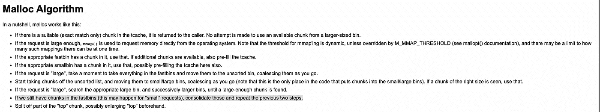

如果释放块的大小≥ **64KB** ,它也由`**malloc_init_state, malloc_trim, __libc_mallopt**`和`**free**`函数触发:

[https://sourceware.org/](https://sourceware.org/)

在这篇文章中，我们将坚持使用 **malloc** ，因为这是触发 Fastbins 合并**的最直接的方式。**

# FastBin Dup 合并

我们将使用以下程序:

虽然上面的代码很容易理解，但是让我们花点时间来强调几点:

*   在`**Lines 11–14**`处，我们填充 tcache 列表，以便强制使用 FastBin。
*   在`**Lines 16–20**` 处，释放 p1 会将相应的块添加到 FastBin 列表，因为 tcache 列表对于该大小(0x40)已经满了。
*   下一次分配(`**Line 22**`)将触发 FastBin 列表中块的合并。然而，由于 p1 块已经被合并，p3 指针将指向与 p1 相同的地址。
*   释放 **p1** (再次在`**Line 22**`)将把块添加到 tcache，即使它仍然被 **p3 引用。**
*   在`**Line 33**`，我们请求一个可以被 tcache 最后一次添加(`**0x400**`)所满足的大小。因此 **p4** 现在将指向与 **p3** 相同的地址。

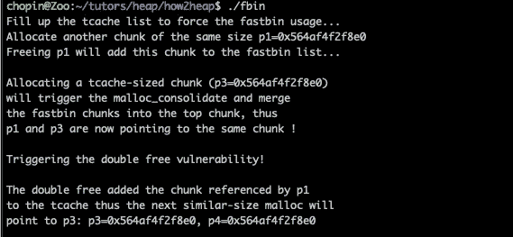

让我们将程序加载到 gdb 中，看看运行中的一切:

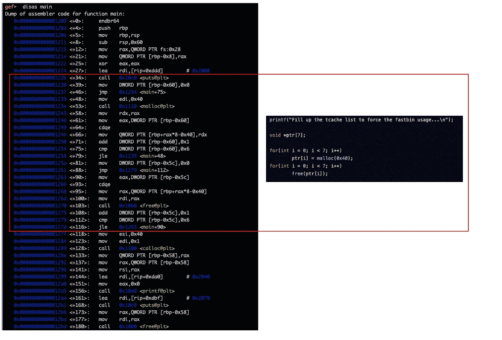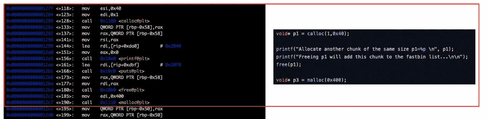

在`free(p1)`后设置一个断点，点击后检查堆箱:

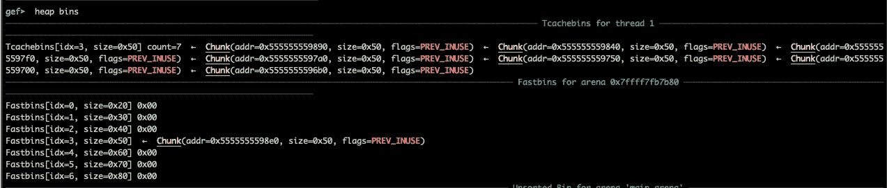

现在进入`**malloc**`直到`**_int_malloc**` 函数，这里我们注意到一个对`**checked_request2size**` **:** 的调用

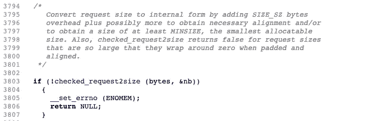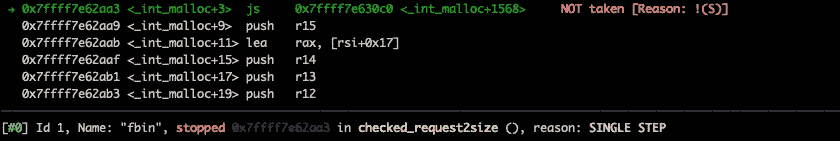

在随后的分支上，_int_malloc 将检查快速箱是否能满足要求(使用`**get_max_fast()**`):

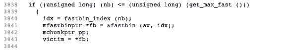

由于我们请求的大小为 0x400 字节，该检查将失败，因此我们将结束于`**malloc_consolidate**`调用:

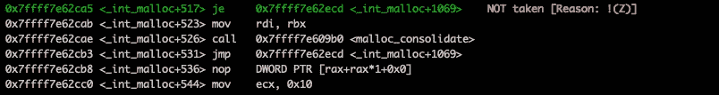

在这个调用之后，`**0x5555555598e0**`处的块已经被合并:

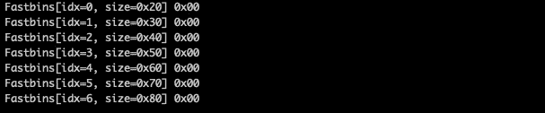

现在 malloc 将返回`**0x5555555598e0**` 作为新的块地址引用来满足分配(见下面顶部块之前的最后一个):

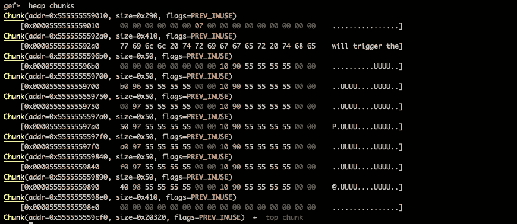

p1 的双释放将块移动到 tcache:

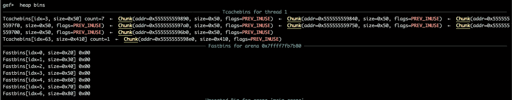

最后，对 malloc 的最后一次调用会将已经分配的块分配给 p4(参见下面的$rax ),这就完成了我们的概念验证:

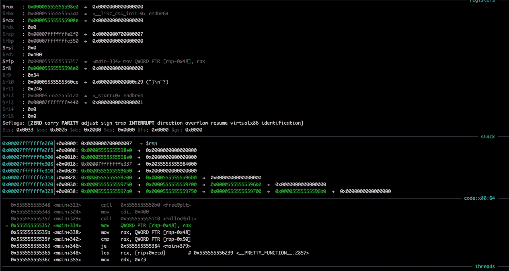

[1][https://sourceware.org/git/?p = glibc.gita = blobf = malloc/malloc . c；HB = 45 A8 e 05785 a 617683 bbaf 83 f 756 CAD a7 a 425 b 9](https://sourceware.org/git/?p=glibc.git;a=blob;f=malloc/malloc.c;hb=45a8e05785a617683bbaf83f756cada7a4a425b9)

[2][https://sourceware . org/glibc/wiki/malloc internals # Thread _ Local _ Cache _ . 28 tcache . 29](https://sourceware.org/glibc/wiki/MallocInternals#Thread_Local_Cache_.28tcache.29)