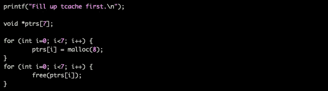
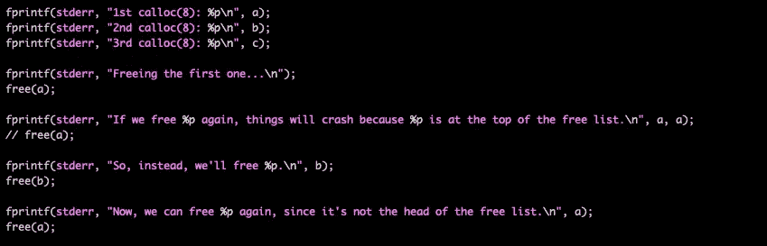
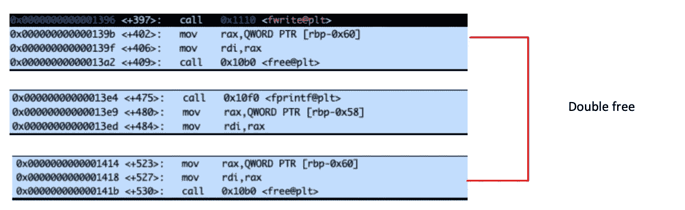
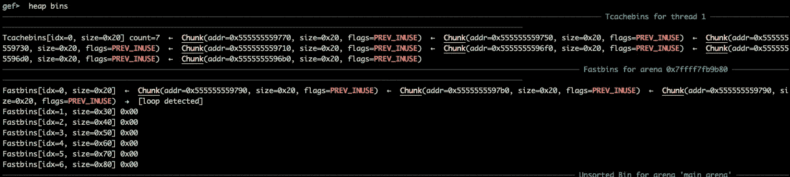
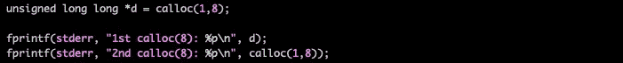
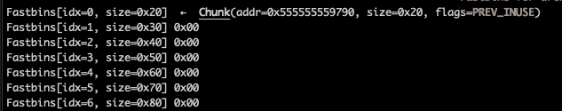
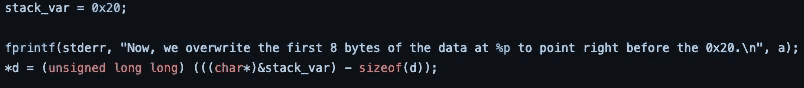
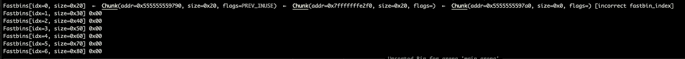
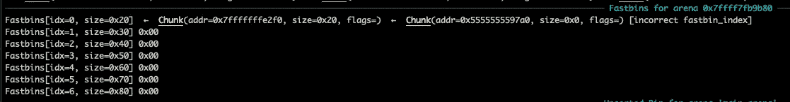
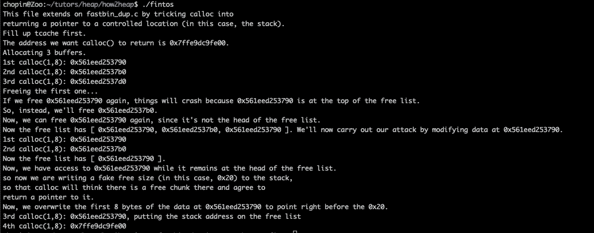

# 初学走路的孩子对堆利用的介绍，FastBin Dup to Stack(第 4.1 部分)

> 原文：<https://infosecwriteups.com/the-toddlers-introduction-to-heap-exploitation-fastbin-dup-to-stack-part-4-1-425592a2870b?source=collection_archive---------5----------------------->

这篇文章是与 x64 Linux 二进制开发技术相关的系列文章的一部分。在我以前的帖子中，我从探索简单的堆栈损坏错误及其缓解技术开始，逐渐发展到更复杂的主题。在上一篇文章中，我深入研究了使用先前已经释放的内存的概念，在堆内存利用的上下文中，这种错误被称为**释放后使用** (UAF)。

继续这个思路，在这篇文章中，我将讨论一种称为 *fastbin dup to stack、[https://github.com/shellphish/how2heap](https://github.com/shellphish/how2heap)repo 中引用的*的堆利用技术。也就是说，从我们停止的地方开始，这里是我以前文章的链接:

*   [堆利用入门(第 1 部分)](https://valsamaras.medium.com/the-toddlers-introduction-to-heap-exploitation-part-1-515b3621e0e8)
*   [堆利用入门(第二部分)](https://valsamaras.medium.com/the-toddlers-introduction-to-heap-exploitation-part-2-d1f325b74286)
*   [堆利用入门——溢出(第 3 部分)](https://valsamaras.medium.com/the-toddlers-introduction-to-heap-exploitation-overflows-part-3-d3d1aa042d1e)
*   [堆利用的幼儿入门——免费后使用&双免费(第四部分)](https://valsamaras.medium.com/use-after-free-13544be5a921)

## FastBin 双自由堆栈

这种攻击利用双重释放漏洞来迫使`**calloc**`返回一个指向受控位置(在这种情况下是堆栈)的假块。我将使用对 **how2heap 的**示例稍加修改的版本，可以在这里找到:

**图 1:**[https://github . com/shellphish/how 2 heap/blob/master/glibc _ 2.23/fastbin _ dup _ into _ stack . c](https://github.com/shellphish/how2heap/blob/master/glibc_2.23/fastbin_dup_into_stack.c)

我将在本例中使用的代码如下所示:

让我们一步一步地看看这段代码在做什么:

*   因为我们想要描述一种 fastbin 利用技术，并且当请求内存分配时，分配器首先使用 tcache，所以代码在第 12 行到第 19 行通过分配七个相同大小的块来“打包”tcache。这将强制分配器使用 fastbins 列表:

**图 2:** 打包 tcache 列表

*   然后，它创建三个新的分配，将它们分配给`a, b, c`变量，并为`a`调用两次 free 函数(double free ):

**图 3:** 双击`a`指针

**图 4:** 广发双免视图

**图 5:** 在 fastbins 列表中，第一个和最后一个块指向同一个地址。

*   对 **calloc** 的接下来的两个调用将从 fastbins 列表中返回块，但是由于双重空闲，fastbins 中仍将有一个条目指向已分配的块:

**图 6:** 对 calloc 的下两个呼叫

为了验证上述内容，将程序加载到 gdb 中，并跟踪对 calloc 的两次调用所返回的地址:

**先是** `**calloc(1,8)**` **→** `**0x0000555555559790**`

**图 7:** 块地址返回到$rax

**第二个** `**calloc(1,8)**` **→** `**0x00005555555597b0**`

**图 8:** 块地址返回到$rax

fastbins 中的一个条目仍然指向分配的块`**(0x0000555555559790)**`:

**图 9:** 在 fastbin 列表中仍然有一个条目指向一个分配的块

*   在第 61 行中，程序模拟了攻击者控制`d`指针的情况，该指针(到目前为止)指向一个正在使用且空闲(同时)的块:

**图 10:** d 指向 stack_var 的地址，而 fastbin 中有一个条目指向同一个内存地址

*   在`d`被分配到`**stack_var**` 的地址后，一个伪链接将被添加到 fastbins 列表中，该列表现在将包含两个块(d 指向的块和伪块):

**图 11:**fastbin 列表包含一个指向堆栈的节点

由于第一次拟合，下一次分配将在 0x555555559790 分配区块:

**图 12:** 对 malloc 的调用从 fastbins 中删除了 head 块

对类似大小的 malloc 的后续调用将返回 0x 7 ffffff e2f 0 处的假块，如编译和运行程序后所示:

最终样本已推送至此:[https://github . com/shellphish/how 2 heap/blob/master/glibc _ 2.31/fastbin _ dup . c](https://github.com/shellphish/how2heap/blob/master/glibc_2.31/fastbin_dup.c)