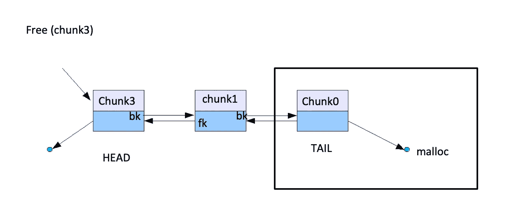
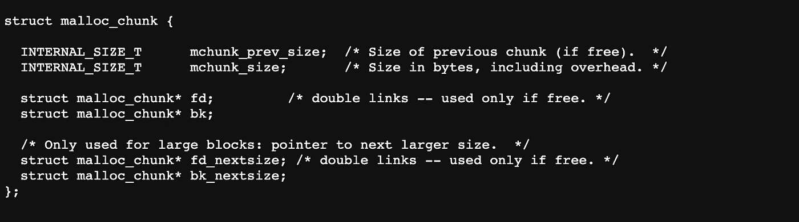
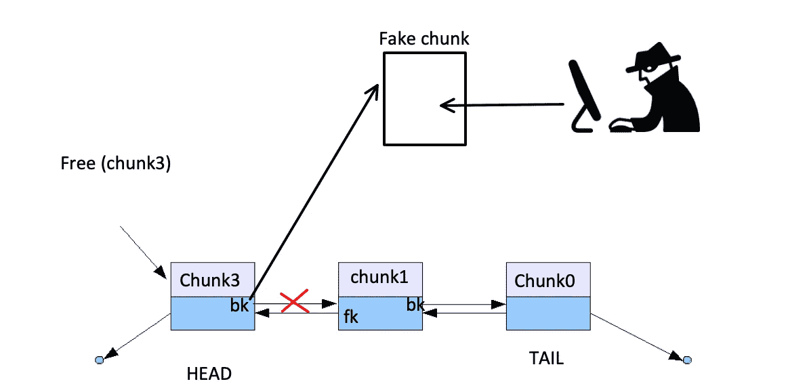
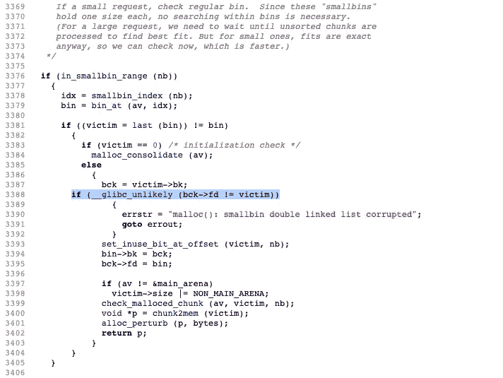
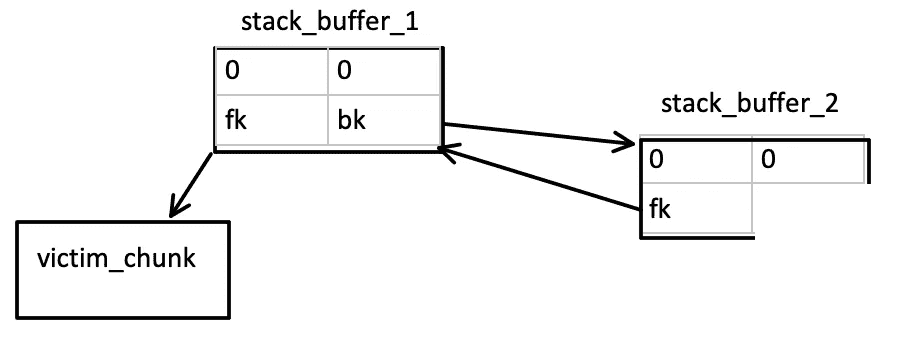
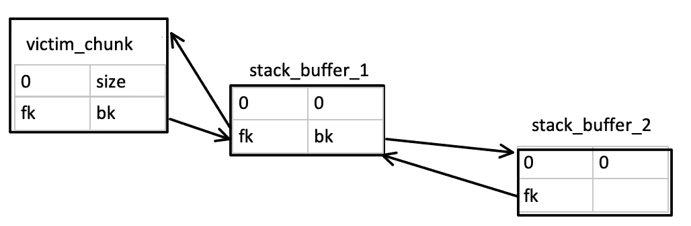
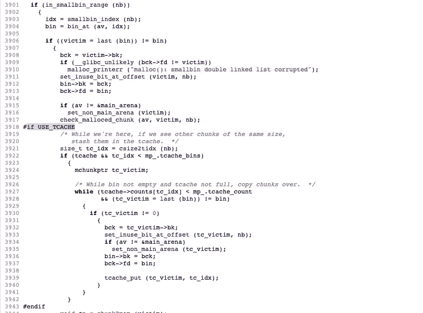
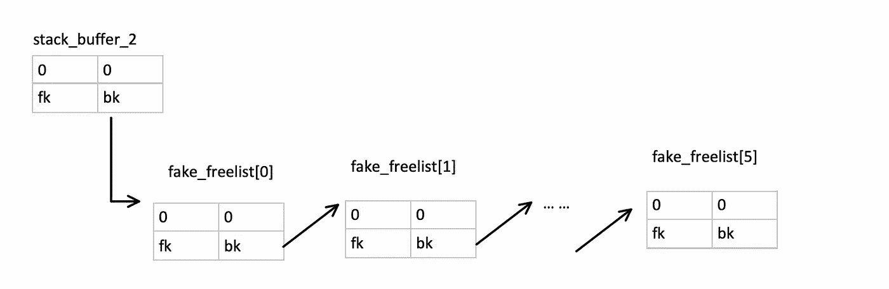

# 《堆开发的幼儿入门》,知识之家(第 4.5 部分)

> 原文：<https://infosecwriteups.com/the-toddlers-introduction-to-heap-exploitation-house-of-lore-part-4-5-1b5865297057?source=collection_archive---------1----------------------->

与我们到目前为止看到的其他堆利用攻击类似，**知识之家** ( **HoL** )背后的想法是**欺骗 malloc 返回一个指针，指向攻击者**控制的内存位置。 **HoL** (ab)使用 ptmalloc 处理`small bin`条目的方式，尽管[初始 post](https://dl.packetstormsecurity.net/papers/attack/MallocMaleficarum.txt) 也包含了`large bin`条目。除了知识之家周围的条件非常独特这一事实[1]，malloc 实现的变化(`fd_nextsize`和`bk_nextsize`的引入)[2]使得这种攻击对于大型 bin 滥用来说不切实际，而在`tcache`的引入和最新 glibc 版本的额外强化之后，这种攻击需要更多的条件才能成功。

除了它的(不)实用性，理解这种攻击是如何工作的，将有助于我们理解 malloc 是如何工作的，毕竟…这才是真正重要的。

在我们开始之前，这里是目前为止的故事:

*   [蹒跚学步，堆剥削，**简介**(上篇)](https://valsamaras.medium.com/the-toddlers-introduction-to-heap-exploitation-part-1-515b3621e0e8)
*   [蹒跚学步，堆剥削，**简介**(下篇)](https://valsamaras.medium.com/the-toddlers-introduction-to-heap-exploitation-part-2-d1f325b74286)
*   [学步的，堆剥削的，**溢出的**(第三部分)](https://valsamaras.medium.com/the-toddlers-introduction-to-heap-exploitation-overflows-part-3-d3d1aa042d1e)
*   [学步的，**使用后免费&双免费**(第四部分)](https://valsamaras.medium.com/use-after-free-13544be5a921)
*   [学步的， **FastBin Dup to Stack** (第 4.1 部分)](https://valsamaras.medium.com/the-toddlers-introduction-to-heap-exploitation-fastbin-dup-to-stack-part-4-1-425592a2870b)
*   [学步的， **FastBin Dup 巩固**(第 4.2 部分)](https://valsamaras.medium.com/the-toddlers-introduction-to-heap-exploitation-fastbin-dup-consolidate-part-4-2-ce6d68136aa8)
*   [蹒跚学步的孩子，**不安全的解除链接**(第 4.3 部分)](https://valsamaras.medium.com/the-toddlers-introduction-to-heap-exploitation-unsafe-unlink-part-4-3-75e00e1b0c68)
*   [幼儿的**精神之家**(第 4.4 部分)](https://valsamaras.medium.com/the-toddlers-introduction-to-heap-exploitation-house-of-spirit-part-4-4-252cd8928f84)

# 知识之家

坚持攻击的主要思想，我们将强制 malloc 返回一个指向我们控制的堆栈内存区域的指针。这将帮助我们覆盖发生漏洞的函数的返回地址，并通过跳过[金丝雀](https://valsamaras.medium.com/introduction-to-x64-linux-binary-exploitation-part-4-stack-canaries-e9b6dd2c3127)值绕过堆栈粉碎检测。我们将在 glibc 2.23 版本的背景下研究 HoL，以避免`tcache`的发生，并逐渐添加缺失的条件，以便为最新的 glibc 版本实现这种攻击。

在我们开始之前，您需要了解以下内容:

*   当一个块被传递给 free()时，它首先被添加到未排序的 bin 中。
*   在下一次调用 malloc 时，如果 smallbin 或未排序的块不能满足内存需求，那么将未排序的块放到适当的列表中。
*   当一个块被插入到(双重链接的)[小容器](https://valsamaras.medium.com/the-toddlers-introduction-to-heap-exploitation-part-2-d1f325b74286)中时，更新 **fd** 和 **bk** 指针，以便指向适当的节点。
*   由于分配器遵循这个 bin 的 FIFO 规则，对`free`的调用将把新的块发送到列表的头部，对 malloc 的调用将从尾部解除块的链接并删除块:

在小垃圾箱中插入和移除块

组块结构

## 袭击

假设您有一个溢出，允许您覆盖一个 N 大小块的`**bk**` 条目，因此它指向一个任意的内存位置:

覆盖 bk 以指向假块

那么为了让攻击发生，分配器需要对一个 N 大小的 malloc 执行 N 次调用，这样就可以到达被覆盖的 bk。让我们来看看 shellphish 的 [how2heap](https://github.com/shellphish/how2heap/blob/master/glibc_2.23/house_of_lore.c) repo 中的一个例子:

第 6 **和 7** 行的`**stack_buffer_1**`和`**stack_buffer_2**`代表两个将被分配到堆栈中的假块。在**第 9 行**中，我们分配了`**victim**`块，我们假设它通过溢出来控制它的头数据。在**行 11** 处，`**victim_chunk**`将指向牺牲块的头部。第 14 行到第 19 行处理`**stack_buffer_1**`和`**stack_buffer_2**` 看起来像与受害者块链接的有效块。更具体地说，**线 16** 将绕过**线 3388** 处的 malloc 检查:

第 17、19 行的代码将在一个双向链表中链接假块，因此我们将得到如下结果:

**添加第 21 行**以避免受害者块与顶部块合并。在**行 23** 对 free 的调用将首先把牺牲块移动到未排序的 bin，因此未排序的 bin 不能满足的下一个 malloc 将把牺牲块移动到 smallbin。**线 28** 表示脆弱性，其结果为以下排列:

由于`**victim_chunk**`是 smallbin 中唯一的节点，第一次调用第 31 行的 malloc 将返回它的地址以满足分配，所以随后调用第 33 行的 malloc 将返回一个指向`**stack_buffer_1**`的(假)数据部分的指针。由于我们控制了`**p4**`指向的内存位置，我们可以覆盖**主**函数的返回地址(第 37 行)以指向`jackpot()`函数的入口，这样通过运行程序我们将在输出中得到一个`Nice jump d00d`，然后程序将退出。

## #if USE_TCACHE

tcache 的引入为 smallbin 处理流增加了几个额外的分支，攻击要成功必须绕过这些分支。更具体地说，malloc 将尝试把剩余的相同大小的 smallbin 块存储到 tcache 中

为了克服这些检查，shellphish 的 repo 中的代码创建了一个假的空闲列表，并通过一个假的`bk`指针链接每个节点:

**void * fake _ freelist[7][4]；**

**for(int I = 0；I<6；i++){ fake _ freelist[I][3]= fake _ freelist[I+1]；}**

这将创建以下设置:

这将填充 tcache 列表并在**行 3927** 处退出循环。最后，代码通过一个伪需求耗尽 tcache 列表，如下所示:

**虚空*假人【7】；for(int I = 0；我<7；i++)dummies[I]= malloc(0x 100)；**

…

…

**for(int I = 0；我<7；i++)free(dummies[I])；**

整个代码如下:

[1][https://dl . packets storm security . net/papers/attack/mallocmaleficarum . txt](https://dl.packetstormsecurity.net/papers/attack/MallocMaleficarum.txt)

[2][https://heap-exploitation . dhavalkapil . com/attacks/house _ of _ lore](https://heap-exploitation.dhavalkapil.com/attacks/house_of_lore)