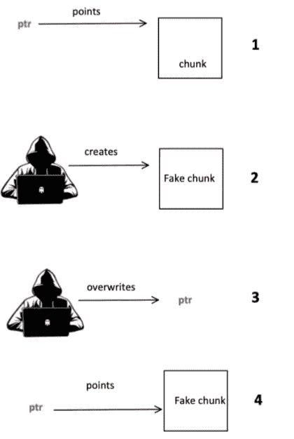
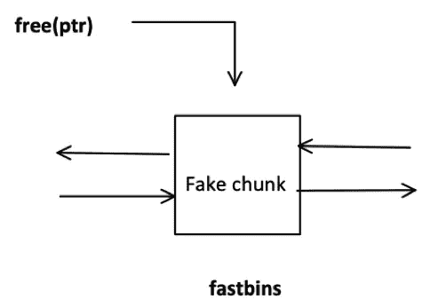
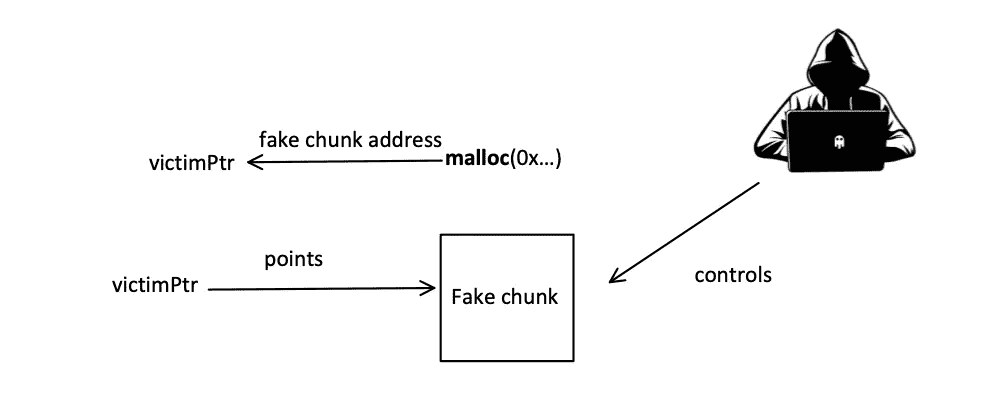
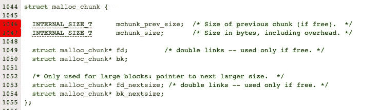
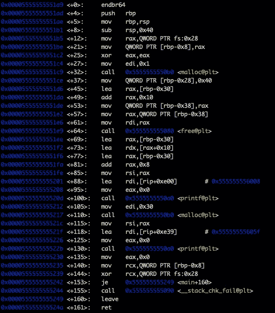
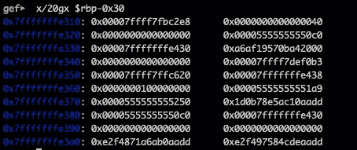
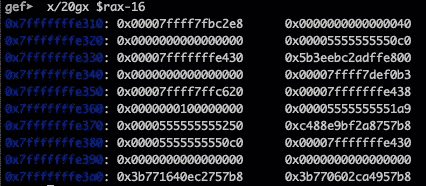
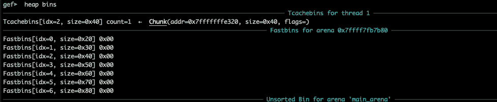
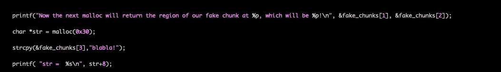
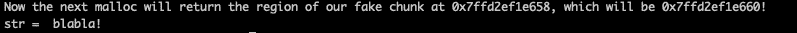

# 初学走路的孩子对堆利用的介绍，精神之家(第 4.4 部分)

> 原文：<https://infosecwriteups.com/the-toddlers-introduction-to-heap-exploitation-house-of-spirit-part-4-4-252cd8928f84?source=collection_archive---------0----------------------->

> 请让我知道，如果我开始听起来很奇怪…

*作者*

# 精神之家

具体的攻击最初是在 2005 年 10 月 11 日**由 [*幻影幻影、*在 bugtraq 邮件列表上以标题*Malloc male ficarum*](https://dl.packetstormsecurity.net/papers/attack/MallocMaleficarum.txt)*介绍的。*这个想法非常简单，而且随着[线程本地缓存](https://sourceware.org/glibc/wiki/MallocInternals#Thread_Local_Cache_.28tcache.29) (tcache)的引入变得更加简单:**

> 一般的想法是覆盖一个指针，这个指针先前是通过调用 malloc()返回的，随后被传递给 free()。这可能导致将任意地址链接到 fastbin。进一步调用 malloc()会导致这个任意地址被应用程序用作内存块。如果设计者可以控制应用程序对假块的使用，那么就有可能覆盖执行控制数据[1]。

简单地说，假设你有一个指向一个块的指针，你可以重写这个块，以便指向一个你控制其内容的任意地址。那么就有可能“欺骗”分配器使用你的地址作为一个空闲块的指针，并把它添加到 fastbins 列表中。当 malloc 再次被调用并且您的块符合要求时，返回的内存地址将指向您的受控内存区域。

免费前

**免费后:**

**最后，在 malloc 之后:**

在引入 tcache bin 之前，攻击者必须使用适当的大小值(由于特定 bin 的双重链接)来创建**相邻的假块，以便通过分配器的有效性检查。tcache bin(单链接)使事情变得更简单，因此制作一个假的块将通过有效性检查。**

**一如既往，请在下面找到我之前关于堆开发的帖子的参考:**

*   [蹒跚学步，堆剥削，**简介**(上篇)](https://valsamaras.medium.com/the-toddlers-introduction-to-heap-exploitation-part-1-515b3621e0e8)
*   [蹒跚学步，堆剥削，**简介**(第二部分)](https://valsamaras.medium.com/the-toddlers-introduction-to-heap-exploitation-part-2-d1f325b74286)
*   [蹒跚学步，堆剥削，**溢出**(第三部分)](https://valsamaras.medium.com/the-toddlers-introduction-to-heap-exploitation-overflows-part-3-d3d1aa042d1e)
*   [学步的，**使用后免费&双免费**(第四部分)](https://valsamaras.medium.com/use-after-free-13544be5a921)
*   [学步的， **FastBin Dup to Stack** (第 4.1 部分)](https://valsamaras.medium.com/the-toddlers-introduction-to-heap-exploitation-fastbin-dup-to-stack-part-4-1-425592a2870b)
*   [学步的， **FastBin Dup 巩固**(第 4.2 部分)](https://valsamaras.medium.com/the-toddlers-introduction-to-heap-exploitation-fastbin-dup-consolidate-part-4-2-ce6d68136aa8)
*   [幼儿的，**不安全的解除链接**(第 4.3 部分)](https://valsamaras.medium.com/the-toddlers-introduction-to-heap-exploitation-unsafe-unlink-part-4-3-75e00e1b0c68)

# 使用 tcache 的精神之家

早在 2017 年，glibc 2.26 就引入了 Tcache，以加快堆管理。关于**精神攻击之屋**，这个增加使得事情变得更容易，因为这个箱子是单列表的。

让我们看一个简单的例子:

我们在**第 6 行**调用 malloc 来初始化堆，随后(在**第 7 行**)我们声明一个指向**无符号长整型** (ull)的指针。在**第 8 行，**我们声明一个由**满**的数组，并让编译器在一个 16 字节的边界上分配它的成员(类似于块边界)。这个数组将模仿一个 chunk，它的头从地址 **fake_chunk[0]开始。**更具体地说，我们有以下对应关系:

**fake _ chunk**[0]→mchunk _ prev _ size，**fake _ chunk**[1]→mchunk _ size(回忆一下 chunk 结构，以便更好地理解这个概念):

**第 10 行**的语句`fake_chunks[1] = 0x40;`将把假块的大小设置为 **0x40** 。如果到目前为止一切顺利，假设攻击者能够重写 **a** 指向的地址。这个假设由第 12 行的`a = &fake_chunks[2];` 语句表示。最后，**行 14** 处的`free(a)`将把假块添加到 **tcache bin** 中，因此下一次调用 malloc(大小为 0x30)时，将返回一个指向攻击者控制的块的指针。请记住，假块的大小也是由攻击者控制的，因此请求的 malloc 大小不会成为攻击的问题。让我们将程序加载到 gdb，以便更深入地了解:

在`main+57`处，我们将在`**$rbp-0x30**`处获得以下值:

`main+57`后的`**$rax**`将指向假块的数据段:

对地址为$rdi 中的$rax 的 **free** 的调用将把假块移动到 tcache:

此时，假块将被分配给下一个 malloc(0x30)。为了让事情变得更有趣，在我们的初始程序中添加以下行(从第 16 行开始):

strcpy 等同于攻击者控制 fake_chunk 的能力，因此 str 指向:

暂时就这样了…下一篇文章再见。

[1][https://dl . packets storm security . net/papers/attack/mallocmaleficarum . txt](https://dl.packetstormsecurity.net/papers/attack/MallocMaleficarum.txt)