# 初学走路的孩子对堆利用、溢出的介绍(第 3 部分)

> 原文：<https://infosecwriteups.com/the-toddlers-introduction-to-heap-exploitation-overflows-part-3-d3d1aa042d1e?source=collection_archive---------0----------------------->

在这些帖子的前几部分( [1](https://valsamaras.medium.com/the-toddlers-introduction-to-heap-exploitation-part-1-515b3621e0e8) 、 [2](https://valsamaras.medium.com/the-toddlers-introduction-to-heap-exploitation-part-2-d1f325b74286) )中，我已经讨论了堆结构，并浏览了一些基本概念，以便为这篇和即将到来的帖子建立一个更好的背景。到目前为止，您可能已经意识到堆分配机制带来的广泛的攻击面，主要是由于它们的复杂性。除此之外，我们只接触了 **ptmalloc** 实现(这只是众多实现中的一个)，毫不奇怪**堆利用概念**完全垄断了安全研究社区的兴趣。

我将在我的许多帖子中使用 [how2heap](https://github.com/shellphish/how2heap) 存储库作为参考，因为它包含各种关于 ptmalloc 的更新的堆利用技术，其中许多也适用于其他实现。在这篇文章中，我们将探讨 x64 系统上的两个典型的**堆溢出**，以及最新的(此时我正在写这篇文章) **Ubuntu 版本 20.04.4** 。

# 我们到目前为止所看到的…在实践中

让我们用一个简单的例子来实践我们到目前为止所看到的。在下面的程序中，我们分别有两个`12`和`30`字节的分配。随后，我们将`LoremIpsum1`和`LoremIpsum2`的值复制到变量`val1`和`val2`，最后我们使用`free`函数释放分配的内存:

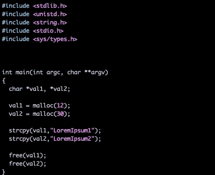

现在让我们编译并加载`gdb`中的程序，在`malloc`调用后设置一个断点，在`free`函数调用后再设置一个断点:

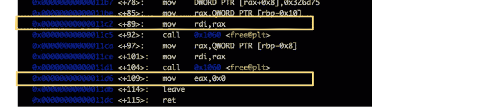

b *main+89，b *main+109

## 免费前

我将使用`gef`(可以按照这里的说明[安装)，以增强我的`gdb`。所以首先使用 GNU 调试器运行程序，并键入`heap arenas`，跟踪](https://github.com/hugsy/gef) [malloc_state](https://valsamaras.medium.com/the-toddlers-introduction-to-heap-exploitation-part-1-515b3621e0e8) 结构。由于我们只处理主线程(因此只是一个舞台)，您将得到类似于下面的结果:

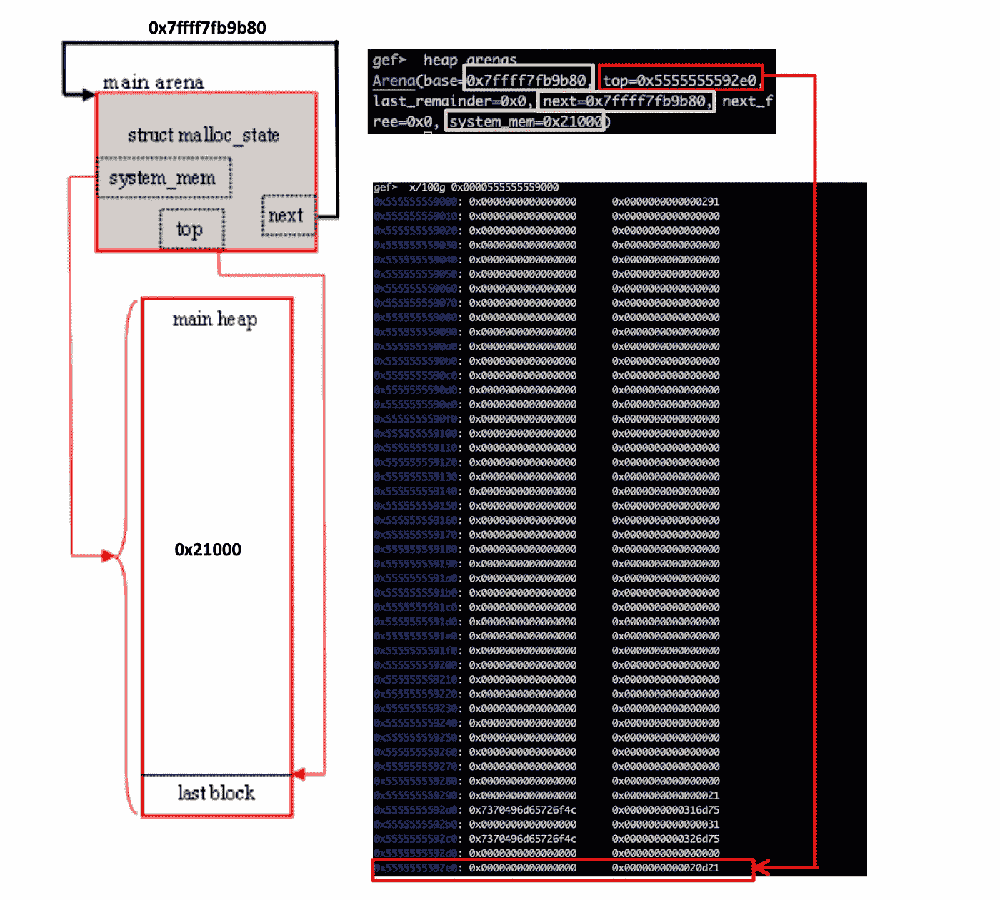

由于我们只有一个竞技场，`next`在`0x7ffff7fb9b80`指向主竞技场的`base`。`system_mem`对应于已分配堆的大小(`0x21000`),`top`变量指向`0x5555555592e0`处的最后一个块。接下来，让我们通过键入`gef> heap chunks`来检查分配的块:

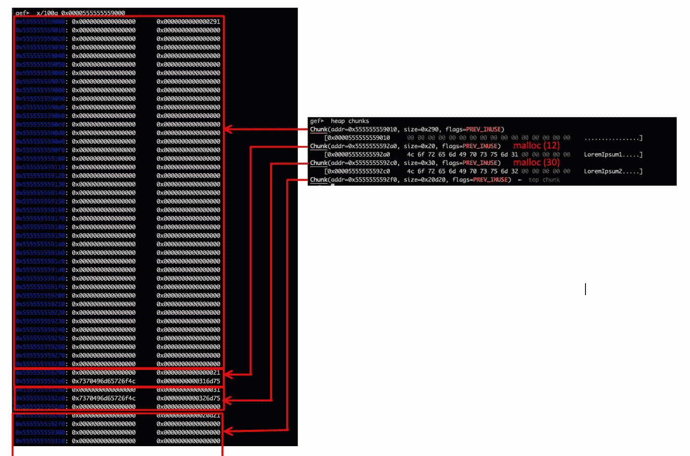

**我们请求了** **12 和 30** 字节，得到了 **0x21** 和 **0x31(十六进制)，但是为什么呢？**因为对齐！记住分配的大小必须在 8 字节(或 64 位上的 16 字节)边界上对齐**？**因此，对于 12 个字节，我们分配了 32 个(0x20 十六进制)，对于 30 个字节，我们分配了 **32+16** 。增加尺寸中的' **1** '指的是 **PREV_INUSE** 标志，因此不“计入”实际尺寸。例如，让我们检查一下`0x5555555592a0`处的块:

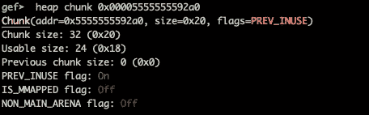

如上所述，初始请求是`val1 = malloc(12)`，块大小是 **32 字节**，其中的 **8 用于指示块的大小**，以及块是否属于辅助竞技场，是否通过 *mmap* 从堆外分配，以及先前的块是否是空闲块。

分配的块，来源:[https://azeria-labs . com/heap-exploitation-part-1-understanding-the-glibc-heap-implementation/](https://azeria-labs.com/heap-exploitation-part-1-understanding-the-glibc-heap-implementation/)

你可能也注意到了我们存储在`0x5555555592a0`和`0x5555555592c0`的编码数据(`LoremIpsum1`和`LoremIpsum2`)。最后，我们在堆的开始有一个大小为`0x0000000000000290`的块，在最后有一个大小为`0x0000000000020d20`(顶部块)的块。

## 免费后

为了更好地了解`free`函数的后果，让我们修改初始程序，增加一些分配，并检查 ptmalloc 如何处理它们。

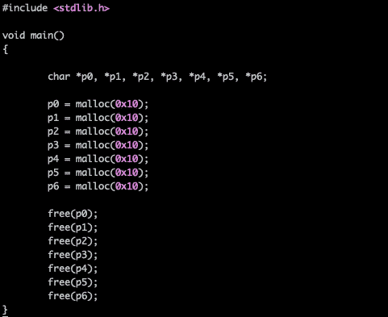

编译上面的程序并加载到 gdb，在`free`调用后设置一个断点。

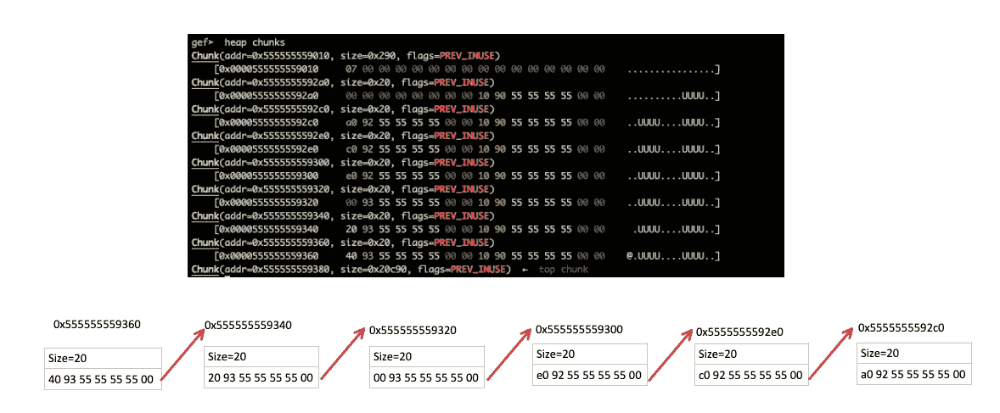

使用 tcache

> **记住**:每个线程都有一个每线程缓存(称为 *tcache* )，其中包含一个小的块集合，可以在不需要锁定竞技场的情况下访问这些块。这些块被存储为一个由**单链表**组成的数组，就像 fastbins 一样，但是链接指向有效载荷(用户区域)而不是块头。每个 bin 包含一个大小的块，所以数组是按块大小索引的(间接)。与 fastbins 不同，tcache 受限于每个 bin 中允许多少块(tcache_count)。如果对于给定的请求大小，tcache bin 为空，则不使用下一个更大的块(可能会导致内部碎片)，而是使用正常的 malloc 例程，即锁定线程的 arena 并从那里开始工作[1]。

每增加一个 0x10 或更少字节的分配都会被整合到 Fastbins 中，因为它超过了 tcache 中允许的最大值(在我们的示例中为 7 ):

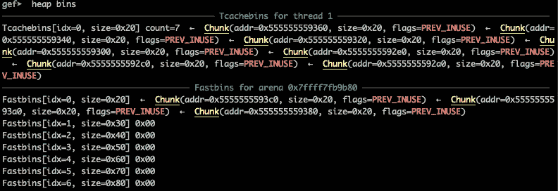

这个堆现在看起来像下面这样:

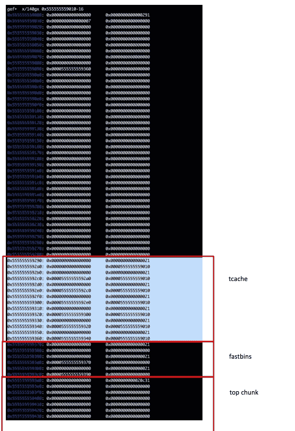

# 基本堆溢出

看一下下面的代码片段，注意程序允许输入比分配的空间更大的大小(`Lines 9,10,15`)。为了方便起见，`system`函数将把由`p1`变量指向的字符串作为参数，并作为系统命令执行。`pwd`是将被执行的硬编码命令，这意味着`system`函数将简单地打印当前目录:

也就是说，如果我们编译并运行该程序，我们将看到以下输出:

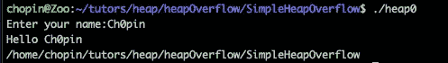

让我们在`gdb`中加载程序，并在`scanf`函数后设置一个断点。通过提供有效的输入，将产生以下结果:

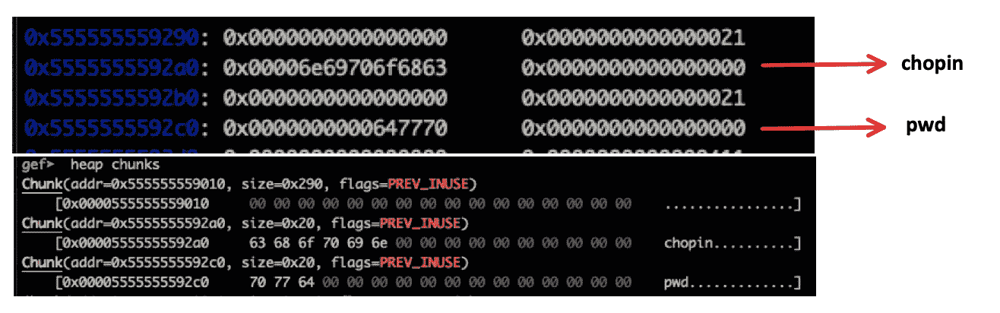

继续这个项目，一切如预期进行:

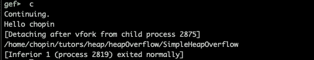

如下图所示，我们需要 32 个字节到达`**pwd**` 字符串并覆盖它:

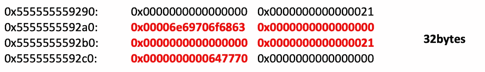

因此，让我们使用下面的字符串，看看会发生什么:

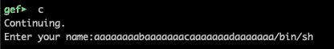

看看这一团糟！！**首先在程序代码中注意，缓冲区是在一个可能溢出的缓冲区之后分配的**。除此之外，大小和标志都受到了影响，但是最重要的是`pwd`命令现在已经被`/bin/sh`所取代:

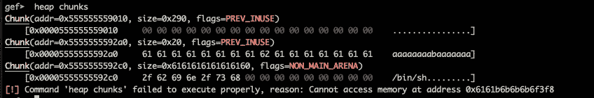

运行程序并给出上述输入将迫使程序返回一个 shell:

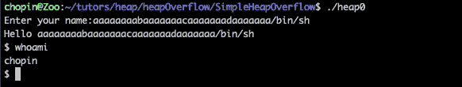

# 从整数溢出到代码执行

现在让我们来看一个更有趣的整数溢出的例子:

从`Line 5`开始，我们将`fp`定义为指向函数的[指针，该函数将`const char *`作为参数并返回一个整数。`Lines 7–13`处的`toInt`函数为`ti`变量(`Line 10`)分配空间，并为其分配`int atoi(const char *str)`](https://www.geeksforgeeks.org/function-pointer-in-c/) [C 函数](https://www.tutorialspoint.com/c_standard_library/c_function_atoi.htm)的地址。稍后在`main`中，我们在`Line 24`定义了`nt`变量，该变量可用于使用`(*nt)(const char *str)`声明调用`atoi`。

另外，`main`函数创建一个**长度为 argv[1]** 的无符号整数的`array`，并在`Lines 27–33`填充该数组。当用户输入数值`1` 或`i == length`时`while loop`断开。最后，在`Line 35`处，`atoi`被`argv[2]`参数所采用的参数调用。

由于数组**大小**已被定义为**无符号整数**，因此**整数溢出**发生，但由于在`Line 21`赋值期间没有相对检查，用户可能会插入任意高的算术值并触发溢出。在下面的演示中，我将使用与上面略有不同的程序版本来打印一些额外的信息，作为演示的参考。

让我们在`gdb`中加载程序，在`main`函数的开始和结束附近设置两个断点。现在运行程序并给出一些有效的参数(例如`gef> r 5 3`):

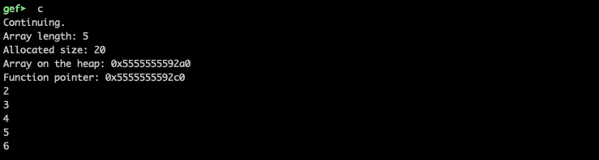

在到达第二个断点后，堆将如下所示:

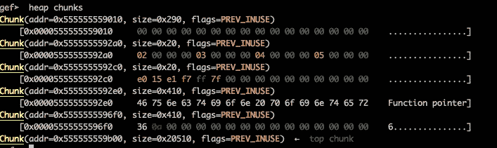

记下`0x5555555592a0`处的数组指针和`0x5555555592c0`处的函数指针。让我们检查这些地址的堆内容:

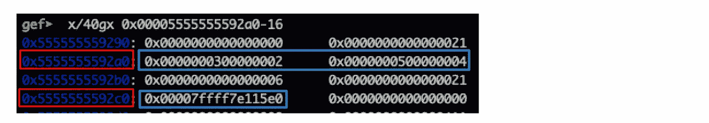

对于等于 5 的长度，请求的大小是 5*4 字节，因此 malloc 分配(最小)32 字节:

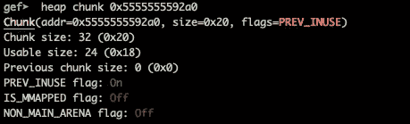

类似地，对 **malloc** ( `see toInt() function`)的第二次调用导致以下分配:

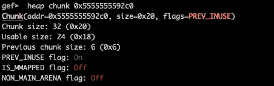

该系统的`unsigned int`大小为`4 bytes`，因此最大允许值将为`0xffffffff == 4294967295`。由于用户的输入与无符号整数的大小相乘，参见`Line 21`，我们假设大于`4294967295/4`的大小将触发溢出:

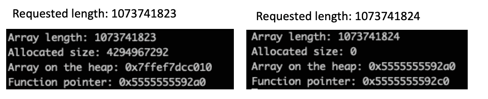

实际上，请注意，在第二种情况下，分配的大小是 0，但是在`Line 27`的`while`循环将允许我们写入超出分配的空间。让我们用 gdb 验证一下:

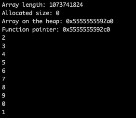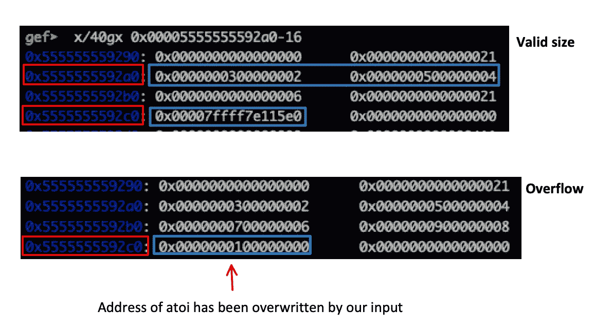

注意，对 malloc 的第二次调用实际上已经从堆中消失了，因为分配的空间已经被我们插入的值(2，3，4，5，..).这包括被值`**0x0000000100000000**` **替换的`atoi`功能的地址。**继续执行，我们将得到一个`SIGSEGV`错误，因为我们的程序将使用存储在`0x00005555555592c0 // Line 35: (*nt)(argv[2])`的函数指针。由于这个指针已经被一个无效的地址所取代，结果将会导致程序崩溃:

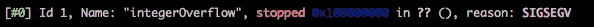

## 剥削

你能想出一个类似于`atoi`的函数，以字符串为参数，执行一个命令吗？

> 我们将用对`system`函数的调用来替换`atoi`调用。由于我们还控制了`atoi`的输入(因为它是由 argv[2]参数获取的)，我们将实现代码执行。

**假设 ASLR 被禁用**，我们必须用`0x7ffff7e1f2c0`替换`atoi`(在我的例子中是`0x7ffff7e115e0`)的地址，T5 是`system`函数的地址。由于我们总共有 6 个字节，并且在单个输入中只能覆盖 4 个字节(由于无符号 int 定义的数组)，我们将首先覆盖`f7e1f2c0`(十进制: **4158780096** )部分，然后是`7ffff`(十进制: **32767** )部分。让我们用`gef➤ r 1073741824 /bin/sh`运行程序，并插入以下值:

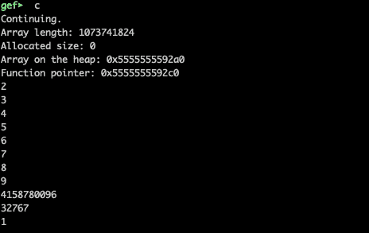

`atoi`的地址已被`system` 函数的地址覆盖，且`/bin/sh`已作为参数给出:

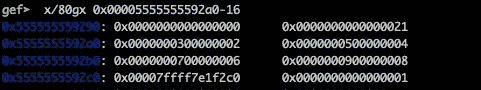

所以，敲击`gef`中的 c，最后会弹出一个外壳:

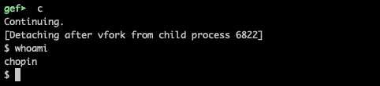

这部分就讲到这里。敬请期待下期！

# 参考

[1][https://sourceware . org/glibc/wiki/mallocinternels #:~:text = Each % 20 thread % 20 has % 20a % 20 per，area)% 20 not % 20 the % 20 chunk % 20 header](https://sourceware.org/glibc/wiki/MallocInternals#:~:text=Each%20thread%20has%20a%20per,area)%20not%20the%20chunk%20header)。