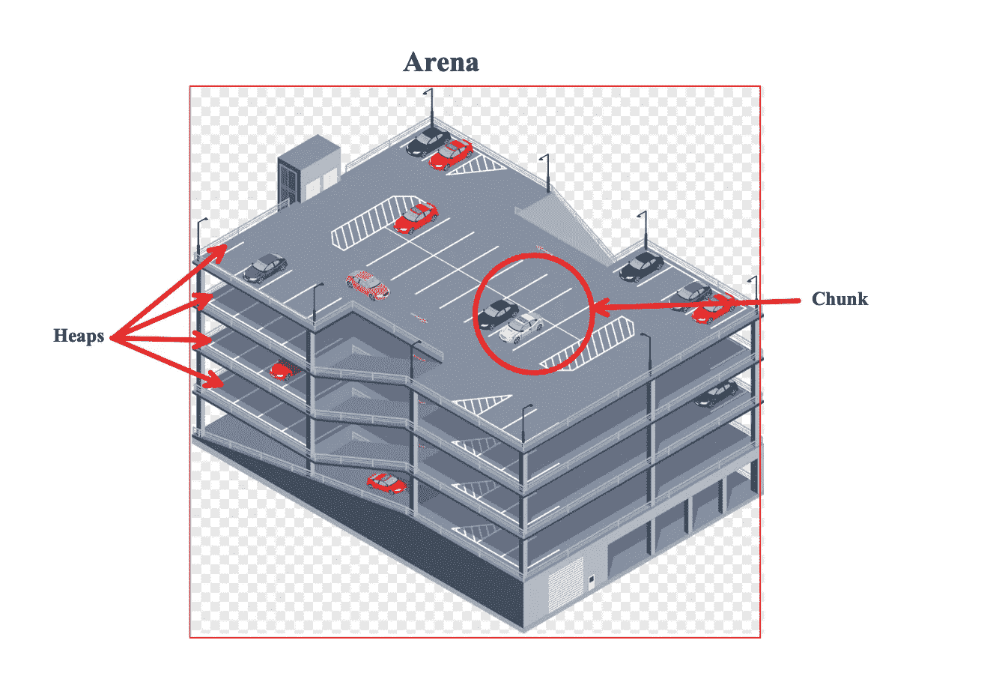
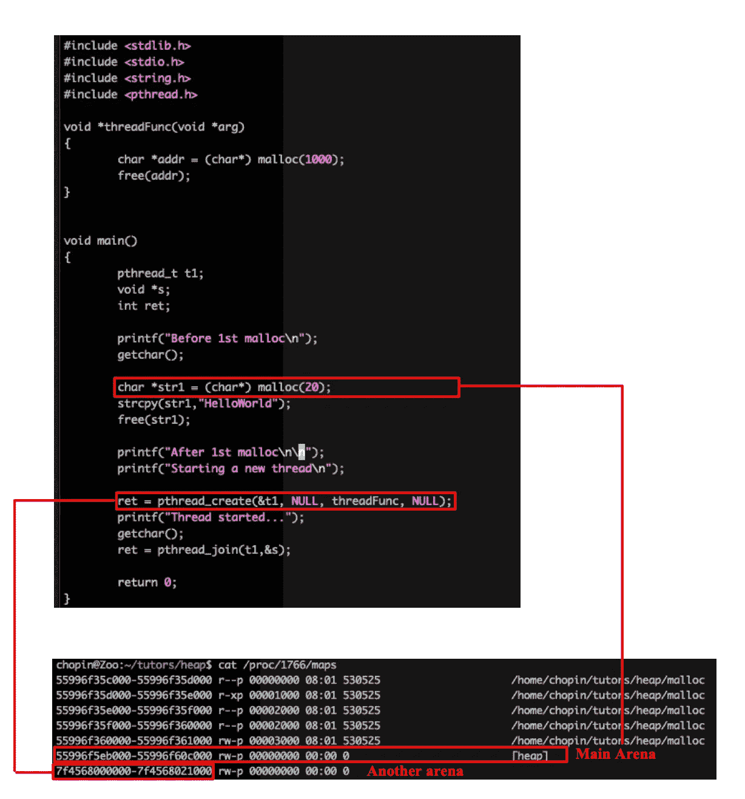
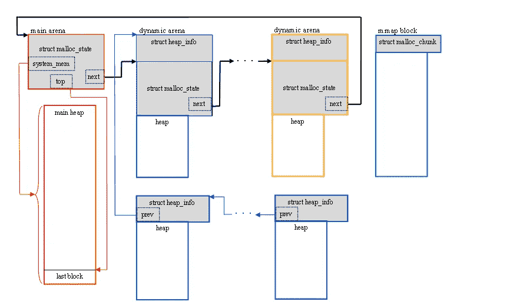
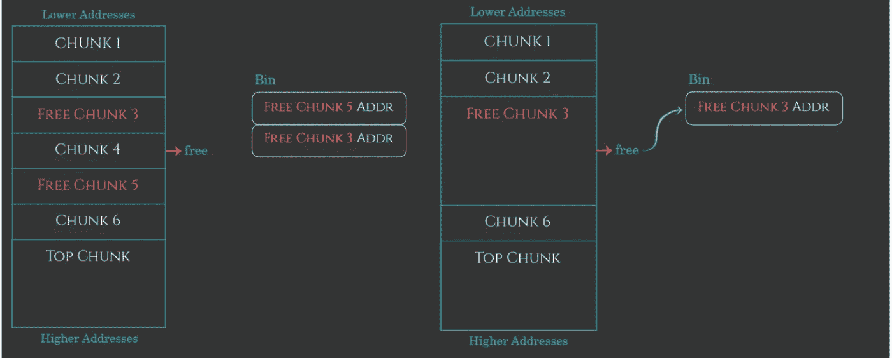
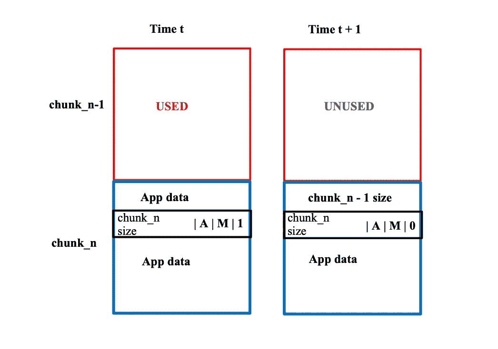

# 初学走路的孩子对堆利用的介绍(第 1 部分)

> 原文：<https://infosecwriteups.com/the-toddlers-introduction-to-heap-exploitation-part-1-515b3621e0e8?source=collection_archive---------0----------------------->

在我的[介绍性](https://valsamaras.medium.com/the-toddlers-introduction-to-dynamic-memory-allocation-300f312cd2db)帖子中，我一直在谈论动态内存分配，并提到了用于解决这个问题的各种解决方案。在这篇文章中，我将重点关注 GNU C 库的内存分配，它是基于**ptmalloc 2**(pthreads malloc)，并且是从 **dlmalloc** (道格·李的 malloc)中派生出来的。

# 堆组织图

分配给每个程序的堆根据三个主要部分进行组织:

*   **arena，**表示分配给每个线程的内存区域，而**包含对一个或多个堆**的引用。主线程的竞技场称为**“主竞技场”，没有多个堆。**
*   **堆，**这是一个连续的内存区域，被**细分为块**，属于一个竞技场。
*   **块**是一个小范围的内存，可以分配、释放或与相邻的块组合成更大的范围。每个块存在于一个堆中，属于一个竞技场。

还记得我上一篇文章中的**停车场**吗？如果我们把竞技场比作一个有多层和多个车位的停车楼，那么我们将会有一个类似于下图的结构:

竞技场，停车场环境中的堆和块

随着 P-Acme(我们的停车公司)的需求不断增长，新的建筑开始建造，新的员工开始管理这些建筑。类似地，当一个新线程被创建时，系统给它分配一个新的竞技场。竞技场的数量是有限制的，所以当达到这个限制时，程序必须重用现有的竞技场。下面的程序创建了两个线程，而每个线程都将获得一个单独的竞技场:

# ptmalloc 实现概述

现在我们对堆结构有了一个概念，让我们对 ptmalloc 分配器有一个全面的了解。

为了给“**主竞技场”分配内存，** malloc 调用了 **sbrk** 函数，尽管请求了内存大小，系统还是会分配 132 KB 的内存。主线程中的更多 malloc 调用将继续使用同一个 arena，而在内存耗尽的情况下，堆大小将会增加。对于每个新线程，通过调用 **mmap 函数**创建不同的 arena ( **线程 arena)** ，并再次分配 132 KB。竞技场的最大数量**是系统中 CPU 数量**的八倍(除非用户另有说明)。

Glibc 使用一个名为 [**malloc_state**](https://github.com/lattera/glibc/blob/master/malloc/malloc.c) **的 C 结构来维护每个竞技场的信息**。对于主竞技场，该信息存储在一个全局变量中，而对于其他竞技场，该信息存储在线程竞技场本身中:

接下来是[**heap _ info**](https://github.com/lattera/glibc/blob/master/malloc/arena.c)**C struct，带有堆元数据信息:**

**注意，每个堆都有自己的头，除了属于主竞技场的那个。最后，我们有 **malloc_chunk** C struct，正如你可能猜到的，它包含关于一个块的信息。到目前为止，我们所讨论的概念的高级概述可以在下面找到:**

****

**图来源:[http://core-analyzer . SourceForge . net/index _ files/page 335 . html](http://core-analyzer.sourceforge.net/index_files/Page335.html)**

**由于 Glibc 的 malloc 是面向块的，我们将重点关注 malloc_chunk(上面的绿色块),并深入了解它是如何构造的。**

## **大块**

**如果您检查 **malloc_chunk C** 结构，您会注意到 **fd** 、 **bk** 、 **fb_nextsize** 和 **bk_nextsize** 属性仅在 **chunk** 空闲时使用 **mchunk_prev_size****

****mchunk_size** 表示当前块的大小，由于它是 8 字节的倍数，最后 3 位(姑且称之为|A|M|P|)用作标志，表示以下状态之一:**

*   **一个标志被用来通知分配器这个块是否来自主竞技场(A == 1)或者不是(A == 0)。**
*   ****M 标志**被设置为 1，那么这个块是通过对 mmap 的一次调用来分配的，根本不是堆的一部分。**
*   ****P 标志**指示前一个块被使用(P==1)或空闲(P==0)，因此，在第二种情况下，它可以安全地与当前块固化在一起:**

****

**[https://azeria-labs . com/heap-exploitation-part-1-understanding-the-glibc-heap-implementation/](https://azeria-labs.com/heap-exploitation-part-1-understanding-the-glibc-heap-implementation/)**

****

**根据先前组块的分配，在时间 t 和时间 t+1 的组块 _n 状态**

**请注意，由于块在内存中彼此相邻，如果您知道堆中第一个块的地址(最低地址),则可以使用大小信息遍历堆中的所有块。**

# **分配停车位**

**让我们暂时忘记多个竞技场，专注于主要的一个。为了理解块分配是如何工作的，我们将使用停车位的概念，并看看 Alice(停车场员工)如何处理请求:**

*   **爱丽丝有一份所有空闲停车位的清单，写在叫做**箱**的笔记本上。请注意，一辆汽车可以占用多个插槽，因此当一辆汽车退出停车场时，Alice 会将空闲的插槽添加到她的列表中。**
*   **当一辆车进入停车场时，Alice 计算出需要多少个车位，并在她的列表中搜索合适的车位。如果她找到一个，她就把它从清单上删除，然后开一张停车罚单给司机。该票包含索引、停车位的大小以及指示前一个(相邻的)停车位是否被使用的标记。这将有助于她统一汽车出口处的停车区域。**
*   **如果没有空位，她会尝试创建新的空位(在停车位尽头的某个地方——最上面的那块)。如果没有空位，她会要求公司延长停车时间。如果公司批准，Alice 将把汽车送到新的位置，否则她将拒绝进入(malloc 返回 null)。**

**暂时就这些了:)，接下来的部分保持联系！**

# **参考**

**[1]https://virtual-index.com/programming/pointers**

**[2][http://blog . k 3170 makan . com/2018/11/glibc-heap-exploitation-basics . html](http://blog.k3170makan.com/2018/11/glibc-heap-exploitation-basics.html)**

**[3][https://sense post . com/blog/2017/无痛-intro-to-the-Linux-userland-heap/](https://sensepost.com/blog/2017/painless-intro-to-the-linux-userland-heap/)**

**[4][http://core-analyzer . SourceForge . net/index _ files/page 335 . html](http://core-analyzer.sourceforge.net/index_files/Page335.html)**

**[5][http://blog . k 3170 makan . com/2018/12/glibc-heap-exploitation-basics . html](http://blog.k3170makan.com/2018/12/glibc-heap-exploitation-basics.html)**

**[6][https://blog . k 3170 makan . com/2019/03/glibc-heap-exploitation-basics . html](https://blog.k3170makan.com/2019/03/glibc-heap-exploitation-basics.html)**

**[7][https://azeria-labs . com/heap-exploitation-part-1-understanding-the-glibc-heap-implementation/](https://azeria-labs.com/heap-exploitation-part-1-understanding-the-glibc-heap-implementation/)**