# 初学走路的孩子对堆利用的介绍(第 2 部分)

> 原文：<https://infosecwriteups.com/the-toddlers-introduction-to-heap-exploitation-part-2-d1f325b74286?source=collection_archive---------0----------------------->

在我的[上一篇文章](https://valsamaras.medium.com/the-toddlers-introduction-to-heap-exploitation-part-1-515b3621e0e8)中，我一直在谈论 ptmalloc 分配器上下文中的堆结构。我经历了一些基本的概念，像竞技场、子堆和块，我用了一个真实的例子来简化这些概念，并(希望)帮助记忆它们。在这一部分，我将关注 **free** 函数的后果，关注分配器如何以最有效的方式*管理释放的内存。*

# 释放一个块

回想一下第 1 部分，当一个块被使用时，它携带关于其大小的信息，以及由表示大小的数字的最后三位表示的另外三个标志(我们将它们命名为|**A**|**M**|**P**|)。由于块大小总是 8 字节(对于 32 位系统)或 16 字节对齐(对于 64 位系统)，这些最后的位在大小计算期间被忽略，因此二进制值 **1111** (二进制)仍将计为 8 字节。最后三位表示该块是否来自主竞技场，是否是通过调用 mmap 分配的，以及前一个块是否在使用中。有了这些信息，并且由于块在内存中彼此相邻，如果有人知道堆中任何块的地址，那么就有可能使用由大小指示的值遍历所有块。

当函数 **free** 被调用时，分配器将首先执行健全性检查来验证块的有效性(例如，对齐、边界、是否已经空闲等)。)如果一切正常，它将使用(现在)未使用的数据区来存储下面描述的值:

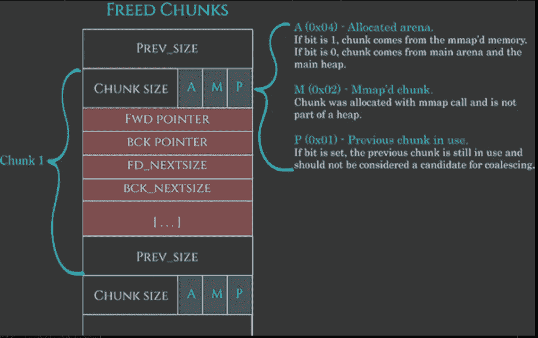

[https://azeria-labs . com/heap-exploitation-part-2-glibc-heap-free-bins/](https://azeria-labs.com/heap-exploitation-part-2-glibc-heap-free-bins/)

请注意 FWD 和 BCK 指针，因为它们的值将被用于将块整合到一个名为**bin 的列表中。**

> ***现实生活中的一个例子:*** 回到我们的停车模型，目前我们已经看到的是，当 Alice 为进来的汽车找到合适的空闲空间**时，她将它从她的可用性列表中移除，并给司机一张票。这张票包含汽车可以占用多少车位，以及关于竞技场、相邻车位的信息，以及它是否属于扩展区域(记住，如果爱丽丝找不到车位，她可以请求公司延长停车时间)。**在离开**的路上，她收到了返回的机票，她必须将该位置添加回她的可用列表中。**
> 
> 因为她使用的是一个简单的笔记本，所以每次她都很难找到一个大小合适的地方，她必须一页一页地搜索才能找到合适的地方。为了避免车辆在停车队列中堆积，她必须想出一个方法来加速这个过程，这就是我们接下来要看到的。

# 爱丽丝的宁滨

当爱丽丝从一辆驶出的汽车上收到一张停车票时，她将它添加到她的**未分类的**堆中，希望上面的槽的数量将匹配即将到来的停车要求。如果这没有发生，她就把它放在她办公室表面的一个短“堆”里。这样她就能快速追踪到它，并将其分配给一辆即将到来的车辆。

为了形象化 Alice 的解决方案，我们可以将彩票想象成纸牌游戏中的扑克牌，其中每张牌都根据一些特定的特征被添加到特定的一堆中。她在这间办公室只能有 **64 堆**牌，每堆可以有 **7 张**。现在，想象一辆进来的汽车必须占用 2 个停车位。Alice 只需从两张票中拿起第一张票，交给司机:

当一堆票没有更多的空间或者她不能创建一个新的时候，她就用一个特别设计的叫做**垃圾箱**的柜子来存放票。每个抽屉指的是一个 **x** 车位的大小，例如第一个抽屉装的是**1 号位**的票，第二个抽屉装的是**2 号位**的票等等，这样她就很容易非常有效地再次跟踪车位。

垃圾箱

在忙碌的日子里，她必须更有创造力，因为上面描述的解决方案是不够的。所以她用了两个储物箱。在第一个盒子(**小盒子**)中，她将彩票放在一个特定的尺寸上，每个子盒子包含一个尺寸的彩票。在第二个(**大箱子)**中，她放入大尺寸的票，每个子箱子包含特定范围的票:

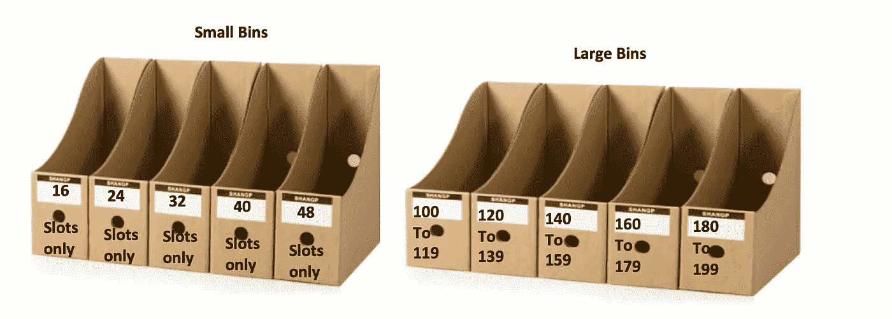

考虑到这一点，我们来看看 ptmalloc 对应的宁滨是怎样的。

# Ptmalloc 的宁滨

我们正处于调用了 **free** 函数的时刻，被释放的块必须被索引以备将来重用。添加到数据段中的 **FWD** 和 **BCK** 指针(记住空闲块和已用块之间的区别)将被用来将块整合到一个双向或单向[链表:](https://en.wikipedia.org/wiki/Linked_list)

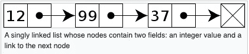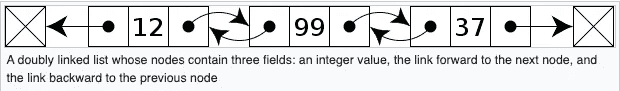

[https://en.wikipedia.org/wiki/Linked_list](https://en.wikipedia.org/wiki/Linked_list)

*但是如果每个空闲块，不管大小，都集成在一个列表中，效果会如何呢？*

与 Alice 的简单笔记本方法类似，分配器必须迭代空闲块列表，以找到满足内存请求的块。如你所知，这对于大量的分配是非常无效的。为了解决这个问题，分配器维护了一系列名为**bin**的列表，并使用它们根据块的大小对块进行索引。Ptmalloc 使用 5 种类型的 bin:**tcache，fast，unsorted，small and large** :

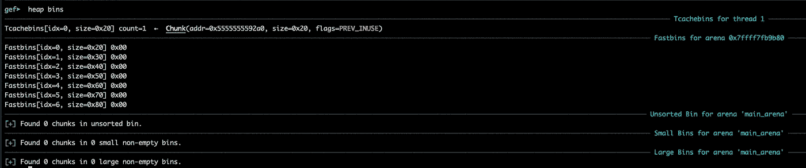

使用 gdb 探索堆箱

> **tcache:** 包含属于单线程的块的**单链表元**。每个 bin 包含一个大小的块，所以数组是按块大小索引的(间接)。例如，如果我们调用 malloc 8 次来分配 0x20、0x20、0x30、0x30、0x40、0x40、0x50、0x50 字节，则 tcache 将如下所示:

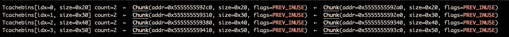

每个箱的组块数由 **tcache_count** 变量设定阈值，箱数由 **tcache_bins** [1]设定阈值:

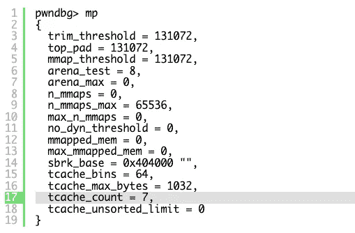

Ubuntu 20.04 中的 glibc 2.31 堆分配

所以如果我们分配 **0x20 字节** **超过**的 7 倍，就会调用另一个 bin 桶来方便组块。例如，9 个 0x20 字节的分配产生以下堆排列:

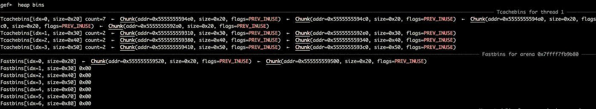

> 一个包含最近释放的小块的列表数组。快速箱不是双重链接的。单链接会更快，而且因为块不会从这些列表的中间移除，所以双链接是不必要的。此外，与常规 bin 不同，它们甚至不以 FIFO 顺序处理(它们使用更快的 LIFO ),因为在通常使用快速 bin 的瞬态上下文中，排序并不重要[1]。

它实际上是一个指针数组，其中每个指针都指向一个单向链表的顶部，该链表包含特定大小的块(16、24、32、40、48、56、64、72、80 和 88 字节加上块的元数据):

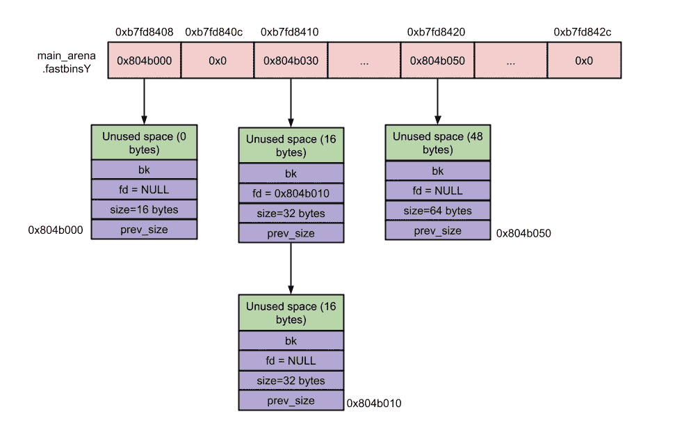

[https://sploitfun . WordPress . com/2015/02/10/understanding-glibc-malloc/](https://sploitfun.wordpress.com/2015/02/10/understanding-glibc-malloc/)

因此，假设有一个 32 字节的 malloc 请求，那么分配器将引用地址为 **0xb7fd8410，**的条目，它将删除最上面的块(列表中的第一个)，并将指针设置为指向第二个条目。要了解从 tcache 到 fastbins 的交换，请参见下图:

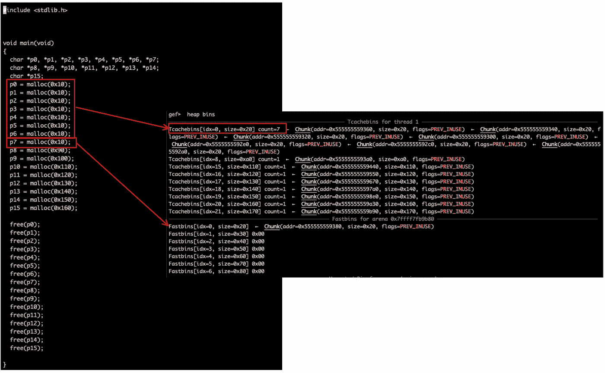

前七个分配已保存到 tcache，下一个分配已移动到 fastbins。

> **小箱子:**共有 62 个，每个小箱子存放大小相同(固定)的大块。在 32 位系统上，每个小于 512 字节的块(或在 64 位系统上小于 1024 字节的块)都有一个相应的小 bin。由于每个小容器只存储一种大小的块，它们是自动排序的，所以在这些列表中插入和删除条目的速度非常快[2]。小容器是双重链接的，因此可以从中间移除大块。
> 
> **大容器:**它们有 63 个，与小容器的主要区别在于它们不是存储固定大小的块，而是存储大小范围内的块[1]。

更具体地说，ptmalloc 定义了[3]:

*   32 个箱，用于存储大小为 [64 字节的块](https://github.com/sploitfun/lsploits/blob/master/glibc/malloc/malloc.c#L1478)。因此，bin[64]将包含大小在 512 到 568 之间的双重链接结构(malloc_chunk ),大小为 576 到 632 的 bin[65],大小为 640 到 696 的 bin[66],等等…
*   16 个容器，用于存储大小为 [512 字节的块](https://github.com/sploitfun/lsploits/blob/master/glibc/malloc/malloc.c#L1479)。
*   8 个用于存储大小为 [4096 字节的块](https://github.com/sploitfun/lsploits/blob/master/glibc/malloc/malloc.c#L1480)。
*   4 个用于存储大小为 [32768 字节的块的存储仓](https://github.com/sploitfun/lsploits/blob/master/glibc/malloc/malloc.c#L1481)。
*   2 个用于存储大小为 [262144 字节间隔](https://github.com/sploitfun/lsploits/blob/master/glibc/malloc/malloc.c#L1482)的块的容器。
*   1 个容器包含剩余大小的[块。](https://github.com/sploitfun/lsploits/blob/master/glibc/malloc/malloc.c#L1483)

> **未分类的容器:**当块被释放时，它们最初被存储在单个容器中(双重链接)。之后在 malloc 对它们进行分类，以便给它们一个快速重用的机会。这也意味着排序逻辑只需要存在于一个点上——其他人只需将空闲的块放入这个容器中，它们稍后会被排序。“未排序的”容器只是常规容器的第一个[4]。

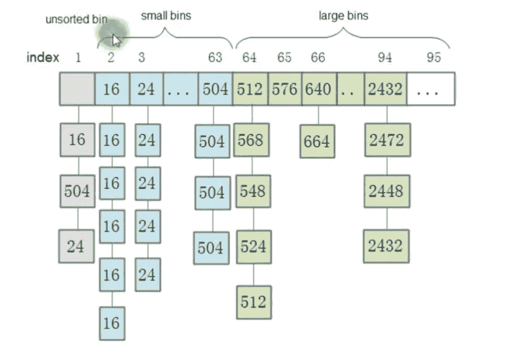

https://developpaper.com/chunks-and-bins-in-memory/

这个帖子到此为止！下一集见。

# 参考

[1]https://sourceware.org/git/gitweb.cgi?[p = glibc.gita = blobf = malloc/malloc . c；h = 6e 766d 11 BC 85 b 6480 fa 5c 9 F2 a 76559 F8 ACF 9 deb 5；hb=HEAD#l1407](https://sourceware.org/git/gitweb.cgi?p=glibc.git;a=blob;f=malloc/malloc.c;h=6e766d11bc85b6480fa5c9f2a76559f8acf9deb5;hb=HEAD#l1407)

[2][https://azeria-labs . com/heap-exploitation-part-2-glibc-heap-free-bins/](https://azeria-labs.com/heap-exploitation-part-2-glibc-heap-free-bins/)

[3][https://sploitfun . WordPress . com/2015/02/10/understanding-glibc-malloc/](https://sploitfun.wordpress.com/2015/02/10/understanding-glibc-malloc/)

[https://sourceware.org/glibc/wiki/MallocInternals](https://sourceware.org/glibc/wiki/MallocInternals)