# 初学走路的孩子对堆利用的介绍，不安全的解除链接(第 4.3 部分)

> 原文：<https://infosecwriteups.com/the-toddlers-introduction-to-heap-exploitation-unsafe-unlink-part-4-3-75e00e1b0c68?source=collection_archive---------1----------------------->

利用堆溢出漏洞并不总是简单的。除此之外，分配器在块分配/释放过程中进行各种检查，这需要额外的步骤来实现可利用的结果。在本帖中，我们假设我们已经发现了这样一个漏洞，我们将探索“下一步”以成功利用它。更具体地说，我们将操作`[unlink](https://sourceware.org/git/?p=glibc.git;a=blob;f=malloc/malloc.c;h=ef04360b918bceca424482c6db03cc5ec90c3e00;hb=07c18a008c2ed8f5660adba2b778671db159a141#l1344)` [宏](https://sourceware.org/git/?p=glibc.git;a=blob;f=malloc/malloc.c;h=ef04360b918bceca424482c6db03cc5ec90c3e00;hb=07c18a008c2ed8f5660adba2b778671db159a141#l1344)，以便允许我们控制一个任意指针并修改它所指向的数据。在特定条件下(比如一个指向函数的指针)，我们可能会重定向代码执行，并能够运行任意命令。

和往常一样，请在下面找到我以前关于堆利用的帖子的参考:

*   [堆剥削的幼儿介绍，介绍(第一部分)](https://valsamaras.medium.com/the-toddlers-introduction-to-heap-exploitation-part-1-515b3621e0e8)
*   [堆开发的幼儿入门，简介(第二部分)](https://valsamaras.medium.com/the-toddlers-introduction-to-heap-exploitation-part-2-d1f325b74286)
*   [初学走路的孩子对堆利用的介绍，溢出(第 3 部分)](https://valsamaras.medium.com/the-toddlers-introduction-to-heap-exploitation-overflows-part-3-d3d1aa042d1e)
*   [堆剥削幼儿入门，免费后使用&双免费(第四部分)](https://valsamaras.medium.com/use-after-free-13544be5a921)
*   [堆利用的幼儿入门，FastBin Dup to Stack(第 4.1 部分)](https://valsamaras.medium.com/the-toddlers-introduction-to-heap-exploitation-fastbin-dup-to-stack-part-4-1-425592a2870b)
*   [堆利用的幼儿入门，FastBin Dup Consolidate(第 4.2 部分)](https://valsamaras.medium.com/the-toddlers-introduction-to-heap-exploitation-fastbin-dup-consolidate-part-4-2-ce6d68136aa8)

# 取消链接宏

我们从上一篇文章中看到，在块释放过程中，当特定条件发生时，分配器会将相邻的块合并成更大的块，以便更有效地分配内存。简单地说，假设你有块`A, B, C`和`B`被释放，那么根据当前的实现，`free`将检查`A`或`C`是否在使用中，如果它们不在使用中，它将试图通过将它们合并到`B`来创建一个更大的块。下面的代码片段描述了该逻辑的实现:

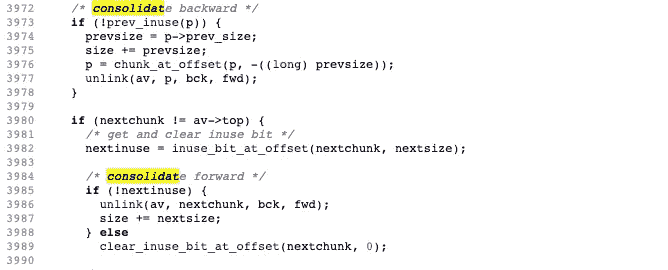

[自由合并](https://sourceware.org/git/?p=glibc.git;a=blob;f=malloc/malloc.c;h=ef04360b918bceca424482c6db03cc5ec90c3e00;hb=07c18a008c2ed8f5660adba2b778671db159a141#l3972)

在第`3977`和`3986`行的`unlink`宏之后，我们得出以下定义:

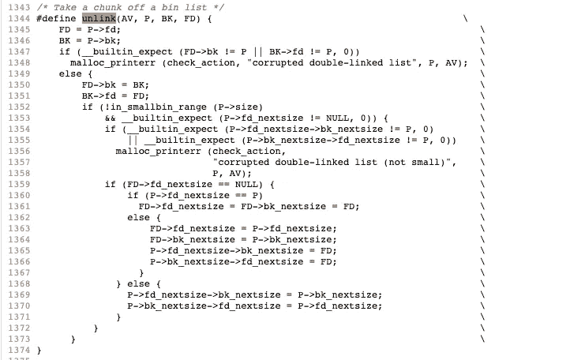

该代码将在双列表重新排列的上下文中修改(见第 1350-1351 行)块头的 **fd** 和 **bk** 指针(见下图):

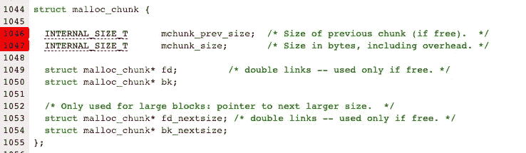

该过程类似于从双列表中删除节点:

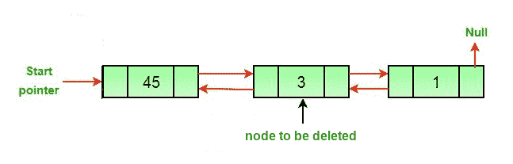

但是，在任何事情发生之前，执行有效性检查(在第 1347 行):

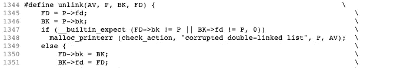

首先注意到`**FD = P→fd**`和`**BK = P→bk**`**，所以`**FD**` 应该指向下一个相邻的块，`**BK**` 应该指向上一个相邻的块:**

**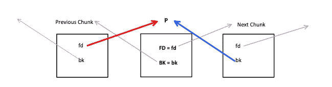**

**所以，要使双链表**有效** `**BK→fd**` **和** `**FD→bk**` **必须指向** `**P**` :**

****

**检查完这个条件后，我们有了下面的赋值`**FD->bk = BK**`和`**BK->fd = FD**`，所以我们的块现在看起来如下:**

**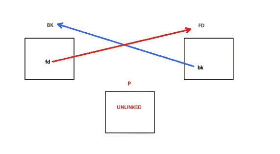**

# **开采计划**

**正如我们在文章开头提到的，我们完全控制块的内容，由于溢出错误，我们可以修改相邻块的元数据。因此，在我们成功利用的过程中，我们必须通过**解除链接检查**:**

**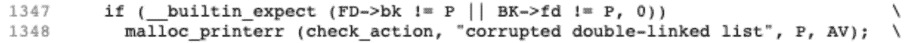**

**为了做到这一点，我们将执行以下操作:**

> ****在受控块内创建一个假块****

**我们将向特定的内存地址插入特定的值，以便在受控块的数据扇区内形成有效的块结构:**

**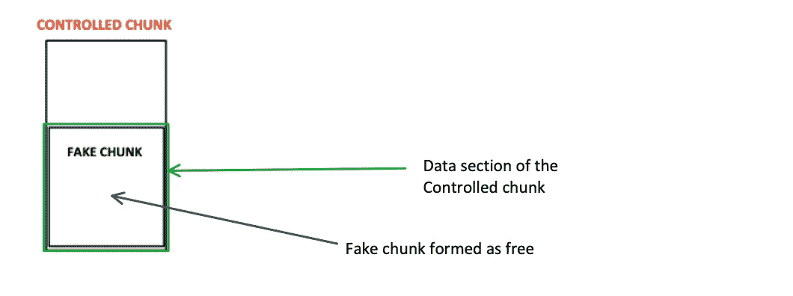**

****当我们想要通过解除链接检查时，我们将要在假块中作为** `**fd**` **和** `**bk**` **插入的值必须指向它们各自的** `**fd**` **和** `**bk**` **指针将指向我们的假块的结构！为了形象化这个概念，让我们看几个图:****

**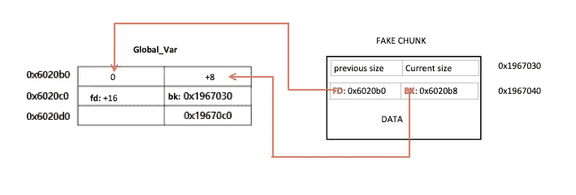**

**假设`**Global_Var**`表形成了一个块结构，那么在内存地址`0x6020b0`我们会有前一个块的大小，在`0x6020b8`有当前块的大小，在`0x6020c0`有 fd 指针，在`0x6020c8`有 bk 指针。所以我们有`fake_chunk.fd→bk = 0x1967030`和 `fake_chunk.bk →fd=0x1967030`，它们将通过解除链接验证检查。**

**下一步:**

> ****修改下一个数据块的标题，以便显示空闲的假数据块****

**记住:由于堆溢出，我们可以写超出**控制的块的**边界，因此我们可以修改**下一个块的头:****

**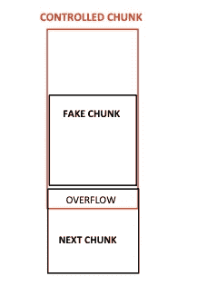**

**关于修改的类型，回想一下，当且仅当前一个块空闲时，分配的块的头部由**当前大小**和**前一个块的大小**组成。我再一次发布块结构，这样你就不用向上滚动了:**

****

**还要记住， **mchunk_size** 嵌入了由值的最后 3 位指示的 3 个标志。因此，如果大小为`**0x10**` 并且前一个块正在使用中，则 **mchunk_size** 将如下所示:**

**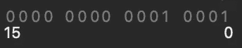**

**我们现在不关心其余的标志，因为我们只需要翻转最后一位，以便**指示前一个块没有被使用**。**这将触发向后合并过程，反过来将触发 unlink 宏。****

**最后但同样重要的是， **mchunk_prev_size** 还必须对应于假块的大小，以便绕过其余的安全检查。如果一切正常，当**下一个块**时，**假块**将被合并，假块的 fd、bk 指针将在两个后续步骤中被覆盖:**

**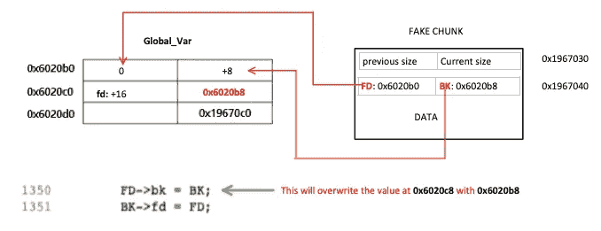**

****第一步:执行完第 1350 行后****

**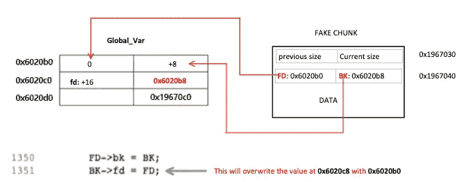**

****第二步:执行完第 1351 行后****

**下面是下一个棘手的部分，**受控块指向它的数据部分，所以通过修改块[0]就像修改 fd 指向的内容，因为我们控制 fd 将指向的位置(通过块[3])，所以我们可以控制块[3]中包含的地址的内容。****

# **陈列柜**

**假设下面的 C 程序:**

**让我们一行一行来搞清楚这件事。在`**Line 6**` 我们定义了一个指针，指向一个返回 void 且不带任何参数的函数。在`**Line 8**` 我们定义了一个指向无符号整数的指针，在`**Lines 10 to 17**` 我们定义了两个函数，完全不做任何事情的 **doNothing** 和弹出 shell 的 **shell** 。在`**Line 26**` 中，我们有 **0x420** 字节的第一个 malloc，所以在这条语句之后，我们将有以下块:**

**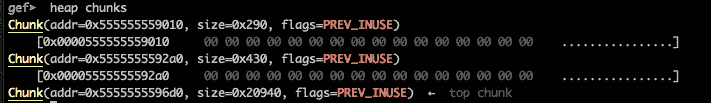**

**因此`chunk0_ptr`指向`0x5555555592a0`(数据块的数据部分)，而同一数据块的报头在`0x555555559290`之前开始 0x10 字节。最后，`chunk0_ptr`的地址在`0x555555558018`处，所以，在第一个 malloc 之后，我们有如下内容:**

**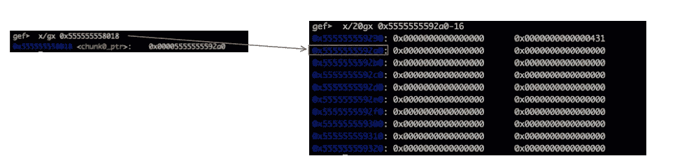**

**在`Line 27`中，我们对 malloc 进行了第二次调用，之后我们的块将如下所示:**

**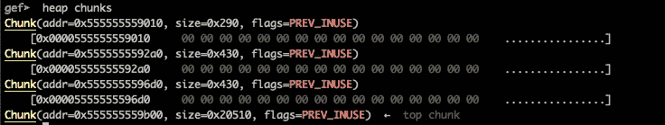**

## **创造一个假的大块**

**现在我们到了这一部分，它对应于假块创建:**

**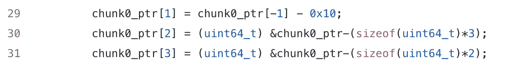**

**因为`chunk0_ptr[-1]`是`0x431`，所以`**Line 29**`将把假块的大小设置为`0x421`**

**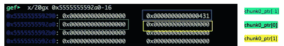**

**并且`**Lines 30–31**`我们设置了假块的 fd/bk 指针:**

```
chunk0_ptr[2] = 0x555555558018 — 3 * 8 = 0x555555558000
chunk0_ptr[2] = 0x555555558018 — 3 * 8 = 0x555555558008
```

**因此，我们的受控块设置如下:**

**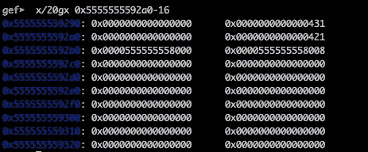**

**这将通过取消链接检查，就像您回忆取消链接检查一样，我们将得到以下内容:**

```
FD = P->fd => FD = 0x0000555555558000
BK = P->bk => BK = 0x0000555555558008
```

**随后，`FD→bk`将向前移动`FD`指针 3 的位置(因为这是块标题`=> 0x0000555555558000 + 0x18 = 0x0000555555558018)`中的`bk’s`位置),并且`FD→fd`将向前移动`BK`指针`2`的位置(因为这是块标题`=> 0x0000555555558008 + 0x10 = 0x0000555555558018)`中的`fd’s`位置)**

**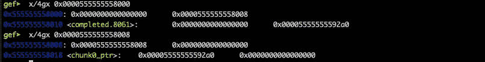**

**总结一下，到目前为止，我们的设置如下:**

****

## **“修复”下一个块的头**

**这是容易掌握的部分:因为我们可以在受控块之外写入，所以覆盖相邻的块是微不足道的。这就是`Lines 33–35`演示的内容:**

****

**`chunk1_hdr[0]`将指向`mchunk_prev_size`而`chunk1_hdr[1]`指向当前尺寸。`Line 35`将翻转最后一位，使假块显示为未使用:**

**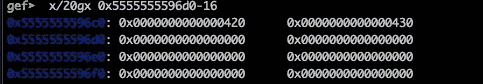**

**我们现在准备拨打免费电话:**

**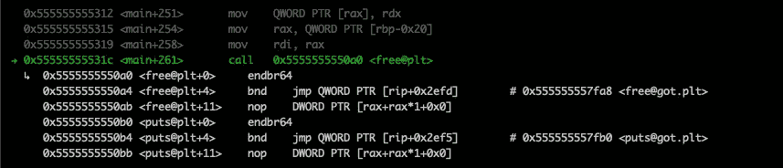**

## **免费后**

**现在让我们看看自由函数的效果。请注意，在调用它之前，我们有以下内容:`*0x555555558018 = 0x00005555555592a0`**

**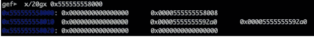****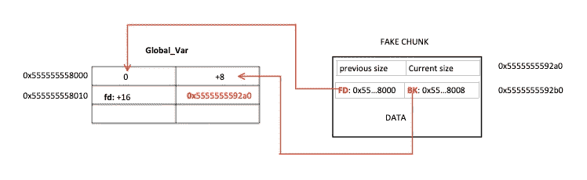**

**然而在`free`执行期间，将执行以下语句:**

**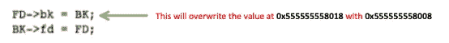**

**并且立即:**

**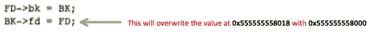**

**事实上:**

****

****最后注意到****

## **在任何地方写任何东西**

**从我们的 C 程序中回忆一下免费调用后的下面几行:**

**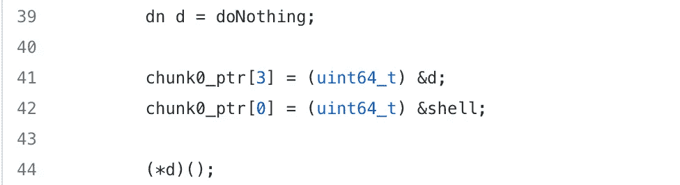**

**`**d**` 变量指向`**doNothing**`函数，但是由于我们控制了`**chunk0_ptr**`的内容，我们可以修改`**chunk0_ptr[3]**` **、**的值，因此在第 41 行之后我们将有以下内容:**

**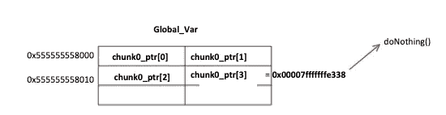**

**所以它将是`***&chunk0_ptr = 0x00007fffffffe338***` ，其中包含了做事情的地址。所以，`**chunk0_ptr[0]**`分在这里:**

**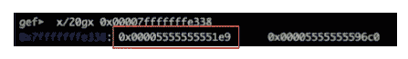**

**因此**行 42** 将用外壳函数的地址覆盖该存储器地址的内容:**

**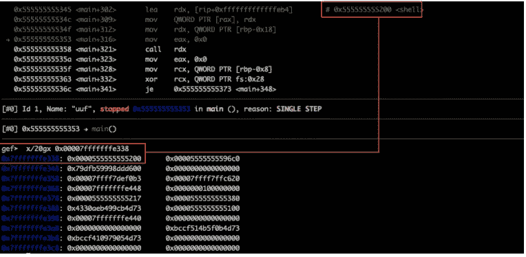**

**这完成了最后一个开发步骤:**

**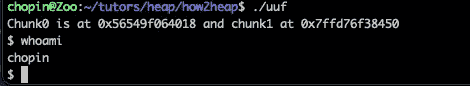**