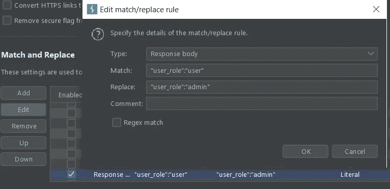

# 这种侦察你可能会故意跳过，但这就是为什么你不应该

> 原文：<https://infosecwriteups.com/the-type-of-recon-that-you-may-skip-on-purpose-but-this-is-why-you-shouldnt-272aa74e08be?source=collection_archive---------1----------------------->

## ，或者为什么太快会导致假阳性

我有一个理论，这可能会影响到那些有一些 bug 搜索经验的人，大概是经验水平越高越容易出现这种疏忽。我可能错了。不管怎样，我认为这迟早会对任何层次的经验都有用:)

当人们很容易跳过至关重要的第一步
时，这一步已经被写了很多——侦察。但是，根据网站的目标，你的经验水平，以及类似的情况，即使你从一个完全合理的侦察开始，也很容易“跳到最后”。虽然在侦察过程中可以进行多任务处理，比如在等待 **ffuf** 或 **dirsearch** 完成浏览你拥有的任何庞大的单词列表或运行 **nmap** / **masscan** 时挖掘有趣的子域名，但这是跳过基础知识会让你提交一个非常愚蠢的“bug”的地方。

**为什么跳过明显的 bug？** 一言以蔽之——可能不是 bug。如果你刚刚打开了一些有趣的子域，或者甚至是一个单一的/范围狭窄的目标网站，为了了解网站是如何工作的，你必须一直跟踪请求和响应。这不仅仅是理解正在进行的请求和响应，还包括为什么要进行这些请求和响应，以及这些请求和响应与网站其他功能/特性的关系。仅仅因为有一个 JSON 响应带有看似有趣的信息，您就必须理解它是如何被获取的。虽然配对请求可能是明显的原因，但也不总是如此。有时会有一连串的请求和响应，最终导致特定的响应。意思就是，仅仅因为 JSON 响应显示了 userid 和 api token，如果你没有登录，很有可能是一个 guest userid，带有 guest api token(或者对任何人都没有关键性影响的 api token)。

**当经验可能造成一些伤害时** 作为已经从事 IT 安全测试十多年的人，有时很难不发现有趣的请求和/或对某些请求的响应内容等。有时候放手去做会更容易。当某个东西看起来像一个容易快速验证的 bug 时，那么事情的顺序当然是:侦察，尤其是网站测试的智能方法(即学习它如何工作，它做什么，等等。以便更好地了解如何以及瞄准什么)突然被利用这个 bug 的欲望所取代，并且希望避免重复。

**缺乏耐心=假阳性，在三幕中** *第一幕——不必要的紧急情况* 在这个特殊的情况下，我对紧急购买一台真正的游戏电脑感到兴奋，因为我想继续以最高的 RTX 图形玩特定的视频游戏:)，因此我允许缺乏适当的耐心。我选择了一个 bug 奖励计划，并努力去做。当我第一次浏览这个网站(意思是，我对它知之甚少)并急切地寻找任何潜在错误的迹象时，我不禁注意到一个需要立即攻击的领域——将用户角色从低级用户提升到管理员。
所以……没有探究与管理员用户相比，低级别用户可以做什么，我以低级别用户的身份登录，并使用 burp 中的匹配和替换，我添加了一个规则，其中响应正文将“user _ role”:“user”替换为“user _ role”:“admin”。

在刷新页面时，我看到我的仪表板显示 admin，而不是 user 角色下的低级用户。但是，其他什么都没变。没有额外的页面，按钮，什么都没有。

*第二幕——一个有趣的发现*
这里是我犯的一个错误，没有“重置”(即。禁用前面的匹配和替换规则)我继续使用网站的另一个功能，心想也许当页面加载时我会看到一些有趣的东西(但不知道作为低级用户访问时应该是什么样子)。但是，那里没有什么有趣的东西。所以，我回到仪表板，但令我惊讶的是，我突然有了一些新按钮。我立即着手验证这不仅仅是一个用户界面的改变。而且，这不仅仅是一个用户界面的变化。我实际上是管理员，我可以添加其他用户，改变用户角色等。

*第三幕——导致令人不快的发现的耐心*
太好了，报告已提交。但是，我无法摆脱那种不安的感觉，就像它是多么容易，我最初的担心是它会被证明是一个副本。当然，这不是唯一的担忧。冷静下来后，我发现这个错误的愚蠢的紧迫性，我不得不进一步调查这个网站。我也希望能找到别的东西，以防最初的报告是重复的。这次我用正确的方法做了。我更多地了解了网站的工作原理、功能等等。

这导致了一个发现，不管出于什么原因(我猜是这样编码的),如果一个低级用户使用一个特定的网站功能，他们的角色会被转换成管理员角色。它是被设计成这样的，不是一个 bug，甚至也不是老笑话“这是一个特性。”我知道这一点是肯定的，因为几天后，一个非常通情达理的分诊人员告诉我同样的事情。

这是我第一次行动太快吗？不。这是我开始悬赏捉虫以来的第三次了。虽然我可能对前两次有一些像样的借口，但这仍然是三次太多了。在当今的经济环境下，人们很容易对财务(不)安全感到恐慌，或者只想在世界末日之前完成一款游戏，这可能会导致一些考虑不充分、可能欠考虑的方法来寻找漏洞。但是，请记住，越容易/越快地找到关键缺陷，它就越不可能是一个缺陷。同样的道理，越复杂的 bug，你会觉得越酷:)找到它，你肯定会更快、更多地得到回报。

黑客快乐，新年快乐:)