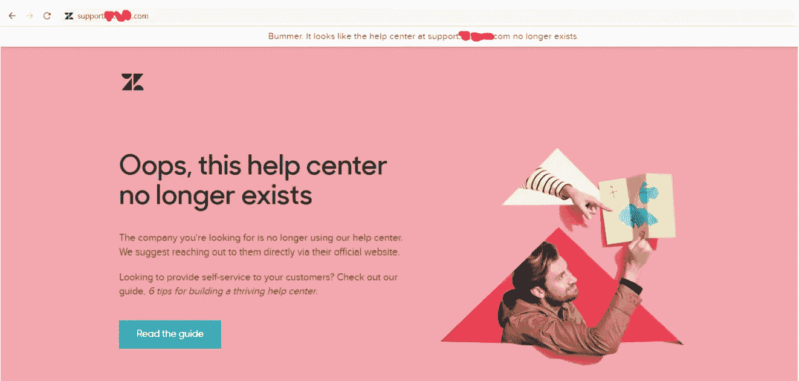
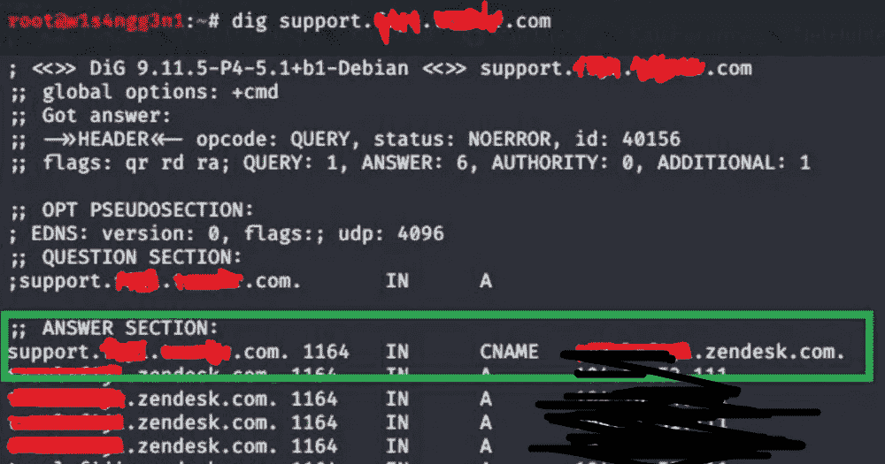
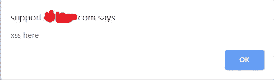
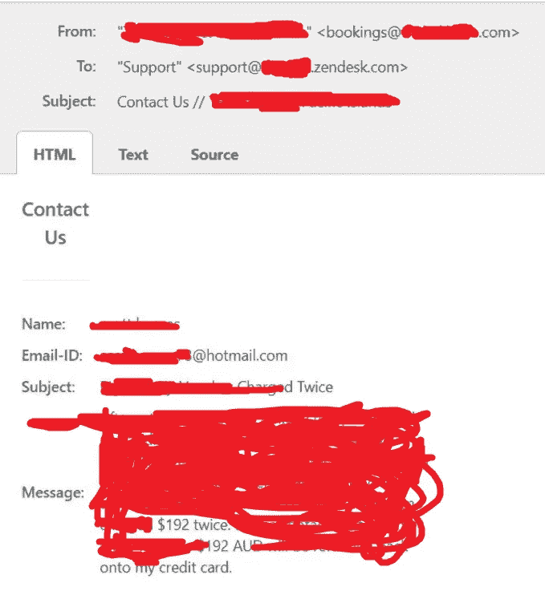
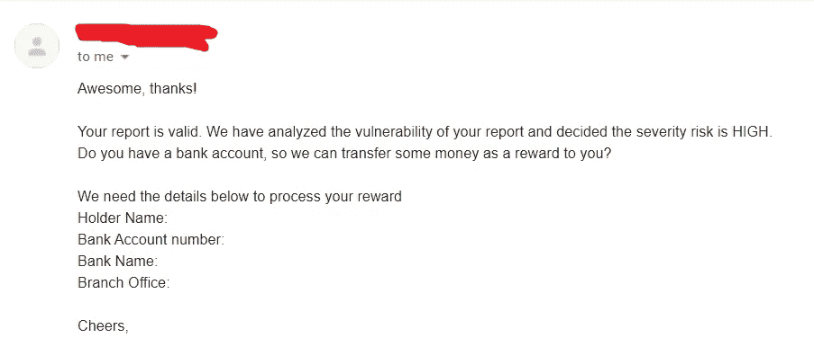

# 意外之财:Zendesk 收购 REDACTED.com 的故事

> 原文：<https://infosecwriteups.com/the-unexpected-bounty-a-story-of-zendesk-takeover-on-redacted-com-f2aa96ce2026?source=collection_archive---------1----------------------->

*Tl；dr:一份善意的子域收购报告以奖金告终，即使公司本身没有 Bug 奖金计划。*

Assalamualaikum Wr。亲爱的读者，愿你平安

这一切都始于一个 Linkedin 连接请求。

这个人的简历上说，她在 REDACTED.com 的*公司担任人才招聘专员。我，在拿到我之前关于 XSS 的报告的副本后，决定从我的主要目标中休息一下，检查一下这个 REDACTED.com*。**

*经过一些子域列举，我在*support.REDACTED.REDACTED.com*上发现了一些有趣的东西。当我试图访问上述子域时，我得到了以下页面:*

**

*看起来这个子域指向了一个 zendesk 帮助中心的页面，这个页面没有被声明或者已经不存在了。使用 ***挖*** 命令，我得到了 CNAME 记录。*

**

*在阅读了 zendesk 文档后，我成功注册了一个新帐户，并接管了子域。我还能够通过启用 SSL 停止重定向来获取存储的 xss，然后用 XSS 有效负载创建一个指南 html 页面。*

**

*我没有立即报告，因为他们没有 Bug Bounty 计划，我在他们的网站上也找不到任何与安全相关的联系。几天后，我收到了他们客户的几张票(大约 10 张),原来这个 zendesk 门户网站仍在使用，他们客户的票正从主(另一个)网站转发到这个门户网站。*

****

*嗯…*

*我决定向 Linkedin 的人才获取专家咨询，我可以在哪里报告这个漏洞？她给了我一封他们安全团队的电子邮件，我立即报告了这个漏洞，因为我的电子邮件中充斥着他们客户的罚单。*

*我只是做个好人，发了这份报告，不期望任何回报，因为我知道他们没有臭虫奖励计划，也没有一句简单的“谢谢”就足够了。*

*但令我惊讶的是，他们决定奖励我赏金。额，意外的钱是最好的钱。*

**

*这是我迄今为止收到的最快的赏金(大约在报告发出后一周)，也标志着我在 2020 年的第一笔赏金。*

*Wassalamualaikum Wr。Wb。*

***时间线:***

*   *2020 年 1 月 17 日:报告已发送。*
*   ***2020 年 1 月 20 日:**报告验证为高严重性，他们要求我提供发送赏金的银行详细信息。*
*   ***2020 年 1 月 23 日:** $$$已支付，有限披露请求获得批准。*

**关注* [*Infosec 报道*](https://medium.com/bugbountywriteup) *获取更多此类精彩报道。**

* [## 信息安全报道

### 收集了世界上最好的黑客的文章，主题从 bug 奖金和 CTF 到 vulnhub…

medium.com](https://medium.com/bugbountywriteup)*