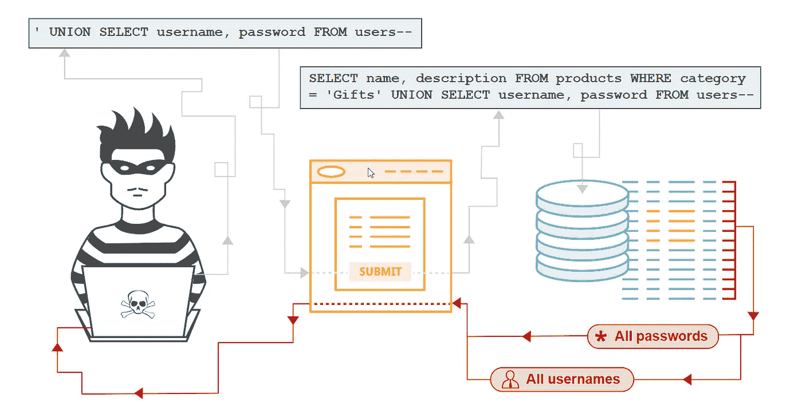
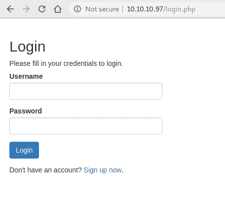
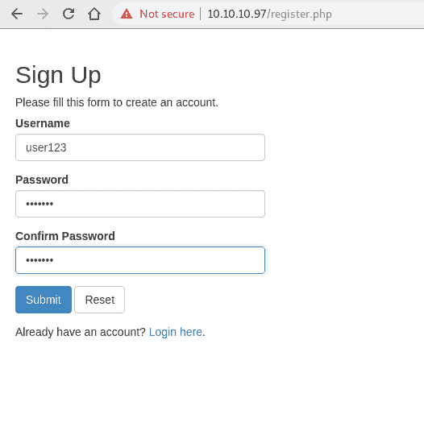
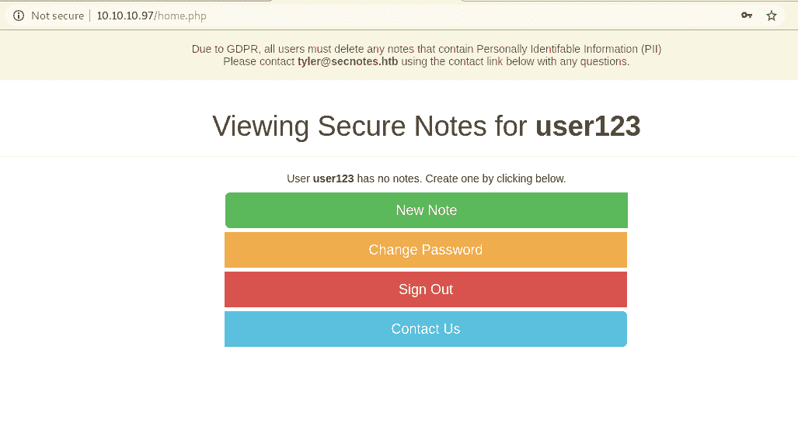
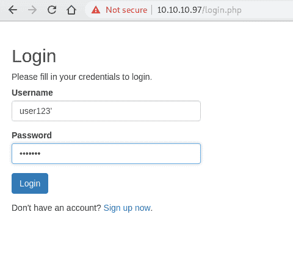
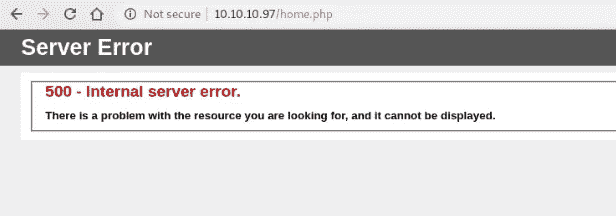
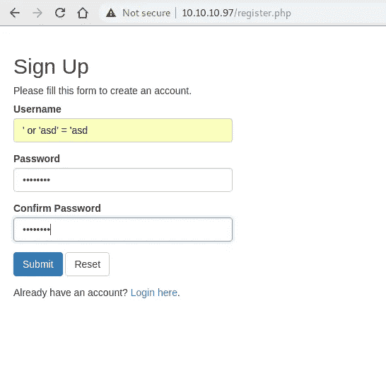
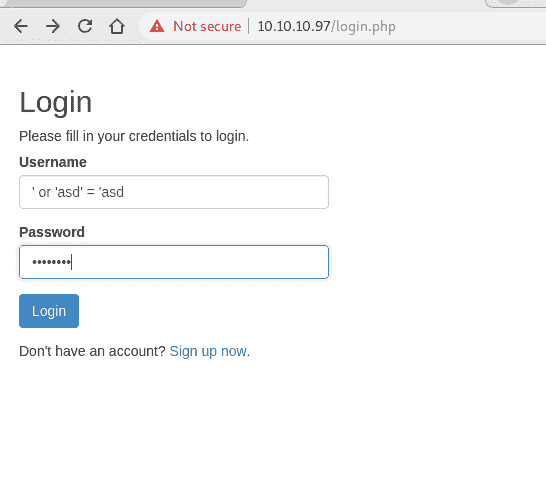
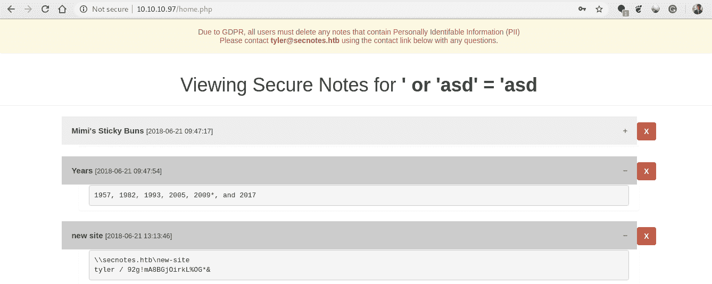

# 什么是二阶 SQL 注入，如何成功利用它？

> 原文：<https://infosecwriteups.com/the-wrath-of-second-order-sql-injection-c9338a51c6d?source=collection_archive---------0----------------------->

## 带演示的二阶 SQL 注入


信用:pixabay.com

# 什么是 SQL 注入

SQL 注入—在数据请求中注入 SQL 语言代码的过程，会导致应用程序后端数据库服务器泄露机密数据或在数据库上执行恶意脚本内容，从而导致主机完全受损。

# 了解二阶代码注入

想象一个场景，其中由攻击者注入到应用程序中的恶意代码不会立即在应用程序中执行。是的，你没看错。这是一个熟悉的故事，通常是这样的，当用户提供的数据被应用程序或任何其他应用程序利用时，攻击者提供的注入代码就会被激活，从而导致成功利用。

一阶和二阶 SQL 注入的主要区别在于，攻击者可以简单地输入一个恶意字符串，并导致修改后的代码立即执行。

看出区别了吗？

攻击者向被视为可信来源的持久存储(如表行)中注入。攻击随后由另一个活动执行。



信用:portswigger.net

# 测试挑战

常见代码注入的攻击性质允许攻击者通过观察应用程序响应来发现漏洞。

测试二阶 SQL 注入有点困难，因为它要求攻击者了解应用程序的后端操作。

你怎么能打败它呢？

自动化 web 应用程序评估工具不足以识别这些漏洞。自动化工具不够智能，无法识别任何后续响应中的应用程序行为变化，这些响应是由先前查询之一中的恶意注入引起的。

# 是什么使应用程序容易受到二阶 SQL 注入的攻击

之所以会出现这种漏洞，是因为一个优秀的程序员可能会在用户可以输入内容的表单中修补他的代码以防止 SQL 注入，但在用户与应用程序数据库没有任何交互的情况下，他不会做同样的事情。

# 利用场景

另一方面，二阶 SQL 注入是一种可通过两个不同步骤利用的漏洞:

1.  首先，我们在数据库中存储一个特定的用户提供的输入值
2.  其次，我们使用存储的值来利用构建 web 应用程序的动态查询的源代码中易受攻击的函数中的漏洞。

因此，让我们言归正传，在一个假设场景的帮助下，更详细地了解如何利用易受攻击的应用程序:

## 示例 1

```
*CREATE TABLE USERS ( userId serial PRIMARY KEY, firstName TEXT )*
```

假设您有这样一些安全代码，从一个表单接收 ***的名字*** :

```
*$firstname = someEscapeFunction($_POST[“firstName”]);**$SQL = “INSERT INTO USERS (firstname) VALUES (‘{$firstName }’);”;**someConnection->execute($SQL);*
```

到目前为止还不错，假设 someEscapeFunction()做得很好。注入 SQL 是不可能的。如果我现在将我的有效负载作为 firstname 的值发送，您不会介意:

*有效载荷:bla’)；从用户中删除；//*

现在，假设同一个系统中的某个人想要将名字从用户传输到其他用户，这样做:

```
*$userid = 42; $SQL = “SELECT firstname FROM USERS WHERE (userId={$userid})”; $RS = con->fetchAll($SQL); $firstName = $RS[0][“firstName”];*
```

然后不转义地将其插入某个表中:

```
*$SQL = “INSERT INTO SOME VALUES (‘{$firstName}’);”;*
```

恶意查询变成这样:

```
*INSERT INTO SOME VALUES (‘ bla’); DELETE FROM USERS; //*
```

此时，您意识到如果名字包含一些删除命令，它仍然会被执行。

## 示例 2

有可能利用一些不需要用户输入的函数，并使用已经保存在数据库中的数据，在需要时进行检索。密码重置功能！

受害者用户“用户 123”可以用一个非常强且安全的密码在网站上注册，但我们仍然很想得到他的帐户。在二阶 SQL 注入中，我们应该能够完成类似于以下的工作:

注册一个新账户。我们想将这个新用户命名为“user 123”—“user pass @ 123”

*有效载荷:“用户 123”——“*

然后，我们可以重置我们的密码，并以适当的形式设置一个新密码。

合法的查询将是:

```
*$pwdreset = mysql_query(“UPDATE users SET password=’getrekt’ WHERE username=’User123' — ‘ and password=’UserPass@123'”);*
```

但是，由于—是用于在 SQL 中进行注释的字符，查询结果将是这样的:

```
*$pwdreset = mysql_query(“UPDATE users SET password=’getrekt’ WHERE username=’User123'”);*
```

然后嘣！你在那里。这将为受害者用户帐户设置一个我们选择的新密码！

# 示范

我在 HTB 的 SecNotes 机器上工作，遇到了如图 1 所示的登录表单。必须尝试 SQL 注入，对吗？咄！我尝试在登录参数中插入 SQL 注入查询，但是没有显示任何内容。



图 1

我创建了一个用户 user123，并登录到该帐户，在其中我可以看到一些注释，如图 2 和图 3 所示。



图 2



图 3

如果我们回忆一下 SQL 注入漏洞利用是如何工作的，我们将一个特定的值存储在数据库中，存储的值将成为 web 应用程序源代码中未过滤或已调试函数的查询的一部分。

如果应用程序使用该应用程序的用户名从数据库中获取笔记会怎样。让我们创建一个用户名包含'的用户，并希望我们可能会遇到 SQL 错误



图 4

哇哦。服务器响应 500 内部服务器错误，如图 5 所示。一旦我能够让服务器响应一个错误(主要是 HTTP 500 状态)，我必须确认是 SQL 命令导致了错误，而不是其他原因。



图 5

我用用户名*或‘ASD’=‘ASD*创建了一个账户，如图 6 所示。因此，用户名*或‘ASD’=‘ASD*被存储在数据库中。



图 6

然后，我使用如图 7 所示的相同用户名登录帐户。



图 7

答对了。现在，我可以看到数据库中的三个注释，如图 8 所示。已经证实，航向导致了这种二阶 SQL 注入漏洞。构建的动态查询看起来会像这样，

```
*SELECT * from notes WHERE username = ‘’ or ‘asd’ = ‘asd’;*
```



图 8

# 攻击概率

与二阶 SQL 注入相比，识别经典(一阶)SQL 注入的成功率是常见的。一阶注入通常被称为“低挂果实”，可以直接观察到，而二阶 SQL 注入的相对概率较低。

在大多数情况下，二阶 SQL 注入攻击必须“盲目”执行，因为攻击者在没有任何系统知识的情况下对后端功能执行攻击。

# 防止二阶 SQL 注入

使用白名单方法来净化数据(即默认情况下禁止所有内容，并明确列举允许或被认为“安全”的数据字符)。

请注意，对于一个应用程序标记为“安全”的数据对于另一个应用程序/组件可能并不安全。

*   每个检索存储数据的应用程序(特别是如果数据可能是由用户提供的)在进一步处理数据之前，必须应用自己的数据清理过程。在进一步处理任何用户提供的数据之前，应对其进行净化处理
*   应用程序组件内部和之间处理的所有数据都应该经过验证。

针对特定语言的建议:

*   Java EE —使用 PreparedStatement()
*   。NET —使用参数化查询，如 SqlCommand()或 OleDbCommand()
*   PHP —对强类型参数化查询使用 PDO(使用 bindParam())
*   Hibernate —使用 createQuery()(在 Hibernate 中称为命名参数)
*   SQLite —使用 sqlite3_prepare()

现在我就此打住，让您去探索更多关于二阶 SQL 注入的知识。

如果您想了解更多关于高级代码注入和测试过程的信息，请查看这篇文章。

# 参考

【https://www.owasp.org/index.php/SQL_Injection 号

[https://ports wigger . net/kb/issues/00100210 _ SQL-injection-second-order](https://portswigger.net/kb/issues/00100210_sql-injection-second-order)

[https://www . researchgate . net/publication/290768140 _ Detection _ Method _ of _ the _ Second-Order _ SQL _ Injection _ in _ Web _ Applications](https://www.researchgate.net/publication/290768140_Detection_Method_of_the_Second-Order_SQL_Injection_in_Web_Applications)