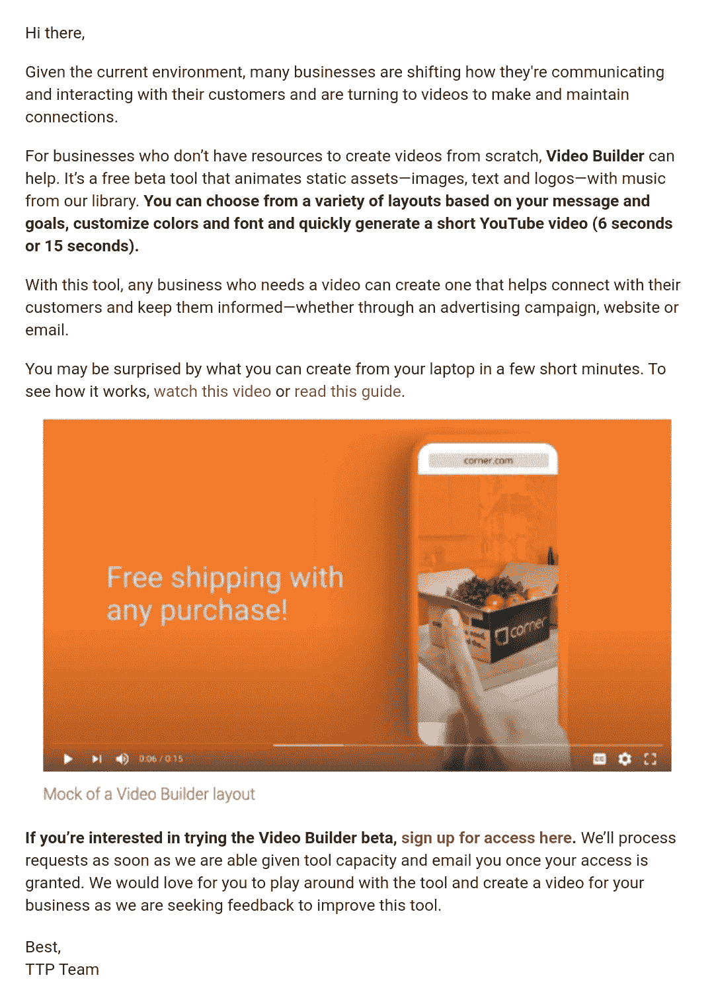
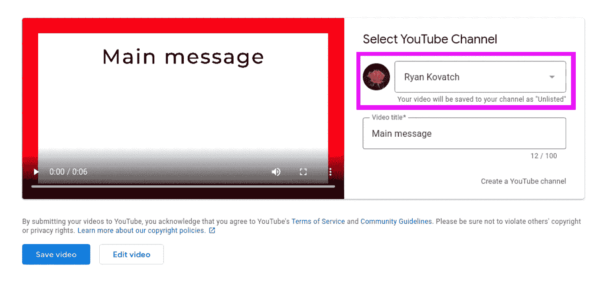
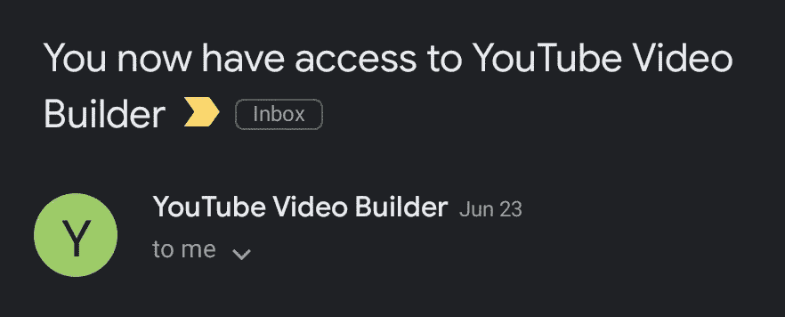
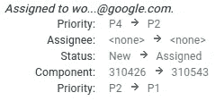
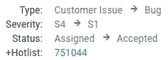

# YouTube 允许未列出的上传到任何频道的错误

> 原文：<https://infosecwriteups.com/the-youtube-bug-that-allowed-uploads-to-any-channel-3b41c7b7902a?source=collection_archive---------1----------------------->

6 月下旬，我收到了 YouTube 的一份测试新产品的邀请:这是一个视频制作工具，可以轻松地将带有自定义字体和徽标的广告放在一起。



我收到的通知我测试版的邮件。

我不知道他们从哪里得到我的信息——我肯定接触过网上每一个可信的测试者表单——但这提供了一个机会。新产品通常不会对攻击如此强硬。当我在请求访问一天后试图登录该网站时，令我惊讶的是，它让我进去了。(奇怪，因为我没有像他们说的那样收到任何通知。)

这个工具非常简单，它是这样工作的:你选择一个模板，用颜色、照片和文本定制它，然后服务器为你渲染它。为了更好地了解它的工作原理，我打开了调试代理的瑞士军刀: [Charles。然后我看着车流穿过，跟着台阶走。](https://www.charlesproxy.com/)

起初，我并没有特别注意到什么——文件上传功能是安全的，他们使用长的加密字符串来标识资源，并且所有字段都经过了清理。真扫兴。但是当我走到最后一步时，我注意到了一些事情。



视频生成器的上传屏幕。

有一个菜单，允许你从与你的谷歌账户相关的频道中进行选择，在这个菜单下面，有一个小小的免责声明:*你的视频将被保存到你的频道，作为“未列出”*所以服务器同时呈现*和*上传视频，并给我选择上传频道的选项。这敲响了警钟。我必须知道它是如何工作的。

YouTube 上的每个频道都有自己的 ID，通常是这样的:`UCxXX0xx_X0XxxXXxxxx00Xx`。你通常可以在频道 URL 或任何视频页面的来源中找到它们。当我回去查看该网站如何获得我的账户上的 YouTube 频道时，我发现服务器的响应如下:

```
HTTP/1.1 200 OK
Content-Type: application/json; charset=utf-8{
    "1": [{
            "1": "**UCBCW8XFPYIENZPC659Pk0kg**",
            "2": "Ryan Kovatch",
            "3": "https://yt3.ggpht.com/a/..."
    }]
}
```

这是我的频道 ID。然后我点击“保存”看看会发生什么。

```
POST /u/0/videobuilder/_/rpc/Image2VideoUiService/UploadToYouTube HTTP/1.1
Host: director.youtube.com
Content-Length: 483
Content-Type: application/x-www-form-urlencoded__ar=%7B%221%22%3A%7B%221%22%3A%22AFbu1Vq...%22%7D%2C%222%22%3A%22UCBCW8XFPYIENZPC659Pk0kg%22%2C%223%22%3A%221%22%2C%224%22%3A%22Created+with+YouTube+Video+Builder+using+template+%5C%22Introduce+your+brand+%286s%29.%5C%22%22%2C%225%22%3A%222755bb19-6e4b-4cd4-beca-46cc29f26625%22%7D
```

表单请求。解码后，`__ar`的值为:

```
{
    "1":{
        "1":"AFbu1Vq..."
    },
    "2":"**UCBCW8XFPYIENZPC659Pk0kg**",
    "3":"Main message",
    "4":"Created with YouTube Video Builder using template \"Introduce your brand (6s).\"",
    "5":"2755bb19-6e4b-4cd4-beca-46cc29f26625"
}
```

是的，这是我的频道 ID。旁边是标题、描述和模板 ID。当我想通了这一点，我的第一步是用我的测试帐户的渠道 ID 交换它。然后…

```
HTTP/1.1 200 OK
```

嘣。服务器返回了一个 ID 来跟踪上传的进度，然后我在 YouTube 上获得了一个链接。果不其然，它被作为一个未公开的视频上传到了一个我不拥有的频道。我马上就举报了。

之后我就收到了这封邮件，好吧。



不会吧，真的吗？

然后我就去睡觉了。

# 第二天

凌晨时分发生了许多活动。我的报告似乎引起了不小的轰动。



首先，在早上 6 点。



30 分钟后。

我醒来时发现“接得好！”在我的邮箱里。这促使我认真思考这样一个问题的含义——在 YouTube 这样的平台上，它会加速错误信息的传播。那种动摇选举和威胁民主的东西。我不得不深入挖掘。

在这一点上，限制是 a .)我不能公开上传视频，b .)我只能上传网站创建的视频，而不是我自己的。根本问题是非常有害的，但如果我能找到绕过这些问题的方法，问题会严重得多。于是我重新审视了一下`UploadToYouTube`函数。

```
{
    "1":{
        "1":"**AFbu1Vq...**"
    },
    "2":"UCBCW8XFPYIENZPC659Pk0kg",
    "3":"Main message",
    "4":"Created with YouTube Video Builder using template \"Introduce your brand (6s).\"",
    "5":"2755bb19-6e4b-4cd4-beca-46cc29f26625"
}
```

那个标识符？这是一个包含视频文件信息的加密字符串。(其实要长很多。)我后来才知道这叫做`scottyResourceId`，YouTube 上到处都用它来识别上传到他们服务器上的数据。一个想法突然出现在我的脑海中:如果我可以上传一个文件到另一个 YouTube 网站，从那里提取资源 ID，并在这个 API 中使用它，会怎么样？这将允许我上传一个自定义视频，并指向它的服务器。

我打开了 YouTube Studio 并上传了一个测试文件。服务器的回应是:

```
HTTP/1.1 200 OK
X-GUploader-UploadID: ...
X-Goog-Upload-Status: final
Content-Length: 405
Server: UploadServer
Connection: keep-alive{
    "status":"STATUS_SUCCESS",
    "scottyResourceId":"**ACKujmz...**"
}
```

答对了。这个 ID 以`ACK`开头，但是和另一个一样长。我向视频构建器发送了一个新的`UploadToYouTube`请求，这次是用来自 YouTube Studio 的 ID，然后……得到了一个错误。

```
com.google.apps.framework.request.CanonicalCodeException:
com.google.security.keymaster.KeyUnavailableException:**No matching decryption key found; ciphertext had key hash XXYYZZ but no key version matched it; existing versions:keyhashes are 1:YYZZXX, 2:ZZXXYY, 3:YYXXZZ, 4:XXZZYY, see go/key_unavailable_exception.**Code: PERMISSION_DENIED
```

所以没用。但是像这样的异常实际上可能是比它们阻止的功能更严重的问题*。*在这种情况下，服务器试图解密资源 ID，但是由于它来自另一个服务器，它无法找到正确的解密密钥来使用。当这个异常被抛出时，它包含了它存储的所有键的散列。这是一次严重的数据泄露。

我报了，又得到一个“接得好！”围绕将视频从不公开变为公开的进一步研究并不成功，所以我就此打住。

# 结论

即使是游戏中最大的玩家也容易出现这样的错误。有时它们更明显，有时更难发现，但它们就在那里。我希望我的第一篇文章对那些试图找到第一笔 bug 奖金的人有所帮助，或者可能已经有一些了。没有什么无法穿透的应用程序。

# 时间表

## 所有时间都是太平洋标准时间。

*   **收到邀请**6 月 22 日上午 9:53
*   **报告第一个 bug**6 月 23 日晚上 10:44
*   **被审判为 P1**6 月 24 日上午 6:10
*   **“接得好！”并升级到 S1**6 月 24 日上午 6:40
*   **报告第二个 bug**6 月 24 日下午 6:09
*   **“接得好！”并升级到 p2s 2**6 月 25 日凌晨 2:02
*   **小组奖励 6337 美元奖金**7 月 2 日上午 11:20
*   **两个错误都被确认为已修复**10 月 16 日下午 3:01