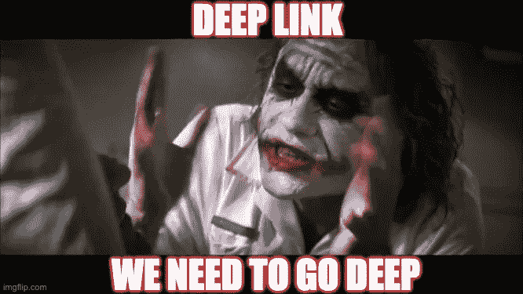
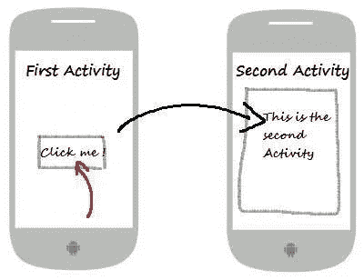
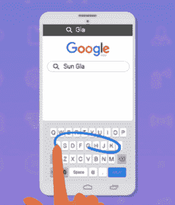
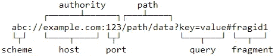

# 安卓深度链接的 Zaheck！

> 原文：<https://infosecwriteups.com/the-zaheck-of-android-deep-links-a5f57dc4ae4c?source=collection_archive---------1----------------------->

## 有没有想过你的应用程序中的深层链接是攻击者破解你的应用程序的大门之一？



在当前混合移动架构的时代，网页浏览量和深度链接被广泛使用。前者用于交付动态 web 内容，而后者用于使应用程序更具交互性。

在这个故事中，我们将讨论与 Webview 和深度链接混合相关的常见安全错误配置。我们将主要讨论 Bagipro 对 URL 验证不足进行的惊人的安全研究，稍后我们将给出一些建议来缓解这个问题。

这个故事也是为了那些可能不了解 Android 系统基本概念的安全传播者。先决条件一节涵盖了一些稍后会用到的概念，如果你已经清楚这些基本概念，可以跳过这一节。

# 先决条件

## 活动

activity 是 Android 应用程序的组件之一，通俗地说，它可以被认为是一个*屏幕*。它有一个用户界面，允许用户与应用程序进行交互。



交流意图的使用

## 意图和意图过滤器

意图是一个消息传递对象，它允许不同应用程序组件(如活动、内容提供者、服务等)之间的通信。它可用于相同或不同应用程序的应用程序组件之间的通信。

强烈推荐你看一下 Pg。[的第 11 和 19 页**保护 Android 应用程序的灰色问题**](https://packetstormsecurity.com/files/download/147088/The_Grey_Matter_of_Securing_Android_Applications_v1.0.pdf) 旨在更好地理解意图和意图过滤器的概念。

## 网络视图

Android 允许开发者通过 Webviews 将网页内容直接显示到他们的应用程序中。您可以将 Webview 视为应用程序的专用 web 浏览器。

# 深度链接是什么鱼！？

在 web 浏览器上浏览 web 内容时，您可能已经观察到浏览器调用安装在您设备上的特定应用程序来显示 web 内容的交互。下面这张 GIF 通过一个深度链接展示了浏览器和应用之间的交互。



深层链接只不过是特定的 URIs(统一资源标识符)，必须由我们的应用程序来处理，以改善用户体验。例如，***FB://profile/33138223345***是深度链接，URI 包含直接进入脸书移动应用内的特定位置所需的所有信息，在这种情况下，id 为‘33138223345’的简档，即脸书应用内的维基百科页面。

在引擎盖下，我们有一个 Android 活动，一旦一个深层链接被触发，这个活动就会被调用。我们通常称这样的活动为**可浏览活动**，因为它们被配置为确认可浏览类别意图。可浏览活动必须有一个用三个元素定义的意图过滤器，即。 ***动作*** ， ***类别*** 和 ***数据*** 如下面的 AndroidManifest.xml 片段所示。你可以在这里阅读更多关于这个 [*的*](https://developer.android.com/training/app-links/deep-linking) 。

```
<activity
    android:name="com.example.android.GizmosActivity"
    android:label="@string/title_gizmos" >

    <intent-filter android:label="@string/filter_view_example_gizmos"> **<*action* android:name="android.intent.action.VIEW" />
        <*category* android:name="android.intent.category.DEFAULT" />
        <*category* android:name="android.intent.category.BROWSABLE"/>** <!-- Accepts URIs that begin with "webviewdemoapp://” -->
        **<*data* android:scheme="webviewdemoapp"/>** </intent-filter>
</activity>
```



**注意:**我们使用***android:scheme***标签在数据元素中定义了 URI 方案，因此现在 Android 系统不仅会使用此方案( *webviewdemoapp://* )来确认 URIs，而且一旦触发了此类深度链接，还会调用此可浏览活动，这就是深度链接的工作方式。

# Zaheck

## **URL 验证不足**

通常，每当我们在可浏览的活动中有 Webview 组件，并且想法是加载在深度链接 URI 中传递的 web URLs 时，强烈建议验证 URL，以防止加载任意 URL。
2019 年 3 月， [Bagipro](https://hackerone.com/bagipro) 在 Grab Passenger 应用中报告了类似问题，他因其惊人的工作获得了 7500 美元的奖励。你可以在这里了解更多信息[。](https://hackerone.com/reports/401793)

```
For example if an application acknowledges the following deep link and opens the highlighted URL in the webview it is suggested that the proper validation should be performed.webviewdemoapp://issue=1&url=***https://scripts.shivsahni.com/testsample.html***
```

以下代码片段显示了在 webview 中加载 URL 时的验证

```
Uri uri = Uri.parse(deeplinkURL);/****https://scripts.shivsahni.com/testsample.html*/***if("shivsahni.com".equals(uri.getHost() || uri.getHost().endsWith(".shivsahni.com"))
{ webView.loadUrl(deeplinkURL);}
```

> 虽然上述 URL 验证似乎足以防止 URL 的任意加载，但是由于`android.net.Uri`和`java.net.URL`解析器中的问题，验证仍然可以被绕过，对手仍然可以在我们的应用程序的 webview 中打开恶意 URL

问题是`android.net.Uri`和`java.net.URL`解析器不能识别权限部分中的反斜杠，这使得攻击者可以使用反斜杠来绕过前面提到的验证。同样的情况描述如下:

```
String url = "http://attacker.com\\\\@legitimate.com/smth"; Log.d("Wow", Uri.parse(url).getHost()); // legitimate.com is printed
webView.loadUrl(url); // attacker.com is loaded
```

这项广泛的研究是由 Bagipro 完成的，你可以在这里[阅读更多相关信息](https://hackerone.com/reports/431002)。

最近，我对此做了更多的分析，发现 API 级别 28 及以上的问题现已修复，因为现在触发带有格式错误的 URL 的深度链接会在 Chrome 浏览器而不是应用程序的 webview 中加载攻击者的脚本。我在 Pixel XL 设备上测试了这种行为。

这样的问题实际上可以成为 P0 安全问题，考虑这样一种情况，其中特权 Webview(例如:带有 [JS 接口](https://developer.android.com/reference/android/webkit/WebView#addJavascriptInterface(java.lang.Object,%20java.lang.String)))用于支持这样的功能，缺乏适当的 URL 验证可能允许对手分发具有恶意 JavaScript 的攻击者控制的 URL 的深度链接，这甚至允许通过 JS 桥执行 Java 功能，因此甚至可能导致用户的敏感信息如 PII 和 auth 令牌的泄露。此外，攻击者只需拥有恶意 JavaScript 并分发带有恶意 URL 的 deeplink，就可以远程利用该攻击。

## 建议

尽管这个问题在 API 级别 28 中得到了修复，并且根据统计数据，Android 9 占据了主要的市场份额，但我们仍然需要支持以前的 API 来保持业务照常进行。建议验证完整的 URL，包括方案、权限等。最好的方法是使用正则表达式。

建议的方法之一如下所示:

```
private fun validateURL(urlString: String):Boolean{try {
    URL urlObject= new URL(urlString);
    if((urlObject.getAuthority()=="shivsahni.com") && (urlObject.getHost()=="https"))
            return true;
}
catch (MalformedURLException e)
{
    e.printStackTrace();
    return false;
}}
```

除了充分的 URL 验证之外，还建议对 webview 进行适当的加固，以控制其受到损害的情况下的影响。要强化 webview，请记住以下几点:

1.  每当您需要在您的应用 webview 中加载不可信的 web 内容时，通过使用 [Chrome 定制标签](https://developer.chrome.com/multidevice/android/customtabs)来执行充分的 webview 隔离
2.  除非明确要求，否则禁止从 webview 访问 JavaScript:: `setJavaScriptEnabled(false)`、文件系统::`setAllowFileAccess(false)`和内容提供商::`setAllowConentAccess(false)`。

你可以参考这个令人敬畏的关于强化 Android webviews 的 [confluence](https://wiki.sei.cmu.edu/confluence/pages/viewpage.action?pageId=87150638) 。