# 胖客户端测试:现代方法和技术:第 1 部分

> 原文：<https://infosecwriteups.com/thick-client-pentest-modern-approaches-and-techniques-part-1-7bb0f5f28e8e?source=collection_archive---------0----------------------->

> 你好**技术员**👨‍💻
> 
> 这里欢迎你！！😊

这个博客旨在提供一个安全测试案例和一套工具，我们在执行胖客户端测试时需要这些工具。

所以，我计划将这个广泛的主题分成几个部分/博客，这样你就可以在一个特定的主题上逗留。🦸‍♂️

> **第一部**

胖客户端是在用户的主机/系统上运行的应用程序，它与后端服务器或数据库服务器通信。

下面列出了一些例子:

1.  *铬合金*

*2。缩放*

*3。Anydesk*

*4。Skype*

> **就架构而言，分为两层和三层应用。**

1.  **两层**:两层基于客户端-服务器架构。双层架构就像一个客户端-服务器应用程序。直接通信发生在客户机和服务器之间。客户端和服务器之间没有中介。

图 1–两层架构图。图片来源—[https://kb . cloud . im/support/solutions/articles/66000491882-how-to-create-a-tier-architecture-with-DNS-balancer](https://kb.cloud.im/support/solutions/articles/66000491882-how-to-create-a-2-tier-architecture-with-dns-balancer)

2.**三层:**

三层体系结构是一种成熟的软件应用程序体系结构，它将应用程序组织成三个逻辑和物理计算层:表示层或用户界面；应用层，在这里处理数据；和管理与应用程序相关的数据的数据层。

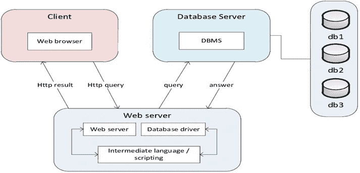

图 2-三层架构/图片来源-[https://www . research gate . net/figure/The-3-Tier-Architecture _ fig 22 _ 260389483](https://www.researchgate.net/figure/The-3-tier-architecture_fig22_260389483)

> **瘦客户端与胖客户端的区别**👇🏻

**瘦客户端**:

1.  瘦客户机连接到基于服务器的环境，该环境托管用户所需的大部分应用程序、内存和敏感数据。
2.  瘦客户机经常出现在银行和邮局。

**胖客户端:**

1.  胖客户端是一种不需要连接到服务器系统就能运行的软件。
2.  Microsoft Outlook、Yahoo Messenger 和 Skype 是一些胖客户端应用程序的例子。

> **如何测试胖客户端应用**？👨‍💻

在我看来，与 Web/API Pentest 相比，胖客户端 Pentest 更复杂。在胖客户端中，有两种类型(I)基于代理的胖客户端。(ii)基于非代理的胖客户端(普通)。

👨‍💻面对胖客户端应用程序的第一步是收集信息，例如:

1.发现客户端和服务器端都使用了什么技术。

2.弄清楚应用程序的功能和行为。

3.标识用户输入的所有不同入口点。

4.了解应用程序使用的核心安全机制。

5.识别常见的漏洞，如语言和框架。

一.[https://cve.mitre.org/cve/search_cve_list.html](https://cve.mitre.org/cve/search_cve_list.html)

二。https://www.exploit-db.com/

> **我们可能在胖客户端应用程序中发现的一些已知漏洞的列表。**

1.敏感数据泄露

2.DLL 劫持

3.错误处理不当

4.注射

5.逆向工程

6.会话管理

7.不安全的存储

8.SSL/TLS

9.业务逻辑

10.弱加密检查

> 让我们来看看我们在胖客户端测试中需要的一套**工具**。不是这个(🧑🏻‍🔧)😐

> **我们将在胖客户端测试中使用的一些已知工具列表。**

1.回声幻影

2.Procmon

3.Strings.exe

4.系统内部套件

5.Nmap

6.Testssl

7.流程黑客

8.Dnspy/ Dot Peek/ VB 反编译器

9.Metasploit(创建 Mal。DLL 文件)

10.小提琴手/演奏员

11.Wireshark

12.Ollydbg

13.。网状反射器

14.Winhex

是的，试图涵盖大多数工具🙆🏻‍♂️

> **实验室**:**DVTA——易受攻击的胖客户端应用**
> 
> [https://github.com/secvulture/dvta](https://github.com/secvulture/dvta)—我们针对少数测试案例测试易受攻击的应用程序/环境。

> **可以使用各种编程语言开发胖客户端应用程序，例如:**
> 
> 1.点。网
> 
> 2.Java 语言(一种计算机语言，尤用于创建网站)
> 
> 3.C/C++
> 
> 4.微软 Silverlight

> 我们从漏洞列表、测试用例以及测试方法开始。那么，我们去स्टार्ट 🥳吧👨‍💻

乐可·帕布·卡·纳姆🙏—贾伊·什里·拉姆🙏

**1。通过回声幻影**捕捉请求。

Echo Mirage 能够拦截受测胖客户端与本地或远程服务器之间的非 HTTP 流量。

使用该工具拦截请求，可以深入了解客户端和远程服务器之间传输的数据类型。

Echo Mirage 可以连接到经过测试的胖客户端应用程序进程，以便可以拦截和编辑经过测试的胖客户端应用程序与本地或远程服务器之间的通信。

当您打开 Echo Mirage 工具时，您将看到两个主要选项卡:

**流量日志** —查看通过代理的所有消息的完整记录。

**规则** —查看当前配置的规则，还可以添加/更改/删除拦截规则。

**步骤**:

1:我们将配置规则以捕获请求。

点击规则选项卡->选择**新建->-**查看选项卡中的以下配置。

*   确保勾选了截取选项。
*   端口和地址必须是*

一旦以上设置正确，点击保存，就可以继续下一步了。

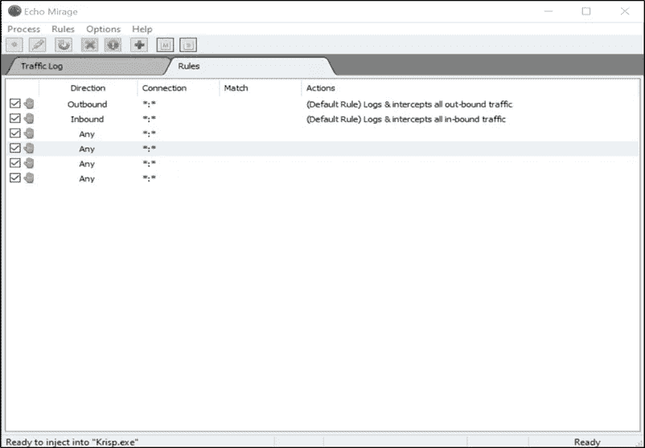

图 1 —回显 Mirage 规则策略

步骤 2:接下来，通过使用左上方的选项来注入测试应用程序的进程 ID，通过选择文件来注入进程 ID/执行应用程序。

步骤 3:一旦我们正确地挂钩了测试应用程序的进程 ID。我们将能够在 Echo Mirage 中捕获请求，如图 2 所示。

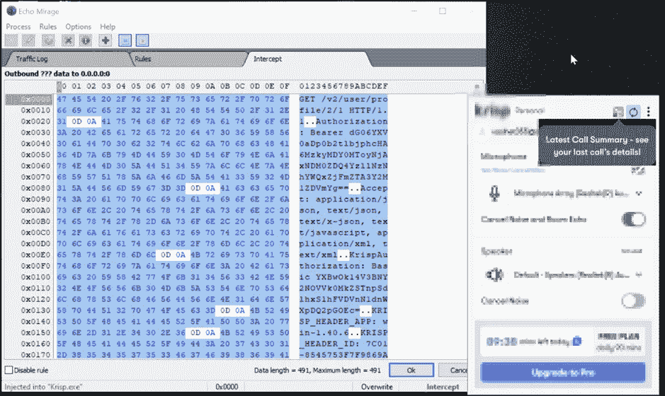

图 Echo Mirage 中捕获的请求

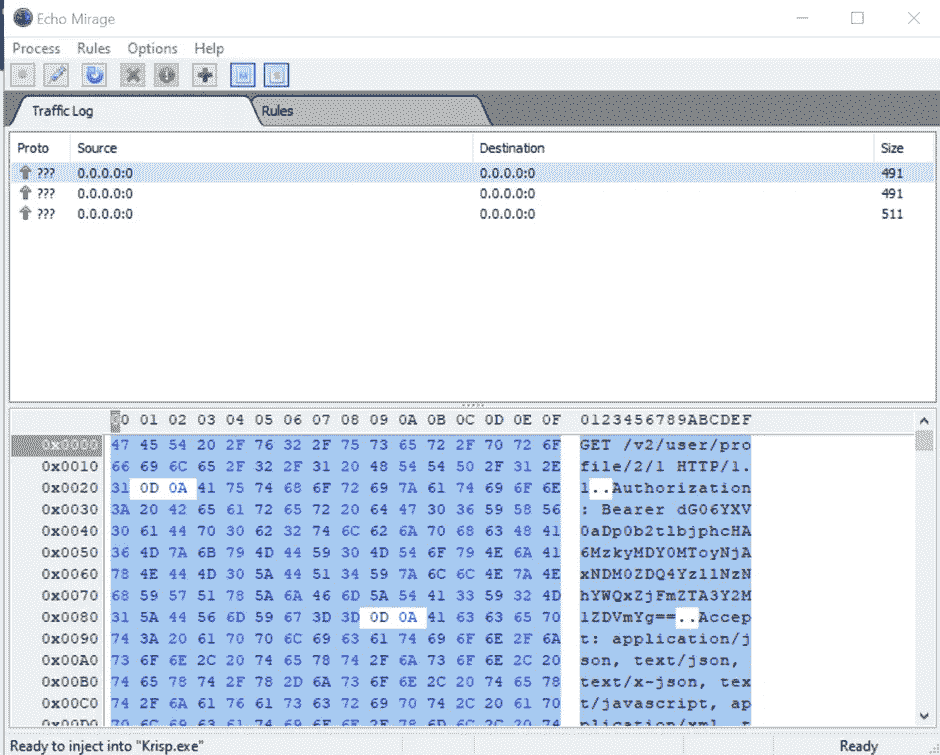

图 3-流量日志选项卡

**缓解**:建议在三层架构上构建应用程序。此外，确保敏感细节不会在 **GET** 方法请求中传输。

2.**硬编码敏感数据**:

**工具** - dnspy

**描述**:

dnSpy 是一个可移植的调试器。NET 程序集编辑器，以便在编辑和调试程序集时使用，即使源代码不可用。dnSpy 旨在帮助反编译各种程序集，让您更好地理解它们的功能。

**步骤**:在 dnspy 工具中打开测试应用程序，搜索具体的字符串，如图 5 所示。

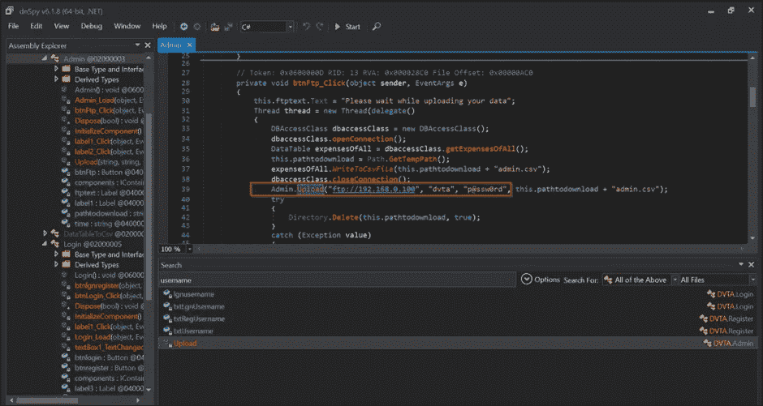

图 4-搜索特定字符串。

**缓解**:建议删除硬编码的敏感数据。

3.**胖客户端应用的签名检查**:

转储文件版本信息，并验证系统上的图像是否经过数字签名。

**工具**:sigcheck64.exe

sigcheck64.exe·appltnName.exe

**概念验证的**:

**第一个场景**:应用程序经过数字签名。

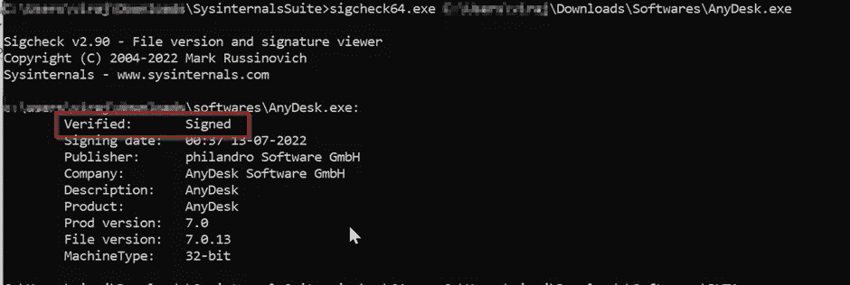

图 5:安全应用程序示例 POC。

**第二种情况**:我们将测试一个易受攻击的应用程序。

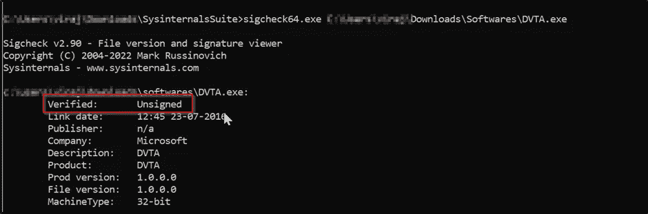

图 6-该死的易受攻击的应用程序

我们将在上面的 POC 中看到易受攻击的应用程序是未签名的。

**缓解**:建议对未签名的胖客户端应用进行数字签名。

4.**通过 Winhex 泄漏敏感数据**

**说明** : WinHex 是一款商业磁盘编辑器，通用十六进制编辑器(hex editor)，用于数据恢复和数字取证。内存分析工具

**工具** : Winhex

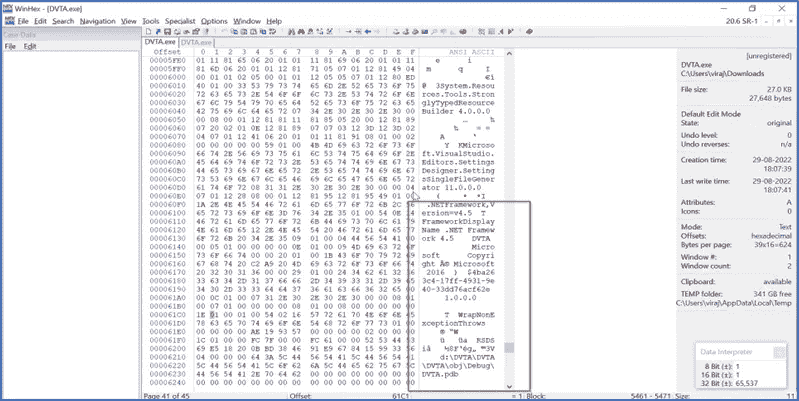

图 7- Winhex 工具

**缓解**:避免敏感数据泄露。

**5。错误处理不当:**

**描述**:

错误处理是指软件应用程序中出现错误时的响应和恢复过程。换句话说，它是由预测、检测和解决应用程序错误、编程错误或通信错误组成的过程。

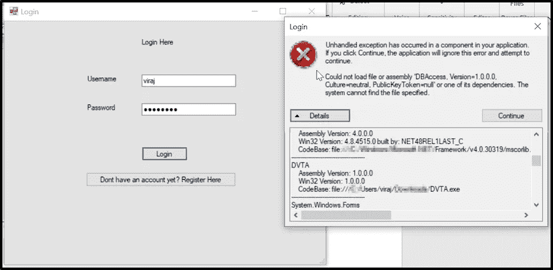

图 8 —错误处理不当

**缓解**:

应记录如何处理错误的具体策略，包括要处理的错误类型以及每种错误的类型，将向用户报告哪些信息，以及将记录哪些信息。所有开发人员都需要理解该策略，并确保他们的代码遵循该策略。

6.**缺乏代码混淆**:

当开发人员在编译二进制文件时没有混淆代码时，攻击者可以使用一些工具(如 JD GUI & Dnspy)反编译代码。

**工具** : dnspy

图 9 —缺乏代码混淆

**缓解**:

建议使用一套软件进行代码混淆。比如:ProGuard、JObfuscator、Javaguard 等等。

**7。配置文件和其他敏感文件可能包含敏感细节**。

**描述**:这是另一个测试用例，我们将在敏感数据的支持文件中看到敏感数据。

**缓解**:建议开发者避免从支持文件中泄露敏感细节。

8. **SQL 注入**:

我假设我们熟悉这个漏洞，所以只讨论描述性的部分。

**描述**:

SQL 注入攻击包括通过从客户端到应用程序的输入数据插入或“注入”SQL 查询。成功的 SQL 注入攻击可以读取数据库中的敏感数据、修改数据库数据(插入/更新/删除)、对数据库执行管理操作(如关闭 DBMS)、恢复 DBMS 文件系统中给定文件的内容，有时还会向操作系统发出命令。SQL 注入攻击是一种注入攻击，在这种攻击中，SQL 命令被注入到数据平面输入中，以影响预定义 SQL 命令的执行。

**威胁建模**:

SQL 注入攻击允许攻击者伪造身份、篡改现有数据、导致否认问题(如使交易无效或改变余额)、允许完全泄露系统上的所有数据、破坏数据或使其不可用，以及成为数据库服务器的管理员。

SQL 注入在 PHP 和 ASP 应用程序中非常普遍，因为旧的函数接口很流行。由于可用编程接口的性质，ASP.NET 和 J2EE 应用不太可能轻易利用 SQL 注入。

SQL 注入攻击的严重性受到攻击者的技能和想象力的限制，在较小的程度上，也受到深度防御对策的限制，例如到数据库服务器的低特权连接等等。通常，将 SQL 注入视为高影响严重性。

**缓解**:建议用准备好的语句实现参数化查询。

9.【strings.exe 敏感数据泄露

【Strings.exe】工具:

将数据转储到我们会寻找敏感信息的地方。

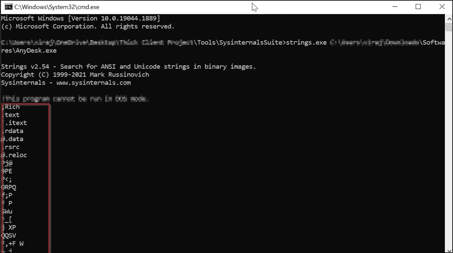

图 10 —转储数据

**缓解**:避免泄露敏感数据，对敏感数据进行加密。

**10。打开已知易受攻击的服务:**

**工具** : Nmap

对于检查胖客户端使用的端口非常有用。

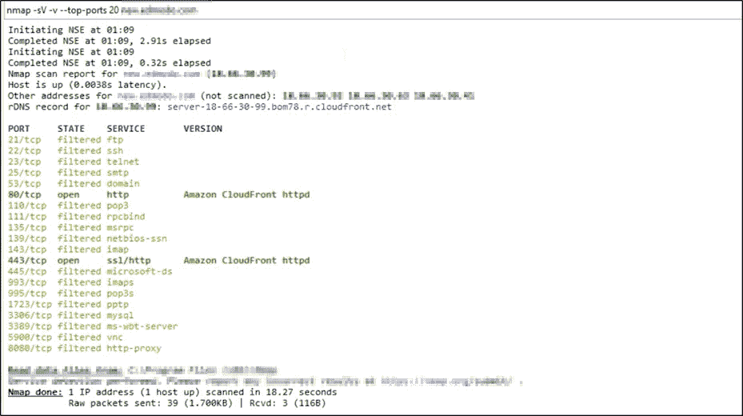

图 11 — Nmap 工具

**缓解**:关闭未使用的端口，实施安全策略，并确保服务没有使用易受攻击的报告版本。

> ***结束语*** :🙇
> 
> 谢谢你陪我到这里，希望对你有帮助。
> 
> 这就是这篇博客的全部内容，我们在这里讨论了胖客户端测试的一些重要测试案例。此外，还介绍了对架构和测试方法的基本理解。

> 这些是攻击者试图利用的弱点，我们作为 pentesters 需要在攻击者之前识别出来。
> 
> 我希望这种方法在你每次面对胖客户端应用时都有用。👨‍💻🙇

**还有更多的测试用例，我们将在即将到来的博客中看到，即:** [**第二部分胖客户端测试**](https://medium.com/@virajmota38/) **。👨‍💻**

> 最后但同样重要的是，找到下面提到的我的帐户 ID 以防任何查询。不要犹豫伸出手，我也一定会这样做。
> 
> *||保持安全，保持健康||*

> **感谢你留在这里阅读这篇博客**，
> 
> *维拉伊·MOTA(安全分析师/漏洞猎人)*
> 
> *领英:*[https://in.linkedin.com/in/viraj-mota/](https://www.linkedin.com/in/viraj-mota)
> 
> *推特:*https://twitter.com/VirajMota_T42
> 
> **参考文献**:

[https://www . optiv . com/insights/source-zero/blog/thick-client-application-security-testing](https://www.optiv.com/insights/source-zero/blog/thick-client-application-security-testing)

【https://rattibha.com/thread/1454079811203198979?lang=en 号

[https://blog . secure layer 7 . net/static-analysis memory-forensics-逆向工程-thick-client-penetration-testing-part-4/](https://blog.securelayer7.net/static-analysismemory-forensics-reverse-engineering-thick-client-penetration-testing-part-4/)

[https://www.ollydbg.de/](https://www.ollydbg.de/)

[https://docs.microsoft.com/en-us/sysinternals/downloads/](https://docs.microsoft.com/en-us/sysinternals/downloads/)

[https://resources . infosec institute . com/topic/reverse-engineering-ollydbg/](https://resources.infosecinstitute.com/topic/reverse-engineering-ollydbg/)

[https://hex-rays.com/ida-free/#download](https://hex-rays.com/ida-free/#download)

 [## 胖客户端渗透测试方法

### 简介胖客户端应用程序已经存在很多年了，并且仍然可以在各种…

www.cyberark.com](https://www.cyberark.com/resources/threat-research-blog/thick-client-penetration-testing-methodology/) 

## 来自 Infosec 的报道:Infosec 每天都有很多内容，很难跟上。[加入我们的每周简讯](https://weekly.infosecwriteups.com/)以 5 篇文章、4 个线程、3 个视频、2 个 Github Repos 和工具以及 1 个工作提醒的形式免费获取所有最新的 Infosec 趋势！