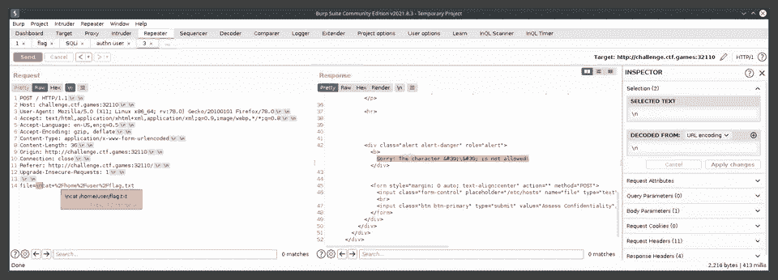
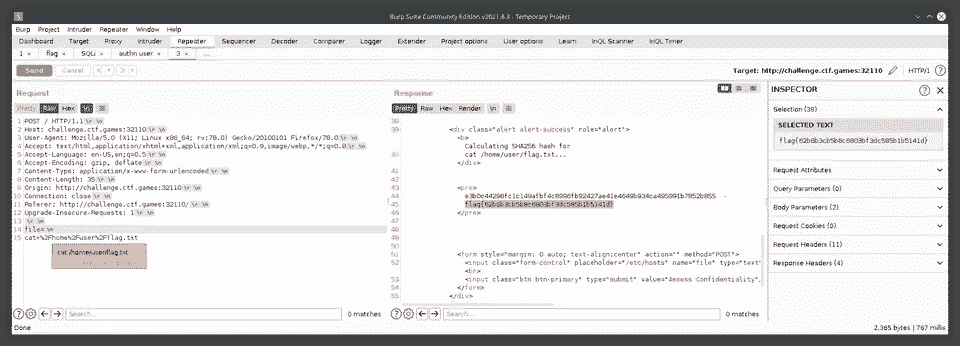
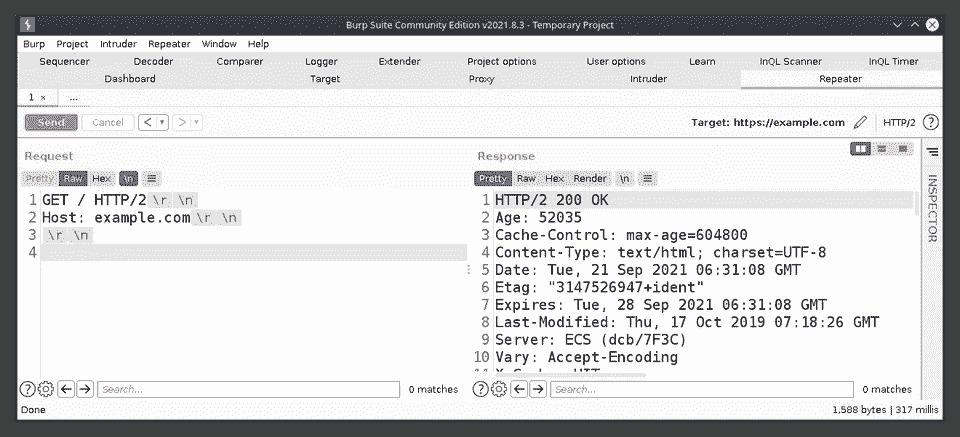

# 我从 2021 CTF 世博会学到的东西

> 原文：<https://infosecwriteups.com/things-i-learnt-from-h-cktivitycon-2021-ctf-31d7a7cdc3fe?source=collection_archive---------2----------------------->

# 尝试所有的挑战，阅读所有的文章

1.  即使挑战标签上写着“很难”，也要尝试一下——在 CTF 结束后，你正在阅读评论文章，**这将是一个巨大的帮助**——如果你已经浏览了挑战，那就容易多了。当然，你绝对应该阅读所有的文章。
2.  **这只是一个标签**——它们并不总是适用于你的专业水平——**OPA Secrets**，“硬”挑战——一篇[文章提到它是代码审计挑战](https://github.com/todd-tao/CTF-WriteUps/tree/main/H%40cktivityCon_2021_CTF/Web#solution-2)——在进一步阅读之前，我开始了挑战，浏览了 GitHub 上的源代码，找到了旗帜的`id`硬编码，然后我用那个`id`修改了`/getValue` POST 请求，并得到了旗帜。在文章的后面，它说没有实现访问控制——这是实际的漏洞，但是我所需要的只是发送一个请求，请求体中有`id`来获取标志，而`id`在源代码中；重点是，只有当你不知道如何阅读代码时，它才是困难的。
3.  从更广泛的意义上来说，当攻击现实世界中的应用时——你必须尝试任何事情&想到的任何事情，永远不要假设它不会产生结果，因为它太容易或简单了——**永远假设你是第一个看它的人**——这是现实世界，任何事情都容易被忽略。
4.  **了解新领域的最快方法** —最近我读了一些关于云挑战的文章，这些文章对工具(什么？)和方法(如何？)进行超级快速的实际启动。

# 蛮力所有的东西

admin:admin——这是另一个“简单”网络挑战的解决方案， **swagger** —为什么我把暴力作为最后手段&然后完全忘记它。

# 从图像中提取文本，快！！！

我正看着你，“简单”的热身挑战**粉刺**——在手机上使用谷歌镜头扫描图像>复制标志文本>通过推板发送到笔记本电脑或像正常人一样使用在线 OCR 网站，我怎么在 CTF 期间没有想到这一点呢？

# 浏览黑暗网络

**Mike Shallot** ，OSINT——我遇到的第一个挑战要求我探索互联网的黑暗角落——现在用 Brave 浏览器的私有 Tor 功能连接 Tor 网络变得容易多了——我一开始确实试着安装 Tor，但出现了一些错误——加上我已经安装了 Brave，所以我想这次我会尝试这个功能

令人惊讶的是，这款浏览器甚至不需要管理员权限就可以安装(我应该研究一下如何安装)——它默认情况下会阻止广告和追踪器，你可以通过使用浏览器获得基本的注意力令牌——你可以直接发送给互联网上最喜欢的创作者——试着从这个网站给我发送一些——[crypto super charges the great online game](https://www.notboring.co/p/the-great-online-game)——我意识到我听起来是由他们赞助的，但我不是。

# \n 不是换行符

这个出乎我的意料……**integrity**，“中等”网站，有一个过滤一些特殊字符的输入框，我试着提交了一些，包括' \n '，得到的错误是:' \ '是不允许的

后来一篇文章做了完全相同的事情，我不明白其中的区别——直到我在 burpsuite 中玩了一圈并复制粘贴了我从不可打印字符中得到的换行符，结果发现两者有不同的用例

NewLine (\n)是 10 (0xA)，carrier return(\ r)是 13 (0xD) —换句话说，\n 是可打印版本(？)有人纠正我这一点，请！

想了解更多，这里有一个来自 2009 年的非 HTTPS 的旧博客[和一个现代的 Q 网站](http://hayne.net/MacDev/Notes/unixFAQ.html#endOfLine)。

# SSTV——慢扫描电视

 [## 慢扫描电视(SSTV)

### 频率 3 兆赫，450 兆赫频率范围 3 兆赫- 450 兆赫模式 USB，LSB，NFM 调制调频 ACF 线每分钟发射…

www.sigidwiki.com](https://www.sigidwiki.com/wiki/Slow-Scan_Television_%28SSTV%29) 

学习很酷的隐写术新方法总是很棒，这种方法使用模拟电视信号来传输图像。

# 用于代码泄漏的 pastebin，以及员工 GitHub repos

搜索在目标公司工作的员工，他们拥有哪些 GitHub 库。如果服务器头没有返回任何有意义的东西，他们可能会摆弄目标 API 或文档，这也有助于了解他们可能使用的内部技术堆栈。

*最初发表于*[*https://nilesheverywhere.com*](https://nilesheverywhere.com/random-learnings)*。*