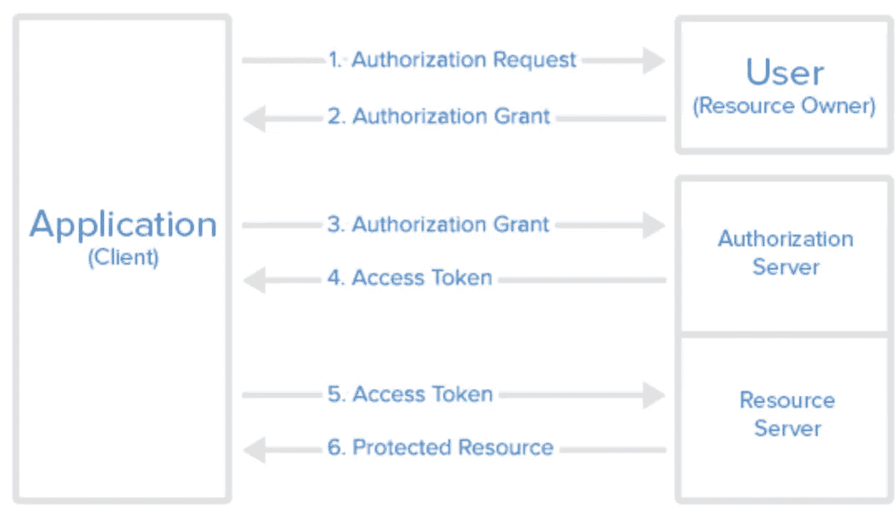

# 这就是他如何只需点击一下就能劫持 Reddit 账户的方法:1 万美元的 bug 赏金

> 原文：<https://infosecwriteups.com/this-is-how-he-could-hijack-reddit-accounts-with-just-one-click-a-10-000-bug-bounty-7fd8d54d5582?source=collection_archive---------0----------------------->

## 探索弗兰斯·罗森绕过奥厄斯安检的方法

# 摘要

劫持一个随机用户的帐户可能是许多恶意黑客梦寐以求的目标。这可能通过传统的数据泄漏方法和暴力密码发生，但随着附加的安全措施更加普遍，如 2FA 或 OAuth，它(希望)变得越来越难以简单地猜测和检查。

攻击者理想的利用方式是所谓的[零点击](https://www.pcmag.com/how-to/what-is-a-zero-click-attack#:~:text=Zero%2Dclick%20attacks%20exploit%20existing,to%20a%20zero%2Dclick%20attack.)。当攻击者发现某种漏洞，可以发送某种形式的通信(短信、电子邮件等)时，就会发生这种情况。取决于利用)，并且用户与恶意内容没有任何交互，攻击者就可以危害受害者的设备、帐户等。当这些漏洞被发现时，他们通常[制造新闻](https://googleprojectzero.blogspot.com/2021/12/a-deep-dive-into-nso-zero-click.html)。

人工智能生成的 craiyon.com“黑客熊猫”图像

攻击者能做的第二件事就是一次点击式利用。这就像一次零点击，但它只需要受害者最少的交互(即一次点击)就能让攻击者接管。这些显然也是极其危险的，安全研究员 [Frans Rosén](https://twitter.com/fransrosen) 想出了一种方法来对任何使用 Reddit 上的苹果登录的用户进行这样的攻击，结果获得了 10，000 美元的奖金。

# **漏洞利用**

> 我将查看 [Frans Rosén 的](https://twitter.com/fransrosen)技术博客文章“[在登录 OAuth-flows](https://labs.detectify.com/2022/07/06/account-hijacking-using-dirty-dancing-in-sign-in-oauth-flows/) 中使用“辣身舞”劫持账户”以及他的 [HackerOne 报告](https://hackerone.com/reports/1567186)从 Reddit 获得 10，000 美元的 bug 奖金。本文中引用的所有技术都源自 Rosen 的工作，这两份报告将包含完整的技术分析。请注意，这需要很长时间才能发现，而且也不容易找到。

许多受欢迎的网站，如亚马逊、谷歌和苹果，提供 [OAuth](https://en.wikipedia.org/wiki/OAuth) 服务，允许用户登录其他网站，如 Reddit。如果实现正确，OAuth 可能是执行安全授权的一种很好的方式。然而，像任何事情一样，即使是很小的错误也可能绕过身份验证，导致帐户被接管。

来自[https://www . digital ocean . com/community/tutorials/an-introduction-to-OAuth-2](https://www.digitalocean.com/community/tutorials/an-introduction-to-oauth-2)的典型 OAuth 流程

正如罗森所说，“快乐的 OAuth 舞”通常遵循上图的格式。将某种形式的令牌或代码颁发给经过验证的用户，然后执行验证，这会消耗资源。资源一旦被使用，就不能再被使用。在处理令牌的方式之一中，称为`response_mode=fragment`，令牌实际上是通过使用片段放入 [href](https://www.w3schools.com/tags/att_a_href.asp) 中。

Rosén 也非常感兴趣，并且已经[开发了工具](https://github.com/fransr/postMessage-tracker)来跟踪`[window.postMessage()](https://developer.mozilla.org/en-US/docs/Web/API/Window/postMessage)`的使用，这允许跨来源的通信。他从理论上说，也许有可能将“快乐”之舞变成“肮脏”之舞，OAuth 进程进入一种状态，在这种状态下，已颁发的令牌仍然可以使用，但仍然可以通过 URL 获得，然后通过`postMessage()`泄露。

Rosén 的能够建立一个工作的点击帐户劫持 Reddit 用户使用苹果登录。第一步是通过有效的 Apple 登录过程为攻击者获取一个有效的`state`，用于验证发出请求的用户。使用 Rosén 的例子，一旦攻击者拥有了这一点，攻击者将能够准备一个包含 iframe`www.redditmedia.com`的恶意页面，该页面允许通过 URL 进行通信。这个 iframe 将为用户创建一个链接，以便在加载了攻击者`state`的情况下登录 Reddit 的苹果登录流程。这个 iframe 还使用特定的`response_type`和`response_mode`调用 OAuth，这是 Reddit 没有阻止的，以强制 OAuth 验证过程泄漏 URL 片段中的令牌。一旦受害者登录，URL 变成`[https://reddit.com/#state=xxx&code=xxx&access_token=xx](https://reddit.com/#state=xxx&code=xxx&access_token=xx)`，攻击者可以使用 XSS 通过 iframe 访问它，因为他们有相同的域。一旦令牌被盗，攻击者就可以作为受害者登录！*注意:看看这份报告和之前的报告，Reddit 的团队似乎非常积极，乐于修复这些漏洞，并致力于全面披露，因此也要表扬他们的团队。*

人工智能生成的 craiyon.com“指纹黑客”图像

这是对罗森漏洞利用工作原理的基本总结！然而，我极度简化并省略了许多关于罗森是如何制造这次 OAuth 劫持事件的细节。我非常鼓励有兴趣的人去看看他的博客文章“在登录 OAuth-flows 中使用“辣身舞”的帐户劫持”[和他的](https://labs.detectify.com/2022/07/06/account-hijacking-using-dirty-dancing-in-sign-in-oauth-flows/) [HackerOne 报告](https://hackerone.com/reports/1567186)来充分阅读所有有趣的技术细节和为什么这行得通的原因。这真是令人着迷。

弗兰克·罗森又一次完成了令人难以置信的工作，祝贺你获得 10，000 美元奖金。感谢您通读，请在下面留下任何建设性的反馈、建议或问题！如果你喜欢，请考虑在 Medium 上跟随我或者[请我喝杯咖啡](https://www.buymeacoffee.com/robertocyberkid)。在 roberto.cyberkid@gmail.com 联系我，在[推特](https://twitter.com/CyberKidLama)关注我，在 [LinkedIn](https://www.linkedin.com/in/roberto-lama-9a126a123/) 联系我！

*来自 Infosec 的报道:Infosec 上每天都会出现很多难以跟上的内容。* [***加入我们的每周简讯***](https://weekly.infosecwriteups.com/) *以 5 篇文章、4 个线程、3 个视频、2 个 Github Repos 和工具以及 1 个工作提醒的形式免费获取所有最新的 Infosec 趋势！*