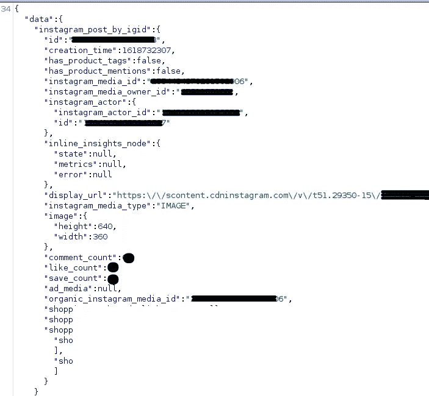
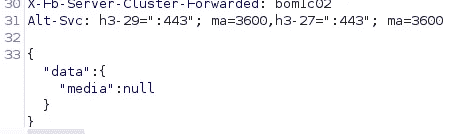
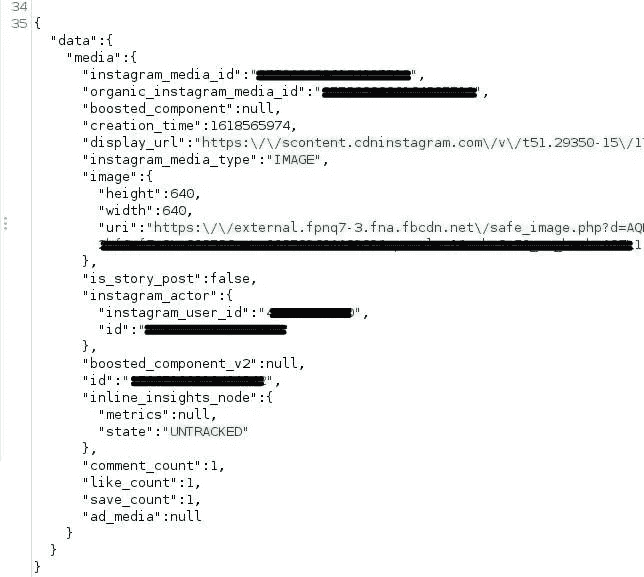
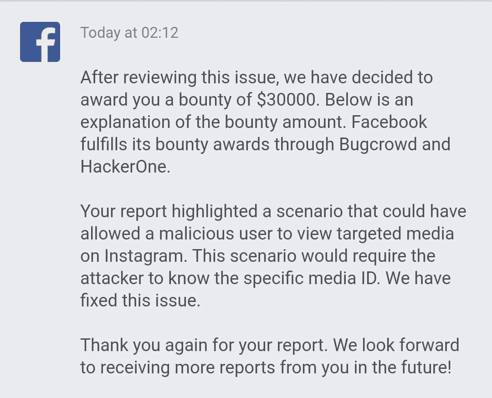

# 这就是为什么我能够在 Instagram 上看到用户的私人存档帖子/故事，而不用关注他们

> 原文：<https://infosecwriteups.com/this-is-how-i-was-able-to-see-private-archived-posts-stories-of-users-on-instagram-without-de70ca39165c?source=collection_archive---------0----------------------->

我是来自马哈拉施特拉邦的马约·法塔德。这是我在脸书昆虫赏金计划中的第一只昆虫。

## 描述

该漏洞可能允许恶意用户在 Instagram 上查看目标媒体。攻击者无需使用媒体 ID 跟踪用户，就可以看到私人/存档帖子、故事、视频、IGTV 的详细信息。详细信息包括赞数/评论数/保存数、显示 url、图片 uri、脸书链接页面(如果有)和其他。

**影响**

用户的数据可能被不正确地读取。攻击者能够重新生成存档故事和帖子的有效 CDN URL。此外，通过暴力破解媒体 ID，攻击者可以存储特定媒体的详细信息，并在以后过滤私有和存档的内容。

## 再现步骤

步骤:

1.  获取目标的帖子/卷轴/IGTV/故事媒体 id(通过暴力或其他技术)
2.  向[https://i.instagram.com/api/v1/ads/graphql/](https://i.instagram.com/api/v1/ads/graphql/)
    ***参数*** :
    doc_id= **【编校】**&query _ params = { " query _ params ":{ " access _ token ":"，" id":"[ **MEDIA_ID** ]"}}
3.  其中**【媒体 ID】**是任何帖子/卷轴/IGTV/故事的媒体 ID。
    doc_id 被编辑。
4.  在响应中，display_url、save_count &披露了特定媒体的其他详细信息。

几天后，我发现了另一个 doc_id= **【修订】**的端点，它披露了相同的信息。access_token 是通过 POST 请求传递的，所以当我试图访问不同帐户的媒体时，我得到了 ***数据:响应中的 null*** 。

**步骤:**

1.向[https://i.instagram.com/api/v1/ads/graphql/](https://i.instagram.com/api/v1/ads/graphql/)
***参数***:
access _ token =**【编校】**&variables = { " query _ params ":{ " access _ token ":"，" ID ":"**【MEDIA _ ID】**" }，" fetch _ actor _ ID ":false }&server _ timestamps = true&doc _ ID =**【编校】**

其中**【媒体 ID】**是任何帖子/卷轴/IGTV/故事的媒体 ID。
doc_id 被编辑。
不包括其他参数。
访问令牌是有效的脸书访问令牌。

反应

2.然后，我将*访问令牌*更改为*空值*，这样我就可以访问信息了。
同一个端点也披露了链接到 Instagram 账户的脸书页面，但脸书页面& Instagram 账户链接是公开的。这里可以看到
***https://www.facebook.com/ads/library/?active_status=all&ad _ type = all&country = US&view _ all _ PAGE _ id = PAGE _ ID&search _ type = PAGE***
其中 **PAGE_ID** 是脸书页面 ID。

***参数***:
access _ token = null&变量= { " query _ params ":{ " access _ token ":"，" ID ":"**【MEDIA _ ID】**" }，" fetch _ actor _ ID ":false }&server _ timestamps = true&doc _ ID =**【编校】**

回应:

## 固定

Instagram 改变了上述端点。

## 时间表

2021 年 4 月 16 日:发送报告
2021 年 4 月 19 日:来自脸书安全团队的回复—需要更多信息
2021 年 4 月 19 日:发送信息
2021 年 4 月 22 日:报告已分类
2021 年 4 月 23 日:发现另一个终端泄露相同信息
2021 年 4 月 29 日:已修复
2021 年 4 月 29 日:漏洞未完全修补。将信息发送给 FB 安全团队
…2021 年 6 月 15 日:获得 30000 美元奖金。

