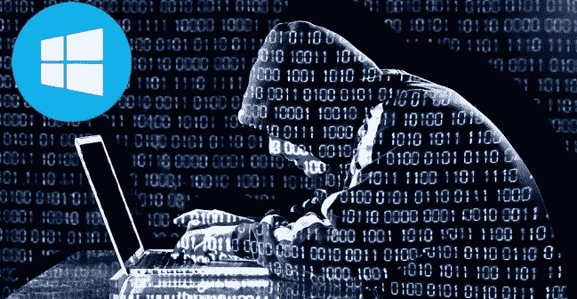
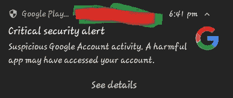
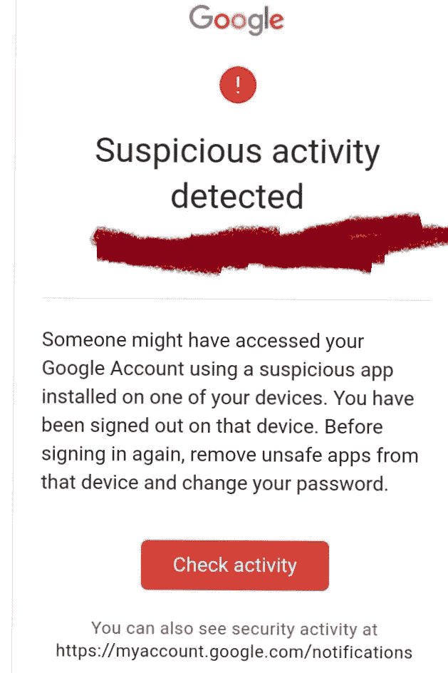

# 我的 Windows 10 就是这么黑的！以及我是如何克服它的(从受影响的电脑中删除特洛伊木马)。

> 原文：<https://infosecwriteups.com/this-is-how-my-windows-10-hacked-and-how-i-overcome-it-remove-a-trojan-horse-from-affected-pc-9cb5c90df26d?source=collection_archive---------2----------------------->

你从这篇文章中学到了什么

1.  我的错误是因为我的电脑被黑了。
2.  当你知道自己被黑客攻击时，你会感到怎样的恐惧！
3.  什么是特洛伊木马。
4.  如何知道自己被黑了(基本症状)。
5.  如何扫描你的电脑，并删除任何恶意软件。
6.  Hr_Vicky 的提示。

## 我对这个事件的故事。

有一天我在晚上 6 点睡觉，梦见了*安格尔·普丽娅*(我的女朋友)。不小心我的手机嗡嗡作响，我醒来，由于这种干扰，并检查我的手机，然后朋友们，你不能相信我得到了恐惧。那个时刻对我来说是非常可怕的时刻。看完那个通知后，我会给你看那个通知，你也可以看那个通知，感受我在那段时间的情况。

我的通知

真的，我被黑了，我担心你被黑后发生的事情。在那一瞬间，我想了很多事情。就像我的隐私和我的 google drive 一样，我有这么多个人照片和其他文件，我的私人视频和照片会公开吗？或者它会出现在 Darkweb 上，我所有的社交媒体帐户会被别人接管吗？我现在失去了他们。最后但同样重要的是，我会受到勒索软件的影响，我会被某人骚扰并索要赎金，银行余额也会受到影响等等。

## 黄金时期

> 我走了很长一段路，现在试着放松。现在是时候用你的头脑来处理这种情况了。我也是一个黑客，然后关闭正常思维，现在打开黑客思维。尝试找出问题并像传奇人物一样解决它。

## 错误

现在我试着回忆过去 5 天发生的所有错误。幸运的是，有一天我试着学习 adobe premiere，却不想为它的许可证付费。所以我使用快捷方式，我去一个网站下载它的破解版本并安装它。安装后，我享受了很多，并认为生活是如此简单，我得到了它的自由，享受更多的快乐时刻。我不知道在这个快乐的时刻之后会发生什么灾难。

## 识别问题

首先，我扫描了我下载 zip 文件，发现该文件是恶意的。它有一段特洛伊木马的代码。哦，我的上帝。现在是时候在系统中搜索并杀死它了。

**什么是特洛伊木马。**

特洛伊木马或特洛伊木马是一种**类型的恶意代码或软件**，看起来合法，但却能控制你的电脑。特洛伊木马旨在对您的数据或网络进行破坏、干扰、窃取或其他有害操作。

## 你被黑的基本症状！。

*   你得到一个假的杀毒信息。
*   您有不需要的浏览器工具栏。
*   您的互联网搜索将被重定向。
*   你会看到频繁的随机弹出窗口。
*   您的朋友收到了您发送的社交媒体邀请，但您并未发送邀请。
*   您的在线密码无效。
*   减慢你的电脑。
*   未经您操作就安装了未知应用程序。

## 如何扫描并删除它:

>如果你是电脑方面的天才，那么首先检查你的 windows defender 和 antivirus 是否工作，如果它们不工作，首先尝试谷歌并修复这个问题。因为这两个是微软提供的伟大工具，它能检测 80%或更多的恶意软件。

>扫描您的 windows 注册表并识别异常活动。

>浏览默认 windows 位置的所有文件和文件夹。这可能要花很多时间，你可以自动化它来节省你的时间。

>使用 Wireshark 检查网络流量的流向。它的目标是一个未知的网页或任何类型的恶意目标。

例如:hfeofeieeoeo.tr，asdfkdlll.com…..等等。

## Hr_Vicky 提示:

使用谷歌帐户登录，使用所有的安全措施，就像 2FA 和谷歌提供的更多。因为当有人试图用你的帐户进行恶意活动时，谷歌会通知你。

始终更新您的防病毒软件和 windows 操作系统。

一段时间后，你可以根据你的知识进行手动扫描。

如果你不知道该做什么，不要惊慌，雇佣一个有道德的黑客，然后向他们咨询，他们肯定会帮助你。

谷歌帮了你很多。

例如:

> **感谢**增长自己的见识。我总是试图给你一些不同的和新的东西。
> 
> =====再见，保重=====