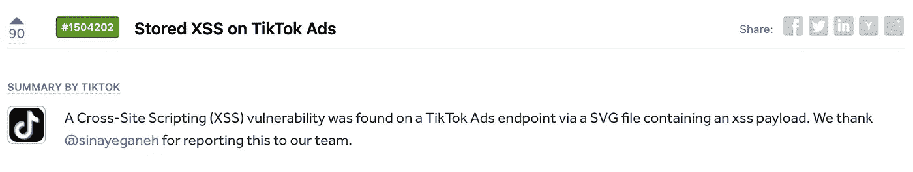

# 这个简单的技巧将利用图片上传-2500 美元抖音虫赏金。

> 原文：<https://infosecwriteups.com/this-simple-trick-will-exploit-image-uploads-2500-tiktok-bug-bounty-41fc01128ee?source=collection_archive---------1----------------------->

## 在 SVG 文件中存储 XSS。


电脑黑客的赛博朋克数字艺术。

## 摘要

跨站点脚本(XSS)是所有 web 应用程序开发人员头疼的安全问题。在这种类型的漏洞中，攻击者会以某种方式将恶意的 JavaScript 代码或“脚本”注入良性的 web 应用程序。如果攻击者能够成功嵌入该脚本，那么该脚本将拥有访问重要用户信息的权限。当受害者访问所述 web 应用时，恶意脚本可以窃取用户的 cookies 或其他帐户凭证。近日，HackerOne 用户`[sinayeganeh](https://hackerone.com/sinayeganeh?type=user)`在[抖音](https://hackerone.com/reports/1504202)发现一个 XSS 漏洞，被判中等严重程度，并获得 2500 美元的 bug 赏金！

XSS 的传统示例是测试输入字段并添加以下有效负载:

```
<script> alert(“TEST”); </script>
```

如果弹出一个警告框说“测试”，那么 XSS 是可能的。这个脚本可能会被一个更危险的脚本所取代，这个脚本会将访问者的会话`[document.cookie](https://developer.mozilla.org/en-US/docs/Web/API/Document/cookie)`发送给黑客。许多现代 web 框架都有某种针对易于发现的 XSS 攻击的防御措施，但黑客们不断想出有趣的方法来绕过这些过滤器。Ismail Tasdelen 在 Github 上为 XSS 收集了一份非常棒的有效载荷测试列表，而 [@XssPayloads](https://twitter.com/XssPayloads) 也一直在推特上发布新发现的有效载荷。

## SVG 有效负载

[可缩放矢量图形，或 svg](https://developer.mozilla.org/en-US/docs/Web/SVG) ，是“一种基于 XML 的标记语言，用于描述基于二维的矢量图形”(来源: [Mozilla](https://developer.mozilla.org/en-US/docs/Web/SVG) )。这意味着这是一种不同于标准 jpg 或 png 的表示图像的方式。开发者防范包含在``标签中的 XSS 更常见，但是`<svg>`标签也支持 JS 代码！

本质上，这种形式的 XSS 有效载荷与标准的``有效载荷相同，但目标是标准防御机制不会将其注册为有效载荷。

黑客组织 [Ghostlulz 撰写了一篇很好的文章](http://ghostlulz.com/xss-svg/)，解释了如何为 SVG 文件构建一个可靠的有效负载的细节。我将包含一个他们突出显示的有效负载作为示例，如果 web 应用程序允许上传 SVG 文件并容易受到 XSS 攻击，它将弹出一个带有文本“Ghostlulz XSS”的警告框。

```
<?xml version="1.0" standalone="no"?> 
<!DOCTYPE svg PUBLIC "-//W3C//DTD SVG 1.1//EN" "http://www.w3.org/Graphics/SVG/1.1/DTD/svg11.dtd"> <svg version="1.1" baseProfile="full" >    
    <rect width="300" height="100" style="fill:rgb(0,0,255); stroke-width:3;stroke:rgb(0,0,0)" />    
    <script type="text/javascript"> 
        alert("Ghostlulz XSS");    
    </script> 
</svg>
```

## 抖音利用

HackerOne 用户`[sinayeganeh](https://hackerone.com/sinayeganeh?type=user)`最近在[抖音](https://hackerone.com/reports/1504202)发现了一个 XSS 漏洞。



在[钢骨](https://hackerone.com/reports/1504202)上报告总结

如摘要中所述，抖音 Ads 上有一个易受攻击的端点，允许包含 XSS 有效负载的 SVG 上传。抖音通常不会提供比摘要更多的关于已披露漏洞的信息，但这被给予了 6.5 的评级，这是一个中等严重级别。

`[sinayeganeh](https://hackerone.com/sinayeganeh?type=user)`的伟大发现，祝贺你获得 2500 美元的 bug 赏金！

```
**Want to Connect?** Please consider contacting me at roberto.cyberkid@gmail.com following me on Medium, [buying me a coffee](https://www.buymeacoffee.com/robertocyberkid), following me on [twitter](https://twitter.com/CyberKidLama), or connecting with me on [LinkedIn](https://www.linkedin.com/in/roberto-lama-9a126a123/)!
```

*来自 Infosec 的报道:Infosec 上每天都会出现很多难以跟上的内容。* [***加入我们的每周简讯***](https://weekly.infosecwriteups.com/) *以 5 篇文章、4 个线程、3 个视频、2 个 Github Repos 和工具以及 1 个工作提醒的形式免费获取所有最新的 Infosec 趋势！*