# 如何用自己的工具发现多达 10，000 个子域名

> 原文：<https://infosecwriteups.com/this-time-you-will-learn-how-to-create-your-own-tool-with-which-you-will-be-able-to-discover-2e813495907e?source=collection_archive---------0----------------------->

这次你将学习如何创建你自己的工具来发现网站的子域。如果您在空闲时间致力于报告漏洞，这将对您非常有帮助。

为了创建这个工具，我们将使用 **bash** 对我们将要使用的任务进行编程，我们将按部分查看它们

首先我们需要知道什么是子域:

> 子域是一种将站点(网站)作为附件与主网站相关联的方式。
> 
> 子域类型:【http://subdominio.dominio.com】，这些子域实际上指向你租用的主机的一个文件夹，但是显示子域的内容。
> 
> 例如，如果不是像下面这样显示你的博客:【http://www.tudominio.com/blog/】T4 你想从一个子域显示它，你可以创建一个子域:[http://blog.tudominio.com](http://blog.tudominio.com)
> 
> [https://www.dondominio.com/help/es/116/que-es-subdominio/](https://www.dondominio.com/help/es/116/que-es-subdominio/)

记住什么是领域，让我们继续什么是工具。

如果您从未使用过 linux，更不用说编写自己的 bash 脚本了，下面是 bash 是什么:

> Bash 是一个命令解释器，通常运行在文本窗口中，用户在文本模式下输入命令。Bash 还可以从一个称为脚本的文件中读取和执行命令。
> 
> [https://es.wikipedia.org/wiki/Bash](https://es.wikipedia.org/wiki/Bash)

## 好吧，让我们言归正传。

对于这个工具，我们将使用 CURL，它将帮助我们提出请求。我们的工具将基于一个网页，该网页具有发现网站子域的功能，我最喜欢的是它非常快。

我们将要帮助我们的网站如下，它不是我所拥有的，所以我要感谢创作者提供了这样一个伟大的工具！

[https://sonar.omnisint.io/subdomains/ejemplo.com](https://sonar[.]omnisint[.]io/subdomains/tesla[.]com)

当我们得到页面的结果时，我们会看到类似这样的内容:

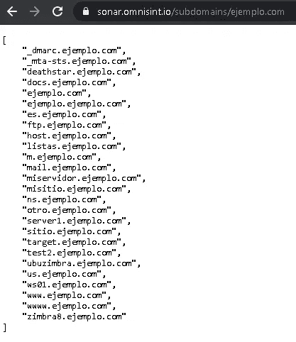

我们正在寻找的是我们在页面 URL 中使用的域的子域。

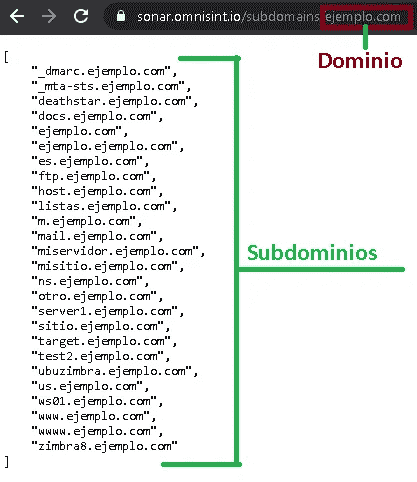

在这个例子中，它看起来更详细，我们发现几个子域。

我们要做的第一件事是，我们已经进入了工具的创建阶段，我们必须知道的是，我们可以从终端使用 CURL 工具来创建页面 sonar.omnisint.io。

为此，我们使用以下命令行:

```
curl “[https://sonar.omnisint.io/subdomains/ejemplo.com](https://sonar.omnisint.io/subdomains/ejemplo.com)"
```

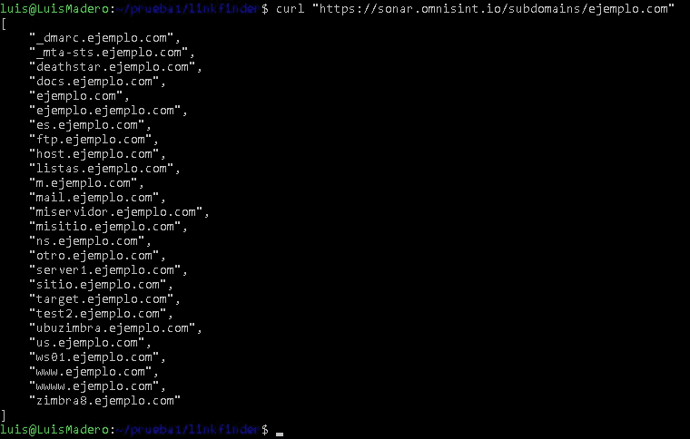

正如您所看到的，当执行这个命令并从浏览器访问页面时，我们得到了相同的结果。到这里为止，似乎仅仅改变请求的位置是没有意义的，但是我们不要忘记，在这种情况下，我们是从 linux 开始工作的，我们可以选择在 BASH 中创建一个脚本。

利用这种可能性，我们将创建一个脚本，帮助我们实现自动化并查看更多细节，在这种情况下，我们将处理这两个简单的事情:

*   创建一个变量，用来存储我们要扫描的域
*   创建另一个变量来存储找到的子域数量。

不过还是一步一步来吧。

我们要做的第一件事是重定向所传递命令的结果，以便将其保存在文本文件中:

```
curl “[https://sonar.omnisint.io/subdomains/ejemplo.com](https://sonar.omnisint.io/subdomains/ejemplo.com)" > subdominios.txtcat subdominios.txt
```

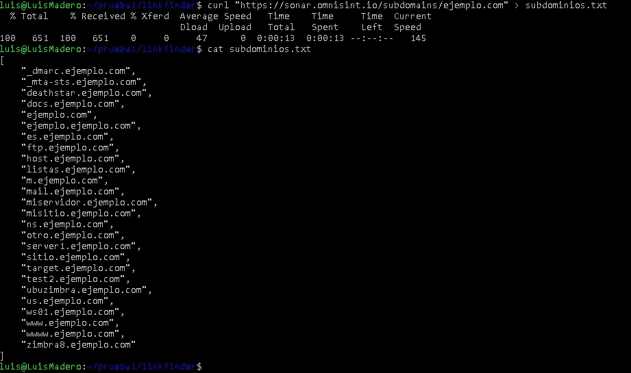

在创建脚本时，我们必须记住一些事情，那就是保持我们的工作环境整洁，我们必须始终努力消除我们不需要的东西，在这种情况下，我们有以下内容:

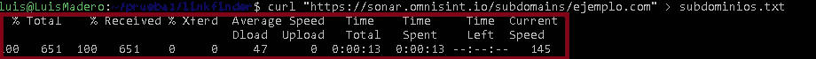

红框中的内容是 CURL 工具的一部分，它向我们展示了下单所需的时间，但我们对此不感兴趣，我们想要的是尽可能保持环境整洁，为此我们有以下选择:

```
curl --silent --insecure “[https://sonar.omnisint.io/subdomains/ejemplo.com](https://sonar.omnisint.io/subdomains/ejemplo.com)" > subdominios.txt && cat subdominios.txt
```

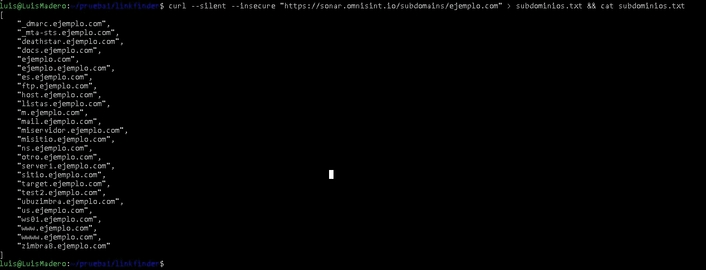

这样我们就有了一个更干净的结果。现在，我们已经定义了我们想要做的事情，其中一件事是计算子域的数量，我们将使用命令“wc”来完成。

```
cat subdominios.txt | wc -l
```

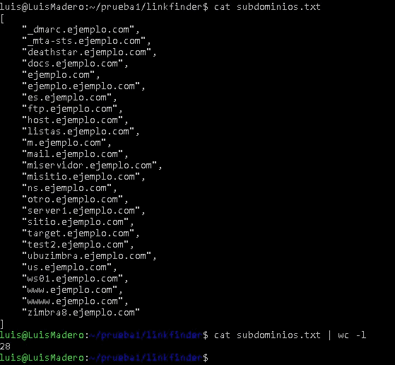

wc -l 命令的作用是计算文件中包含的行数，现在回到我们必须删除不需要的部分这一点，我们意识到在 cat subdomains.txt 命令的输出中，我们多了两行:

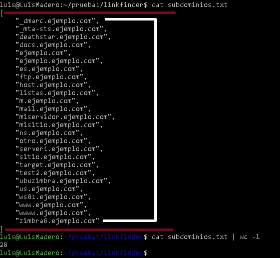

红色的线是对我们没用的线，白色的线是我们真正感兴趣的线，因为它们是子域所在的线。在计算行数的时候，我们将不再有 2 行的误差。

为此，我们将使用正则表达式。

```
grep -oE "[a-zA-Z0-9._-]+\.ejemplo.com"
```

这个正则表达式的作用是过滤结果，只显示以下列开头的数据:

*   字母 a-z
*   字母 A-Z
*   从 0 到 9 的数字
*   最后 _

所有这些都是通过查找满足上述条件的行来完成的，这些行位于文本“. example.com”的旁边。

完整的命令行

```
curl --silent --insecure "[https://sonar.omnisint.io/subdomains/ejemplo.com](https://sonar.omnisint.io/subdomains/ejemplo.com)" | grep -oE "[a-zA-Z0-9._-]+\.ejemplo.com" > subdominios1.txt
```

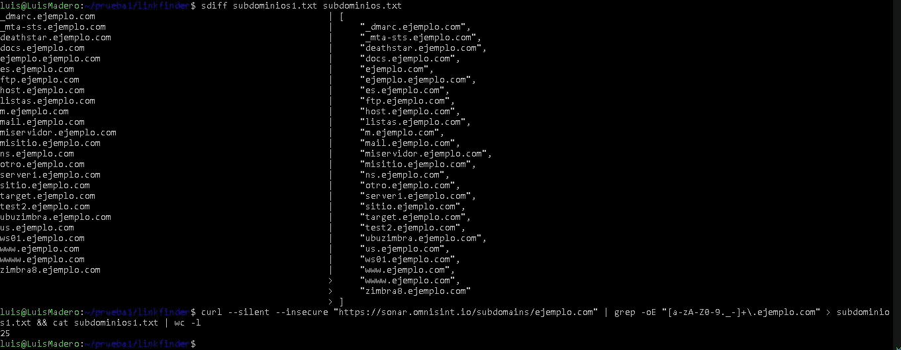

我决定添加不带正则表达式的输出和带正则表达式的输出的比较，这样你就可以看到不同之处，我们第一次应用 wc -l 时得到的结果是找到了 28 个子域，而现在带正则表达式时只有 25 个，这是因为不带正则表达式的输出也返回域，而带正则表达式的输出则消除了这一点，如果我们有了子域的确切数目。

现在我们已经做好了开始创建脚本的一切准备。不会是这个样子。

```
#!/bin/bashclear
read -p "Ingresa un host: " HOSThost=($HOST)
numero_subdominios=$(cat subdominios2.txt | wc -l)for hosts in "{host[@]}"
do
        curl --silent --insecure "[https://sonar.omnisint.io/subdomains/$HOST](https://sonar.omnisint.io/subdomains/$HOST)" > subdominios1.txtcat subdominios1.txt | grep -oE "[a-zA-Z0-9._-]+\.$HOST" | sort -u > subdominios2.txtecho "Se encontraro: $numero_subdominios subdominios"done
```

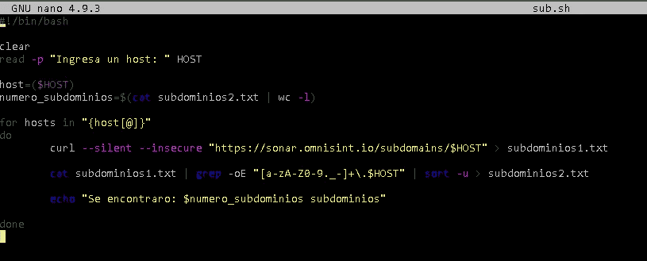

现在让我们一步一步来:

```
#!/bin/bash
```

这将启动所有 bash 脚本

```
clear
read -p "Ingresa un host: " HOST
```

“清除”用于清除屏幕。

“read -p”用于要求用户输入一个单词，该单词将存储在主机变量中。

```
host=($HOST)
numero_subdominios=$(cat subdominios2.txt | wc -l)
```

“主机”是存储所选域的变量。

“number_subdomains”是执行命令 cat subdomains2.txt | wc -l 的结果

```
for hosts in "{host[@]}"
do
        curl --silent --insecure "[https://sonar.omnisint.io/subdomains/$HOST](https://sonar.omnisint.io/subdomains/$HOST)" > subdominios1.txtcat subdominios1.txt | grep -oE "[a-zA-Z0-9._-]+\.$HOST" | sort -u > subdominios2.txt
```

在这里，我们进入脚本的主体，这部分是负责向页面发出请求的部分，我们用它来获取子域，所用的命令已经在上面解释过了。

```
echo "Se encontraro: $numero_subdominios subdominios"done
```

最后，我们有一个在屏幕上打印文本的 echo，我们打印的是变量 numero_subdominios，以获得找到的子域的数量。

最后我们有了这个结果:

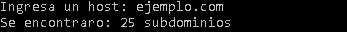

最后，我想澄清一下，这只是我们可以实现的一切的一个小例子，这是我个人从我发布在 github 帐户上的一个工具中获得的，您可以在这里找到:

[](https://github.com/Y000o/linkfinder) [## Y000o/linkfinder

### 在 GitHub 上创建一个帐户，为 Y000o/linkfinder 的开发做出贡献。

github.com](https://github.com/Y000o/linkfinder) 

示例:

域名 yandex.com 有 9802，用这种方法你可以在 26 秒内得到子域名

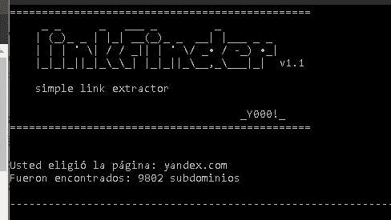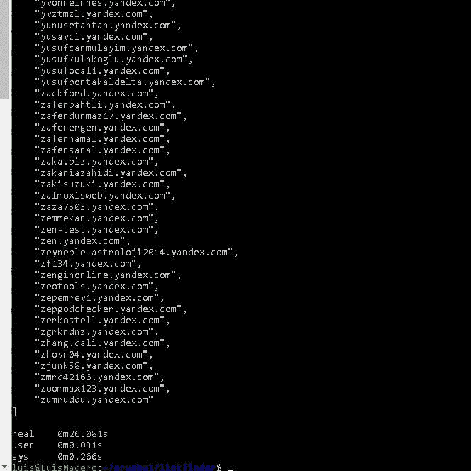

非常感谢你给我这次写作的机会！希望你觉得有用！！！