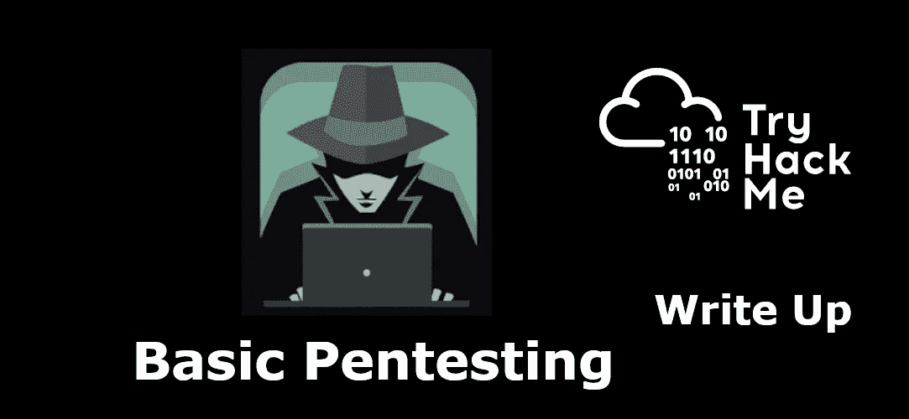
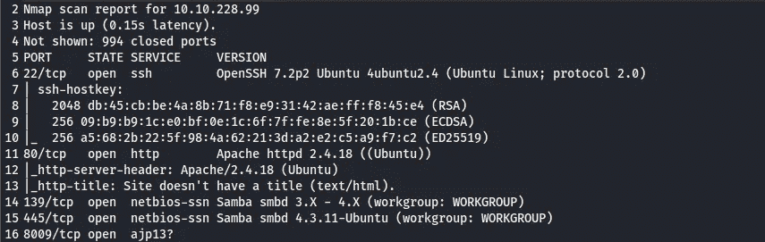
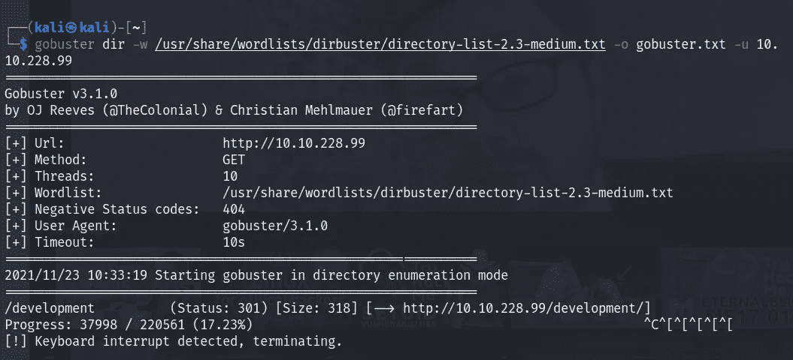
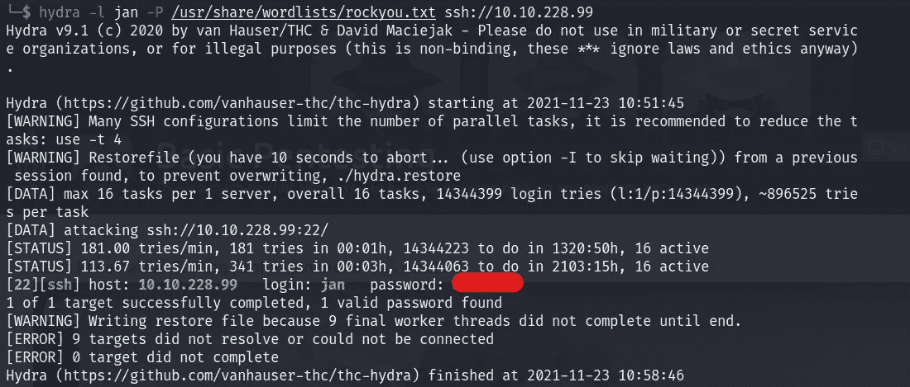
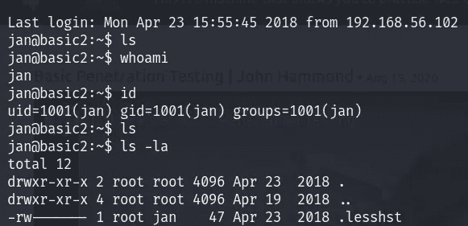
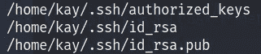
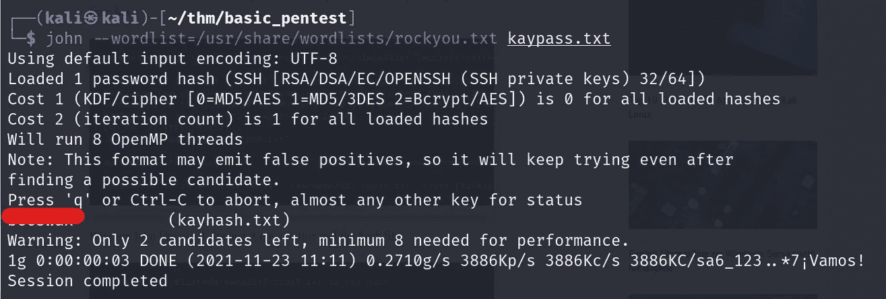
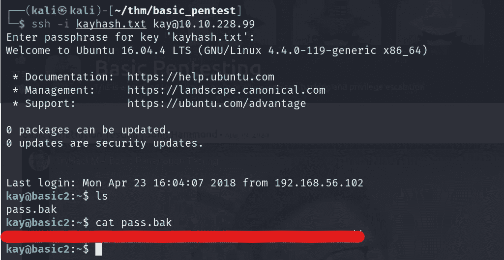

# TryHackMe:基本测试

> 原文：<https://infosecwriteups.com/thm-basic-pentesting-39b7271cf802?source=collection_archive---------2----------------------->

# 介绍

大家好。！拿着我的第一份走查报告。所以请忽略任何错误和语法/拼写，lol XD。

因为这是我人生中的第一个 CTF，所以我决定从 YouTube 上看一些教程。我知道约翰·哈蒙德上传了他们的视频。所以我跳到那里写&，看了几个，这样当我看的时候，我就不记得他是怎么解决的了。我在看了 3-4 天的视频后尝试了一下。但我确实记得一些关键点。

## 不取则长，所以二话没说，让我们根入 ***根入***



# Web 应用程序测试和权限提升

所以首先对于初始/第一阶段，让我们从每个人开始的事情开始: **Nmap**

```
nmap -sC -sV -oN nmap <ip>
```



不好意思，忘了拿 nmap ssp

现在到了一些**目录蛮**强迫的时候了:

```
gobuster dir -w <wordlist> -u <ip>
```



如您所见，有一个名为' **development** 的目录。

查了一下后，似乎没什么用，不如我们再进一步。

现在让我们**扫描**主机:为了扫描，我使用 **enum4linux** (是的，我确实记得以前的视频 XD)

```
enum4linux -a <ip> | tee enum4linux.txt
```


结果，我们找到了两个用户。

知道用户名后，你会怎么做？

是的，我也这么做了:**暴力强制。**所以我用九头蛇做了同样的事情

```
hydra -p jan -P <wordlist> ssh://<ip>
```



宋承宪 _ 一月

尝试连接…



在搜索了一些资料后，我们发现在/home 目录下有另一个用户的目录，即 kay。

环顾四周，没有发现任何有用的东西(但我记得这里一定有什么东西)。比我用 [linePEAS](https://github.com/carlospolop/PEASS-ng/tree/master/linPEAS) (一个检测 PrivEsc 的工具)&发现的这个:



然后，我很快搜索相同的，并记得呀，我错过了这一点。

快速复制了。ssh 文件到本地机器，并尝试与用户“kay”连接

```
ssh -i id_rsa kay@<ip>
```

现在它要求输入密码:(

为此，ssh2john 将派上用场。

```
-> ssh2john id_rsa > kayssh-> john --wordlist=<wordlist> kayssh
```

还有沃利亚。！，我们找到了密码:



尝试登录……成功……恭喜！！



这个房间就这些了。

如果你喜欢这个，那就试试支持我的分享并鼓掌吧:)

结束，和平🤞

| [房间链接](https://tryhackme.com/room/basicpentestingjt) | [推特](http://twitter.com/namx05) | [GitHub](http://github.com) |