# [THM]赏金黑客报道

> 原文：<https://infosecwriteups.com/thm-bounty-hacker-writeup-3e680beea044?source=collection_archive---------5----------------------->

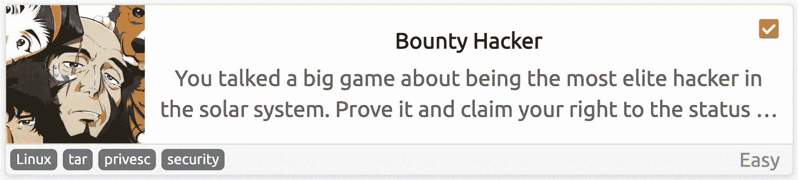

[Bounty Hacker](https://tryhackme.com/room/cowboyhacker) 是 TryHackMe 中一个简单的机器，我们将使用基本的枚举和蛮力进入。

首先，让我们用 [MASSCAN](https://github.com/robertdavidgraham/masscan) 看看哪些端口是打开的:

```
masscan -p- --rate 1000 10.10.144.135
```

*   `-p-`:枚举所有 TCP 端口，从 1 到 65535
*   `--rate`:每秒向主机发送多少数据包

> 我更喜欢使用 MASSCAN 来枚举端口，因为它比 nmap 快得多，所以在发现端口后，我们可以使用 nmap 来单独检查这些端口中运行的服务。

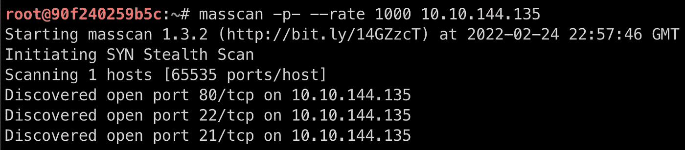

质量扫描输出

发现开放端口后，我们可以使用 [nmap](https://nmap.org/) 来检查服务器中正在运行哪些服务:

```
nmap -p21,22,80 -Pn -sV 10.10.144.135
```

*   `-p`:我们要扫描的港口
*   `-Pn`:跳过主机发现，将所有主机视为在线
*   `-sV`:检查服务/版本信息

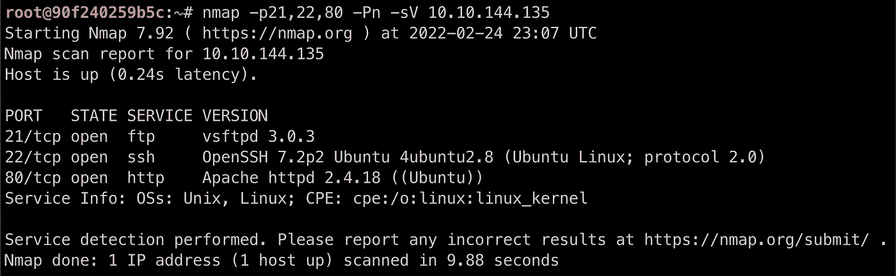

从输出中，我们看到**端口 80** 是打开的，并且它正在运行一个 http 服务，但是我找不到任何能带我们到那里的东西，所以我们现在就把它留下。

另一个值得检查的开放端口是**端口 21** ，它正在运行 [FTP](https://en.wikipedia.org/wiki/File_Transfer_Protocol) 服务，所以让我们检查一下[匿名登录](https://book.hacktricks.xyz/pentesting/pentesting-ftp#anonymous-login)是否被启用:

```
ftp 10.10.144.135
```

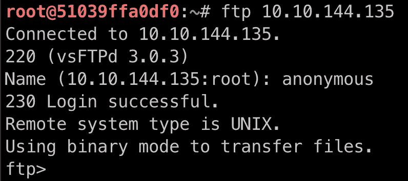

我们可以使用命令`ls -la`来列出内容:

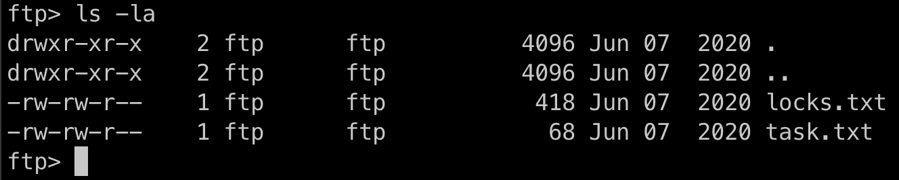

可用目录中有两个文件，所以我们可以使用`mget`来下载它们:

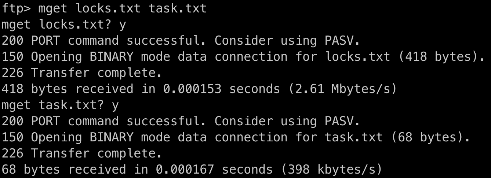

如果我们阅读文件，我们可以看到`locks.txt`看起来像一个密码列表，而`task.txt`似乎是来自一个名叫`lin`的人的消息。

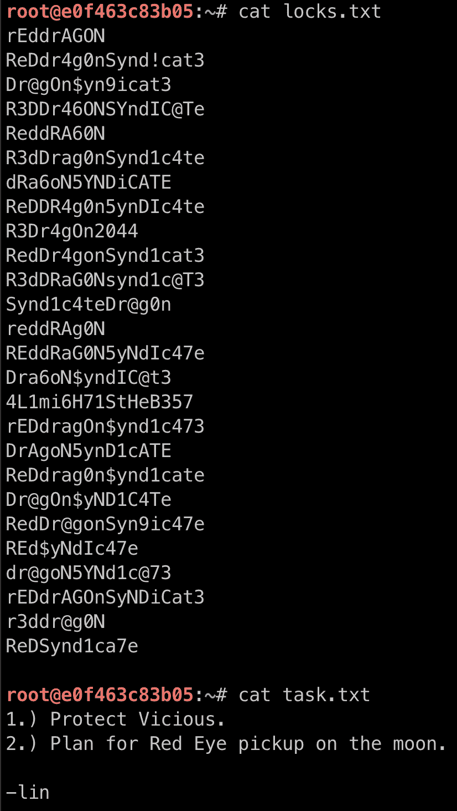

# 接近机器

我们可以从机器中的一个问题来假设下一步是什么:

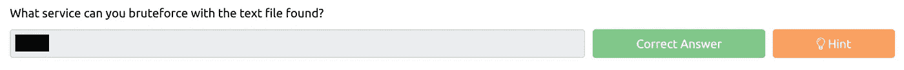

好吧，唯一有意义的其他可用服务是 [SSH](https://en.wikipedia.org/wiki/Secure_Shell) ，运行在**端口 22** 上。在这种情况下，我们可以使用名为 [Hydra](https://github.com/vanhauser-thc/thc-hydra) 的工具:

```
hydra -l lin -P locks.txt 10.10.144.135 ssh
```

*   `-l`:用于登录的用户名(在这种情况下，我们可以假设`lin`是来自`task.txt`笔记的名字)
*   `-P`:包含要测试的密码列表和用户名的文件

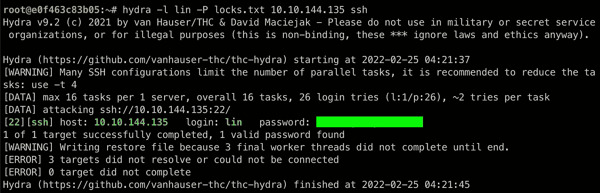

九头蛇产量

有了用户名和密码，让我们使用 SSH 连接到服务器:

```
ssh lin@10.10.144.135
```

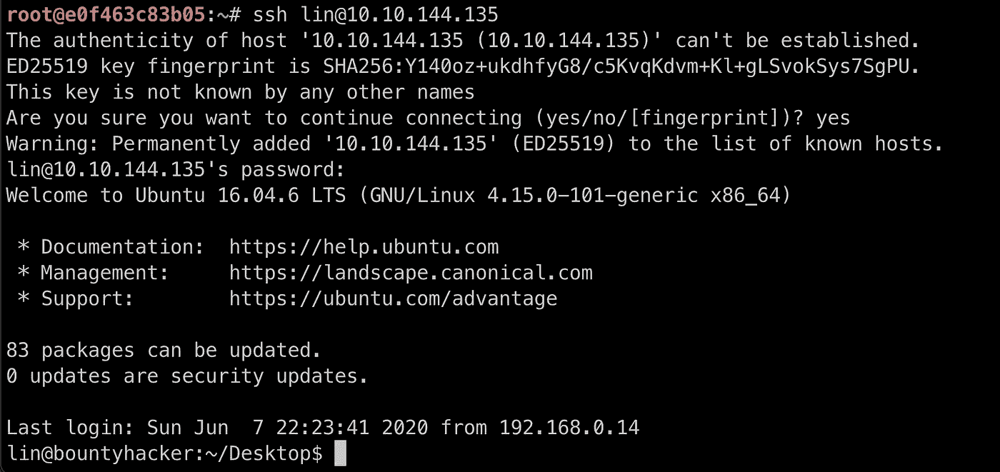

机器访问✅

现在，我们可以在目录和文件中查找用户标志:

```
cat /home/lin/Desktop/user.txt
```

# 权限提升

在寻找权限提升向量时，我总是测试的第一件事是列出用户的权限，并检查当前用户是否可以作为 root 用户执行任何操作:

```
sudo -l
```

*   `-l`:列出用户的权限

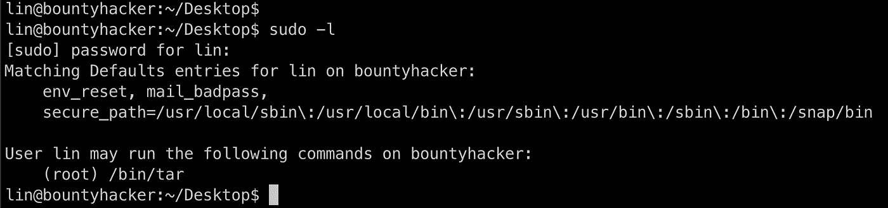

似乎用户`lin`被允许在这台机器上以 root 用户身份运行`tar`命令。我们可以使用 [GTFOBins](https://gtfobins.github.io/gtfobins/tar/#sudo) 来检查我们如何利用它:

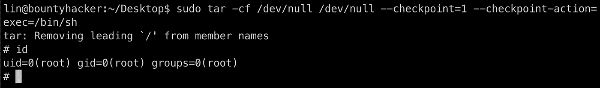

特权升级✅

> 来自 GTFOBins:如果二进制文件在`sudo`之前被允许作为超级用户运行，它不会放弃提升的特权，并且可以用于访问文件系统、升级或维护特权访问。

现在我们可以读取根标志:

```
cat /root/root.txt
```

# 结论

这是一个有趣的机器，我认为它有一个很好的和聪明的方法来教我们如何使用 Hydra，而不是让我们尝试用成千上万的密码长预制单词表。干得好(谢谢)！

Infosec Writeups 团队刚刚完成了我们的第一次虚拟网络安全会议和网络活动。我们有 16 位出色的演讲者，他们主持了非常有价值和鼓舞人心的会议。要查看演讲者和主题列表，请点击此处。

[](https://iwcon.live/) [## IWCon2022 — Infosec 书面报告虚拟会议

### 与世界上最优秀的信息安全专家建立联系。了解网络安全专家如何取得成功。将新技能添加到您的…

iwcon.live](https://iwcon.live/)