# 布鲁克林九九报道

> 原文：<https://infosecwriteups.com/thm-brooklyn-nine-nine-writeup-c145a3a3491c?source=collection_archive---------4----------------------->

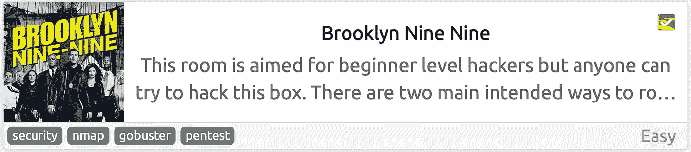

[Brooklyn Nine Nine](https://tryhackme.com/room/brooklynninenine) 是 TryHackMe 中的一个简单机器，我们将在其中使用基本的枚举，并对隐写术进行一些研究。

首先，让我们用 [MASSCAN](https://github.com/robertdavidgraham/masscan) 看看哪些端口是打开的:

```
masscan -p- --rate 10000 10.10.115.97
```

*   `-p-`:枚举所有 TCP 端口，从 1 到 65535
*   `--rate`:每秒向主机发送多少数据包

> 我更喜欢使用 MASSCAN 来枚举端口，因为它比 nmap 快得多，所以在发现端口后，我们可以使用 nmap 来单独检查这些端口中运行的服务。

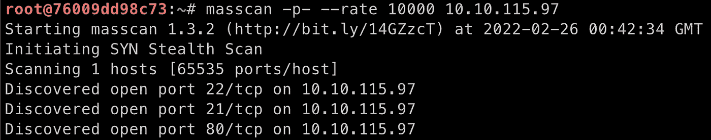

质量扫描输出

发现开放端口后，我们可以使用 [nmap](https://nmap.org/) 来检查服务器中正在运行哪些服务:

```
nmap -p21,22,80 -Pn -sV 10.10.115.97
```

*   `-p`:我们要扫描的港口
*   `-Pn`:跳过主机发现，将所有主机视为在线
*   `-sV`:检查服务/版本信息

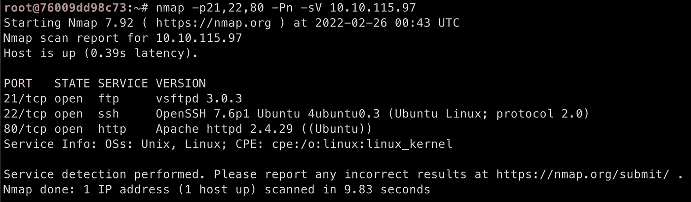

nmap 输出

从输出中，我们看到端口 **80** 是打开的，它正在运行 http 服务，所以让我们在浏览器上检查一下。该页面只是一个图像，但如果我们检查源代码，我们会发现一个有趣的注释:

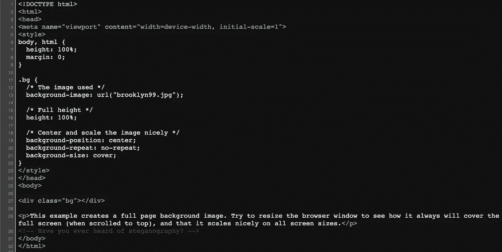

> [隐写术](https://en.wikipedia.org/wiki/Steganography)是将一条信息隐藏在另一个对象内的技术，例如[在音频文件中隐藏一段文本](https://en.wikipedia.org/wiki/Steganography#Hiding_an_image_within_a_soundfile)，所以我们只有在查看音频文件的声谱图时才能看到消息。


在这种情况下，我们在源代码中引用了上面的图像，所以我们可以假设我们应该研究它。让我们下载图片:

```
wget [http://10.10.115.97/brooklyn99.jpg](http://10.10.115.97/brooklyn99.jpg)
```

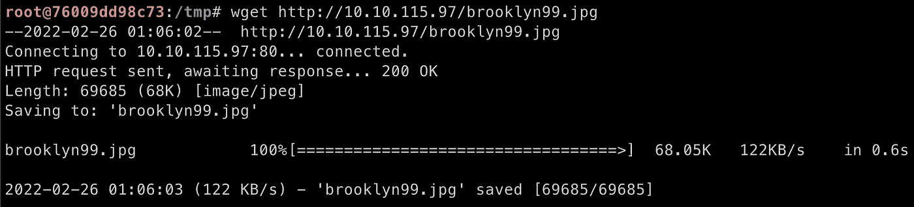

# 接近机器

通常，如果我们有密码，我们可以从图像中提取信息。在这种情况下，我们没有密码，但幸运的是，有一个非常好的(而且非常快)工具，我喜欢用它来应对隐写术挑战，它叫做 [Stegseek](https://github.com/RickdeJager/stegseek) 。

我们可以使用 **rockyou.txt** 单词表(一个*实际上是*大的密码列表)来破解这个密码并检索消息:

```
stegseek brooklyn99.jpg /usr/share/wordlists/rockyou.txt
```

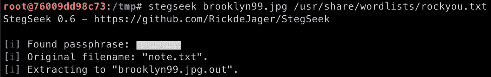

Stegseek 输出

Stegseek 在这个图像中找到了另一个文件，让我们来读一下:


嘿！因为我们有 Holt 的密码，我们可以检查我们是否能够使用 [SSH](https://en.wikipedia.org/wiki/Secure_Shell) 用这些凭证登录机器:

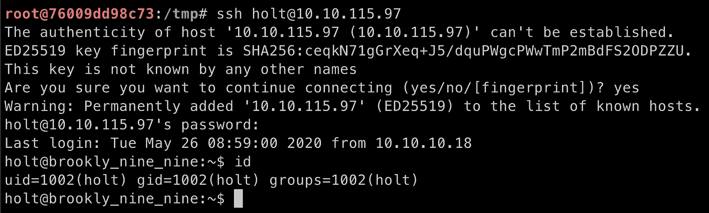

机器访问✅

现在，我们可以在目录和文件中查找用户标志:

```
cat /home/holt/user.txt
```

# 权限提升

在寻找权限提升向量时，我总是测试的第一件事是列出用户的权限，并检查当前用户是否可以作为 root 用户执行任何操作:

```
sudo -l
```

*   `-l`:列出用户的权限

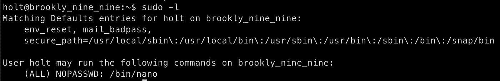

似乎用户`holt`被允许在这台机器上作为根用户运行`nano`命令。我们可以使用 [GTFOBins](https://gtfobins.github.io/gtfobins/nano/#sudo) 来检查我们如何利用它:

```
sudo nano
^R^X
reset; sh 1>&0 2>&0
```

> `^R`表示`ctrl+r`，而`*^X*`表示`*ctrl+x*`
> 
> 来自 GTFOBins:如果二进制文件在`*sudo*`之前被允许作为超级用户运行，它不会放弃提升的特权，并且可以用于访问文件系统、升级或维护特权访问。

所以在终端中，我们使用:

```
sudo nano
```

Nano 是一个文本编辑器，所以当我们执行二进制文件时，会出现一个界面，现在我们可以按住`ctrl+r`:

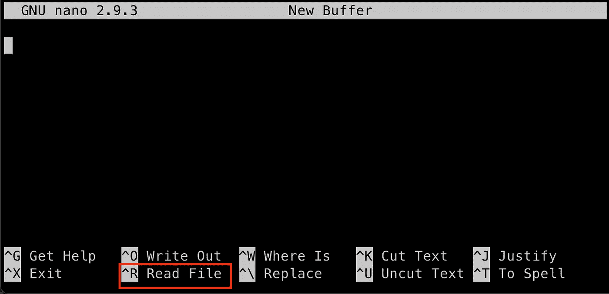

然后`ctrl+x`:

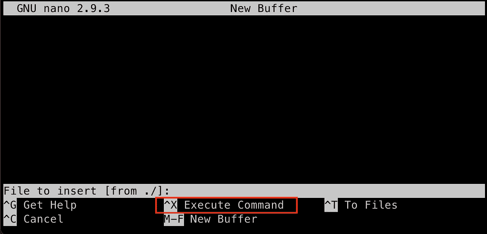

现在我们只需要编写命令`reset; sh 1>&0 2>&0`:

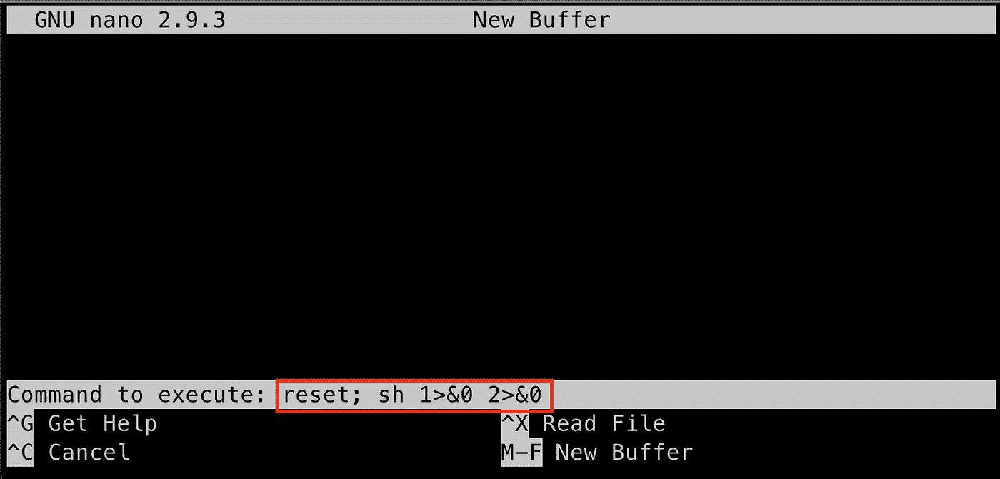

只需点击几次回车键，屏幕就会清晰一点，我们就有了 root！

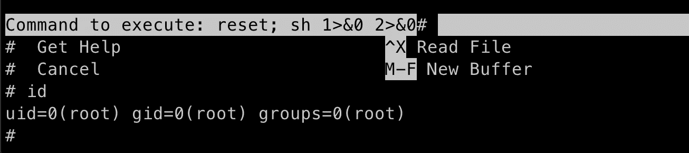

特权升级✅

现在我们可以读取根标志:

```
cat /root/root.txt
```

# 结论

首先，布鲁克林九九是我最喜欢的电视节目之一，所以这是一个非常有趣的开发机器。将隐写术加入其中真的很有趣，让我们能够学习和使用一些我们在 CTFs 中不经常看到的不同东西。

九-九！

Infosec Writeups 团队刚刚完成了我们的第一次虚拟网络安全会议和网络活动。我们有 16 位出色的演讲者，他们主持了非常有价值和鼓舞人心的会议。要查看演讲者和主题列表，请点击此处。

[](https://iwcon.live/) [## IWCon2022 — Infosec 书面报告虚拟会议

### 与世界上最优秀的信息安全专家建立联系。了解网络安全专家如何取得成功。将新技能添加到您的…

iwcon.live](https://iwcon.live/)