# [THM] Dav 报道

> 原文：<https://infosecwriteups.com/thm-dav-writeup-a2e843a697ee?source=collection_archive---------1----------------------->

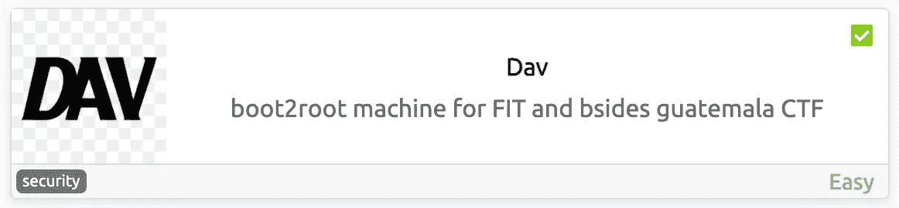

[Dav](https://tryhackme.com/room/bsidesgtdav) 是 TryHackMe 中的一个简单机器，我们将在其中使用基本枚举，了解更多关于 [WebDAV](https://en.wikipedia.org/wiki/WebDAV) 的信息，以及如何探索它以获得对服务器的访问。

通过在浏览器中访问服务器，我们可以看到默认的 Apache 页面，所以这里没有什么要做的:


http://10.10

接下来，让我们使用 [MASSCAN](https://github.com/robertdavidgraham/masscan) 查看哪些端口是打开的:

```
masscan -p- --rate 10000 10.10.45.24
```

*   `-p-`:枚举所有 TCP 端口，从 1 到 65535
*   `--rate`:每秒向主机发送多少数据包

> 我更喜欢使用 MASSCAN 来枚举端口，因为它比 nmap 快得多，所以在发现端口后，我们可以使用 nmap 来单独检查这些端口中运行的服务。

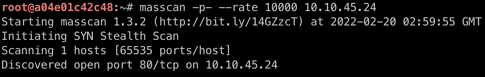

质量扫描输出

从输出中，我们看到只有**端口 80** 是打开的，所以现在我不会运行 nmap，相反，让我们通过用 [Gobuster](https://github.com/OJ/gobuster) 枚举目录来检查我们能找到什么:

```
gobuster dir -w /usr/share/wordlists/seclists/Discovery/Web-Content/directory-list-2.3-medium.txt -t 50 -u 10.10.45.24
```

*   `dir`:告诉 Gobuster 枚举目录
*   `-w`:用于枚举主机的单词表，我通常使用 [SecLists](https://github.com/danielmiessler/SecLists) 中的这个
*   `-t`:要用多少根线
*   `-u`:目标网址

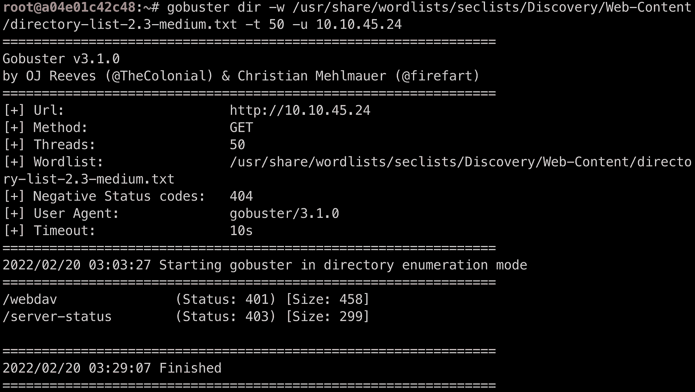

Gobuster 输出

## 接近机器

从上面我们可以看到，Gobuster 找到了一个有趣的目录:`/webdav`，所以我们在浏览器上查一下:

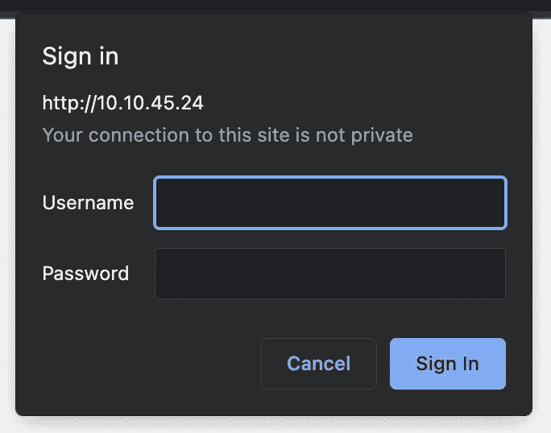

http://10.10.45.24/webdav

> WebDAV 意味着 Web 分布式创作和版本控制，并允许用户在服务器上创建、更改和移动文件，因此您可以将其视为类似 FTP 或 SMB 的东西。由于它与文件管理一起工作，我们可以很快假设我们将需要在不久的将来上传一个反向 shell。

在`/webdav`目录中，我们看到我们需要凭证来访问该页面。因为我总是试图避免暴力攻击，所以我总是检查的第一件事是看我正在探索的任何东西是否有默认凭证来为我节省一些(通常是很多)时间。

对`webdav default credentials`的基本搜索将把我们带到[这个页面](http://xforeveryman.blogspot.com/2012/01/helper-webdav-xampp-173-default.html)，并给我们默认的凭证:`wampp:xampp`。

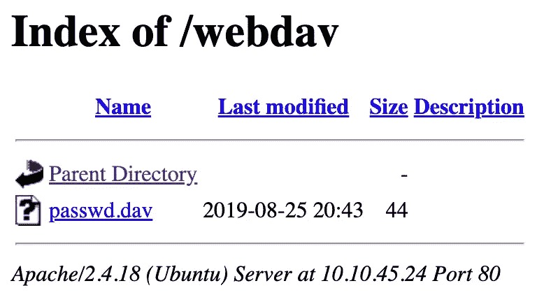

http://10.10.45.24/webdav/

我们可以看到服务器中只有一个文件，`passwd.dav`:


http://10 . 10 . 45 . 24/webdav/passwd . dav

我们可以尝试用[开膛手约翰](https://github.com/openwall/john)破解它，然而，在这一点上，我看不出有这个密码有多大用处，因为没有其他服务可以探索，比如 SSH 或 FTP。

> 只是一个有趣的事实:
> 当我写前一段时，我想“嗯，这个哈希可能是我以前使用的密码，让我检查一下…”:

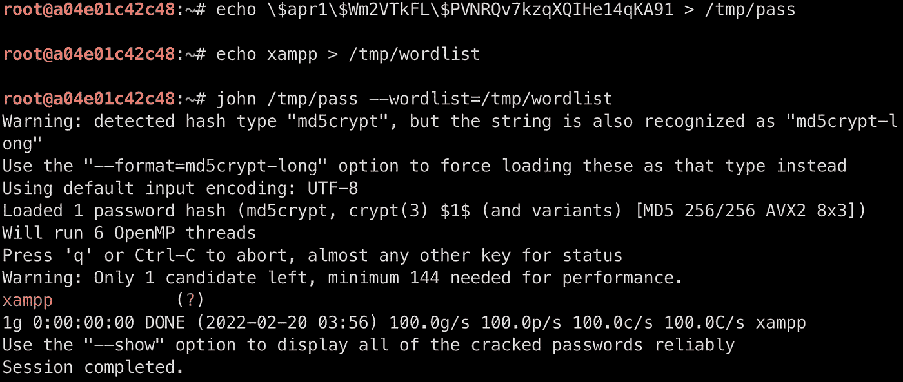

…我是对的！只是证明我的理论

所以现在我们知道我们有地方可以上传文件并阅读它们，希望我们也可以执行它们。

进一步研究后，我在 [HackTricks](https://book.hacktricks.xyz/) 中发现了一些利用 WebDAV 的方法。其中之一是通过使用一个叫做[尸](https://book.hacktricks.xyz/pentesting/pentesting-web/put-method-webdav#cadaver)的工具，这是一个用于 Unix 的 CLI WebDAV 客户端。要使用它，我们只需说出主机和路径:

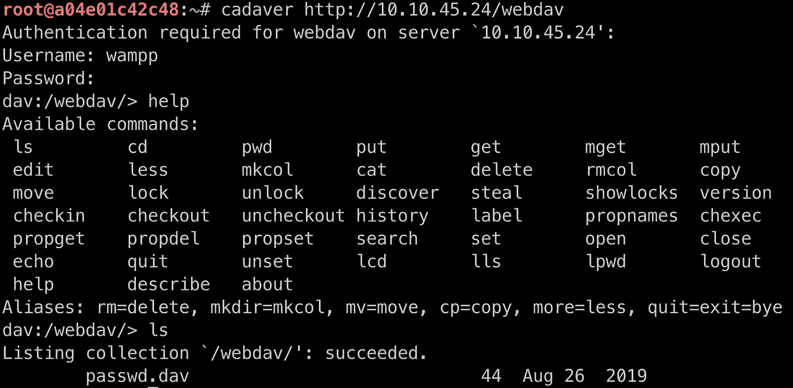

使用尸体

用`help`列出命令，我们可以找到一个`put`命令，所以我们应该能够上传一个反向 shell 并访问机器。

对于 PHP 反壳，我一般用[这个](https://github.com/pentestmonkey/php-reverse-shell)。所以我下载它，替换 IP 和端口，然后发送到服务器:

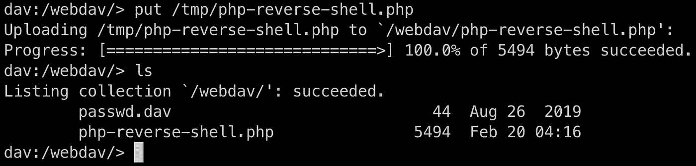

上传反向外壳

如果我们再次检查文件的索引，现在我们看到我们的脚本上传了:

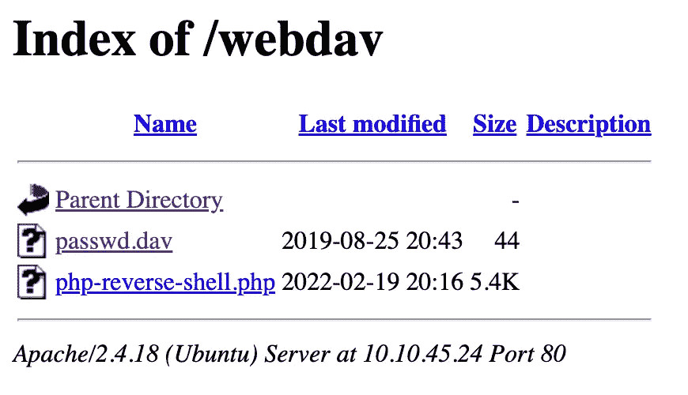

http://10.10.45.24/webdav/

因此，在单击脚本文件之前，让我们开始监听 PHP 脚本中使用的端口中的连接:

```
nc -lvnp 1123
```

现在，我们可以单击该文件并检查连接是否已建立:

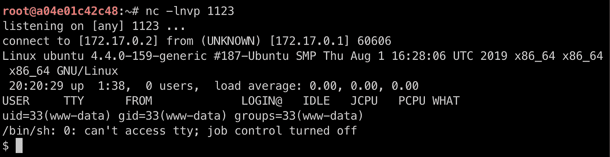

机器访问✅

我们可以在目录和文件中查找用户标志:

```
cat /home/merlin/user.txt
```

# 权限提升

在寻找权限提升向量时，我总是测试的第一件事是列出用户的权限，并检查当前用户是否可以作为 root 用户执行任何操作:

```
sudo -l 
```

*   `-l`:列出用户的权限

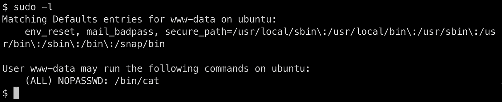

列出用户的权限

嗯，`cat`正是我们需要阅读的那根旗帜:

```
sudo cat /root/root.txt
```

# 结论

这是一台有趣而简单的机器。多了解一些 WebDAV 以及如何使用它是一件很酷的事情。一个终身难忘的教训是:尽快更改默认凭据！

# 🔈 🔈Infosec Writeups 正在组织其首次虚拟会议和网络活动。如果你对信息安全感兴趣，这是最酷的地方，有 16 个令人难以置信的演讲者和 10 多个小时充满力量的讨论会议。[查看更多详情并在此注册。](https://iwcon.live/)

[](https://iwcon.live/) [## IWCon2022 - Infosec 书面报告虚拟会议

### 与世界上最优秀的信息安全专家建立联系。了解网络安全专家如何取得成功。将新技能添加到您的…

iwcon.live](https://iwcon.live/)