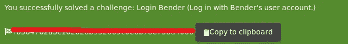
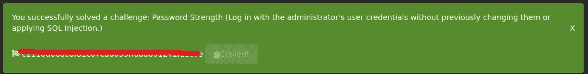
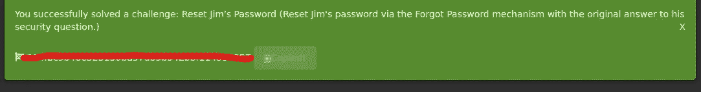
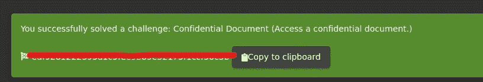
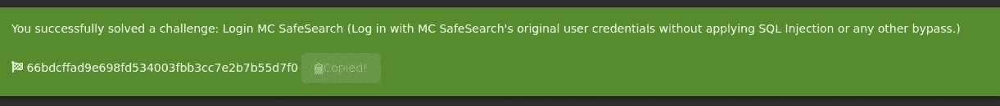

# THM- OWASP 果汁店-第 1 部分

> 原文：<https://infosecwriteups.com/thm-owasp-juice-shop-98dd77aa8a0f?source=collection_archive---------2----------------------->

大家好，

今天我在尝试一个最新的盒子，即 OWASP 果汁店。


OWASP 果汁店

众所周知，OWASP juice shop 是一个离线的 web 应用程序，用于学习和了解各种攻击的工作原理。让我们在 TryHackme 中解决其中的一些问题

第一项挑战是侦察。在这里，我们需要访问应用程序，并找出他们给出的 3 个问题的答案

管理员的电子邮件地址是什么？

> 简单一点…-几乎与用户名相同(答案可见于框中的其他挑战)

什么参数用于搜索？

> 试试搜索栏里的东西，你就能看到答案

吉姆在他的评论中提到了什么节目？

> 根据提示，我们可以查看吉姆的评论，谷歌一下，我们可以得到答案(热门电视节目)

在本节中，我们将测试 SQL 注入技术，在本例中
我们需要使用登录表单字段来注入 SQL 命令

```
‘ or 1=1 —
```

一旦我们按照流程拦截打嗝的流量，得到下面的标志(答案)


下一个任务，我们需要使用 burp 作为 bender@juice-sh.op 登录，这是我们的下一个标志。



损坏的身份验证:

第一个任务是破解管理员使用管理员密码使用打嗝，我们得到了旗帜



第二个任务是破解吉姆的密码

老实说，我尝试了多次，最后尝试使用打嗝，终于得到了一面旗帜。



此任务与敏感数据泄露相关。第一个任务与访问非公共目录以获取标志相关。



下一个任务是访问 Mc 安全搜索帐户。答案就在提示里。拿到旗子了。



第三项任务与有害空字节相关。

有害空字节是一种通过添加空值来绕过限制策略的注入类型。在此任务中，我们不允许下载文件。因此我们添加了一个空字节来绕过这个限制。

[http://10 . 10 . 68 . 219/FTP/package . JSON . bak %](http://10.10.68.219/ftp/package.json.bak)2500 . MD

我成功地拿到了旗子，我将在下一部分继续他们。

感谢你阅读这篇文章…

注意:*作为 10 月 PentesterLab 赠品*的一部分提交，在文章末尾。