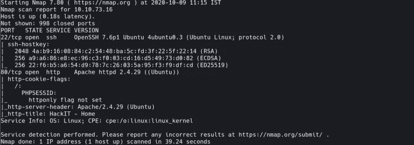
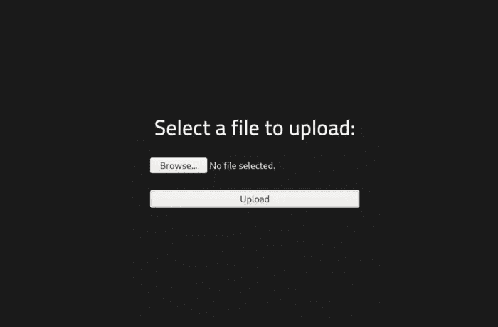
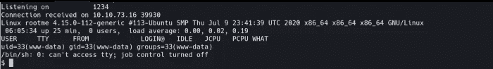
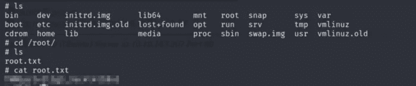

# TryHackMe: RootMe

> 原文：<https://infosecwriteups.com/thm-rootme-94a48def69d3?source=collection_archive---------1----------------------->


## 简介:

你好，绅士！正如你从标题中知道的，这是关于什么的。

**所以让我们根**

## 任务 1:部署机器

```
Q1\. Deploy the machine.
```

## 任务 2:侦察

为了让事情变得更容易，我过去常常导出我的 IP 以节省时间

```
export IP=10.10.154.15
```

从现在开始，每次你想调用 ip，就用 **$IP**

现在，让我们开始扫描:—

```
nmap -sV -oN nmap $IP
```



nmap 结果

通过扫描，我们得到了 2 个打开的端口，即

**80**(**http**)&22(**ssh**)

让我们四处看看 **HTTP (** 因为我们没有任何用户名和他们的凭证为 **SSH** 连接 **)** ，我们得到了:

```
http://$IP
```


http (80)

什么都没有，只是一个简单的页面。让我们做一些目录扫描，

```
gobuster dir -u $IP -w <wordlist>I used 'directory-list-lowercase-2.3-medium.txt'
```

发现了一些有趣的页面，其中一个是:



http://$IP/panel

## 任务 3:获得外壳

所以在**/面板**上有一个上传功能。

于是上传了我的 **rev_shell.php** 代码，用 **nc** 在后台运行，但是没有结果(没有得到 rev-shell):(用 diff ext 即 png，jpg，html，php5 试了一下，成功了。它反映在网页上。

随着我的 rev_shell.php5 上传完毕，现在是时候访问/运行它了。

现在要访问/运行同一个文件该怎么办呢？

我们在 gobuster 的结果中发现了 **/uploads** 目录。

因此，通过 http://$IP/uploads(并点击所需的文件)或 http://$ IP/uploads/rev _ shell . PHP(通过在 URL 本身中指定文件)来访问文件

**但是**，在此之前不要忘记运行一个监听器&，为此我们使用 **netcat。**

```
nc -lnvp 4444
```

现在你已经完成了，让我们通过之前讨论过的链接运行 php 脚本。

是的，我们得到了 rev-shell B-)



反向外壳

在此之后，尝试了一些正常的冲浪，即在 **/home** 中搜索旗帜，但没有结果。在别的什么地方。然后我记得这个命令名为' **find** '(顾名思义，它有助于查找文件) :

```
find / -name user.txt 2> /dev/null
```

还有躲猫猫。！

## 任务 4:权限 Esc

现在让我们检查一下特权 Esc 策略。

1.  我试过`sudo -l`命令，没有运气:(
2.  已检查`SUID`文件:

```
find / -type f -perm -04000 -ls 2>/dev/null
```

瞧啊。！我们有一份文件。有 python，我们可以作为 sudo 运行。

->在 [GTFObins](https://gtfobins.github.io) 上检查，

->运行脚本

```
python -c 'import os; os.execl("/bin/sh", "sh", "-p")'
```

->轰，我们是**根。**并得到了 root.txt 标志:)



就这样，我们成功地完成了这个房间。做这项挑战是一次奇妙的经历。希望你喜欢，然后考虑鼓掌:)

> 链接:

|| [房间](https://tryhackme.com/room/rrootme) || [推特](https://twitter.com/namx05) || [GitHub](https://github.com/namx05) ||

[](https://tryhackme.com/room/rrootme) [## TryHackMe | RootMe

### 一个新手用的 ctf，可以 root 我吗？

tryhackme.com](https://tryhackme.com/room/rrootme)