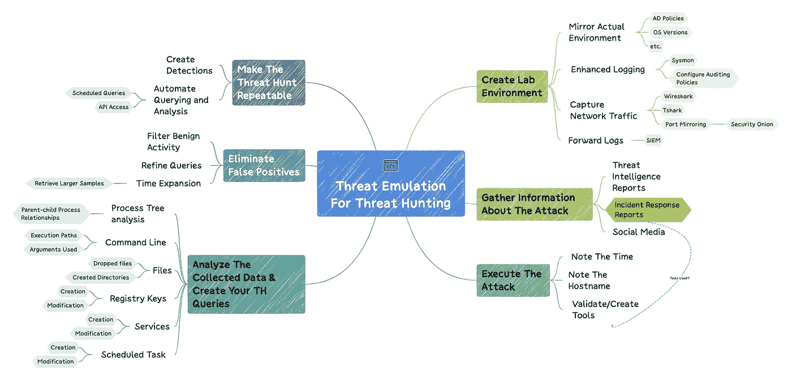
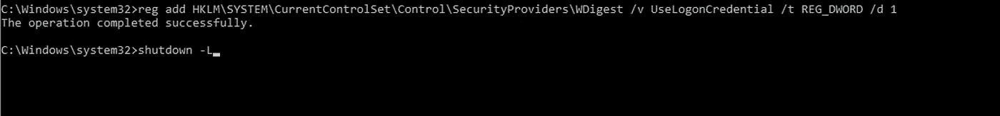
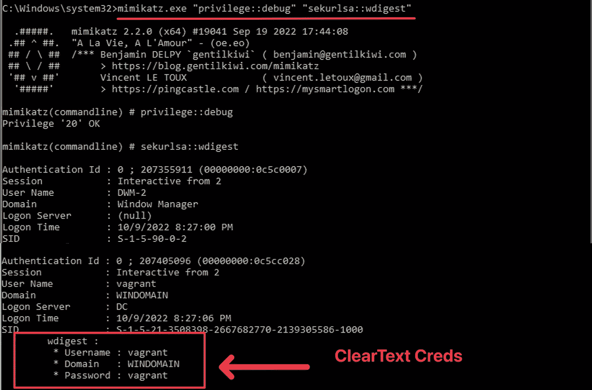
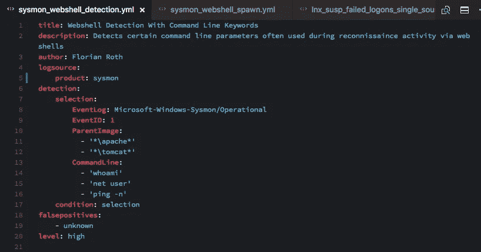
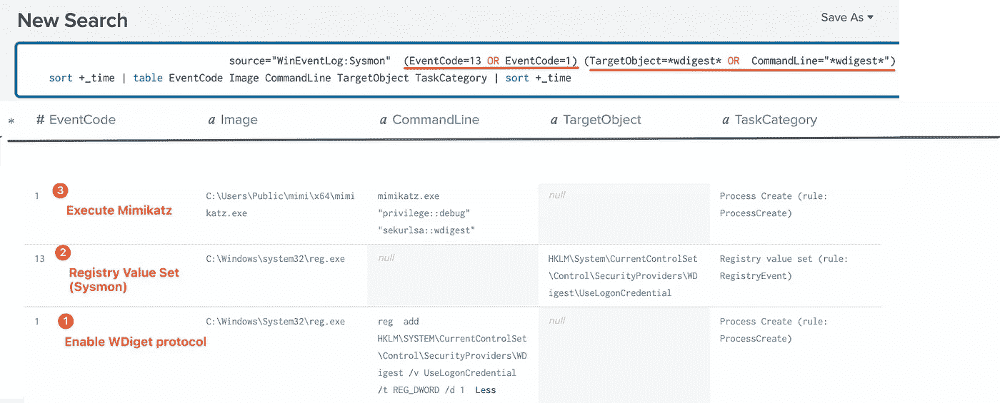
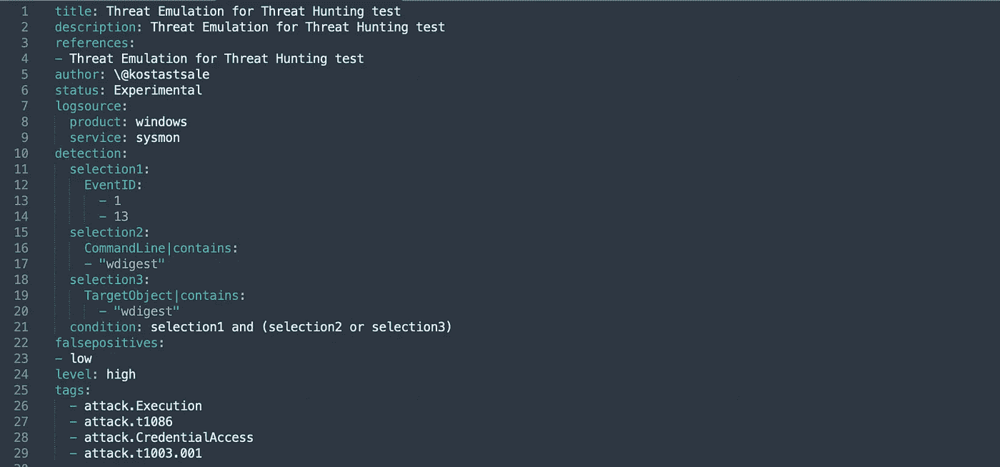
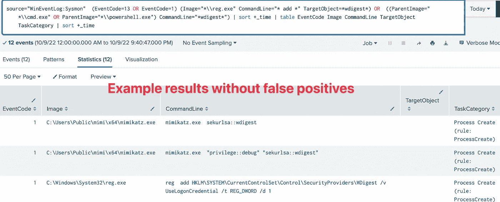

# 威胁搜寻系列:使用威胁模拟进行威胁搜寻

> 原文：<https://infosecwriteups.com/threat-hunting-series-using-threat-emulation-for-threat-hunting-f7ccaa4b85e5?source=collection_archive---------0----------------------->

这篇文章将展示如何使用威胁模拟来寻找威胁。我经常使用威胁模拟来了解攻击执行后留下的证据。

虽然威胁模拟有许多用例，但这篇文章将重点关注模拟攻击者的技术，以帮助寻找威胁。威胁模拟是一种强大的工具，可用于搜索威胁。安全团队可以通过在实验室环境中模拟攻击者的技术来生成必要的遥测和测试安全解决方案。这个过程可以帮助您了解攻击者的心态和方法，从而让您更有效地寻找威胁。

作为一个威胁猎人，寻找可用的资源来寻找敌对技术有时会很困难。一些资源可能是与攻击相关的信息(想想威胁情报/事件响应报告)和遥测数据(日志)。在这种情况下，您必须进行自己的研究，并采用威胁模拟来帮助生成必要的数据。

**重要**

> *在你开始模拟攻击和挖掘日志之前，最好先确定你在找什么和你研究的目的。*

有必要建立一个实验室环境来协助重现攻击场景，并收集生成的遥测数据。然后，您可以分析结果并寻找生产环境中的独特攻击指标(IOA)。

# 成功模拟的步骤

在模拟攻击之前，有许多因素需要考虑。我将模拟的各个阶段划分如下:

1.  创建一个实验室环境。
2.  收集关于攻击的信息
3.  执行攻击
4.  分析收集的数据并创建您的 TH 查询
5.  消除误报
6.  使威胁搜索可重复

> 这一节将回顾这些关键步骤，并对每个步骤进行高层次的解释。我还将包括一个例子来巩固这个概念。示例用例将支持 Wdigest 协议提取明文凭证。

以下是以下过程的思维导图:

# **1。创建测试环境**

**重要**

> 只是在这里澄清一下，这不会是一个恶意软件实验室。尽管仍然建议将实验室环境与实验室外的任何其他主机隔离开来，但这将是一个重现攻击的测试环境。

在构建测试环境时，考虑使用与您的组织环境相匹配的策略。例如，请求 IT 部门将黄金映像安装在实验室的一台主机上。此外，在 windows AD 环境中，您可以使用相同的组策略，例如:

*   禁用 LDAP 签名
*   禁用 SMB 签名
*   禁用 NLA
*   等等。

镜像您的测试环境不是必需的；但是，它可以使威胁模拟的结果与您稍后要搜索的网络更加相关。

另一个重要方面是主机的日志记录能力。为了最大限度地利用模拟，主机应该记录所有活动，启用增强的日志记录将有助于这一点。增强日志功能的一个好方法是使用 Sysmon。除了默认的 Windows 事件日志之外，Sysmon 还可以提供大量的详细信息。此外，所有日志都应该转发到一个集中的位置，以便于分析。您可以使用 ELK stack 或任何您能得到的其他解决方案。

你应该收集哪些日志？

虽然端点遥测可能是大多数情况下最相关的数据源，但在开发恶意通信模式检测时，网络数据也很有用。像 Suricata 这样的入侵检测系统(IDS)可以帮助创建网络检测，而 Zeek 这样的解决方案可以提供详细的网络可见性。因此，获取网络流量可能是有益的。

您可以使用 Wireshark 或 T-Shark 等开源软件捕获单个端点上的 web 流量。有更有效的方法来捕获网络流量，但这种方法应该足以让事情开始。

最后，如果您想评估您的组织正在使用的安全解决方案，最好将其包括在您的实验设置中。如果默认防御策略在模拟过程中阻止工具，请确保创建仅检测策略。

通过整合上述所有配置，您可以重现攻击，并观察它们对您组织的生产环境的潜在影响。同时，生成的遥测将帮助您研究各种攻击和攻击路径。下面，我提供了一些建立实验室环境的资源:

—预制的实验室环境:

*   检测实验室:[https://detection Lab . network/](https://detectionlab.network/)
*   Splunk 攻击范围 v 2.0:[https://www . splunk . com/en _ us/blog/security/introducing-splunk-Attack-Range-v2-0 . html](https://www.splunk.com/en_us/blog/security/introducing-splunk-attack-range-v2-0.html)

—逐步指南:

*   建立一个用于检测和监控的网络安全家庭实验室:[https://cyberwoxacademy . com/building-a-Cybersecurity-home lab-for-Detection-Monitoring/](https://cyberwoxacademy.com/building-a-cybersecurity-homelab-for-detection-monitoring/)
*   [https://www.cyberhuntingguide.net/creating-homelab.html](https://www.cyberhuntingguide.net/creating-homelab.html)
*   带 PowerShell 的活动目录主页实验室(2022 指南):[https://system weakness . com/active-Directory-Home-Lab-w-PowerShell-2022-Guide-a 87311182 ab 2](https://systemweakness.com/active-directory-home-lab-w-powershell-2022-guide-a87311182ab2)

**用例示例:**

*   设置和使用检测实验室

# **2。收集关于攻击的信息**

下一步是收集尽可能多的关于重现攻击场景所需工具的信息。你可以使用 OSINT 收集尽可能多的信息。即使只有高层次的信息可用，每个小提示都有帮助。例如，您可能只会在威胁情报报告中发现攻击的内容，以及使用后的结果或最终目标。了解结果会在稍后的数据分析步骤中有所帮助。

如果您感到困惑，可以联系信息安全社区中的其他人。你会惊讶有多少人愿意协助。向他人伸出援手时要有耐心；他们不会按照你的时间表工作。

一些需要考虑的一般问题是:

*   攻击的前提条件是什么？

—特定的应用程序/操作系统版本

—需要存在某种错误配置。

—需要特权。

*   攻击的最终目标是什么？
*   我需要哪些数据源来捕捉活动？

—网络日志

—流程执行日志

—身份验证日志

—以上所有的组合？！

*   我如何发动攻击？

**用例示例:**

red teaming experiments 博客有一篇关于攻击的精彩文章([https://www . ired . team/offensive-security/credential-access-and-credential-dumping/forced-wdigest-to-store-credentials-in-plaintext](https://www.ired.team/offensive-security/credential-access-and-credential-dumping/forcing-wdigest-to-store-credentials-in-plaintext))

先决条件:

*   从 gentilkiwi 的官方 Github 页面下载 mimikatz

# **3。执行攻击**

一旦您获得了必要的信息和工具，就该执行威胁模拟了。在分析阶段，记下攻击的执行时间和主机名会很有用。

值得注意的是，如果您需要外部工具来执行攻击，您应该验证您打算使用的工具的可信度和真实性。人们发布后门工具和脚本的情况有很多。

**用例示例:**

步骤 1:启用 Wdigest 协议，注销并重新登录

步骤 2:使用适当的命令行参数执行 mimikatz

# **4。分析收集的数据并创建您的 TH 查询**

将丰富的日志转发到一个集中的位置，在那里可以对它们进行解析并准备好进行检查，这可以在此阶段节省大量时间。知道了执行时间，您就可以快速启动调查并开始研究数据，而不必担心运行额外的工具。

如果出于某种原因无法做到这一点，您仍然可以使用一些工具从仿真过程中涉及的主机收集信息。其中一些工具是[迅猛龙](https://github.com/Velocidex/velociraptor)和[卡普](https://www.kroll.com/en/insights/publications/cyber/kroll-artifact-parser-extractor-kape)。人们应该熟悉解决同一问题的多种方法。

当捕获和分析网络流量时，像[安全洋葱](https://securityonionsolutions.com/)、 [Arkime、](https://arkime.com/)或 good 'ol Wireshark 这样的工具是这项工作的绝佳人选。

运行攻击后，可以检查已经安装的安全解决方案(如果有的话)。您是否看到任何基于网络或端点的检测？如果是这样，您可以获得关于触发的检测类型的更多信息。不管检测是否被触发，如果您使用 EDR 解决方案，您可以查询围绕执行时间生成的遥测。

假设您发现了一些有趣且独特的攻击指标，下一步就是根据您的 SIEM 或您使用的其他解决方案所支持的语言来设计初始查询。

了解数据集中可能出现的一些指标有助于您识别与攻击执行相关的独特模式。下面的列表并不详尽，但它确实包括了一些我最喜欢的东西:

*   过程树分析

—父子流程关系

*   命令行

—执行路径

—使用的参数

—等等。

*   文件

—丢弃的文件

—目录创建

*   服务/计划任务创建/修改
*   注册表项创建/修改

Sysmon 日志甚至可以包括更多详细的端点信息，这些信息对于创建初始威胁搜索查询非常有用。我最喜欢的增强可见性的 Sysmon 事件 id 有:

*   事件 ID 7:图像已加载
*   事件 ID 8: CreateRemoteThread
*   事件 ID 9: RawAccessRead
*   事件 ID 10: ProcessAccess

Sysmon 事件的完整列表和对上述 Eid 的进一步解释可以在这里找到:[https://learn . Microsoft . com/en-us/sysinternals/downloads/Sysmon # events。](https://learn.microsoft.com/en-us/sysinternals/downloads/sysmon#events.)

在创建查询时，您可能希望研究一下[适马项目](https://github.com/SigmaHQ/sigma)。

***“适马*** *是一种通用的、开放的签名格式，允许您以直截了当的方式描述相关日志事件。”*

许多安全研究人员以适马格式贡献他们的检测规则。您可以将一些规则翻译成您的 SIEM/EDR 特定语言。一旦熟悉了 sigma 规则的编写，这些规则就可以贡献给社区和项目。

适马规则示例:

有许多免费资源可以开始了解适马。 [@nas_bench](https://twitter.com/nas_bench) 在这里整理了一些最好的:[https://github.com/nasbench/SIGMA-Resources](https://github.com/nasbench/SIGMA-Resources)。

**用例示例:**

检测实验室包括一个 Splunk 实例，数据将被转发到该实例。在这个例子中，我使用 Sysmon 日志来检查数据并创建查询。

上述查询的 sigma 规则如下所示:

您可以使用 SOC Prime 提供的[https://uncoder.io/](https://uncoder.io/)在线测试和翻译您的 sigma 规则。

# **5。消除误报**

不幸的是，当你在寻找威胁时，事情并不总是美好的。在收到最初的广泛搜索结果后，出现误报是很常见的。过滤掉良性活动是改进查询的一种方式。假阳性需要一些时间来验证。有时，我会花几个小时分析数据，试图理解噪音(误报)。最终，目标是在不影响查询质量的情况下减少噪音。

**用例示例:**

上面的查询可以进一步细化，以避免任何误报。这是一个例子:

> source = " WinEventLog:Sysmon "(event code = 13 或 event code = 1)(Image = " * \ \ reg . exe " command line = " * add * " target object = * wdi gest *)或((ParentImage="*\\cmd.exe "或 parent Image = " * \ \ powershell . exe ")command line = " * wdi gest * " | sort+_ time | table event code Image command line target object task category | sort+_ time

# **6。使威胁搜索可重复**

现在您已经创建并优化了您的查询，剩下的就是记录您的研究，并与适当的团队和社区共享(如果您选择这样做的话)。这里的目标是创建一个检测，以消除相同的威胁搜索在未来的重复。

如果结果噪音太大，不适合进行新的检测，还有另一种方法可以重复进行威胁搜索。在应用编程接口(API)的帮助下，精确的查询可以被自动化。大多数免费和付费的 SIEM/EDR 解决方案都有一个 API，它提供了一种以编程方式查询数据的方法。然后可以使用脚本自动运行查询并完成大部分分析。

# **结论**

通过了解攻击者的运作方式，您可以更好地设计您的安全解决方案，并在您的网络中搜寻威胁。我希望这篇文章能帮助你应用威胁模拟来填补知识空白，试验和测试你的查询，以便更有效地寻找威胁。

请在这里和 Twitter 上关注我，了解本系列后续文章的更新。

https://twitter.com/Kostastsale

 [## tsale -概述

### 此时您不能执行该操作。您已使用另一个标签页或窗口登录。您已在另一个选项卡中注销，或者…

github.com](https://github.com/tsale) 

## 来自 Infosec 的报道:Infosec 每天都有很多内容，很难跟上。[加入我们的每周时事通讯](https://weekly.infosecwriteups.com/)以 5 篇文章、4 个线程、3 个视频、2 个 GitHub Repos 和工具以及 1 个工作提醒的形式免费获取所有最新的 Infosec 趋势！