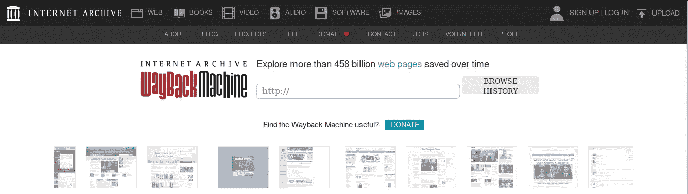
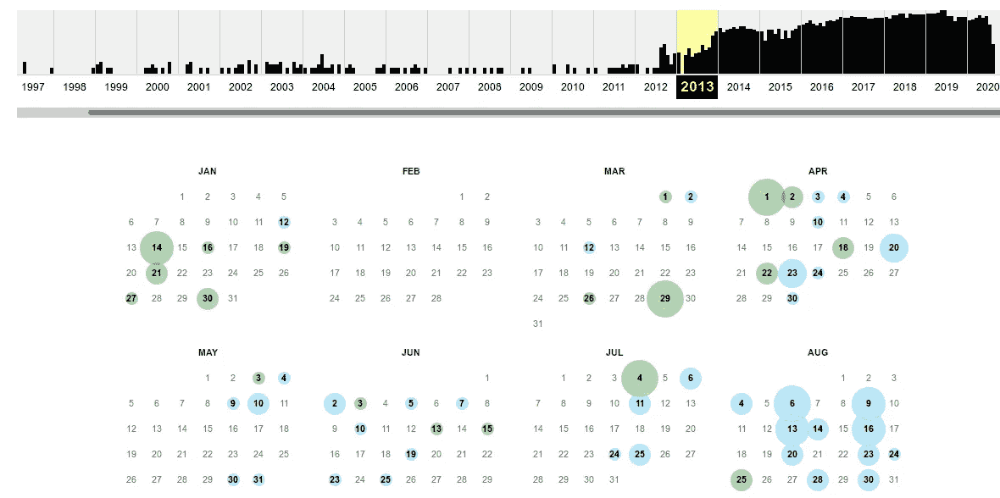

# 时间旅行，发现未列出的宝藏

> 原文：<https://infosecwriteups.com/time-traveled-and-found-unlisted-treasure-ed0d77b9c742?source=collection_archive---------2----------------------->

这个故事是关于我如何发现隐藏在一些未公开的视频背后的宝藏，这些视频只能在有限的时间内访问。

免责声明:在此过程中没有发生侵犯隐私的情况。本文仅用于信息和教育目的，我对您使用此信息导致的任何隐私侵犯或损害不承担任何责任。

这件事发生在我即将参加的一场比赛上。对于这个故事，我把它称为一个智力竞赛😉。由于这是我第一次参加这个年度比赛，我需要了解一些往年的内容和他们讨论的话题。因此，我搜索了他们的官方网站和一些社交媒体渠道，看看我能找到什么。但是我找不到任何有用的东西。可惜最后我也没能参加比赛。

然而，几个星期后，我收到了一封电子邮件，其中包含一个链接，链接到今年活动的详细总结，发布在他们的官方网站上。似乎他们正在与在特定年份注册该活动的人分享这些信息。无论如何，这是我最开始寻找的。

因此，这意味着，他们在每年活动结束时在他们的网站上发布有限时间的活动总结和相关信息。这是我想到[时光倒流机](https://archive.org/web/)的地方💡。

它是互联网的数字档案，允许用户回到过去，看看网站过去的样子。如果一个网站加载需要与原始服务器交互的动态内容，它就不会给你想要的东西。但是如果是呈现标准的 HTML，那就完美了。所以我只需输入网址就能回到过去。

Wayback 机器登录页面

一旦你输入网址，你会得到如下的时间表。

2013 年 medium.com[的存档数据](https://web.archive.org/web/20130915000000*/medium.com)

然后你必须点击那些彩色的点，在存档的版本上冲浪。

你猜怎么着！先前的暗示是正确的🏆。我可以找到大量关于这几年的信息，这些信息在当时是不公开的。此外，我发现了一些 YouTube 视频和其他文物。所以我跳到 YouTube 上看看我得到了什么。令人惊讶的是，这些视频是未上市的😲提供了关于这个问题的宝贵知识。

通常情况下，一个视频是不公开的，给它更多的访问限制。根据上面的场景，我们可以看到 YouTube 上未上市和私人视频的明显差异。因为如果它们是私有的，我就不能以这种方式访问它们。因此，人们在为自己的内容设置隐私状态之前，必须根据上下文来思考和行动，尤其是在 YouTube 上。

最后，我可以通过简单地改变做事方式来获得我想要的东西。