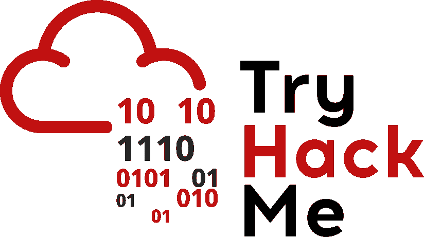
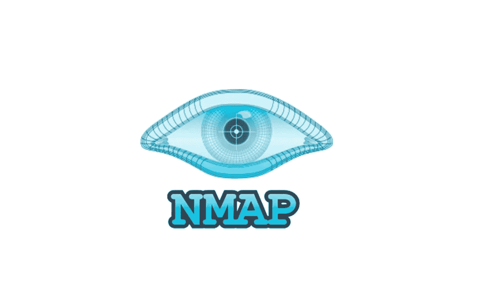
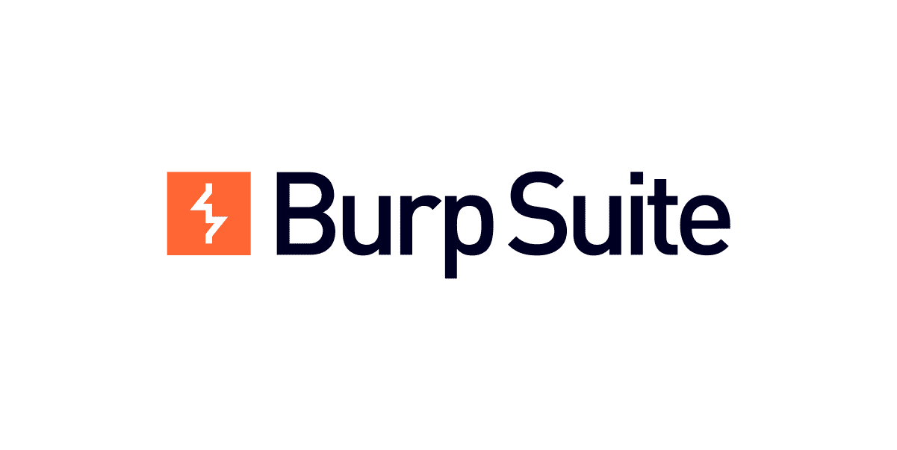

# TLDR·CTF 撰文:Vulnversity/TryHackMe

> 原文：<https://infosecwriteups.com/tldr-ctf-write-up-vulnversity-tryhackme-ab814501b1ef?source=collection_archive---------5----------------------->

## CTF 写下你在进入房间前应该阅读的内容


来自 tryhackme.com 的照片

# 系列简介

ybersecurity 一直是我想涉足的领域，或者至少是将我的数据科学技能应用到其中。不是因为“机器人先生”式的好莱坞黑客场景，不是那个。相反，我被它吸引是因为它体现了好奇心、对知识的渴望、解决问题的能力以及总是修修补补的心态。

进入 [TryHackMe](https://tryhackme.com/) ，这是一个流行的在线平台，让你通过许多简短的游戏化实验室(具有特定目的和配置的虚拟机)学习网络安全。它也非常适合初学者。您不必构建自己的家庭实验室并处理那些虚拟机配置。它们已经是现成的，随时可以被利用。它可以让你接触到其他人的智慧(由其他专家或同行开发的 CTF 室)，而如果你建立自己的家庭实验室，你就无法获得这些智慧。这一系列文章将记录我对挑战的感受以及我从挑战中学到的东西，有点像 TLDR 的风格。

# 对 TLDR·CTF 的报道有什么期待



来自 tryhackme.com 的照片

**可能会有帮助，如果你:**

✔️想要从 20，000 英尺的高度了解这个房间的情况
✔️想要所有线索来帮助您完成整个旅程，但仍想自己解决问题
✔️完成了房间的布置，但仍想看看有哪些好的收获

**如果您需要:**，您可能需要查看其他评论

🔶想要一个详细的逐步记录来指导你通过挑战
为此，我推荐这个[记录](https://0xa94.medium.com/tryhackme-vulnversity-ca0bdcc73386)。

# 总体感觉

到我们今天要讨论的房间:TryHackMe: Vulnversity。如果选择[进攻试探](https://tryhackme.com/paths)路径就是第一个实房(第一个*入门*和*教程*太容易数了)。总的来说，我觉得这个房间设计得很好。它需要一些 Linux 命令行知识，但不需要太复杂。它将整个任务分解成小块，因此没有一个子任务太难处理。它将侦察、利用、利用后的典型黑客攻击过程浓缩到这些简单的任务中，向您介绍工具，并引导您完成思考过程。注意，你仍然需要自己做一些研究。这个房间不会什么都喂你。但这正是乐趣所在，对吗？

# 尝试这个房间的理由

> 1.学习基本的黑客流程(侦查->利用->利用后)
> 2。熟悉一些非常必要的黑客工具( **nmap** 、 **GoBuster、**BurpSuite、 **systemctl** 等)。)
> 3。体验一下特权升级和反向外壳。

# 使用的战略/战术

➡️使用 **Nmap** 获取开放端口和服务的信息- >发现 80 端口开放，
网站使用 **GoBuster** 搜索 web 服务器上的文件夹- >在**内部**文件夹中找到上传表单
➡️使用 **BurpSuite** 拦截请求并找出支持的上传格式- > **PHP:** 否； **phtml:** 是的！
➡️上传扩展名为`. phtml '的反向外壳有效载荷绕过过滤:在反向外壳内获得一个反向外壳
➡️，使用 **find** 搜索可用于权限提升的 SUID 文件->find**/bin/system CTL**
➡️创建一个 **SystemD** 服务文件，使用 **/bin/systemctl** 启用并运行它，获得 root 访问权限！赢了！

# 使用的工具/命令

## Nmap



图片来自[Linux 瘾君子](https://www.linuxadictos.com/)

Nmap 在侦察过程中是如此重要，这个任务只是皮毛。使用的一些选项:

**-sV** :尝试确定运行
**的服务版本:-p xxx 或-p-** :端口扫描端口 xxx 或扫描所有端口
**-A:** 启用操作系统和版本检测，执行内置脚本以进一步枚举

## GoBuster

[GoBuster](https://github.com/OJ/gobuster) 是一款 URIs/DNS 子域暴力破解工具。它是在 Go 中开发的，将枚举你给它的主机名，并吐出目录和文件夹。如果有一个预先构建的单词表，效果会更好。实验室中使用的命令是:

```
 gobuster dir -u http://<ip>:3333 -w <word list location> 
```

如果你使用 Kali Linux，单词列表可以很容易地放在 */usr/share/wordlists* 下。有人提到 [dirsearch](https://github.com/maurosoria/dirsearch) 在这里是一个可行的替代方案。使用该工具，您可以找到一个**上传**文件夹，您可以将文件上传到网络服务器上。

## BurpSuit



照片来自 [PortSwigger](https://portswigger.net/burp)

尝试上传一些文件，你会发现大多数扩展名被阻止。如何进行？进入 [BurpSuite](https://portswigger.net/burp) ，据 [Arch Wiki](https://wiki.archlinux.org/title/Burp_suite) 介绍，它是一个用于执行 web 应用安全测试的“*集成平台。嗯，我们只是用它来拦截一些网络请求，并尝试不同的文件扩展名，看看哪个实际上没有被阻止。
它的主旨是尝试上传一些东西，使用 *BurpSuite* 拦截它，然后用预先加载的各种文件扩展名的单词表(例如 *php、php5、phtml* 等)更改文件扩展名部分。)来测试哪一个实际上可以绕过网络服务器过滤器。
一旦发现( *phtml* )，只要上传一个反向 shell 的 PHP 脚本并上传到 webserver，在浏览器上加载，那么你的监听 **nc -lvnp 1234** 会话就会得到反向 shell。*

## 系统 ctl


图片来自[https://brand.systemd.io/](https://brand.systemd.io/)

一旦我们有了反向外壳，最后的事情将是特权升级。一种方法是使用 SUID 权限搜索可执行文件。我们用*查找*来完成:

```
 find / -user root -perm -4000 -exec ls -ldb {} \; 
```

在返回的结果中， */bin/systemctl* 脱颖而出。我们可以创建一些服务文件(例如 *root.service* )并让 *systemctl* 开始获取特权:

```
TF=”root.service”
echo ‘[Service]
Type=oneshot
ExecStart=/bin/sh -c “cat /root/root.txt > /tmp/flag.txt”
[Install]
WantedBy=multi-user.target’ > $TF
```

注意这里你不能在远程 shell 中使用像 **vim** 或 **nano** 这样的文本编辑器，只需 echo 到文件中即可。不是最理想的，但能完成任务。一旦有了 *root.service* 文件，运行 *systemctl* 来启用/启动它:

```
/bin/systemctl enable /tmp/output/root.service
/bin/systemctl start /tmp/output/root.service
```

服务正常启动后，一个简单的 *cat /temp/flag.txt* 会给我们想要通过房间的标志。

# 参考

*   TryHackMe
*   TryHackMe: Vulnversity
*   [nmap](https://nmap.org)
*   [捉鬼敢死队](https://github.com/OJ/gobuster)
*   [目录搜索](https://github.com/maurosoria/dirsearch)
*   [泡沫塑料](https://portswigger.net/burp)
*   [php 反向外壳](https://github.com/pentestmonkey/php-reverse-shell/blob/master/php-reverse-shell.php)
*   [SUID escalation](https://gtfobins.github.io/gtfobins/systemctl/#suid)