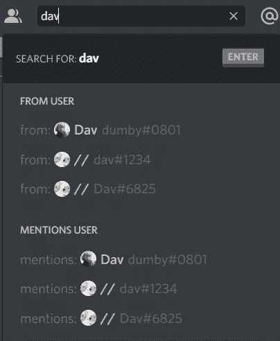
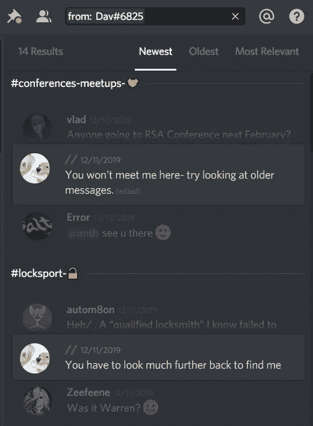
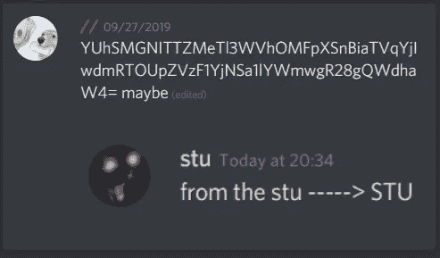
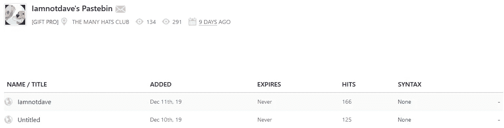
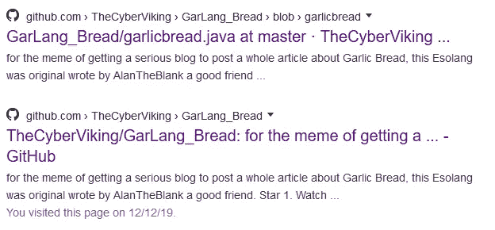
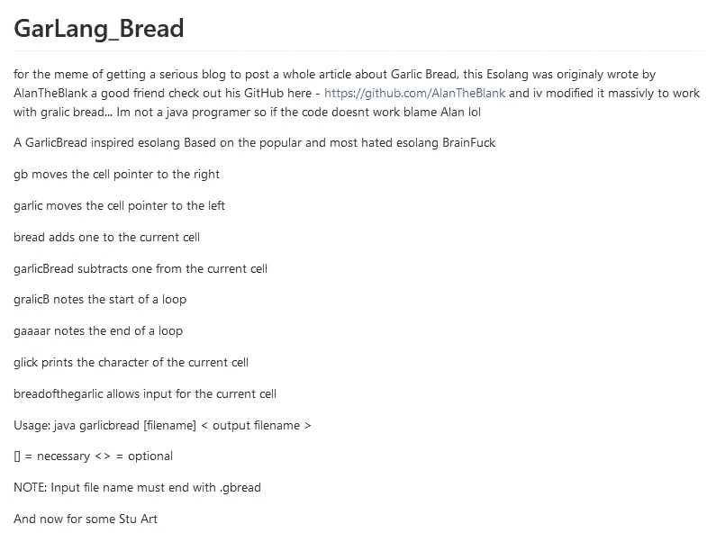
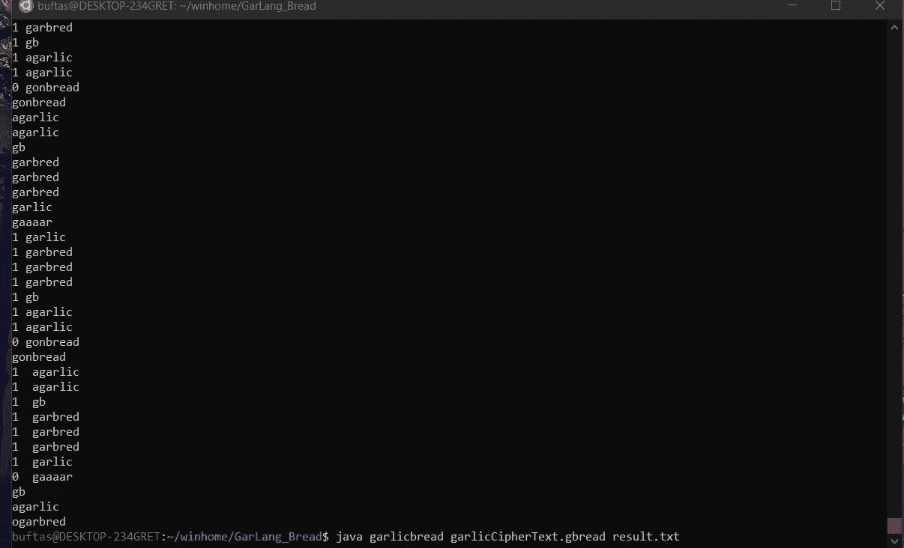
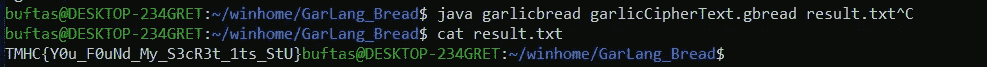

# HTB x TMHC CTF——新挑战

> 原文：<https://infosecwriteups.com/tmhc-ctf-osint-challenge-e8bad2c9f144?source=collection_archive---------0----------------------->

所以最近 HTB 和许多帽子俱乐部合作了一个 CTF。

这也是我们团队第一次一起 CTF。我们在 TMHC CTF 上获得了第三名(我出色的队友承担了重任)。那个周末我有空的时候刚刚解决了 OSINT 挑战。这导致我们在 HTB 有一个月的 VIP 订阅！

# **概述:**

这个新的挑战很简单。挑战的概念是研究协作平台中发送的消息。它以解码一种深奥的语言来获得旗帜而结束。

# **挑战:**

> 因此，TMHC 戴夫@戴夫的一个所有者正在经历一场身份危机，你能找到这个假账户和他们的秘密吗？你需要加入 TMHC 不和来开始这个挑战。【https://discord.gg/infosec 

# 解决方案:

通过点击 discord 链接，您将被定向到 CTF 许多帽子俱乐部 Discord 服务器。在此之前 CTF，我已经是不和谐的一员。然后我搜索了字符串“dav ”,似乎有 3 个用户的名字和用户名都带有 Dav。



然后我检查了 Dav#6825，因为可能用户是按照他们创建的日期或者他们加入服务器的日期排列的。检查它的信息，我发现他的对话很有趣。我继续浏览。



在那个账号最早的消息里，有一个 base64 的字符串。



解码后会得到一个网址:

```
$ echo -n YUhSMGNITTZMeTl3WVhOMFpXSnBiaTVqYjIwdmRTOUpZVzF1YjNSa1lYWmwgR28gQWdhaW4=| base64 -d
aHR0cHM6Ly9wYXN0ZWJpbi5jb20vdS9JYW1ub3RkYXZl Go Again$ echo -n YUhSMGNITTZMeTl3WVhOMFpXSnBiaTVqYjIwdmRTOUpZVzF
1YjNSa1lYWmwgR28gQWdhaW4=| base64 -d | base64 -d
https://pastebin.com/u/Iamnotdavebase64: invalid input
```

网址是:

```
https://pastebin.com/u/Iamnotdave
```

访问该网址时，我看到一些贴子:



检查 iamnotdave 文件的内容:

```
---Garlang_Bread - you will never crack my code---
agarlicgonbreadagarlicagarlicagarlicgbgarbredgarlicgaaaargbagarlicogarbredagarlicagarlicagarlicagarlicagarlicagarlicagarlicogarbredagarlicagarlicagarlicagarlicagarlicogarbredagarlicagarlicagarlicagarlicagarlicogarbredagarlicagarlicagarlicagarlicagarlicgonbreadagarlicgbgarbredgarbredgarlicgaaaargbagarlicogarbredgbgarbredgonbreadagarlicagarlicagarlicgbgarbredgarbredgarlicgaaaargbgarbredgarbredgarbredogarbredgarbredgonbreadagarlicagarlicgbgarbredgarlicgaaaargbgarbredgarbredgarbredogarbredgarbredgonbreadagarlicagarlicagarlicgbgarbredgarbredgarlicgaaaargbagarlicogarbredgonbreadagarlicgbgarbredgarbredgarbredgarlicgaaaargbogarbredagarlicgonbreadagarlicagarlicagarlicagarlicagarlicgbgarbredgarlicgaaaargbogarbredgarbredgarbredgonbreadagarlicagarlicagarlicgbgarbredgarbredgarlicgaaaargbogarbredgarbredgonbreadagarlicagarlicagarlicgbgarbredgarbredgarlicgaaaargbagarlicogarbredgonbreadagarlicagarlicagarlicgbgarbredgarbredgarlicgaaaargbogarbredagarlicagarlicagarlicgonbreadagarlicagarlicagarlicgbgarbredgarbredgarbredgarbredgarlicgaaaargbogarbredagarlicagarlicagarlicagarlicagarlicogarbredgonbreadagarlicagarlicagarlicagarlicagarlicgbgarbredgarbredgarbredgarbredgarlicgaaaargbgarbredogarbredagarlicgonbreadgarbredgarbredgarbredgarbredgbagarlicagarlicagarlicgarlicgaaaargbogarbredgonbreadagarlicgbgarbredgarbredgarbredgarbredgarbredgarlicgaaaargbgarbredgarbredogarbredagarlicagarlicagarlicagarlicagarlicagarlicagarlicagarlicagarlicagarlicagarlicagarlicogarbredgbagarlicgonbreadagarlicagarlicagarlicagarlicagarlicgbgarbredgarlicgaaaargbogarbredagarlicgonbreadagarlicgbgarbredgarbredgarlicgaaaargbagarlicogarbredgonbreadagarlicgbgarbredgarbredgarbredgarbredgarbredgarbredgarlicgaaaargbogarbredgbagarlicgonbreadagarlicagarlicagarlicagarlicagarlicgbgarbredgarlicgaaaargbogarbredagarlicagarlicgonbreadagarlicagarlicagarlicgbgarbredgarbredgarlicgaaaargbagarlicagarlicogarbredgarbredgonbreadagarlicgbgarbredgarbredgarbredgarlicgaaaargbogarbredgarbredgonbreadagarlicagarlicgbgarbredgarlicgaaaargbgarbredogarbredgonbreadagarlicagarlicagarlicgbgarbredgarbredgarlicgaaaargbagarlicagarlicogarbredagarlicogarbredgarbredgarbredgonbreadagarlicgbgarbredgarbredgarbredgarlicgaaaargbogarbredagarlicagarlicagarlicagarlicagarlicagarlicagarlicagarlicagarlicagarlicagarlicagarlicogarbredgonbreadagarlicagarlicagarlicgbgarbredgarlicgaaaargbgarbredgarbredgarbredogarbredgbagarlicgonbreadagarlicagarlicagarlicgbgarbredgarlicgaaaargbogarbredagarlicgonbreadagarlicagarlicgbgarbredgarbredgarbredgarlicgaaaargbagarlicogarbred
```

我搜索字符串“Garlang_Bread ”,结果如下:



访问 Github 页面:



又提到了斯图。然后，我克隆存储库并对字符串运行 java 内容:

```
java garlicbread garlicCipherText.gbread result.txt
```



将输出保存到 result.txt，并读取 result.txt 的内容:



我可以拿到旗子:

```
**TMHC{Y0u_F0uNd_My_S3cR3t_1ts_StU}**
```

我想提一下我的队友 S1ckB0y！感谢修复 Java 部分:)

我希望你能从中学到一些东西。感谢阅读我的文章！干杯！🍺

请点击这里查看其他团队的报道:[https://github.com/ShoulderSurfersCTF/ctf-writeups](https://github.com/ShoulderSurfersCTF/ctf-writeups)

*关注* [*Infosec 报道*](https://medium.com/bugbountywriteup) *获取更多此类精彩报道。*

[](https://medium.com/bugbountywriteup) [## 信息安全报道

### 收集了世界上最好的黑客的文章，主题从 bug 奖金和 CTF 到 vulnhub…

medium.com](https://medium.com/bugbountywriteup)