# 东京食尸鬼 Tryhackme 报道

> 原文：<https://infosecwriteups.com/tokyo-ghoul-tryhackme-writeup-932359680c7e?source=collection_archive---------5----------------------->

**作者 Shamsher khan 这是 Tryhackme room“东京食尸鬼”的特写**

[](https://www.tryhackme.com/room/tokyoghoul666)

https://www.tryhackme.com/room/tokyoghoul666

**房间链接:**[https://www.tryhackme.com/room/tokyoghoul666](https://www.tryhackme.com/room/tokyoghoul666)
**注:此房免费**

# 列举

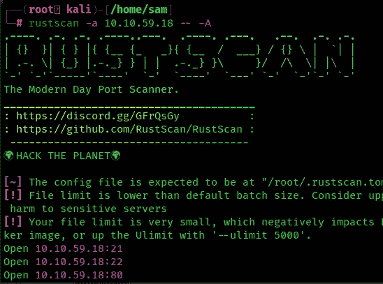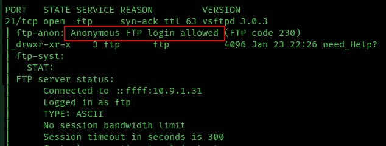

所以我们有 3 个端口

允许 FTP-21 匿名登录

SSH-22

HTTP-80

**问 1:** 开放了多少个端口？

> ***答案:3***

**问 2:** 用的是什么 OS？

> ***答案:ubuntu***

你找到其他食尸鬼给你的纸条了吗？你在哪里找到的？

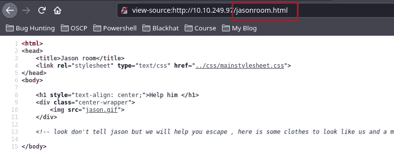

> ***答案:jasonroom.html***

登录到 FTP 服务器


下载这些文件

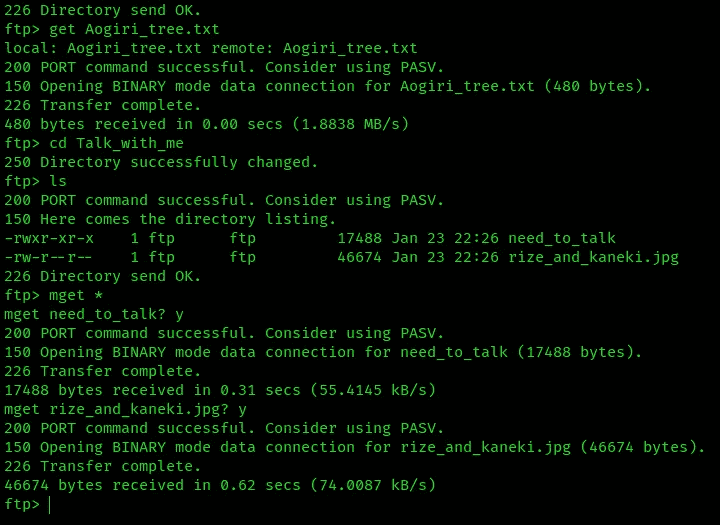

让我们检查一下这些文件

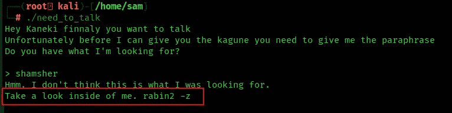

该文件等待一个解释，让我们尝试任何字符串作为密码，以检查它将返回什么输出。所以其说用“**rabina 2-z”**来拉它

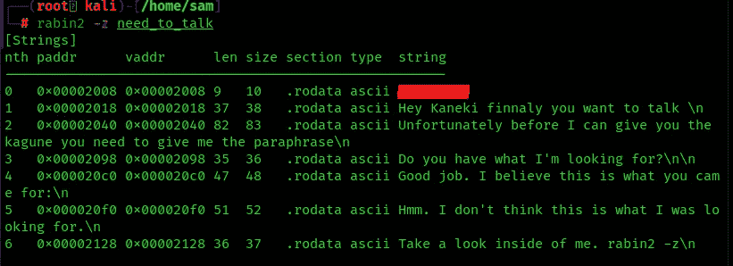

嘣它显示我的文件密码。让我们使用密码

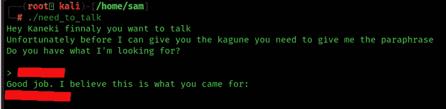

程序给了我们另一个字符串，我想这是图片的密码，所以我用了 steghide

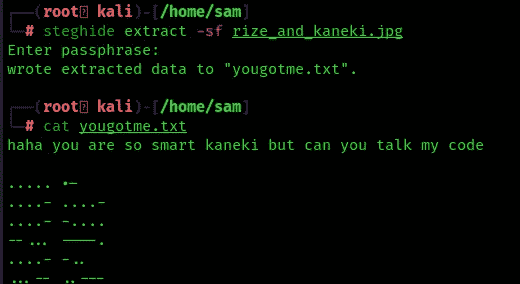

这是摩斯密码，我们来破译

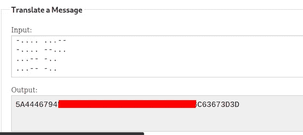

莫尔斯码给了我们十六进制字符串，让我们来破译它

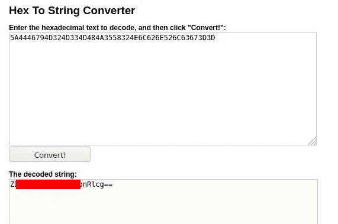

[http://string-functions.com/hex-string.aspx](http://string-functions.com/hex-string.aspx)

十六进制字符串给我们 base64 字符串让我们解码它

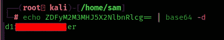

我们发现隐藏目录让我们访问隐藏目录

```
[http://10.10.59.18/**********/](http://10.10.59.18/d1r3c70ry_center/)
```


## dirb

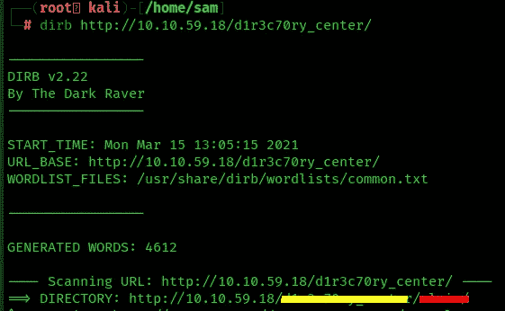

我们找到了另一个子目录

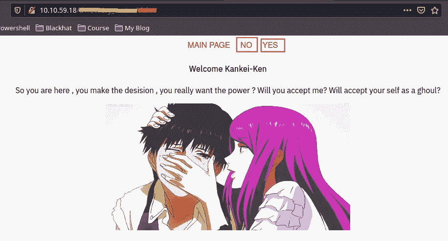

点击**是后**我看到这个参数是谁在服务器上调用的文件

index.php？view=flower.gif

也许我们可以将它改为返回并获取/etc/passwd

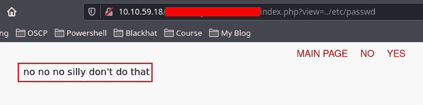

但是我们现在知道这里有一个漏洞，所以我们需要使用 html url 编码来绕过它

```
?view=%2F%2E%2E%2F%2E%2E%2F%2E%2E%2Fetc%2Fpasswd
```

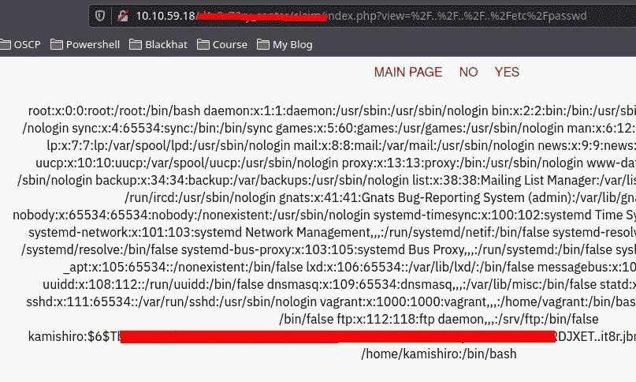

Boom 我们得到了/etc/passwd，带有一个用户名: **kamishiro** 和一个散列，我将使用 john 来破解这个散列

首先，我们把散列放在一个文件中

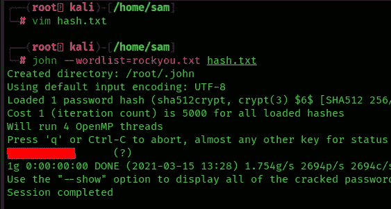

现在我们有了 ssh 凭证

**SSH 和 User.txt**

```
ssh kamishiro@10.10.59.18
```

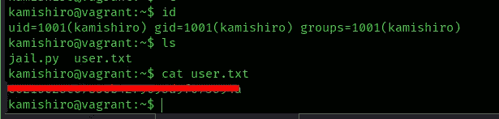

# 私人村庄

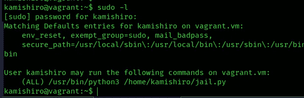

我们以 root 用户身份执行 jail.py，让我们看看这是什么

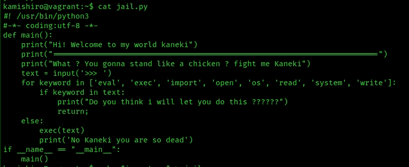

脚本不允许我们执行读取内部文件的命令，我们不能编辑这个文件，我们应该使用内置函数使用[来读取根标志:](https://docs.python.org/3/library/functions.html)

```
__builtins__.__dict__['__IMPORT__'.lower()]('OS'.lower()).__dict__['SYSTEM'.lower()]('cat /root/root.txt')
```

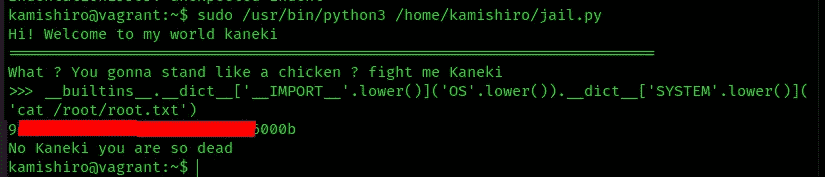

嘣！我们有根旗

你可以在:
**LinkedIn:-**[https://www.linkedin.com/in/shamsher-khan-651a35162/](https://www.linkedin.com/in/shamsher-khan-651a35162/)
**Twitter:-**[https://twitter.com/shamsherkhannn](https://twitter.com/shamsherkhannn)
**Tryhackme:-**[https://tryhackme.com/p/Shamsher](https://tryhackme.com/p/Shamsher)

[](https://tryhackme.com/p/Shamsher)

如需更多演练，请在出发前继续关注…
…

**点击此处加入电报**

[](https://t.me/tryhackme_writeups)

[https://t.me/tryhackme_writeups](https://t.me/tryhackme_writeups)

访问我的其他演练:-

感谢您花时间阅读我的演练。如果你觉得它有帮助，请点击👏按钮👏(高达 40 倍)并分享
它来帮助其他有类似兴趣的人！+随时欢迎反馈！